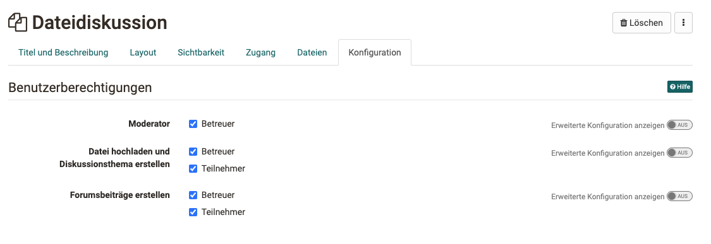

# Kursbaustein "Dateidiskussion“ {: #file_dialog}

## Steckbrief

Name | Dateidiskussion
---------|----------
Icon | { class=size24  }
Verfügbar seit | Neuauflage mit Release 18.0
Funktionsgruppe | Kommunikation und Kollaboration
Verwendungszweck | Kombination aus Forum und Ordner zur Diskussion von Dokumenten
Bewertbar | nein
Spezialität / Hinweis |

Der Kursbaustein Dateidiskussion kann als eine Kombination aus Forum und Ordner verstanden werden. Startpunkt ist jedoch anders als bei Foren immer ein hochgeladenes Dokument, das die Diskussionsbasis für die weitere, dem Dokument zugeordnete Forendiskussion bildet. 

Setzen Sie die Dateidiskussion beispielsweise ein, wenn Sie  möchten, dass Ihre Lernenden sich gezielt zu einem Artikel, eine Grafik oder einen sonstigen Text äussern und die Inhalte diskutieren sollen. 

Sowohl bei geschlossenem Editor als auch bei geöffneten (im Tab „**Dateien**“) ist es möglich, mit einem Klick auf „Datei hochladen“, Dokumente in die Ablage der Dateidiskussion hochzuladen, die anschliessend von allen Kursteilnehmenden angesehen und heruntergeladen werden können. Das zugehörige Diskussionsforum wird automatisch erstellt und kann mit Klick auf "Anzeigen" aufgerufen werden. Durch die Auswahl der entsprechenden Spalten ist erkennbar wer wann welche Datei hochgeladen hat und wie der Diskussionsstand ist.

Wer neben dem Kursbesitzer noch welche Aktionen vornehmen kann, wird im Kurseditor in den Benutzerberechtigungen des Tabs "Konfiguration" definiert.

## Tab Konfiguration
Hier können die Benutzerberichtigungen des Bausteins eingestellt und definiert werden, welche Kursrollen Dateien hochladen und Diskussionsthemen erstellen dürfen. Zudem kann definiert werden, wer in den jeweiligen Diskussionsthemen Forumsbeiträge erstellen darf. Zur Wahl stehen Betreuer und Teilnehmer. Auch wird hier eingestellt, ob Betreuer die Dateidiskussion moderieren dürfen.

{ class="shadow" }

!!! warning "Achtung"

    Eine Diskussion kann erst beginnen, wenn eine entsprechende Datei hochgeladen wurde.
