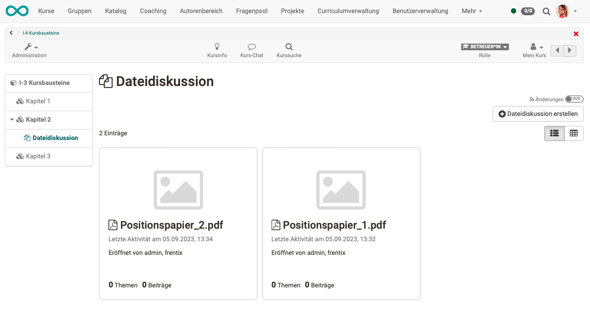
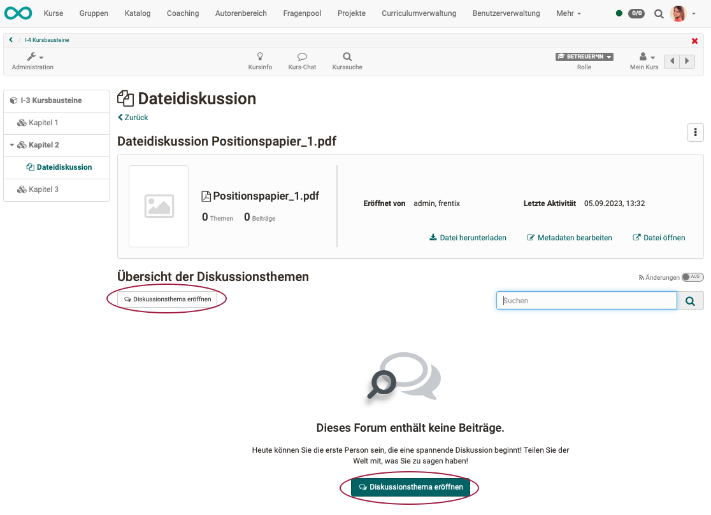
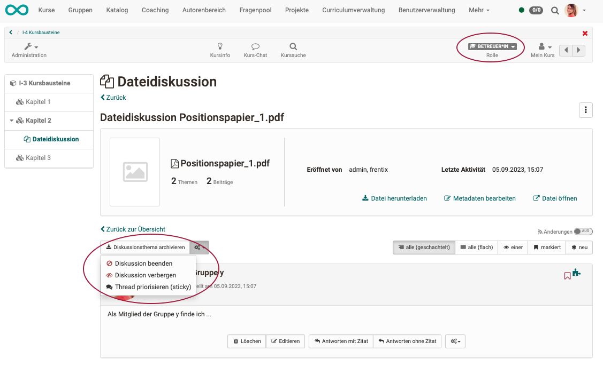
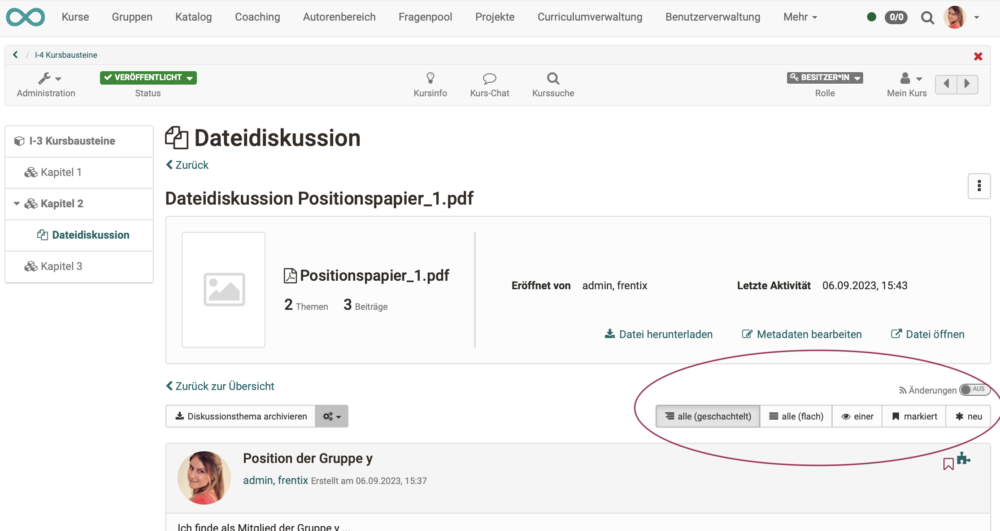

# Kursbaustein "Dateidiskussion“ {: #file_dialog}

## Steckbrief

Name | Dateidiskussion
---------|----------
Icon | { class=size24  }
Verfügbar seit | Neuauflage mit Release 18.0
Funktionsgruppe | Kommunikation und Kollaboration
Verwendungszweck | Kombination aus Forum und Ordner zur Diskussion von Dokumenten
Bewertbar | nein
Spezialität / Hinweis |

## Funktionsprinzip / Verwendung

Im Kursbaustein Dateidiskussion kann eine Datei hochgeladen werden und darüber eine Diskussion eröffnet werden. Ähnlich einem Forum können zur Datei mehrere Diskussionsstränge (Themen, Fragestellungen) angelegt werden. 

Startpunkt ist jedoch, anders als bei Foren, immer eine hochgeladene Datei, die die Diskussionsbasis für die weitere, dem Dokument zugeordnete Forendiskussion bildet.

Setzen Sie die Dateidiskussion beispielsweise ein, wenn Sie möchten, dass Ihre Lernenden sich gezielt zu einem Artikel, einer Grafik oder einen sonstigen Text äussern und die Inhalte diskutieren sollen.

## Dateidiskussion beginnen

Nach Klick auf den Button "Dateidiskussion erstellen" werden Sie aufgefordert, eine Datei als Diskussionsgrundlage hochzuladen oder auszuwählen. In den meisten Fällen ist es sinnvoll, dass von dem/der Besitzer:in oder dem/der Betreuer:in initial eine Datei als Diskussionsgrundlage bereitgestellt wird.

{ class="shadow lightbox" }

!!! note "Hinweis"

    Wird Ihnen kein Button "Dateidiskussion erstellen" angezeigt, wurde vom Kursbesitzer eine entsprechende Restriktion eingerichtet. Siehe Abschnitt "Wer kann Dateien hochladen?"

Es ist möglich, innerhalb des gleichen Kursbausteins "Dateidiskussion" mehrere Dateien als Ausgangspunkt von Diskussionen anzulegen.

!!! tip "Tipp"

    Besteht kein zwingender inhaltlicher Zusammenhang, empfiehlt sich die Verwendung mehrerer Kursbausteine vom Typ 2Dateidiskussion", um die Diskussionsstränge zu separieren und übersichtlicher zu machen. Die Kursbausteine können im Menü evtl. bereits mit hilfreichen Titeln beschriftet und unterschieden werden.

Wenn Teilnehmer:innen oder Betreuer:innen den Kursbaustein Dateidiskussion anwählen, sehen sie zunächst alle angelegten Dateidiskussionen bzw. die Dateien, hinter denen sich jeweils eine eigene Dateidiskussion befindet. Durch Wahl einer Datei gelangen sie in die entsprechende Dateidiskussion.

{ class="shadow lightbox" }

## Dateien hochladen

### Wer kann Dateien hochladen?

Das Hochladen einer Datei als Ausgangspunkt einer Dateidiskussion kann je nach Konfiguration von Besitzer:innen, Betreuer:innen oder Teilnehmer:innen vorgenommen werden. Beim Konfigurieren des Kursbausteins durch den Kursbesitzer kann bestimmt werden, 

* wer 
* in welchem Zeitfenster

Dateien hochladen darf.

Auch weitere Einzelpersonen können namentlich genannt und berechtigt werden.

{ class="shadow lightbox" }

### Welche Dateiformate sind möglich?

Hochgeladen werden können prinzipiell alle Dateiformate (Word, Excel, Bilder, Videos, Audio, usw.)

Zum Öffnen muss jedoch ein entsprechendes Werkzeug in OpenOlat vorhanden sein. Z.B. eine Lizenz für Microsoft Office oder ONLYOFFICE. Andere, spezielle Dateiformate (z.B. .log oder .psd) können ebenfalls hochgeladen, aber nicht in OpenOlat geöffnet werden. Der Button zum öffnen wird dann gar nicht angezeigt.

!!! Tip "Tipp für spezielle Dateiformate"

    Möchten sich z.B. Grafiker über eine Photoshop-Datei (.psd) austauschen, kann die Datei aus OpenOlat heruntergeladen werden und dann jeweils lokal mit passender Software geöffnet werden (ausserhalb OpenOlat).

### Wo liegen diese Dateien?

Die in den Kursbaustein Dateidiskussion hochgeladenen Dateien werden in einem Pfad innerhalb der Dateiablage von OpenOlat gespeichert, nicht im Ablageordner. Ein Zugriff auf diese Dateien ist also nur über den Kursbaustein Dateidiskussion möglich.

## Diskussion führen

!!! Note "Hinweis"

    Eine Diskussion kann erst beginnen, wenn eine Datei als Diskussionsgrundlage hochgeladen wurde.

### Zu diskutierende Dateien öffnen oder herunterladen

Sobald Teilnehmer:innen auf der Startseite eine Datei als Ausgangspunkt einer Dateidiskussion gewählt haben, können sie diese Datei öffnen oder herunterladen.

### Wie wird ein Diskussionsthema eröffnet?

Unterhalb der diskutierten Datei befinden sich die Buttons zum Eröffnen eines Diskussionsthemas.
Es sind mehrere Diskussionsthemen pro Dokument möglich.

{ class="shadow lightbox" }

### Wie wird ein Diskussionsbeitrag ergänzt?

Diskussionteilnehmer:innen haben die Möglichkeit eine Antwort mit oder ohne Zitat des vorherigen Beitrags zu erstellen.

Wird ein Beitrag nachträglich editiert, ist das in der Kopfzeile des Eintrags vermerkt. Es wird jeweils der letzte Editiervorgang angezeigt.

Auch das Anhängen von weiteren Dateien innerhalb eines Diskussionsbeitrags ist möglich, wenn ein Beitrag erstellt oder editiert wird.

{ class="shadow lightbox" }

!!! note "Hinweis"

    Die Option unter dem Tab Konfiguration "Forumsbeiträge erstellen" bezieht sich auch auf Themen (initiale Beiträge).

### Welche Aufgabe haben Moderator:innen?

Moderator:innen haben gewöhnlich die Aufgaben, 

* die Diskussion in Gang zu setzen (z.B. indem sie eine Datei als Diskussionsgrundlage hochladen),
* prüfend zu beobachten (inhaltliche Kontrolle und Steuerung),
* bei Bedarf korrigierend einzugreifen. (Sie können z.B. beleidigende, unpassende Forumsbeiträge verbergen. Änderungen des Moderators an einem Forumsbeitrag werden angezeigt.)

{ class="shadow lightbox" }

!!! note "Hinweis"

    Diese Aufgabe kann im Tab "Konfiguration" allen Betreuer:innen zugewiesen werden. Auch weitere Einzelpersonen können namentlich genannt und berechtigt werden.

### Beiträge durchsuchen, Darstellung der Diskussion

Oberhalb der Beiträge einer Dateidiskussion ermöglichen verschiedene Buttons eine Änderung der Darstellung der Beiträge. Z.B. können die Diskussonsbeiträge verschachtelt (Antworten jeweils eingerückt) dargestellt werden. Oder Sie können sich nur die neusten Beiträge anzeigen lassen. Das erleichtert das Durchsuchen umfangreicher Diskussionen.

{ class="shadow lightbox" }

!!! tip "Tipp"

    Sie können sich hier auch ein Abonnement einrichten, um bei neuen Beiträgen informiert zu werden.

### Verschieben von Beiträgen

Diskussionsbeiträge können von Berechtigten an eine andere Stelle in einer Dateidiskussion verschoben werden. Dies ist auch in einen anderen Kursbaustein und sogar kursübergreifend möglich.

Es kann ein einzelner Beitrag, ein ganzer Diskussionsfaden oder ein Teil eines Diskussionsfadens, mit allen darunter angehängten Antworten, verschoben werden. Die betroffenen Diskussionsteilnehmer:innen können per Mail über das Verschieben ihrer Beiträge informiert werden.

{ class="shadow lightbox" }

Ein Wizard hilft beim Verschieben.

{ class="shadow lightbox" }

!!! note "Hinweis"

    Weil es sich bei der Dateidiskussion um eine spezielle Form eines Forums handelt, können Beiträge und Diskussionsfäden auch in einen Kursbaustein vom Typ "Forum" verschoben werden. 

### Löschen

Beim Löschen ist zu unterscheiden:

* **Löschen eines einzelnen Beitrags**: Der/die Ersteller:in eines Diskussionsbeitrags hat das Recht, den eigenen Beitrag auch wieder zu löschen. Durch das Löschen eines Beitrags werden im Normalfall aber auch die Antworten auf diesen Beitrag obsolet. Deshalb werden die Antworten auf diesen Beitrag ebenfalls gelöscht. Der Diskussionsfaden wird also an dieser Stelle abgeschnitten.

{ class="shadow lightbox" }

* **Löschen der gesamten Diskussion zu einer Datei**:		
Besitzer:innen und Betreuer:innen steht diese Option rechts oben im Icon mit den 3 Punkte zur Verfügung. Alternativ können auch in der Tabellendarstellung die 3 Punkte am Ende einer Tabellenzeile (Datei) gewählt werden.

{ class="shadow lightbox" }

---

## Diskussion beenden

### Wie kann eine Diskussion beendet werden?

Das **manuelle Beenden** einer Diskussion erfolgt durch Betreuer:innen und Besitzer:innen.

{ class="shadow lightbox" }

Ein **automatisches Beenden** erfolgt, wenn in der Konfiguration des Kursbausteines ein zeitlicher Rahmen für die Erstellung von Diskussionsbeiträgen gesetzt wurde. Nach dem gesetzten Zeitpunkt ist dann die Bearbeitungsmöglichkeit automatisch deaktiviert.

### Diskussionsthemen archivieren

Die Diskussionsthemen können von Betreuer:innen und Besitzer:innen auch archiviert werden.

{ class="shadow lightbox" }