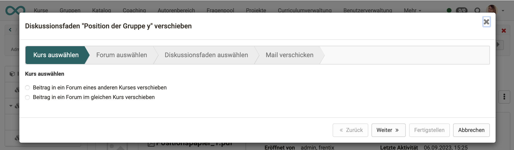

# Kursbaustein "Dateidiskussion" {: #file_dialog}

## Steckbrief

Name | Dateidiskussion
---------|----------
Icon | { class=size24  }
Verfügbar seit | Neuauflage mit Release 18.0
Funktionsgruppe | Kommunikation und Kollaboration
Verwendungszweck | Kombination aus Forum und Ordner zur Diskussion von Dokumenten
Bewertbar | nein
Spezialität / Hinweis |

## Funktionsprinzip / Verwendung

Im Kursbaustein "Dateidiskussion" können Dateien hochgeladen und dazu passende Diskussionsthemen eröffnet werden. Ähnlich wie in einem Forum lassen sich zu einer Datei mehrere Diskussionsstränge anlegen. Ausgangspunkt ist jedoch immer die Datei selbst, die als gemeinsame Diskussionsbasis dient.

Der Baustein eignet sich besonders, wenn Lernende sich gezielt mit einem konkreten Dokument auseinandersetzen sollen – etwa einem Artikel, einer Grafik, einem Vorlesungsskript oder einem Konzeptpapier.

Im Kurseditor fügen Sie den Baustein "Dateidiskussion" hinzu. Über den Tab "Dateien" laden Sie die Dokumente hoch, über "Konfiguration" legen Sie die Berechtigungen für unterschiedliche Rollen fest.

## Dateidiskussion anlegen
Kursbesitzer:innen und weitere Personen mit Berechtigung können den Button "Dateidiskussion erstellen" anklicken. Dies kann sowohl im Kurseditor als auch bei geschlossenem Kurseditor im Kursrun erfolgen.

{ class="shadow lightbox" }

{ class="shadow lightbox" }

Nach Klick auf den Button "Dateidiskussion erstellen" wird man aufgefordert, eine Datei als Diskussionsgrundlage hochzuladen oder eine Datei aus dem Ablageordner des Kurses auszuwählen. 

In den meisten Fällen ist es sinnvoll, dass von dem/der Besitzer:in oder dem/der Betreuer:in initial eine Datei als Diskussionsgrundlage bereitgestellt wird.

!!! note "Hinweis"

    Wird Ihnen kein Button "Dateidiskussion erstellen" angezeigt verfügen Sie nicht über die Berechtigung. Siehe Abschnitt "Wer kann Dateien hochladen?"

!!! tip "Tipp"

    Besteht kein zwingender inhaltlicher Zusammenhang zwischen den Dateien, empfiehlt sich die Verwendung mehrerer Kursbausteine vom Typ "Dateidiskussion", um die Diskussionsstränge zu separieren und übersichtlicher zu machen. Die Kursbausteine können im Menü evtl. bereits mit hilfreichen Titeln beschriftet und unterschieden werden.

## Dateien organisieren

### Wer kann Dateien hochladen?

Wer Dateien hochladen darf, wird im Kurseditor im Tab "Konfiguration" festgelegt. Kursbesitzer:innen können standardmaessig immer Dateien einstellen. Zusätzlich kann bestimmt werden, ob auch Betreuende und Teilnehmende Dateien als Ausgangspunkt für eine Diskussion hochladen dürfen.

Über die erweiterte Konfiguration lassen sich die Rechte weiter verfeinern – etwa indem Uploads zeitlich begrenzt oder einzelnen Personen gezielt Upload-Berechtigungen erteilt werden.

{ class="shadow lightbox" }

### Welche Dateiformate sind möglich?

Hochgeladen werden können prinzipiell alle Dateiformate (Word, Excel, Bilder, Videos, Audio, usw.)

Zum Öffnen muss jedoch ein entsprechendes Werkzeug in OpenOlat vorhanden sein. Z.B. eine Lizenz für Microsoft Office oder ONLYOFFICE. Andere, spezielle Dateiformate (z.B. .log oder .psd) können ebenfalls hochgeladen, aber nicht in OpenOlat geöffnet werden. Der Button zum öffnen wird dann gar nicht angezeigt.

!!! Tip "Tipp für spezielle Dateiformate"

    Möchten sich z.B. Grafiken über eine Photoshop-Datei (.psd) austauschen, kann die Datei aus OpenOlat heruntergeladen werden und dann jeweils lokal mit passender Software geöffnet werden (ausserhalb OpenOlat).

### Wo liegen diese Dateien?

Die in den Kursbaustein Dateidiskussion hochgeladenen Dateien werden in einem Pfad innerhalb der Dateiablage von OpenOlat gespeichert, nicht im Ablageordner. Ein Zugriff auf diese Dateien ist also ausschliesslich über den Kursbaustein Dateidiskussion möglich.

## Diskussion führen

!!! Note "Hinweis"

    Eine Diskussion kann erst beginnen, wenn eine Datei als Diskussionsgrundlage hochgeladen wurde.

### Wie wird ein Diskussionsthema eröffnet?

Unterhalb der diskutierten Datei befinden sich die Buttons zum Eröffnen eines Diskussionsthemas.
Es sind mehrere Diskussionsthemen pro Dokument möglich.

{ class="shadow lightbox" }

### Zu diskutierende Dateien öffnen oder herunterladen

Wenn Teilnehmende oder Betreuende den Kursbaustein Dateidiskussion anwählen, sehen sie zunächst alle schon angelegten Dateidiskussionen bzw. die Dateien, hinter denen sich jeweils eine eigene Dateidiskussion befindet. Durch Wahl eines Elements gelangen sie in die entsprechende Dateidiskussion.

{ class="shadow lightbox" }

### Wie wird ein Diskussionsbeitrag ergänzt?

Diskussionsteilnehmer:innen können Antworten mit oder ohne Zitat des vorherigen Beitrags verfassen. 
Wird ein Beitrag nachträglich bearbeitet, erscheint dies in der Kopfzeile; angezeigt wird jeweils der letzte Bearbeitungsschritt.
Beim Erstellen oder Bearbeiten eines Beitrags können zudem Dateien angehängt werden.

{ class="shadow lightbox" }

!!! tip "Tipp"

    Sie können sich auch über das Glockensymbol ein Abonnement einrichten, um bei neuen Beiträgen informiert zu werden.

### Welche Aufgabe haben Moderator:innen?

Moderator:innen haben gewöhnlich die Aufgaben, 

* die Diskussion in Gang zu setzen (z.B. indem sie eine Datei als Diskussionsgrundlage hochladen),
* prüfend zu beobachten (inhaltliche Kontrolle und Steuerung),
* bei Bedarf korrigierend einzugreifen. (Sie können z.B. beleidigende, unpassende Forumsbeiträge verbergen. Änderungen von Moderator:innen an einem Forumsbeitrag werden angezeigt.)

{ class="shadow lightbox" }

!!! note "Hinweis"

    Diese Aufgabe kann im Tab "Konfiguration" allen Betreuer:innen zugewiesen werden. Auch weitere Einzelpersonen können namentlich genannt und berechtigt werden.

### Beiträge durchsuchen, Darstellung der Diskussion

Oberhalb der Beiträge einer Dateidiskussion ermöglichen verschiedene Buttons eine Änderung der Darstellung der Beiträge. Zum Beispiel können die Diskussonsbeiträge verschachtelt (Antworten jeweils eingerückt) dargestellt werden. Oder Sie können sich nur die neusten Beiträge anzeigen lassen. Das erleichtert das Durchsuchen umfangreicher Diskussionen.

{ class="shadow lightbox" }

### Verschieben von Beiträgen

Diskussionsbeiträge können von Berechtigten an eine andere Stelle in einer Dateidiskussion verschoben werden. Dies ist auch in einen anderen Kursbaustein und sogar kursübergreifend möglich.

Es kann ein einzelner Beitrag, ein ganzer Diskussionsfaden oder ein Teil eines Diskussionsfadens, mit allen darunter angehängten Antworten, verschoben werden. Die betroffenen Diskussionsteilnehmer:innen können per Mail über das Verschieben ihrer Beiträge informiert werden.

{ class="shadow lightbox" }

Ein Wizard hilft beim Verschieben.

{ class="shadow lightbox" }

!!! note "Hinweis"

    Weil es sich bei der Dateidiskussion um eine spezielle Form eines Forums handelt, können Beiträge und Diskussionsfäden auch in einen Kursbaustein vom Typ "Forum" verschoben werden. 

### Löschen

Beim Löschen ist zu unterscheiden:

* **Löschen eines einzelnen Beitrags**: Der/die Ersteller:in eines Diskussionsbeitrags hat das Recht, den eigenen Beitrag auch wieder zu löschen. Durch das Löschen eines Beitrags werden im Normalfall aber auch die Antworten auf diesen Beitrag obsolet. Deshalb werden die Antworten auf diesen Beitrag ebenfalls gelöscht. Der Diskussionsfaden wird also an dieser Stelle abgeschnitten.

{ class="shadow lightbox" }

* **Löschen der gesamten Diskussion zu einer Datei**:		
Besitzer:innen und Betreuer:innen steht diese Option rechts oben im Icon mit den 3 Punkte zur Verfügung. Alternativ können auch in der Tabellendarstellung die 3 Punkte am Ende einer Tabellenzeile (Datei) gewählt werden.

{ class="shadow lightbox" }

## Diskussion beenden und archivieren

Das manuelle Beenden einer Diskussion erfolgt durch Betreuer:innen und Besitzer:innen.

{ class="shadow lightbox" }

Beendet wird jeweils nur der einzelne Diskussionsstrang zu einer Datei; er wird danach entsprechend markiert. Inhaltliche Änderungen sind dann nicht mehr möglich. Das Ausgangsdokument bleibt jedoch bestehen, und es können jederzeit neue Diskussionen dazu eröffnet werden.

Eine weitere Möglichkeit, alle Diskussionen eines Kursbausteins automatisch abzuschliessen, besteht darin, im Kurseditor unter "Konfiguration" die Berechtigung zum Erstellen von Forenbeiträgen oder zum Anlegen neuer Diskussionsthemen inklusive Datei-Upload zeitlich zu begrenzen. Nach Ablauf der Frist ist die Bearbeitung für die jeweiligen Rollen automatisch deaktiviert. Für Teilnehmende und Betreuende kann dies getrennt festgelegt werden. Das Löschen oder Ändern bestehender Beiträge bleibt – abhängig von der Rolle – weiterhin möglich.

Ausserdem können Betreuer:innen und Kursbesitzer:innen die Diskussionsthemen über den entsprechenden Button als .zip-Datei archivieren.