#  Course Element "File Dialogue" {: #file_dialog}

## Profile

Name | File dialogue
---------|----------
Icon | { class=size24  }
Available since | New edition with release 18.0
Function group | Communication and collaboration
Purpose of use | Combination of forum and folder for discussion of documents
Assessable | no
Speciality / Note |

## Operating principle / Usage

In the course element file dialogue, a file can be uploaded and a dialogue can be opened about it. Similar to a forum, several dialogue threads (topics, questions) can be created for the file.

However, unlike forums, the starting point is always an uploaded document that forms the basis for the further forum dialogue assigned to the document.

Use file dialogue, for example, if you want your learners to comment specifically on an article, graphic or other text and discuss the content.

---

## Starting a file dialogue

After clicking on the button "Create file dialogue" you will be asked to upload or select a file as a basis for discussion. In most cases, it is useful for the owner or coach to initially provide a file as a basis for discussion.

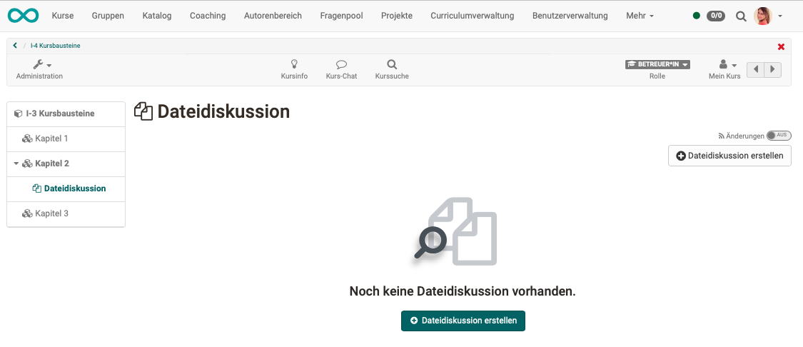{ class="shadow lightbox" }

!!! note "Note"

    If you are not shown a button "Create file dialogue", a corresponding restriction has been set up by the course owner. See section "Who can upload files?"

It is possible to create several files as starting points for discussions within the same course element "File dialogue".

!!! tip "Hint"

    If there is no compelling connection in terms of content, it is advisable to use several course elements of the type "file dialogue" in order to separate the dialogue threads and make them clearer. The course elements can possibly already be labelled and differentiated with helpful titles in the menu.

If participants or coaches select the course element file dialogue, they will first see all created file dialogues or the files behind which there is a file dialogue. Selecting a file takes you to the corresponding file dialogue.

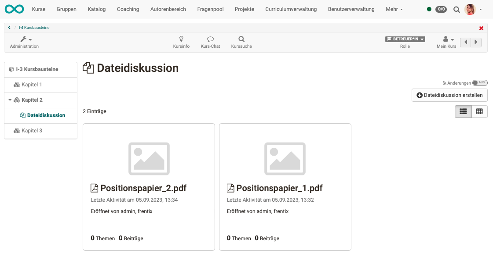{ class="shadow lightbox" }

---

## Uploading files

### Who can upload files?

Uploading a file as the starting point of a file dialogue can be done by owner, coach or participant, depending on the configuration.
When configuring the course element by the course owner, it can be determined, 

* who,
* in which time frame

can upload files.

Other individuals may also be named and authorised.

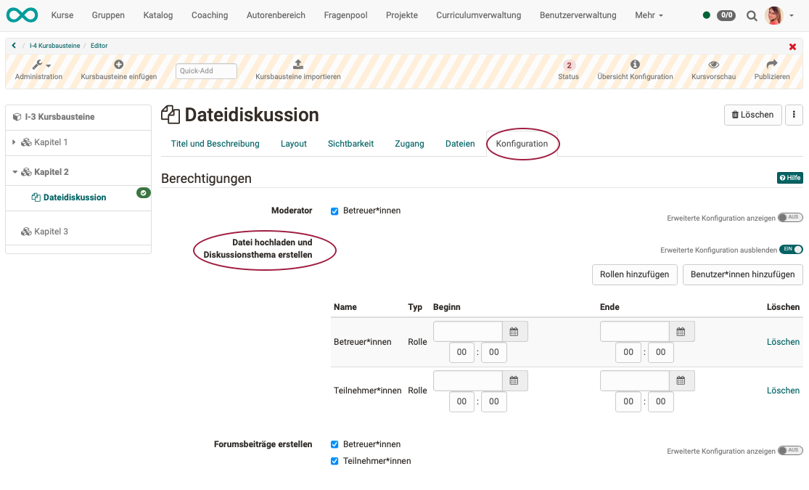{ class="shadow lightbox" }

### Which file formats are possible?

In principle, all file formats (Word, Excel, images, videos, audio, etc.) can be uploaded.

However, a corresponding tool must be available in OpenOlat to open it. For example, a licence for Microsoft Office or ONLYOFFICE. Other, special file formats (e.g. .log or .psd) can also be uploaded, but not opened in OpenOlat. The open button is then not displayed at all.

!!! Tip "Hint for particular file formats"

    If, for example, graphic artists would like to exchange information about a Photoshop file (.psd), the file can be downloaded from OpenOlat and then opened locally with suitable software (outside OpenOlat).

### Where are these files located?

The files uploaded to the course element file discussion are saved in a path within the file storage of OpenOlat, not in the storage folder. Access to these files is therefore only possible via the course element file discussion.

---

## Leading a dialogue

!!! Note "Note"

    A dialogue can only begin when a file has been uploaded as a basis for discussion.

### Opening or downloading files to be discussed

Once participants have selected a file as the starting point for a file dialogue on the homepage, they can open or download this file.

### How to open a dialogue topic?

Below the discussed file are the buttons for opening a discussion topic.
Several dialogue topics per document are possible.

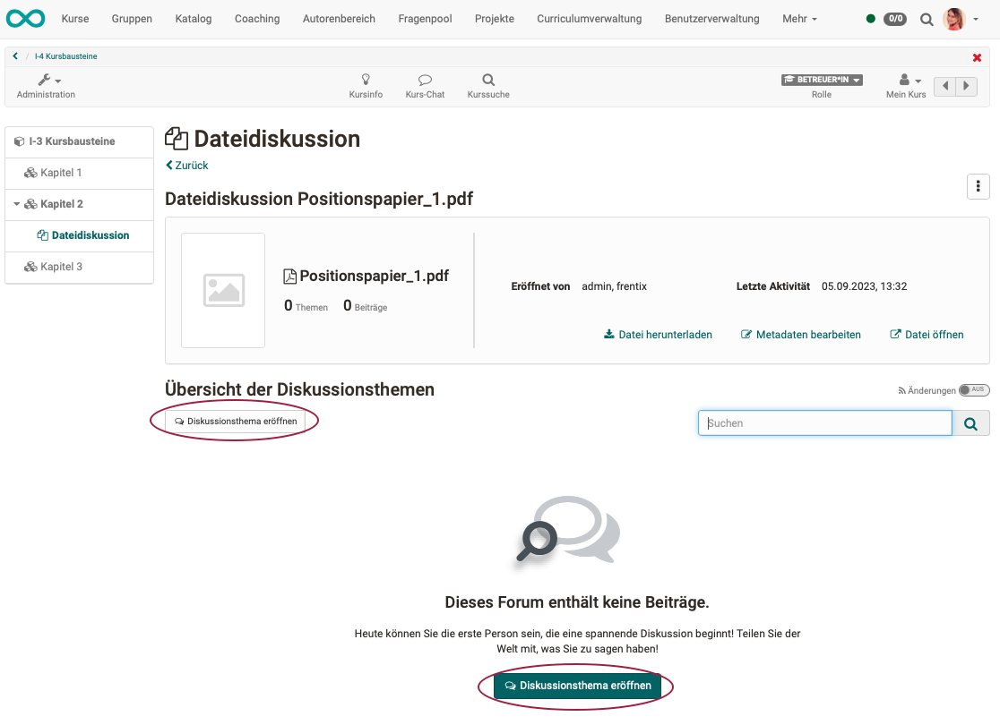{ class="shadow lightbox" }

### How is a contribution to the dialogue added?

Dialogue participants have the option of creating a reply with or without quoting the previous post.

If a contribution is subsequently edited, this is noted in the header of the entry. The last editing process is displayed in each case.

If a contribution is subsequently edited, this is noted in the header of the entry. The last editing process is displayed in each case.

{ class="shadow lightbox" }

!!! note "Note"

    The option under the Configuration tab "Create forum posts" also refers to topics (initial posts).

### What is the role of moderators?

Moderators usually have the following tasks:

* get the dialogue going (e.g. by uploading a file as a basis for discussion),
* observe in a controlling manner, (content control and management)
* take corrective action when necessary. (For example, you can hide offensive, inappropriate forum posts. Changes made by the moderator to a forum post are displayed).

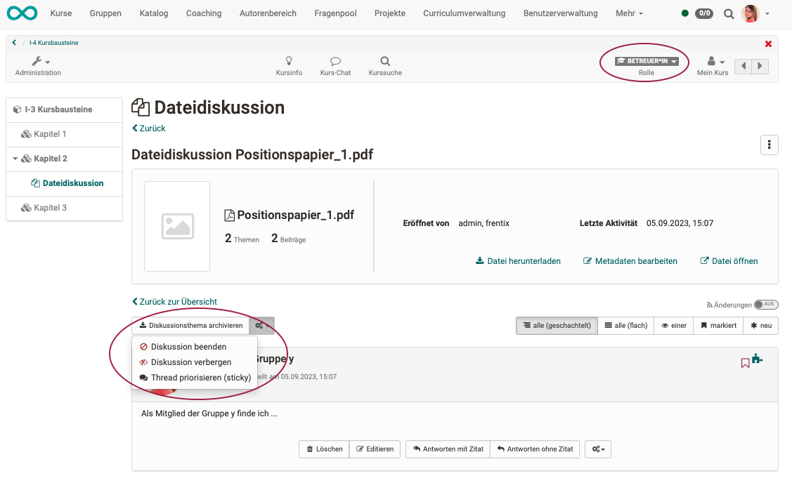{ class="shadow lightbox" }

!!! note "Note"

    This task can be assigned to all coaches in the Configuration tab. Other individuals can also be named and authorised.

### Searching posts, appearance of discussion

Above the posts of a file dialogue, various buttons allow you to change the appearance of the posts. For example, the dialogue contributions can be displayed nested (answers indented). Or you can display only the most recent posts. This makes it easier to search through extensive dialogues.

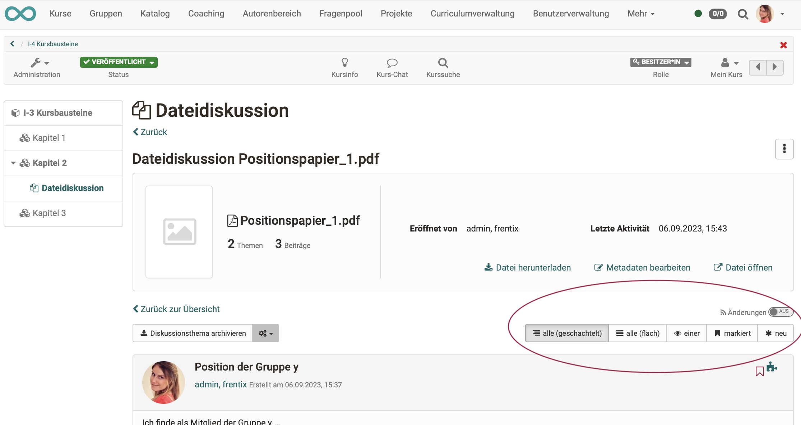{ class="shadow lightbox" }

!!! tip "Hint"

    You can also set up a subscription here to be informed of new contributions.

### Moving posts

Dialogue contributions can be moved to another place in a file dialogue by authorised persons. This is also possible in another course element and even across courses.

A single post, an entire thread or part of a thread, with all the replies attached to it, can be moved. The dialogue participants concerned can be informed by e-mail that their posts have been moved.

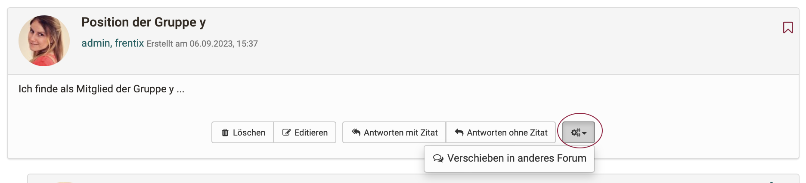{ class="shadow lightbox" }

A wizard helps with moving.

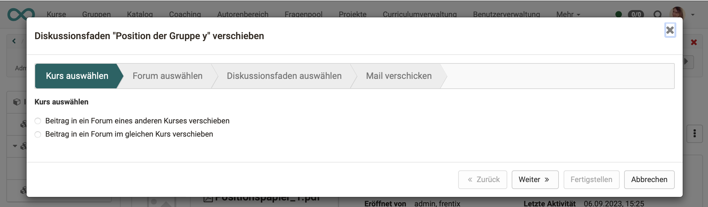{ class="shadow lightbox" }

!!! note "Note"

    Because the file dialogue is a special type of forum, contributions and dialogue threads can also be moved to a course element of the type "Forum". 

### Deleting

A distinction must be made when deleting:

* **Deleting a single post** 
    The creator of a dialogue post has the right to delete their own post.

    However, deleting a post will normally also render the replies to that post obsolete. Therefore, the replies to this post will also be deleted. The dialogue thread will therefore be cut off at this point.

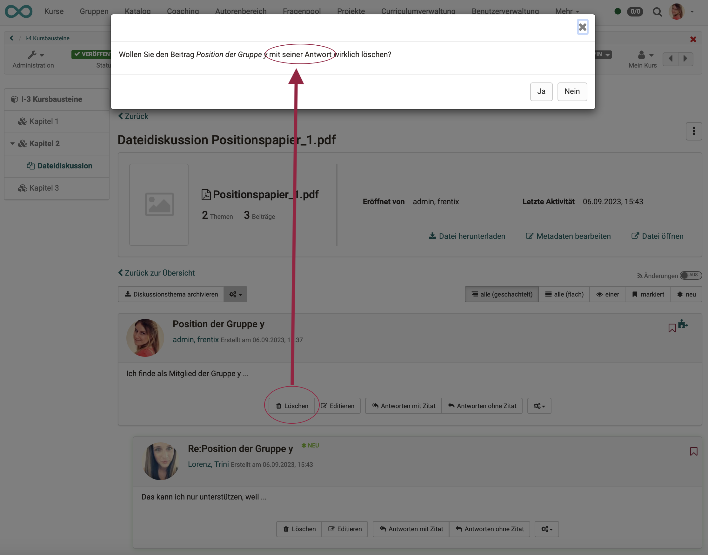{ class="shadow lightbox" }

* **Deleting the entire dialogue for a file** 		
Owners and coaches have access to this option at the top right of the icon with the 3 dots.
Alternatively, the 3 dots at the end of a table row (file) can also be selected in the table display.

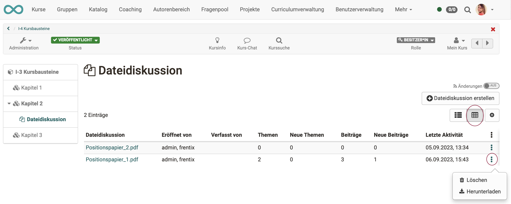{ class="shadow lightbox" }

The course element File Dialog can be understood as a combination of forum and folder. The course element "File dialog" provides you with preset discussion forums; in contrast to an ordinary forum, dialogs here are explicitly based on certain documents. Use such a file dialog to let your course participants discuss e.g. scientific articles or papers.

The **manual closure** of a dialogue is done by the coaches and the owner.

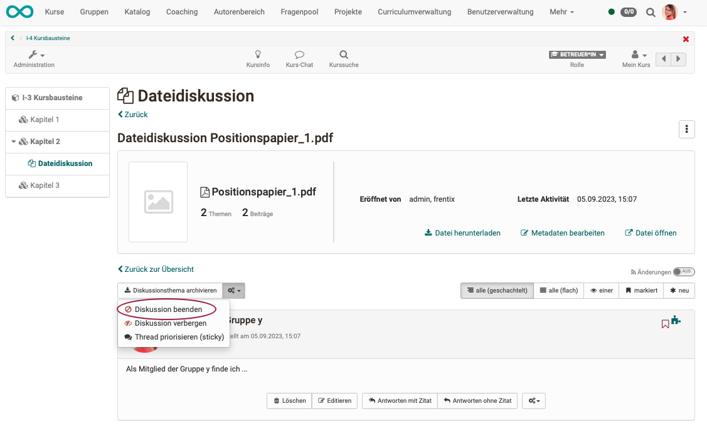{ class="shadow lightbox" }

An **automatic termination** takes place if a time frame for the creation of dialogue contributions has been set in the configuration of the course element. After the set time, the editing option is then automatically deactivated.

### Archiving dialogue topics

The discussion topics can also be archived by coaches and owners.

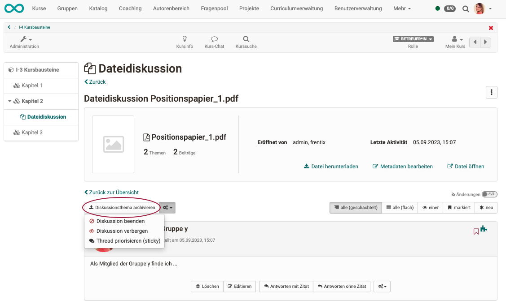{ class="shadow lightbox" }