# Course Element "File Dialog" {: #file_dialog}

## Profile

Name | File dialog
---------|----------
Icon | { class=size24  }
Available since | New edition with release 18.0
Function group | Communication and collaboration
Purpose of use | Combination of forum and folder for discussing documents
Assessable | no
Speciality / Note |

## Operating principle / Usage

In the course element "File dialog", files can be uploaded and matching discussion topics opened for them. Similar to a forum, several discussion threads can be created for one file. However, the starting point is always the file itself, which serves as the shared basis for discussion.

The element is particularly suitable when learners are meant to engage with one specific document: for example an article, a graphic, a lecture script or a concept paper.

In the course editor, add the "File dialog" element. Upload the documents via the "Files" tab, and set the permissions for the different roles via "Configuration".

## Creating a file dialog
Owners and other authorised persons can click the "Create file dialog" button. This is possible both in the course editor and, with the course editor closed, in the course run.

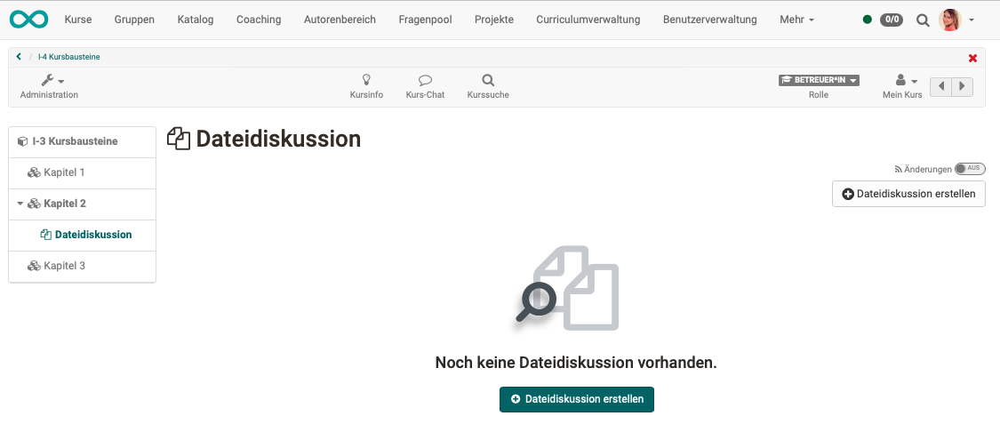{ class="shadow lightbox" }

After clicking the "Create file dialog" button, you are prompted to upload a file as the basis for discussion or to select one from the storage folder of the course.

In most cases, it makes sense for the owner or coach to initially provide a file as the basis for discussion.

!!! note "Note"

    If you are not shown a "Create file dialog" button, you do not have the required permission. See section "Who can upload files?"

!!! tip "Tip"

    If there is no compelling connection between the files, it is advisable to use several course elements of the type "File dialog" to separate the discussion threads and make them clearer. The course elements can already be labelled and distinguished with helpful titles in the menu.

## Organising files

### Who can upload files?

Who is allowed to upload files is set in the course editor, in the "Configuration" tab. Owners can always upload files by default. In addition, it can be determined whether coaches and participants may also upload files as the starting point for a discussion.

The advanced configuration allows the permissions to be refined further: for example by limiting uploads to a time frame or granting individual persons specific upload permissions.

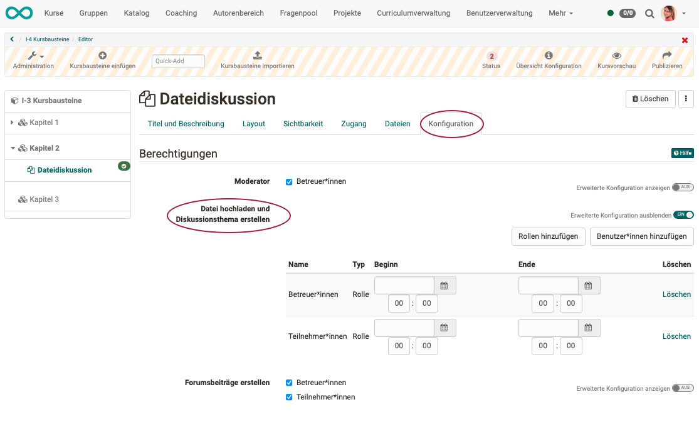{ class="shadow lightbox" }

### Which file formats are possible?

In principle, all file formats can be uploaded (Word, Excel, images, videos, audio, etc.).

However, a corresponding tool must be available in OpenOlat to open the file. For example, a licence for Microsoft Office or ONLYOFFICE. Other, special file formats (e.g. .log or .psd) can also be uploaded but not opened in OpenOlat. In that case, the open button is not displayed at all.

!!! tip "Tip for special file formats"

    If, for example, graphics are to be exchanged via a Photoshop file (.psd), the file can be downloaded from OpenOlat and then opened locally with suitable software (outside OpenOlat).

### Where are these files located?

The files uploaded to the course element "File dialog" are stored in a path within the file storage of OpenOlat, not in the storage folder. Access to these files is therefore only possible via the course element "File dialog".

## Leading a discussion

!!! note "Note"

    A discussion can only begin once a file has been uploaded as the basis for discussion.

### How is a discussion topic opened?

Below the discussed file are the buttons for opening a discussion topic.
Several discussion topics per document are possible.

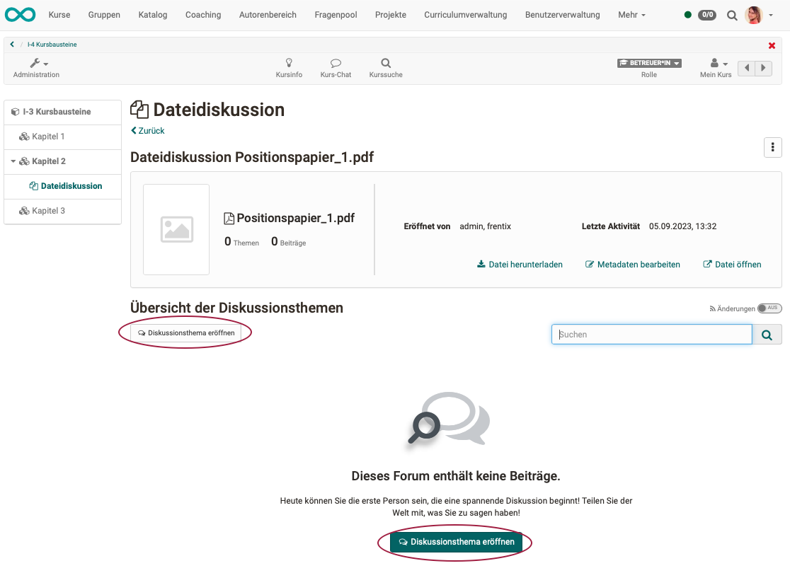{ class="shadow lightbox" }

### Opening or downloading files to be discussed

When participants or coaches select the course element "File dialog", they first see all file dialogs already created, or the files behind which a file dialog exists. Selecting an element takes them to the corresponding file dialog.

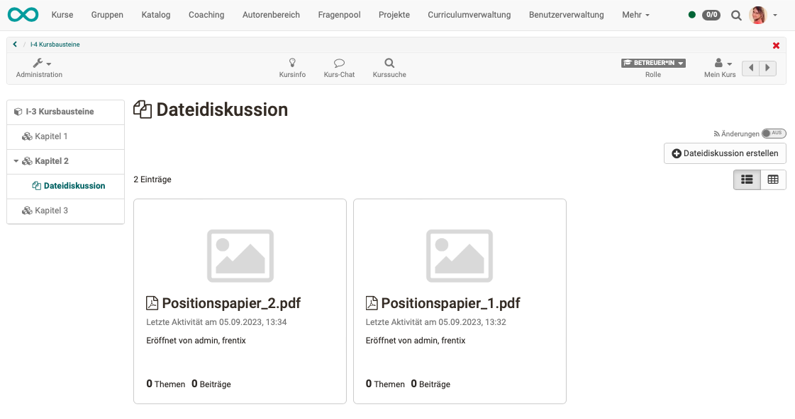{ class="shadow lightbox" }

### How is a contribution added to the discussion?

Discussion participants can write replies with or without quoting the previous post.
If a post is edited afterwards, this is shown in the header; the last editing step is displayed in each case.
Files can also be attached when creating or editing a post.

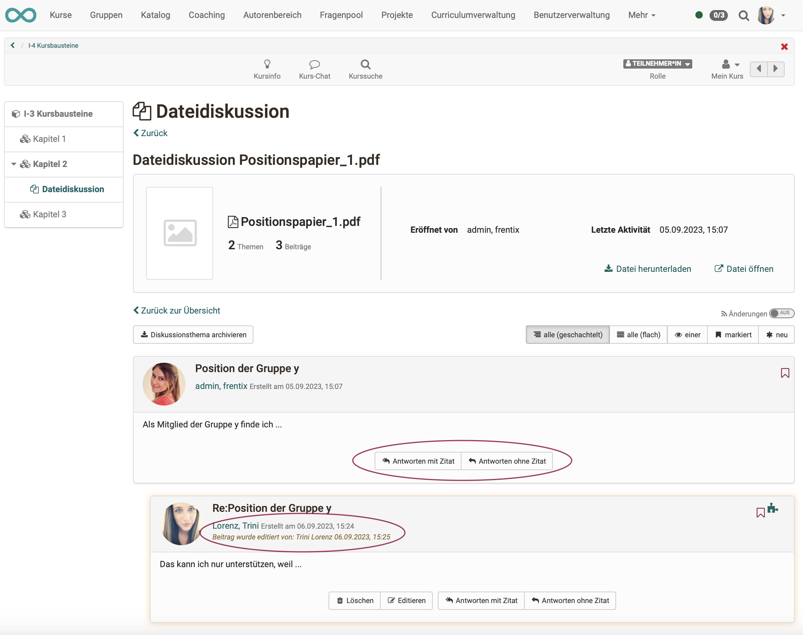{ class="shadow lightbox" }

!!! tip "Tip"

    You can also set up a subscription via the bell icon to be informed of new posts.

### What is the role of moderators?

Moderators usually have the following tasks:

* getting the discussion going (e.g. by uploading a file as the basis for discussion),
* observing in a controlling manner (monitoring and steering the content),
* taking corrective action when needed. (For example, you can hide offensive, inappropriate forum posts. Changes made by moderators to a forum post are displayed.)

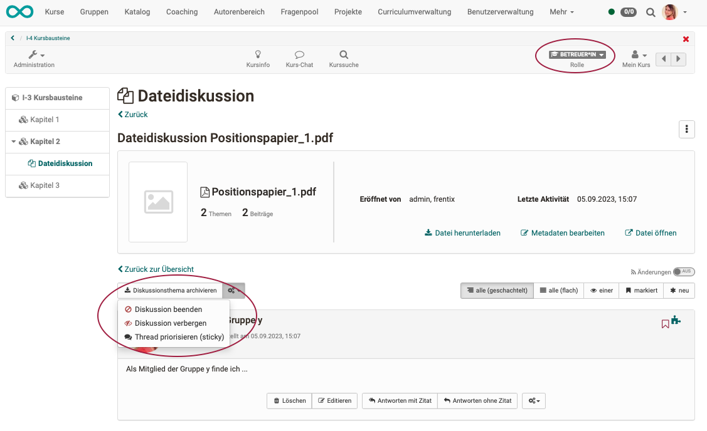{ class="shadow lightbox" }

!!! note "Note"

    This task can be assigned to all coaches in the "Configuration" tab. Other individual persons can also be named and authorised.

### Searching posts, appearance of the discussion

Above the posts of a file dialog, several buttons allow you to change how the posts are displayed. For example, discussion posts can be shown nested (replies indented). Or you can display only the most recent posts. This makes it easier to search extensive discussions.

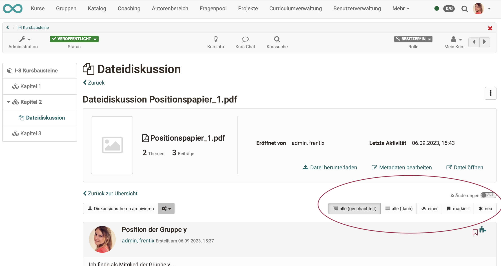{ class="shadow lightbox" }

### Moving posts

Discussion posts can be moved to another place in a file dialog by authorised persons. This is also possible into another course element and even across courses.

A single post, an entire discussion thread, or part of a discussion thread with all replies attached below it, can be moved. The discussion participants affected can be informed by mail about the moving of their posts.

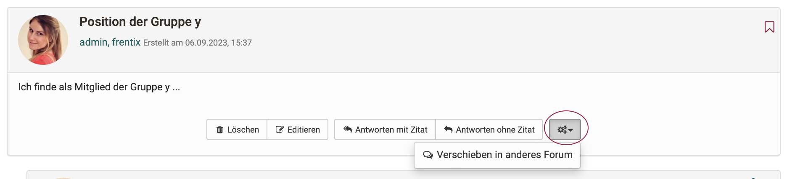{ class="shadow lightbox" }

A wizard helps with moving.

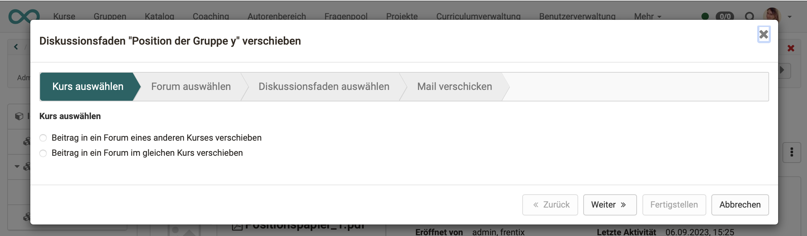{ class="shadow lightbox" }

!!! note "Note"

    Because the file dialog is a special type of forum, posts and discussion threads can also be moved to a course element of the type "Forum".

### Deleting

A distinction must be made when deleting:

* **Deleting a single post**: The creator of a discussion post has the right to delete their own post again. Deleting a post normally also makes the replies to that post obsolete. Therefore, the replies to this post are also deleted. The discussion thread is thus cut off at this point.

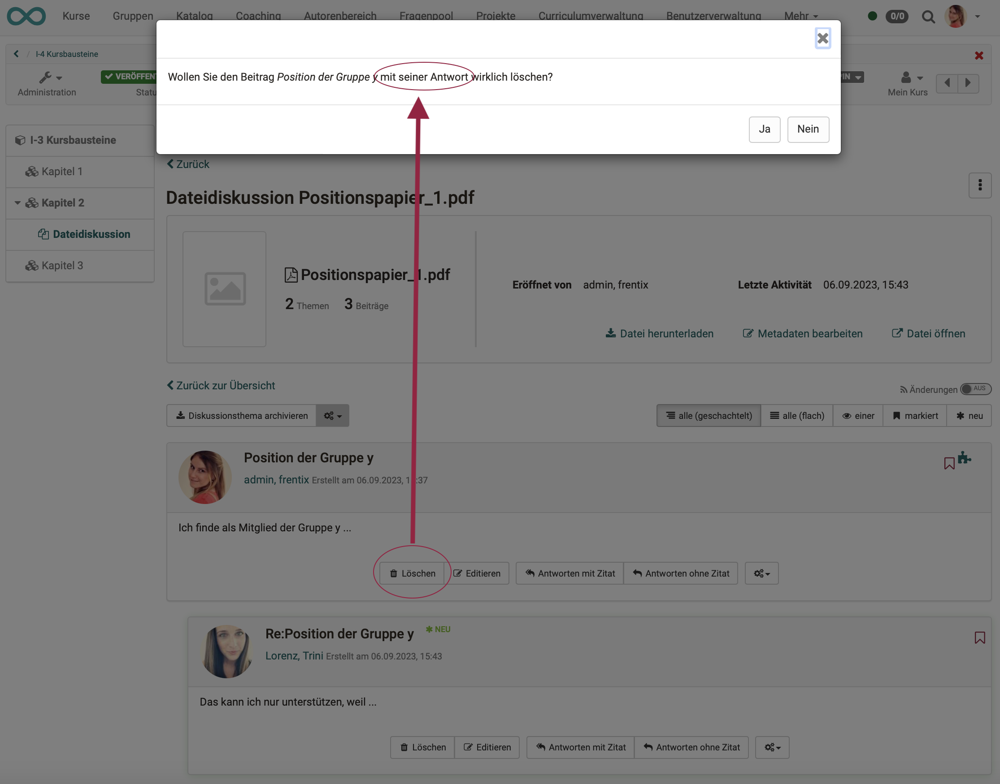{ class="shadow lightbox" }

* **Deleting the entire discussion for a file**:
Owners and coaches have access to this option at the top right, in the icon with the 3 dots. Alternatively, the 3 dots at the end of a table row (file) can also be selected in the table view.

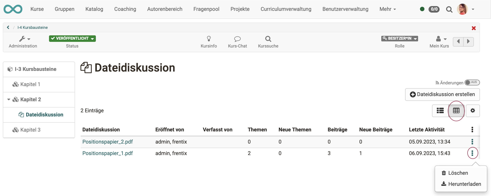{ class="shadow lightbox" }

## Ending and archiving discussions

Manually ending a discussion is done by coaches and owners.

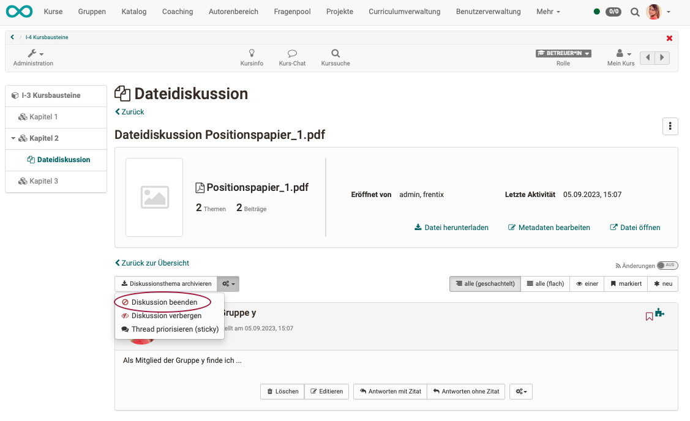{ class="shadow lightbox" }

Only the individual discussion thread for one file is ended each time; it is then marked accordingly. Content changes are then no longer possible. However, the original document remains, and new discussions about it can be opened at any time.

Another way to automatically close all discussions of a course element is to limit, in the course editor under "Configuration", the time frame for the permission to create forum posts or new discussion topics including file upload. After the deadline, editing is automatically deactivated for the respective roles. This can be set separately for participants and coaches. Deleting or changing existing posts remains possible, depending on the role.

Coaches and owners can also archive the discussion topics as a .zip file via the corresponding button.

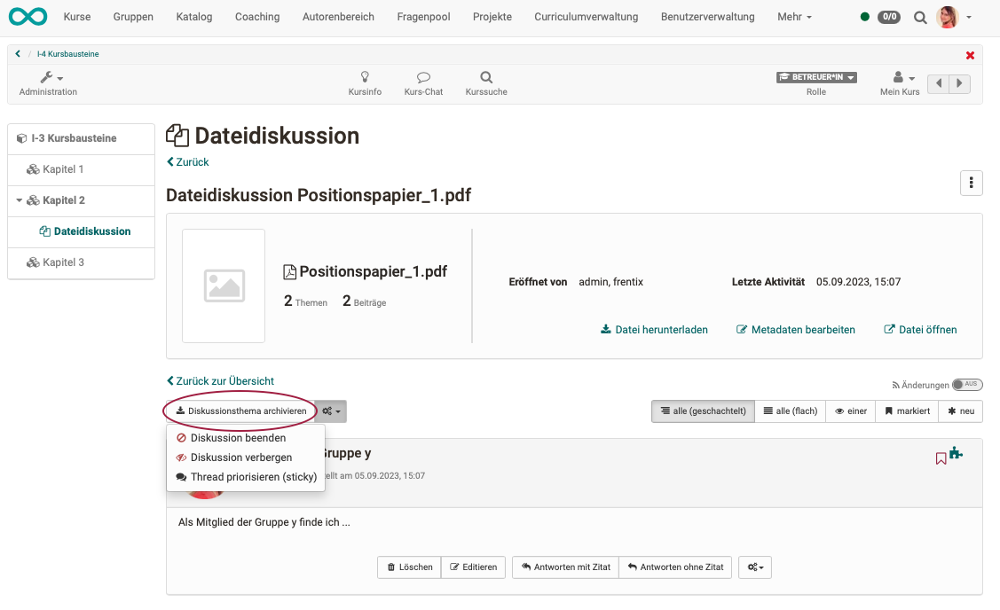{ class="shadow lightbox" }
