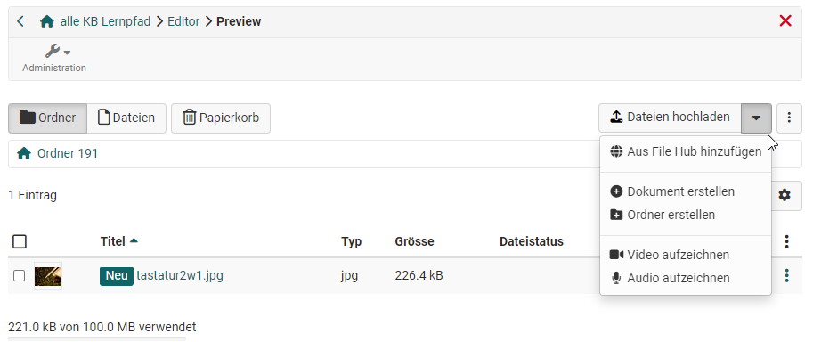

# Kursbaustein "Ordner" {: #folder}

## Steckbrief

Name | Ordner
---------|----------
Icon | { class=size24  }
Verfügbar seit | Neuauflage mit Release 19.1
Funktionsgruppe | Wissensvermittlung
Verwendungszweck | Bereitstellung von Dateien zum Download (z.B. Material zum Kurs)
Bewertbar | nein
Spezialität / Hinweis | Ein ähnlicher Kursbaustein ist der Kursbaustein "Teilnehmer Ordner". 

Der Kursbaustein "Ordner" ermöglicht es Lehrenden, Dateien zum Download bereitzustellen. Häufig werden hier Kursmaterialien wie Folien oder Skripte hinterlegt. Der "Ordner" kann aber auch als kollaboratives Werkzeug für den Dateiupload durch Lernende konfiguriert werden.

---

## Konfiguration im Kurseditor {: #config}

### Tab Lernpfad {: #tab_learning_path}

=== "Tab Lernpfad mit fixen Zeitangaben"
    
    { class="shadow lightbox" }

=== "Tab Lernpfad mit relativen Zeitangaben"

    { class="shadow lightbox" } 

**Durchführung** 
Wie bei anderen Kursbausteinen auch, kann für einen "Ordner" bestimmt werden, dass er obligatorisch mindestens einmal geöffnet werden muss, damit er als "erledigt" gilt. 
Als freiwilliger Kursbaustein zählt er nicht bei der Berechnung des Lernfortschritts mit.
Wird er ausgenommen, erscheint er nicht im Menü, es sei denn, dass bei eingeschalteten Ausnahmen bestimmt wird, dass bestimmte Kursmitglieder diesen Kursbaustein im Kursmenü angezeigt bekommen.

**Relatives Datum** 
Diese Angabe bezieht sich auf die beiden folgenden Angaben. Wird kein relatives Datum gewünscht, können (optional) für "Freigabedatum" und "Zu bearbeiten bis" fixe Zeitpunkte eingegeben werden. Werden relative Daten gewünscht, können statt fixen Daten Bezugspunkte wie "x Tage nach erstem Kursbesuch" ausgewählt werden.

**Freigabedatum** 
Der Kursbaustein ist vor dem Freigabedatum zwar sichtbar, aber nicht zugänglich. Ab dem angegebenen Zeitpunkt ist das Öffnen und Arbeiten darin möglich. Wird keine Angabe gemacht, bleibt der Ordner ab dem Freigabdatum dauerhaft verfügbar, sofern man Zutritt zum Kurs hat.

**Zu bearbeiten bis:** 
Der Baustein kann bis zum angegeben Zeitpunkt geöffnet und bearbeitet werden. 
Wird keine Angabe gemacht, bleibt der Ordner ab dem Freigabdatum dauerhaft verfügbar, sofern man Zutritt zum Kurs hat. 

**Bearbeitungszeit** 
Hier kann eingetragen werden, wie lang der/die Autor:in die Bearbeitungszeit für den Kursbaustein **einschätzt**. Die hier angegebene Bearbeitungszeit ist unabhängig davon, wieviel Zeit wirklich benötigt wird. Die geschätzte Zeitangabe kann jedoch für die Berechnung des Lernfortschritts verwendet werden.

**Erledigungskriterium** 
Hier bestimmen Sie, wodurch der Kursbaustein im Kursmenü als "erledigt" markiert wird.

---

### Tab Ordnerkonfiguration {: #tab_folder_config}

**Ordner wählen** 
Im Tab "Ordnerkonfiguration" legen Sie fest, *wo* die Dateien dieses Ordners im Ablageordner des Kurses gespeichert werden sollen. OpenOlat kann dafür entweder automatisch einen neuen Ordner erstellen, oder Sie wählen einen bereits vorhandenen Ordner im Ablagebereich des Kurses aus.

Wird die Option **"Automatisch generierter Ordner"** gewählt, legt OpenOlat im Menü "Dateien" den Unterordner "_courselementdata" an inklusive eines Unterordners mit dem Namen des jeweiligen Kursbaustein "Ordners" entlang der Navigationsstruktur. Alle Dateien des Kursbausteins werden nun hier gespeichert.

Wählt man **"Ordner aus Ablageordner des Kurses verwenden"** kann ein bereits existierender Ordner aus dem Ablageordner des Kurses ausgewählt werden. Das bietet sich besonders an, wenn Sie die Dateien, die Sie bereitstellen wollen, bereits sinnvoll im Ablageordners des Kurses strukturiert hochgeladen haben. Alternativ kann auch gezielt ein neuer Ordner im Ablageordner erstellt werden. Wenn mit dem Kurs ein in den [Kurseinstellungen](../learningresources/Course_Settings.de.md) ein Ressourcenordner verknüpft ist, kann dieser ebenfalls ausgewählt werden. Wählen Sie in diesem Fall bei den angezeigten Ordnern des Ablageordners den "_sharedfolder" aus.

 

**Dateien hochladen** 
Nachdem der konkrete Ablageort gewählt ist können Sie über den Button "Ordner verwalten" im Bereich "Dateien hochladen" Ihre Dateien hochladen oder erstellen. 

Ein Zugriff auf diesen Dateibereich ist auch bei geschlossenem Kurseditor möglich (siehe unten).

 

**Benutzerberechtigungen** 
Unter "Berechtigungen" kann definiert werden, wer Dateien in dem Kursbaustein Ordner hochladen und erstellen darf. Standardmässig dürfen neben den Besitzer:innen auch Betreuer:innen, aber nicht die Teilnehmer:innen Dateien hochladen.

Über die erweiterte Konfiguration kann ferner die Bereitstellung von Dateien auch für bestimmte Gruppen, z.B. für Assistenten oder Hiwis oder auch nur für einzelne Personen definiert werden. 

---

## Ansicht bei geschlossenem Kurseditor {: #view_with_editor_closed}

Folgende Möglichkeiten stehen Kursbesitzer:innen und Personen mit der entsprechenden Berechtigung zur Verfügung:

### Dateien hinzufügen

**Dateien hochladen:** Wählen Sie eine Datei von Ihrer Festplatte aus. Klicken Sie auf den kleinen Pfeil nach unten, um zusätzliche Optionen zu sehen (vergl. Screenshot "Dateien hochladen):

 * **Aus File Hub hinzufügen:** Greifen Sie auf den [File Hub](../personal_menu/File_Hub.de.md) sowie auf Ihre Ordner und Dateien zu. Sie können auch auf Ihr [Media Center](../personal_menu/Media_Center.de.md) zugreifen und Dateien direkt in den File Hub hochladen.
  
* **Dokument erstellen:** Je nach aktivierten Editoren (z.B. Word, Excel, PowerPoint, Diagramme, Whiteboard, Text, HTML, CSS, XML) können Sie hier neue Dokumente erstellen und diese mit einer Beschreibung, Lizenz und weiteren Metadaten versehen.
  
* **Ordner erstellen:** Erstellt einen neuen Unterordner im Kursbaustein.
  
* **Video aufzeichnen:** Zeichnen Sie ein Video mit der Webcam auf.
  
* **Audio aufzeichnen:** Nehmen Sie eine Audiodatei auf.

## Weitere Optionen und Anpassungen des Kursbausteins {: #further_options}

User können Änderungen im Ordner abonnieren. Zudem lässt sich die Ansicht individuell anpassen, indem zwischen der visuellen Kachelansicht und der detaillierten Tabellenansicht gewechselt wird. In der Tabellenansicht können die angezeigten Spalten ausgewählt werden, um mehr Details als in der Kachelansicht anzuzeigen. Die Suchfunktion ermöglicht es, Dateien schnell zu finden. Gelöschte Dokumente werden in den "Papierkorb" verschoben.

Im 3-Punkte-Menü des Kursbausteins können Sie den [WebDAV-Link](../basic_concepts/Using_WebDAV.de.md) anzeigen lassen und Metadaten aktualisieren. 

### Metadaten {: #metadata}

Die konkreten [Metadaten](../basic_concepts/Full_Text_Search.de.md#metadata) einer Datei können Kursbesitzer:innen über das 3-Punkte-Menü einer konkreten Datei bearbeiten. 

Neben der Beschreibung und Sperreigenschaften sind besonders die Lizenzangaben relevant. Über die Lizenzangaben können Sie eine konkrete Lizenz für das Dokument hinterlegen, z.B. eine der Creative Commons Lizenzen verwenden, den Lizenzgeber eintragen, sowie weitere Informationen zum Herausgeber, zur Quelle, zum Erscheinungsdatum usw. hinterlassen. Die Lizenz wird im Ordnerbaustein in einer separaten Spalte angezeigt. Mit Klick auf die Lizenz erhält der User die hinterlegten Informationen zur jeweiligen Lizenz.

In den Metadaten wird auch angezeigt, wie häufig eine Datei aufgerufen wurde. Ferner gibt es einen Link, mit dem Sie die jeweilige Datei direkt verlinken können. Ob auch externe Personen auf die Datei zugreifen können, ist von den Zugangseinstellungen des Kurses abhängig.

### Dateien bearbeiten {: #edit_files}

Personen mit Bearbeitungsrechten können bei unterstützten Dateiformaten wie docx, xlsx, pptx, draw.io, dwb, txt, html, css und xml durch einen Klick auf den Dateinamen direkt in den Bearbeitungsmodus wechseln. Voraussetzung dafür ist, dass diese Formate in der OpenOlat [Administration](../../manual_admin/administration/External_Tools_-_Administration.de.md) aktiviert wurden.

## Weiterführende Informationen {: #further_information}

:octicons-device-camera-video-24: **Video-Einführung**: [Abonnements](<https://www.youtube.com/embed/h9gOqt7TR7Q>){:target="_blank”}

[Lernpfad Kurs - Kurseditor >](../../manual_user/learningresources/Learning_path_course_Course_editor.de.md) 

