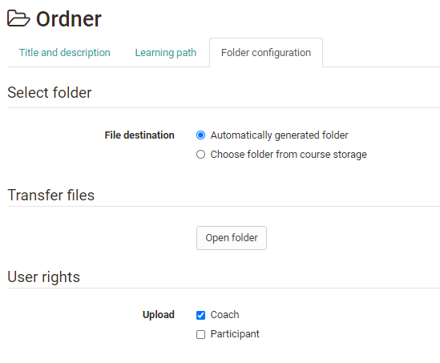
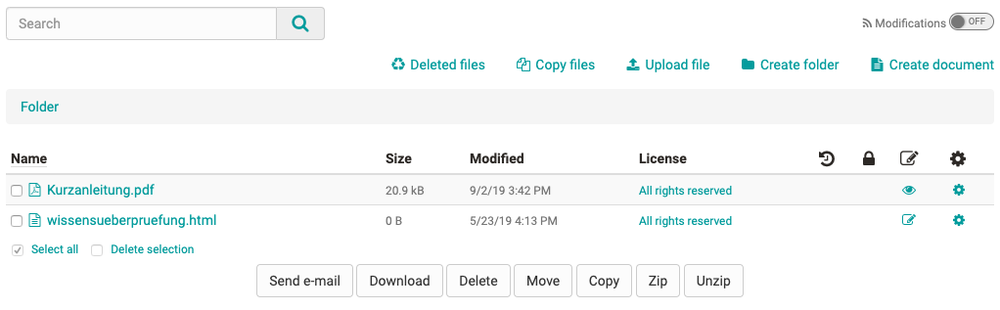

# Course Element "Folder"

## Profile

Name | Folder
---------|----------
Icon | { class=size24 }
Available since | New edition with release 17.1
Functional group | Knowledge transfer
Purpose | Provision of files for download (e.g. material for the course)
Assessable | no
Specialty / Note | A similar course element is the course element "Participant folder".

In the course element "Folder" you can offer files to be downloaded. Often
folders are used to provide course participants with scripts or slides
regarding your course. But the course element offers even more possibilities.
Furthermore, the course element can also be configured in the tab "Folder
configuration" to allow participants to upload and edit files.

Please note: The order of the files is not fixed. The user can sort the files
according to the columns by name, size and modification date.

##  Tab Folder Configuration {: #config}

In the tab "Folder configuration" of the course element you define where
exactly the files of this folder should be stored in the folder of the course.
For this OpenOlat can either generate a folder automatically or select a
specific folder from the course folder.

If the option "Automatically generated folder" is selected, OpenOlat creates
the subfolder _courselementdata including a subfolder with the name of the
respective course element "folder". All files of the course element are now
saved here.

If you select "Choose folder from course storage" you can select an existing
folder from the course folder. This is especially useful if you have already
uploaded the files you want to make available in a structured way in the
course's folder. In the next step, select an existing folder in the storage
folder and create a new subfolder in the storage folder. If configured in the
[course settings](../learningresources/Course_Settings.md), you can also access a linked resource
folder via the storage folder.

You can then upload files to the previously defined location in the "Upload
files" area via the "Manage folder" link or display the files that have
already been uploaded.

Access to this file area is also possible when the editor is closed.

### User rights settings

Furthermore, in the "User rights" section, you can define whether coaches
and/or participants are also allowed to edit and upload files to the folder.
By default, coaches are allowed to upload files in addition to the owners, but
not the participants.

## Settings with closed editor

In the course run, course owners and persons with the right to save files in
the folder can ...

  * Upload and download files
  * Delete, move and copy files
  * Create new documents
  * Depending on the file type, you can also edit files, especially if a document editor is activated in the administration.
  * Create new subfolders within the course element. So a course element "Folder" can contain several subfolders. The use of several course element folders is only necessary if the folders are to be integrated at different places in the course structure or if the folders are connected with different selective releases.

To facilitate the upload and download of multiple files, the files can be
zipped or unzipped. In addition, the use of [WebDAV](../basic_concepts/Using_WebDAV.md) is
recommended for uploading more extensive materials.

Furthermore, all users can ...

  * Send files of the folder by e-mail to registered OpenOlat users
  * Search the files in the folder for keywords
  * Subscribe to the folder and be quickly informed about changes

###  Metadata  {: #metadata}

The gear symbol can be used to configure the [metadata] (../basic_concepts/Full_Text_Search.md#metadata)of a file and thus add
various information. In addition to the description and lock properties, the
license information is particularly relevant. You can use the license
information to define a specific license for the document, for example, use
one of the existing Creative Commons licenses, enter the licensor, and leave
additional information about the publisher, source, publication date, and so
on. The license is displayed in a separate column in the folder module. By
clicking on the license, the user receives the stored information on the
respective license.

The metadata also shows how often a file was called up. There is also a link
with which you can directly link the respective file. Whether external persons
can also access the file depends on the access settings of the course.

### Edit Files

Depending on the file type and activation in OpenOlat [Administration](../../manual_admin/administration/External_Tools_-_Administration.md), it is possible to edit files located in the course element "Folder". If editing is possible, the editing icon { class=size16 } appears in the table. Clicking on the icon opens the respective editing editor, e.g. Only Office. By using these external, cooperative editing tools, the course element "Folder" can also be used for the collaborative work of learners.