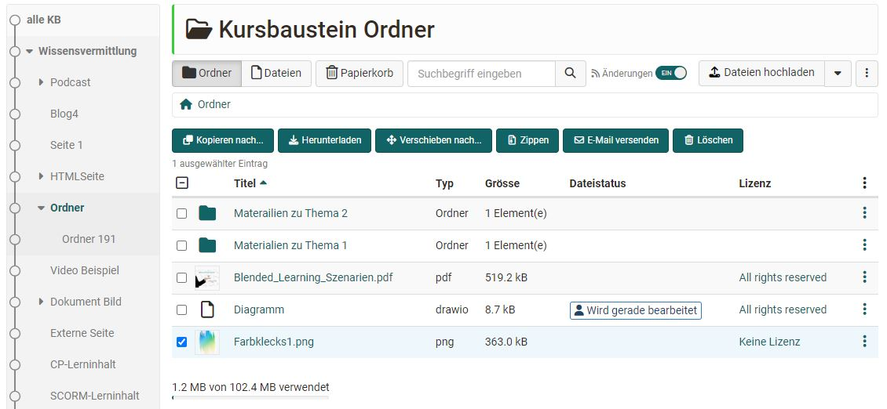

# Course Element "Folder" {: #folder}

## Profile

Name | Folder
---------|----------
Icon | { class=size24 }
Available since | New edition with release 17.1
Functional group | Knowledge transfer
Purpose | Provision of files for download (e.g. material for the course)
Assessable | no
Specialty / Note | A similar course element is the course element "Participant folder".

In the course element "Folder" you can offer files to be downloaded. Often folders are used to provide course participants with scripts or slides regarding your course. 
The "folder" can also be configured as a collaborative tool for learners to upload files.

---

## Configuration in the course editor {: #config}

### Tab learning path {: #tab_learning_path}

### Tab folder configuration {: #tab_folder_config}

**Select folder** 
In the tab "Folder configuration" of the course element you define where exactly the files of this folder should be stored in the folder of the course. For this, OpenOlat can either generate a folder automatically or select a specific folder from the course folder.

If the option **"Automatically generated folder"** is selected, OpenOlat creates the subfolder "_courselementdata" including a subfolder with the name of the respective course element "folder". All files of the course element are now saved here.

If you select **"Choose folder from course storage"**v  you can select an existing folder from the course folder. This is especially useful if you have already uploaded the files you want to make available in a structured way in the course's folder. In the next step, select an existing folder in the storage folder and create a new subfolder in the storage folder. If a resource folder is linked to the course in the [Course settings](../learningresources/Course_Settings.md), this can also be selected. In this case, select "_sharedfolder" from the folders displayed in the storage folder.

 

**Upload files** 
Once you have selected the specific storage location, you can upload or create your files using the "Manage folder" button in the "Upload files" area. 

Access to this file area is also possible when the course editor is closed (see below).

 

**User rights**

Under "User rights" you can define who can upload and create files in the course element folder. By default, coaches are allowed to upload files in addition to the owners, but not the participants.

The extended configuration can also be used to define the provision of files for specific groups, e.g. for assistants or support staff, or for individual persons only. 

---

## View with closed course editor {: #view_with_editor_closed}

The following options are available to course owners and persons with the appropriate authorization:

### Add files

**Upload files:** Select a file from your hard disk. Click on the small down arrow to see additional options (see screenshot "Upload files"):

* **Add from file hub:** Access the [File Hub](../personal_menu/File_Hub.md) and your folders and files. You can also access your [Media Center](../personal_menu/Media_Center.md) and upload files directly to the File Hub.

* **Create Document:** Depending on the editors activated (e.g. Word, Excel, PowerPoint, diagrams, whiteboard, text, HTML, CSS, XML), you can create new documents here and add a description, license and other metadata to them.

* **Create folder:** Creates a new subfolder in the course element.

* **Record video:** Record a video with your webcam.

* **Record audio:** Record an audio file.

### Further options and adjustments to the course element  {: #further_options}

Users can subscribe to changes in the folder. The view can also be customized by switching between the visual tile view and the detailed table view. In the table view, the displayed columns can be selected to show more details than in the tile view. The search function makes it possible to find files quickly. Deleted documents are moved to the "trash can".

You can display the [WebDAV link](../basic_concepts/Using_WebDAV.md) and update metadata in the 3-dot menu of the course element. 

### Metadata  {: #metadata}

Course owners can edit the specific [metadata](../basic_concepts/Full_Text_Search.md#meta-data--metadata) of a file via the 3-dot menu of a specific file. 

In addition to the description and lock properties, the license information is particularly relevant. You can use the license information to define a specific license for the document, for example, use one of the existing Creative Commons licenses, enter the licensor, and leave additional information about the publisher, source, publication date, and so on. The license is displayed in a separate column in the folder module. By clicking on the license, the user receives the stored information on the respective license.

The metadata also shows how often a file was called up. There is also a link with which you can directly link the respective file. Whether external persons can also access the file depends on the access settings of the course.

### Edit Files

Persons with editing rights can switch directly to editing mode for supported file formats such as docx, xlsx, pptx, draw.io, dwb, txt, html, css and xml by clicking on the file name. The prerequisite for this is that these formats have been activated in the OpenOlat [Administration](../../manual_admin/administration/External_Tools_-_Administration.md).

## Further information {: #further_information}

:octicons-device-camera-video-24: **Video introduction (German)**: [Subscriptions](<https://www.youtube.com/embed/h9gOqt7TR7Q>){:target="_blank”}

[Learning path course - Course editor >](../../manual_user/learningresources/Learning_path_course_Course_editor.md) 
