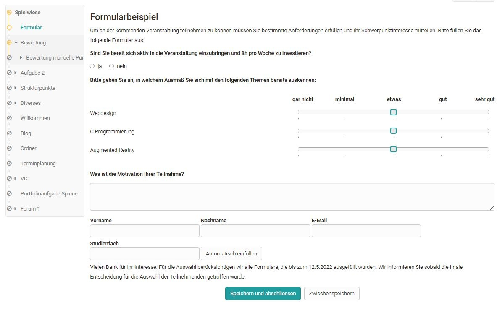

# Kursbaustein "Formular"  {: #course_element_form}

## Steckbrief

Name | Formular
---------|----------
Icon | { class=size24  }
Verfügbar seit | 
Funktionsgruppe | Wissensüberprüfung
Verwendungszweck | Kursbaustein zur Integration der Lernressource "Formular"
Bewertbar | nein
Spezialität / Hinweis |

Mit dem Kursbaustein "Formular" können Sie die Lernressource Formular einem Kurs hinzufügen. Das Formular funktioniert ähnlich wie der Kursbaustein "Umfrage" und kann ebenfalls nur einmal ausgefüllt werden. Allerdings sind die Bearbeitungen des Formulars nicht anonym (zumindest in der Standard Einstellung).

Für das Ausfüllen des Kursbausteins kann im Tab "Formular" ein letzter Abgabetermin definiert werden. Eine [Kurs-Erinnerung](../learningresources/Course_Reminders.de.md) kann ebenfalls ergänzend verknüpft werden. Anders als beim Umfragebaustein erhalten die Teilnehmenden bei Abgabe des ausgefüllten Formulars automatisch eine Bestätigungsmail mit Datum und Zeitpunkt der Abgabe sowie ihr ausgefülltes Formular als PDF im Anhang.
  
Betreuende sehen in der Übersichtstabelle im Kursrun welche Teilnehmenden das Formular schon ausgefüllt haben und welche nicht. Bereits abgegebene Formulare können zur weiteren Bearbeitung durch den Teilnehmenden vom Betreuer wieder geöffnet oder auch komplett zurückgesetzt werden. Mit Klick auf die Teilnehmenden kann das ausgefüllte Formular angesehen werden. Die Formulardaten aller Teilnehmenden stehen als Excel-Export zur Verfügung.

Die Verwendung dieses Kursbausteins ist z.B. hilfreich, wenn die Lernenden bestimmte Formulare verpflichtend ausfüllen müssen, z.B. vor der Aufnahme eines Laborpraktikums oder als Bestätigung für das eigenständige Erbringen einer Leistung.

!!! Info

    Anders als beim Kursbaustein Umfrage erfolgt für diesen Kursbaustein allerdings keine spezifische grafische Auswertungsübersicht. 

## Formulare einbinden

Wie Sie Formulare erstellen und in Kurse einbinden erfahren Sie [hier](../forms/Three_Steps_to_your_Form.de.md).

Nachdem Sie den Kursbaustein Formular dem Kurs hinzugefügt haben stehen Ihnen im Kurseditor folgende Tabs zur Verfügung:

{ class="shadow lightbox" }

Im Tab "Titel und Beschreibung" sowie "Layout" können allgemeine Beschreibungen und Informationen zum jeweiligen Kursbaustein hinterlegt und die optische Darstellung definiert werden. Im [Tab Lernpfad](../learningresources/Learning_path_course_Course_editor.de.md) werden spezielle Einstellungen die für Lernpfad Kurse gelten definiert. Herkömmliche Kurs verfügen dagegen über die Tabs Sichtbarkeit und Zugang. Hier wird definiert, wer diesen Kursbaustein sehen bzw. bearbeiten kann.

### Tab "Formular"

Die zentrale Konfiguration erfolgt im Tab "Formular". Hier wird im ersten Schritt entweder ein neues Formular erstellt oder ein existierendes ausgewählt.

{ class="shadow lightbox" }

Nach Klick auf den Button werden alle Formulare, bei denen man Besitzer ist, angezeigt und können einfach per Klick auf den Haken ausgewählt werden.

{ class="shadow lightbox" }

Hat man noch kein Formular erstellt, kann eine neue Lernressource Formular über den Button "Erstellen" erstellt oder ein extern vorliegendes Formular über den Button "Importieren" hinzugefügt werden. Anschließend erscheint das gerade angelegte oder importierte Formular ebenfalls in der Liste und kann ausgewählt werden.

Ein neu erstelltes Formular beinhaltet zunächst noch keine Elemente, Fragen oder Textfelder. Diese müssen im Kurs über "Bearbeiten" oder alternativ direkt in der Lernressource im [Formular Editor](../learningresources/Form_editor_Questionnaire_editor.de.md) hinzugefügt werden.

Wenn ein Formular im Kurseditor erstellt wird, wird automatisch eine neue Lernressource Formular angelegt, die auch im [Autorenbereich](../area_modules/Authoring.de.md) unter "Meine Einträge" zu finden ist und in weiteren Kursen und Kursbausteinen eingebunden werden kann.

!!! info "Hinweis"

    Nachdem ein Formular ausgewählt wurde kann es über den Link "Bearbeiten" gestaltet werden. Wurde das Formular schon vorher passend eingerichtet ist eine Bearbeitung nicht mehr nötig.

{ class="shadow lightbox" }

**Mehrfaches Ausfüllen des Formulars**

Für manche Anwendungsfälle soll das Formular von jedem/jeder Teilnehmer:in nur einmal verwendet werden können, z.B. für das Feedback zu einem Kurs.
In anderen Anwendungsfällen soll ein Formular mehrfach von den gleichen Teilnehmer:innen verwendet werden können, z.B. soll eine Person mit dem gleichen Formular mehrfach Bestellungen machen können. 
Im Kursbaustein "Formular" kann deshalb mit einem Toggle-Button die Mehrfachverwendung erlaubt werden.

**Teilnahme bis...**

Zusätzlich kann in dem Tab definiert werden bis wann das Formular von den Lernenden ausgefüllt werden kann. Hierfür kann ein festes oder ein relatives Datum verwendet werden, z.B. x Tage nach dem ersten Kursbesuch. Sobald ein Enddatum definiert wurde wird auch der Tab "[Erinnerungen](../learningresources/Course_Reminders.de.md)" aktiviert. Zum Beispiel könnte man eine Erinnerung erstellen, die die Lernenden wenige Tage vor der Abgabedeadline noch einmal per Mail an das Ausfüllen des Formulars erinnert.

**E-Mail Bestätigung**

Wird die E-Mail Bestätigung aktiviert erhalten die Teilnehmenden eine Bestätigungs-E-Mail und das von ihnen ausgefüllte Formular als PDF Anhang. Zusätzlich können auch E-Mail Bestätigungen an Besitzer, Betreuer und Externe verschickt werden.

!!! warning "Achtung"

    Sobald ein Formular von mindestens einem Teilnehmenden angesehen wurde, kann es nicht mehr ersetzt und nur ansatzweise bearbeitet werden.

## Ansicht: Besitzer und Betreuer

Bei geschlossenem Kurseditor sehen Besitzer und Betreuer eine Übersicht der Lernenden des Kurses und ihren Status der Bearbeitung z.B. "Nicht gestartet". Über die Filterfunktion kann auch eine bestimmte Personengruppe angezeigt werden, z.B. alle Personen, die das Formular noch nicht gestartet haben. Das eigentliche Formular sehen Besitzer und Betreuer hier aber nicht. Ein Export der Formulardaten ist ebenfalls möglich.

Besitzer haben ferner noch die Möglichkeit, die Daten einzelner Personen oder alle Daten zurückzusetzen und verfügen zusätzlich noch über den Tab "Erinnerungen", wenn die Formularabgabe mit einer Deadline versehen ist. Hier können sie neue Erinnerungen erstellen und sehen welche [Erinnerungen](../learningresources/Course_Reminders.de.md) schon versandt wurden.

{ class="shadow lightbox" }

## Ansicht: Teilnehmende

Teilnehmenden wird dagegen direkt beim Klick auf das Formular das konkrete Formular angezeigt und sie können es ausfüllen. Ein Zwischenspeichern ist ebenfalls möglich.

{ class="shadow lightbox" }

Das fertig ausgefüllte Formular muss abschließend gespeichert werden und kann dann vom User nicht mehr bearbeitet, nur noch angezeigt werden.
