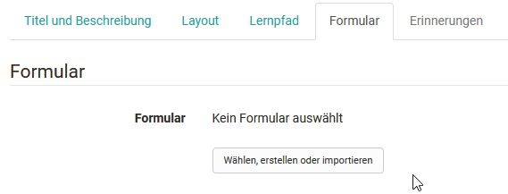
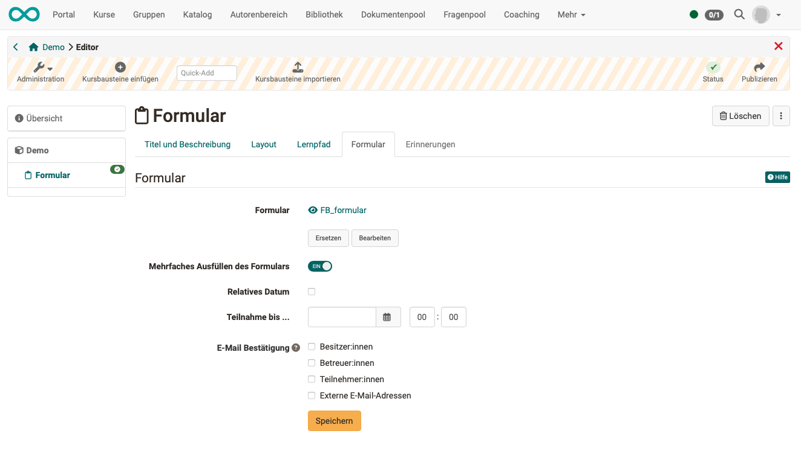

# Course Element "Form"  {: #course_element_form}

## Profile

Name | Form
---------|----------
Icon | { class=size24 }
Available since | 
Functional group | Assessment
Purpose | Course element for integration of learning resource "Form"
Assessable | no
Specialty / Note | 

Using the course element "Form" you can add the learning resource form to a course. The form works similar to the course element "Survey" and can also be filled out only once. However, in contrast to the survey (at least in the standard setting), filling in the form is not anonymous. 

For the completion of the course element, a last deadline can be defined in the tab "Form". A [Course Reminder](../learningresources/Course_Reminders.md) can also be linked in addition. In contrast to the survey module, participants automatically receive a confirmation e-mail with the date and time of submission as well as their completed form as a PDF attachment when they submit the completed form.

Coaches can see in the overview table in the course run which participants have already completed the form and which have not. Forms that have already been submitted can be reopened by the coach for further processing by the participant, or they can be completely reset. By clicking on the participant, the completed form can be viewed. The form data of all participants are available as Excel export.

The use of this course element makes sense e.g. if the learners have to fill in certain forms obligatorily, e.g. before starting a laboratory internship or as confirmation for the independent performance of a service.

!!! Info 

    Unlike the course element survey, however, there is no specific graphical evaluation overview for this course element.

## Integrate forms

You can find out how to create forms and integrate them into courses [here](../forms/Three_Steps_to_your_Form.md).

After you have added the course element Form to the course, the following tabs are available in the course editor:

{ class="shadow lightbox" }

In the tab "Title and description" as well as "Layout" general descriptions and information about the respective course element can be stored and the visual presentation can be defined. In the [tab Learning path](../learningresources/Learning_path_course_Course_editor.md) special settings are defined which are valid for learning path courses. Conventional courses, on the other hand, have the Visibility and Access tabs. Here you define who can see or edit this course element.

### Tab "Form"

The central configuration is done in the "Form" tab. Here, in the first step, either a new form is created or an existing one is selected.

{ class="shadow lightbox" }

After clicking the button, all the forms for which you are the owner will be displayed and you can select them simply by clicking the checkmark.

{ class="shadow lightbox" }

If you have not yet created a form, you can create a new learning resource form using the "Create" button or add an existing external form using the "Import" button. Subsequently, the form just created or imported also appears in the list and can be selected.

A newly created form does not yet contain any elements, questions or text fields. These must be added in the course via "Edit" or alternatively directly in the learning resource in the [Form Editor](../learningresources/Form_Editor.md)

When a form is created in the course editor, a new learning resource Form is automatically created which can also be found in the [Authoring area](../area_modules/Authoring.md) under "My entries" and can be included in further courses and course elements.

!!! info "Hint"

    After a form has been selected, it can be designed via the "Edit" link. If the form has already been set up appropriately, editing is no longer necessary.

{ class="shadow lightbox" }

**Fill out the form multiple times**

For some use cases, the form should only be able to be used once by each participant, e.g. for feedback on a course.
In other use cases, a form should be able to be used multiple times by the same participant, e.g. a person should be able to place multiple orders using the same form. 
Multiple use can therefore be permitted in the ‘Form’ course element using a toggle button.

**Participation until...**

In addition, you can define in the tab until when the form can be filled out by the learners. For this purpose, a fixed or a relative date can be used, e.g. x days after the first course attendance. As soon as an end date has been defined, the tab "[Reminders](../learningresources/Course_Reminders.md)" is also activated. For example, you could create a reminder to email learners again a few days before the submission deadline to remind them to complete the form.

**E-Mail confirmation**

If the e-mail confirmation is activated, the participants will receive a confirmation e-mail and the form they filled out as a PDF attachment. In addition, email confirmations can also be sent to owners, coaches and externals.

!!! warning "Attention"

    Once a form has been viewed by at least one participant, it cannot be replaced or even rudimentarily edited.

## View: Owners and Coaches

When the course editor is closed, the owner and coach see an overview of the learners in the course and their editing status, e.g. "Not started". The filter function can also be used to display a specific group of people, e.g. all people who have not yet started the form. However, the owner and coach do not see the actual form here. An export of the form data is also possible.

Owners also have the option to reset the data of individual persons or all data and additionally have the tab "Reminders" if the form submission has a deadline. Here you can create new reminders and see which [reminders](../learningresources/Course_Reminders.md) have already been sent.

{ class="shadow lightbox" }

## View: Participants

Participants, on the other hand, are shown the specific form directly when they click on it and can fill it out. It is also possible to save the form temporarily.

{ class="shadow lightbox" }

The completed form must finally be saved and can then no longer be edited by the user, only displayed.
