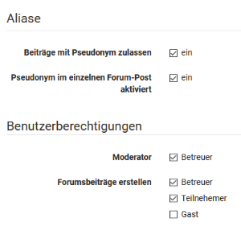
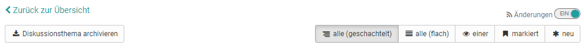
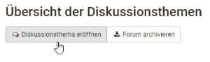
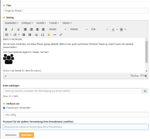
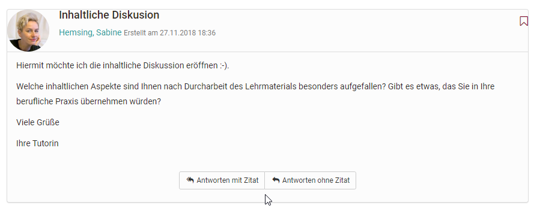
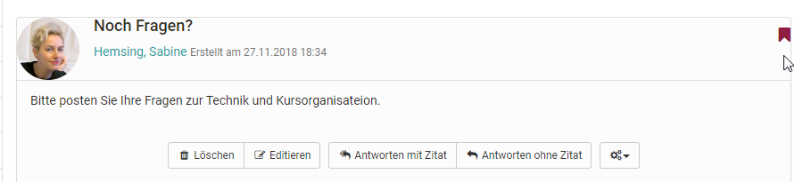
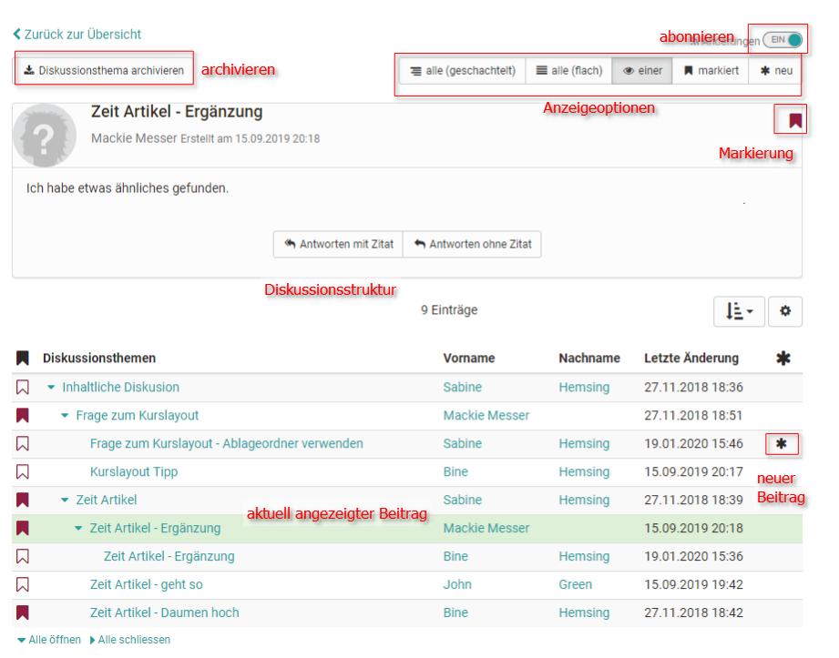

# Kursbaustein "Forum“ {: #forum}

## Steckbrief

Name | Forum
---------|----------
Icon | { class=size24  }
Verfügbar seit | Neuauflage mit Release 18.0
Funktionsgruppe | Kommunikation und Kollaboration
Verwendungszweck | Asynchrone Online-Diskussionen
Bewertbar | nein
Spezialität / Hinweis |

Mit dem Kursbaustein „Forum“ können Sie in Ihrem Kurs auf einfache Weise asynchrone Online-Diskussionen für unterschiedliche Zwecke ermöglichen. Beispielsweise könnten Kursteilnehmende Beiträge mit Fragen zum Inhalt des Kurses verfassen und gegenseitig beantworten oder Sie initiieren eine Fachdiskussion oder setzen spezifische Foren basierte Online-Methoden um. Im Kapitel „Lernaktivitäten im Kurs“ finden Sie unter dem Punkt [„Forum"](../learningresources/Working_with_Forums.de.md) Informationen dazu, wie Forumsbeiträge erstellt und beantwortet werden. Standardmässig haben alle Kursteilnehmer Lese- und Schreibrechte in einem Forum.

Sie können das Forum auch als Alternative für den Mitteilungsbaustein für Ankündigungen von Seiten der Kursautoren verwenden, besonders wenn Rückfragen von den Lernenden erwünscht sind.

!!! tip "Tipp"

    Empfehlen Sie den Kursteilnehmenden, das Forum zu abonnieren, um bei neuen Beiträgen benachrichtigt zu werden.

## Tab Konfiguration

Hier können die Benutzerberichtigungen des Forums eingestellt und definiert werden welche Kursrollen Forenbeiträge erstellen dürfen. Zur Wahl stehen Betreuer, Teilnehmer und Gäste. Auch wird hier eingestellt, ob Betreuer das Forum moderieren dürfen und ob in dem Forum pseudonymisierte Postings erlaubt sind. Bei pseudonymisierten Foren können sich die Beitragsersteller selbst ein Pseudonym auswählen. Ein einmal erstelltes Pseudonym bleibt im Forum immer aktiviert, kann aber je nach Bedarf geändert oder ausgeschaltet werden. Das Pseudonym kann von Benutzer mit einem Passwort geschützt werden, damit nur dieser Benutzer dieses Pseudonym verwenden kann. Ohne Passwortschutz kann dasselbe Pseudonym von mehreren Benutzern verwendet werden. Weiter kann eingestellt werden, dass die Verwendung eines Pseudonyms standardmässig eingeschaltet ist. Wählen Sie dazu die Checkbox "Pseudonym im einzelnen Forum-Post aktiviert".

{ class="shadow" }

Alle Kursbesitzer und [Betreuer](../basic_concepts/coach.de.md) verfügen über folgende weitere **Moderationsrechte**. Sie können:

* Alle Forumsbeiträge editieren, löschen und Dateien anhängen.
* Threads priorisieren (sticky): So erscheint das Diskussionsthema immer zuoberst auf der Liste.
* Diskussionsthemen beenden: Antworten auf Beiträge zu diesem Diskussionsthema sind nicht mehr möglich.
* Diskussionsthemen verbergen: Das Thema erscheint nicht mehr in der Liste der Diskussionsthemen.
* Diskussionsthemen anzeigen: Verborgene Themen werden wieder angezeigt.
* Personenfiltern nutzen: Auf der Forumsübersichtsseite können Forumsbeiträge eines einzelnen Kursteilnehmers angezeigt werden.
* Foren archivieren: Forumsbeiträge (im MS Word-Format) und angefügte Dateien werden in eine ZIP-Datei verpackt und in Ihrem persönlichen Ordner gespeichert.

Personen mit Moderationsrechten können auch Forumsthemen oder einzelne Beiträge verschieben. Zum einen können die Beiträge in ein anderes Thema desselben Forums verschoben werden, zum anderen können ganze Forumsthemen oder Beiträge in ein anderes Forum verschoben werden. Dabei werden jeweils alle darunter liegenden Forumsbeiträge mit verschoben und sind anschliessend im Ursprungsforum nicht mehr sichtbar. Eine Verschiebung von Themen und Beiträgen in ein anderes Forum ist sowohl im selben Kurs als auch in andere Kurse möglich. Der verschobene Thread kann als neuen Diskussionsfaden angelegt werden. Im letzten Schritt der Verschiebung kann zudem ein E-Mail an alle vom Verschieben betroffenen Benutzer geschickt werden, mit der Information, wohin das Forum nun verschoben wird.

!!! warning "Achtung"

    Forumsbeiträge können auch in Foren verschoben werden, in welchen der Ersteller des Beitrages keinen Zugriff hat.

Neben dem Kursbaustein "Forum" gibt es auch die Möglichkeit ein zentrales Forum für den gesamten Kurs in der [Kurs Toolbar](../learningresources/Using_Additional_Course_Features.de.md) anzeigen zu lassen. Das bietet sich häufig an, wenn der Kurs nur ein Forum umfasst, das permanent zur Verfügung stehen soll. Hier können jedoch keine weiteren Einstellungen wie Pseudonymisierung oder Vergabe von Moderationsrechten vorgenommen werden.

## Arbeiten mit Foren

Foren sind die zentralen Werkzeuge für die asynchrone Diskussion in Online-Kursen und auch in OLAT Gruppen. Foren können für den Austausch zwischen den Kursteilnehmenden, für organisatorische Absprachen oder die fachliche Diskussion mit dem Lehrenden verwendet werden. Einige Online-Methoden
verwenden auch gezielt Foren z.B. für Pro-Contra-Diskussionen, die strukturierte Sammlung von Ideen zu bestimmten Aspekten (Brainstorming) usw.

Teilnehmer können in Foren ...

### Diskussionsthemen eröffnen

Wenn Sie im Forum eine neue Nachricht verfassen möchten, wählen Sie „Diskussionsthema eröffnen“. Titel und Beitrag sind obligatorische Angaben. Achten Sie darauf einen aussagekräftigen Titel zu verwenden und bei Reply-Postings angemessen zu verändern.

Mit Hilfe des Foren-Editors können Sie Ihren Beitrag erstellen und formatieren und auch Dateien anhängen. Je nach Konfiguration durch den Kursbesitzer können Sie Ihren Beitrag eventuell auch unter einem Pseudonym veröffentlichen.

### Forumsbeiträge beantworten

Wenn Sie einen bestehenden Forumsbeitrag beantworten möchten, öffnen Sie das Diskussionsthema, indem Sie auf den Titel des Themas klicken. Wählen Sie dann „Antwort mit Zitat“, wenn der Anfangsbeitrag unter Ihrer Antwort erscheinen
soll bzw. Sie direkt auf einzelne Passagen des Beitrags eingehen wollen. Oder wählen Sie „Antwort ohne Zitat“, um den Anfangsbeitrag nicht nochmals aufzuführen.

### Forumsbeiträge markieren

Einzelne Forumsbeiträge können markiert werden. Klicken Sie dazu in der
Detailansicht eines Themas auf die kleine Flagge in der rechten oberen Ecke
eines Beitrags. In der Forumsübersicht sehen Sie wie viele Beiträge pro Thema
markiert wurden. Auf diese Weise können einzelne Beiträge leichter
wiedergefunden oder für eine spätere Beantwortung gekennzeichnet werden.

### Foren archivieren

Wenn Sie das Forum archivieren, werden Forumsbeiträge und angefügte Dateien in eine ZIP-Datei verpackt und können gespeichert werden.

### Foren abonnieren

:octicons-device-camera-video-24: **Video-Einführung**: [Abonnements](<https://www.youtube.com/embed/h9gOqt7TR7Q>){:target="_blank”}

Um bei neuen Forumsbeiträgen benachrichtigt zu werden, stellen Sie in der Übersicht der Diskussionsthemen den Schieberegler bei den "Änderungen“ auf "Ein". Dann erhalten Sie per E-Mail oder unter Abonnements im Bereich "Persönliche Werkzeuge" eine Benachrichtigung. Dabei ist es egal ob ein neuer Beitrag von einem registrierten OLAT Benutzer oder einem Gast eingestellt wurde.

Eine Benachrichtigung erfolgt nur, wenn ein neuer Beitrag erstellt wurde, nicht aber wenn ein bestehender Beitrag geändert wurde!

Sie können Ihrem Posting auch Dateien anhängen, z.B. wenn Ihr Beitrag umfangreicher ist oder Sie sich auf eine bestimmte Datei beziehen. Als Faustregel gilt: Postings, die länger sind als eine DIN A4 Seite sollten im Anhang angefügt und im Posting selbst nur kurz angerissen werden. Sie können
Ihr Posting zu einem späteren Zeitpunkt auch wieder editieren oder löschen, sofern noch niemand auf Ihren Beitrag geantwortet hat.

Es ist möglich, dass Kursteilnehmende vom Lehrenden zusätzlich Moderationsrechte in einem Forum erhalten. Was genau damit verbunden ist, erfahren Sie im Kapitel „[Kommunikation und Kollaboration](../learningresources/Communication_and_Collaboration.de.md)“.

### Darstellungsmöglichkeiten für Foren-Threads

Es gibt verschiedene Darstellungsmöglichkeiten:

* alle (geschachtelt)
* alle (flach)
* einer
* markiert
* neu

User können sich alle Beiträge untereinander anzeigen lassen (alle), mit oder ohne Einrückung. Der Startbeitrag erscheint dabei als erster und die weiteren Beiträge werden entsprechend der Diskussionsstruktur angezeigt. Bei umfangreichen Foren mit vielen Beiträgen bietet es sich an, sich über den Button "neu", nur die neuen Beiträge anzeigen zu lassen. Besonders interessant für komplexere Diskussionen ist auch die Ansicht "einer". Hier wird die gesamte Thread-Struktur angezeigt und kann so sehr gut nachvollzogen werden. Hilfreich dabei ist es, dass sich einzelne Parts ein- und ausblenden lassen. Darüber hinaus erkennt man in dieser Darstellung auch rasch neue Forenbeiträge an dem Sternchen.

Laden Sie impages "[Profil](../personal_menu/Configuration.de.md#profil--profile)" ein Foto hoch, damit neben Ihren Forumsbeiträgen anstelle des Standard-Profilbildes Ihr Foto erscheint.

### Abgrenzung: Dateidiskussion

Die Dateidiskussion stellt eine Kombination aus Forum und Dateibereitstellung dar. So können in Kursen Foren-Diskussionen zu bestimmten Dokumenten erstellt
werden z.B. zu einem Entwurf einer Seminararbeit, einem Bild, einem Konzept oder einem inhaltlichen Dokument. Zu jeder hochgeladenen Datei wird automatisch ein Forum erstellt.

Um an einer Diskussion teilzunehmen, klicken Sie auf den Link „Anzeigen“ neben dem Dateinamen. Nun haben Sie dieselben Möglichkeiten, Diskussionsthemen zu eröffnen oder Beiträge zu beantworten wie im Forum.

#### Datei hochladen

Standardmäßig können Kursteilnehmer keine Dateien hochladen. Diese Option kann aber vom Kursbesitzer im Kurseditor aktiviert werden. Wenn Sie über diese Möglichkeit verfügen, wählen Sie „Datei hochladen“, um eine eigene Datei hochzuladen. Wer wann welche Datei hochgeladen hat ist über die Spalten Vorname, Nachname bzw. Datum erkennbar.
