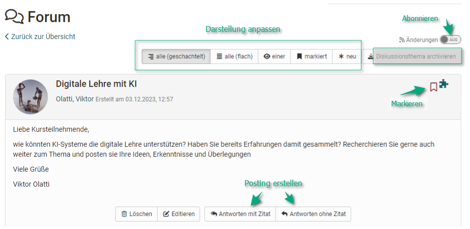

# Kursbaustein "Forum“ {: #forum}

## Steckbrief

Name | Forum
---------|----------
Icon | { class=size24  }
Verfügbar seit | Neuauflage mit Release 18.0
Funktionsgruppe | Kommunikation und Kollaboration
Verwendungszweck | Asynchrone Online-Diskussionen
Bewertbar | nein
Spezialität / Hinweis |

Mit dem Kursbaustein "Forum" können Sie in Ihrem Kurs auf einfache Weise asynchrone Online-Diskussionen für unterschiedliche Zwecke ermöglichen. Beispielsweise können Kursteilnehmende Beiträge mit Fragen zum Inhalt des Kurses verfassen und gegenseitig beantworten oder Sie initiieren eine Fachdiskussion oder setzen spezifische Foren basierte Online-Methoden um usw. 

## Tab Konfiguration

Die Konfiguration eines Forums erfolgt im Kurseditor im Tab "Konfiguration". Hier können die Benutzerberechtigungen des Forums eingestellt und definiert werden, welche Kursrollen Forenbeiträge erstellen dürfen. Zur Wahl stehen Betreuer, Teilnehmer und Gäste. Auch wird hier eingestellt, ob Betreuer das Forum moderieren dürfen und ob in dem Forum pseudonymisierte Postings erlaubt sind. 

### Foren mit Pseudonym

Wurde der Haken bei "Beiträge mit Pseudonym zulassen" aktiviert können die Beitragsersteller selbst einen Namen  eintragen unter dem ihr Beitrag erscheint.  Das Pseudonym kann von Benutzer mit einem Passwort geschützt werden, damit nur dieser Benutzer dieses Pseudonym verwenden kann. Ohne Passwortschutz könnte dasselbe Pseudonym von mehreren Benutzern verwendet werden. 
Weiter kann eingestellt werden, ob der eingegebene Pseudonymname bei weiteren Postings im Forum als Standard voreingestellt ist und somit auch weitere Postings unter dem definierten Namen erfolgen. Wählen Sie dazu die Checkbox "Pseudonym im einzelnen Forum-Post aktiviert".

{ class="shadow" }

### Moderationsrechte

Alle Kursbesitzer und sofern aktiviert alle [Betreuer](../basic_concepts/coach.de.md) verfügen über folgende weitere **Moderationsrechte**. Sie können:

* Alle Forumsbeiträge editieren, löschen und Dateien anhängen.
* Threads priorisieren (sticky): So erscheint das Diskussionsthema immer zuoberst auf der Liste.
* Diskussionsthemen beenden: Antworten auf Beiträge zu diesem Diskussionsthema sind nicht mehr möglich.
* Diskussionsthemen verbergen: Das Thema erscheint nicht mehr in der Liste der Diskussionsthemen.
* Diskussionsthemen anzeigen: Verborgene Themen werden wieder angezeigt.
* Personenfiltern nutzen: Auf der Forumsübersichtsseite können Forumsbeiträge eines einzelnen Kursteilnehmers sowie weitere Informationen (z.B. Wörter, Zeichenzahl der Postings) angezeigt werden.
* Foren archivieren: Forumsbeiträge (im MS Word-Format) und angefügte Dateien werden in eine ZIP-Datei verpackt und heruntergeladen.
* Excel report von Foren (xlsx Format) zum Download. Generieren Sie einen Bericht für die ausgewählten Forums-Kursbausteine. Der Bericht enthält eine Zeile für jeden geschriebenen Forumsbeitrag zur weiteren statistischen Analyse. Ab :octicons-tag-24: Release 18.1

Personen mit Moderationsrechten können auch Threads oder einzelne Beiträge verschieben. Die Beiträge können in ein anderes Thema desselben Forums, in ein anderes Forum im Kurs oder auch in ein Forum in einen anderen Kurs verschoben werden. Dabei werden jeweils alle darunter liegenden Forumsbeiträge mit verschoben und sind anschliessend im Ursprungsforum nicht mehr sichtbar. Der verschobene Beitrag oder Thread kann als neuer Thread oder integriert in einen existierenden angelegt werden. Im letzten Schritt der Verschiebung kann zudem ein E-Mail an alle vom Verschieben betroffenen Benutzer geschickt werden, mit der Information, wohin das Forum nun verschoben wird.

!!! warning "Achtung"

    Forumsbeiträge können auch in Foren verschoben werden, in welchen der Ersteller des Beitrages keinen Zugriff hat.

!!! info "Info"

    Es ist möglich, dass Kursteilnehmende vom Lehrenden zusätzlich Moderationsrechte in einem Forum erhalten. 

## Arbeiten mit Foren

Foren sind die zentralen Werkzeuge für die asynchrone Diskussion in Online-Kursen und auch in OpenOlat Gruppen. Standardmässig haben alle Kursteilnehmer Lese- und Schreibrechte in einem Forum.

Teilnehmende können in Foren Themen eröffnen, Themen archivieren und auch die Darstellung eines Threads/Themas anpassen. Sie können Postings erstellen, editieren und markieren sowie ein Forum komplett abonnieren.

!!! tip "Tipp"

    Empfehlen Sie den Kursteilnehmenden, das Forum zu **abonnieren**, um bei neuen Beiträgen benachrichtigt zu werden. 
    Auch sollten alle User im "[Profil](../personal_menu/Configuration.de.md#profil--profile)" ein **Profilfoto** hinterlegen, das dann mit dem jeweiligen Posting zusammen angezeigt wird und so die Beiträge persönlicher macht.      

### Diskussionsthemen eröffnen

Ein Forum kann mehrere verschiedene Diskussionsthemen (Threads) umfassen. Das erste Posting das mit "Diskussionsthema eröffnen" angelegt wird eröffnet einen neuen Thread. Alle weiteren Postings in diesem Thread sollten sich anschliessend auf das Oberthema des jeweiligen Threads beziehen. 

### Posting erstellen

Um eine wirkliche Diskussion im Forum zu erhalten sollten die meisten Postings _innerhalb_ eines Threads erfolgen und werden somit als Antwort auf das Startpostings des Threads erstellt. Klicken sie hier für auf den Button "Antworten mit/ohne Zitat".
"Titel" und "Beitrag" sind obligatorische Angaben. Achten Sie darauf einen aussagekräftigen Titel zu verwenden und bei Reply-Postings angemessen zu verändern.

Mit Hilfe des Foren-Editors können Sie Ihren Beitrag erstellen und formatieren und auch Dateien anhängen. Als Faustregel gilt: Postings, die länger sind als eine DIN A4 Seite sollten im Anhang angefügt und im Posting selbst nur kurz angerissen werden. 

Sie können Ihr Posting zu einem späteren Zeitpunkt auch wieder editieren oder löschen, sofern noch niemand auf Ihren Beitrag geantwortet hat.

Sofern aktiviert können Sie Ihren Beitrag eventuell auch unter einem Pseudonym veröffentlichen.

!!! info "Tipp"

    Schauen Sie also zu Beginn immer, ob es schon einen passenden Thread für Ihren Beitrag gibt bevor Sie ein neues Diskussionsthema eröffnen bzw. bereiten Sie als Kursbesitzer oder Betreuer eine passende Forenstruktur vor. 

### Forumsbeiträge markieren

Einzelne Forenbeiträge können markiert werden. Klicken Sie dazu in der Detailansicht eines Themas auf die kleine Flagge in der rechten oberen Ecke eines Beitrags. In der Forenübersicht sehen Sie wie viele Beiträge pro Thema markiert wurden. Auf diese Weise können einzelne Beiträge leichter wiedergefunden oder für eine spätere Beantwortung gekennzeichnet werden.

### Foren abonnieren

:octicons-device-camera-video-24: **Video-Einführung**: [Abonnements](<https://www.youtube.com/embed/h9gOqt7TR7Q>){:target="_blank”}

Um bei neuen Forenbeiträgen benachrichtigt zu werden, stellen Sie in der Übersicht der Diskussionsthemen den Schieberegler bei den "Änderungen“ auf "Ein". Dann erhalten Sie per E-Mail oder unter Abonnements im Bereich "Persönliche Werkzeuge" eine Benachrichtigung. Dabei ist es egal von wem  der neue Beitrag erstellt wurde.

Eine Benachrichtigung erfolgt nur, wenn ein neuer Beitrag erstellt wurde, nicht aber wenn ein bestehender Beitrag geändert wurde!

!!! tip "Tipp"

    Empfehlen Sie den Kursteilnehmenden, alle Foren zu abonnieren, um bei neuen Beiträgen benachrichtigt zu werden.

### Darstellungsmöglichkeiten für Foren-Threads

Es gibt verschiedene Darstellungsmöglichkeiten:

* alle (geschachtelt)
* alle (flach)
* einer
* markiert
* neu

User können sich alle Beiträge untereinander anzeigen lassen (alle), mit oder ohne Einrückung. Der Startbeitrag erscheint dabei als erster und die weiteren Beiträge werden entsprechend der Diskussionsstruktur angezeigt. Bei umfangreichen Foren mit vielen Beiträgen bietet es sich an, sich über den Button "neu", nur die neuen Beiträge anzeigen zu lassen. 

Besonders interessant für komplexere Diskussionen ist auch die Ansicht "einer". Hier wird die gesamte Thread-Struktur angezeigt und kann so sehr gut nachvollzogen werden. Hilfreich dabei ist es, dass sich einzelne Parts ein- und ausblenden lassen. Darüber hinaus erkennt man in dieser Darstellung auch rasch neue Forenbeiträge an dem Sternchen.

## Generelles zum Forum 

### Alternativen 

a) Sie können das Forum auch als Alternative für den [Mitteilungsbaustein](../learningresources/Course_Element_Notifications.de.md) für Ankündigungen von Seiten der Kursautoren verwenden, besonders wenn Rückfragen von den Lernenden erwünscht sind.

b) Neben dem Kursbaustein "Forum" gibt es auch die Möglichkeit ein zentrales Forum für den gesamten Kurs in der [Kurs Toolbar](../learningresources/Using_Additional_Course_Features.de.md) anzeigen zu lassen. Das bietet sich häufig an, wenn der Kurs nur _ein_ Forum umfasst, das permanent zur Verfügung stehen soll. Hier können jedoch keine weiteren Einstellungen wie Pseudonymisierung oder Vergabe von Moderationsrechten vorgenommen werden.

c) Die [Dateidiskussion](../learningresources/Course_Element_File_Dialog.de.md) stellt eine Kombination aus Forum und Dateibereitstellung dar. So können in Kursen Foren-Diskussionen zu bestimmten Dokumenten erstellt werden z.B. zu einem Entwurf einer Seminararbeit, einem Bild, einem Konzept oder einem inhaltlichen Dokument. Zu jeder hochgeladenen Datei wird automatisch ein Forum erstellt. Weitere Informationen zum Kursbaustein finden Sie [hier](../learningresources/Course_Element_File_Dialog.de.md). 