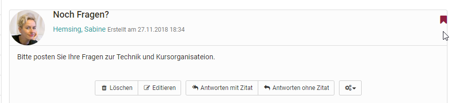

#  Course Element "Forum" {: #forum}

## Profile

Name | Forum
---------|----------
Icon | { class=size24 }
Available since | New edition with release 18
Functional group | Communication and collaboration
Purpose | Asynchronous online discussions
Assessable | no
Specialty / Note |

With the course element "Forum" you can easily enable asynchronous online discussions for different purposes in your course. For example, course participants could write posts with questions about the content of the course and answer each other's questions, or you could initiate a technical discussion or implement specific forum-based online methods. 

   
## Tab Configuration

A forum is configured in the course editor in the "configuration" tab. Here you can set the user rights of the forum and define which course roles are allowed to create forum posts. You can choose between coaches, participants and guests. You can also define whether coaches are allowed to moderate the forum and whether pseudonymized postings are allowed in the forum. 

### Forums with alias

In the case of pseudonymized forums, the posters can choose a pseudonym themselves. Once a pseudonym has been created, it will always remain active in the forum, but can be changed or switched off as required. The pseudonym can be protected by a user with a password, so that only this user can use this pseudonym. Without password protection the same pseudonym can be used by several users. Furthermore, it can be set that the use of a pseudonym is activated by default. To do this, select the checkbox "Pseudonym activated in individual forum posts".

{ class="shadow" }

### Moderation ritghts

All course owners and if enabled all [coaches](../basic_concepts/coach.md) have the following additional **moderation rights**. They can:

  * Editing and deleting all posts in a forum; attaching files.
  * Prioritizing threads (sticky): a certain discussion subject will always appear on top of a list.
  * Closing discussion: it will no longer be possible to reply to a certain discussion subject.
  * Hiding discussion: a certain subject will no longer appear in the forum list.
  * Displaying discussion: hidden subject will be displayed anew.
  * Filter for persons: on the forum's overview page posts of every single course participant as well as further information (e.g. words, number of characters in the postings) can be displayed.
  * Archiving forum: posts (as MS Word) and attached files are packed into a ZIP file and downloaded.
  * Excel report of forums (xlsx format) for download. Generate a report for the selected forum course elements. The report contains one line for each forum post written for further statistical analysis. As of :octicons-tag-24: Release 18.1

Persons with moderation rights can also move forum topics or individual posts. The posts can be moved to another topic in the same forum, to another forum in the course or to a forum in another course. All underlying forum posts are also moved and are then no longer visible in the original forum. The moved post or thread can be created as a new thread or integrated into an existing one. In the final step of the move, an e-mail can also be sent to all users affected by the move, informing them where the forum will now be moved to.

!!! warning "Attention"

    Forum posts can also be moved to forums in which the creator of the post has no access.

!!! info 

    It is possible for course participants to receive additional moderation rights in a forum from the teacher. 

## Working with forums

Forums are the central tools for asynchronous discussion in online courses and also in OpenOlat groups. By default, all course participants have read and write access to a forum.

Participants can open topics in forums, archive topics and also customize the display of a thread/topic. They can create, edit and mark posts and subscribe to a forum completely.

!!! tip "Tip"

    Recommend that course participants **subscribe** to the forum in order to be notified of new posts. 
    All users should also enter a **profile photo** in the "[profile](../personal_menu/Configuration.md#profile--profile)", which will then be displayed together with the respective posting and thus make the contributions more personal.

### Open discussion topic

A forum can contain several different discussion topics (threads). The first posting that is created with "Open new topic" opens a new thread. All further postings in this thread should then refer to the main topic of the respective thread.

### Create a post

In order to maintain a real discussion in the forum, most posts should be made _within_ a thread and are thus created as a reply to the start post of the thread. Click on the "Reply with/without quote" button here. Title and post are mandatory information. Be sure to use a descriptive title and modify appropriately for reply posts.

With the help of the forum editor you can create and format your post and also attach files. As a rule of thumb, postings that are longer than one DIN A4 page should be attached and only briefly outlined in the posting itself. You can also edit or delete your post at a later date if no one has yet replied to your post.

Depending on the configuration by the course owner, you may also be able to publish your post under a pseudonym.

!!! info "Tip"

    Always check at the beginning whether there is already a suitable thread for your contribution before you open a new discussion topic or prepare a suitable forum structure as the course owner. 

### Mark forum posts

Individual forum posts can be marked. To do so, click on the small flag in the upper right corner of a post in the detailed view of a topic. In the forum overview you can see how many posts per topic have been marked. This makes it easier to find individual posts again or mark them for a later reply.

### Subscribe to forums

To be notified when new forum posts are made, set the "Changes" slider to "On" in the discussion topics overview. Then you will receive a notification by e-mail or under Subscriptions in the "Personal Tools" section. It does not matter whether a new contribution has been posted by a registered OLAT user or by a guest.

!!! tip "Hint"

    Advise your course participants on subscribing to the forum to be up-to-date.

### Display options for forum threads

There are several display options:

* all (nested)
* all (flat)
* a single one
* marked
* new

Users can view all posts below each other (all), with or without indentation. The starting post appears first and the other posts are displayed according to the discussion structure. For extensive forums with many posts, it is useful to use the "new" button to display only the new posts. 

Especially interesting for more complex discussions is also the view "one". The entire thread structure is displayed here and can thus be traced very well. It is helpful that individual parts can be shown and hidden. In addition, you can quickly recognize new forum posts by the asterisk in this display.

## General further information

### Alternatives

a) You can also use the forum as an alternative for the [Notification element](../learningresources/Course_Element_Notifications.md) for announcements from the course authors, especially if queries from learners are desired.

b) In addition to the course element "Forum", there is also the option of displaying a central forum for the entire course in the [Course Toolbar](../learningresources/Using_Additional_Course_Features.md). This is often useful if the course only includes _one_ forum that is to be permanently available. However, no further settings such as pseudonymization or assignment of moderation rights can be made here.

c) The [File dialogue](../learningresources/Course_Element_File_Dialog.de.md) is a combination of forum and file provision. In courses, forum discussions can be created for specific documents, e.g. a draft of a seminar paper, an image, a concept or a content document. A forum is automatically created for each uploaded file. Further information on the course element can be found [here](../learningresources/Course_Element_File_Dialog.md).
