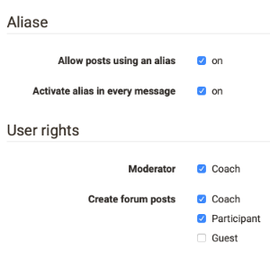

#  Course Element "Forum" {: #forum}

With the course element "Forum" you can easily enable asynchronous online discussions for different purposes in your course. For example, course participants could write posts with questions about the content of the course and answer each other's questions, or you could initiate a technical discussion or implement specific forum-based online methods. In the chapter "Learning Activities in Courses" you will get further information on opening topics and replying to questions; see section ["Forum"](../learningresources/Working_with_Forums.md). Generally all course participants have read and write permission in a forum. All course authors and tutors dispose of the option to moderate a forum additionally.

A course author can also use the forum to notify course participants in the short term. Just configure your forum in the tab "Access" accordingly, i.e. that only course authors have write permission.

!!! tip "Tip"

    Advise your course participants on subscribing to the forum to be up-to-date.
   
## Tab Configuration
Here you can set the user rights of the forum and define which course roles are allowed to create forum posts. You can choose between coaches, participants and guests. You can also define whether coaches are allowed to moderate the forum and whether pseudonymized postings are allowed in the forum. In the case of pseudonymized forums, the posters can choose a pseudonym themselves. Once a pseudonym has been created, it will always remain active in the forum, but can be changed or switched off as required. The pseudonym can be protected by a user with a password, so that only this user can use this pseudonym. Without password protection the same pseudonym can be used by several users. Furthermore, it can be set that the use of a pseudonym is activated by default. To do this, select the checkbox "Pseudonym activated in individual forum posts".

{ class="shadow" }

**Moderation rights**
All course owners and [coaches](../basic_concepts/coach.md) have the following additional moderation rights. You can:

  * Editing and deleting all posts in a forum; attaching files.
  * Prioritizing threads (sticky): a certain discussion subject will always appear on top of a list.
  * Closing discussion: it will no longer be possible to reply to a certain discussion subject.
  * Hiding discussion: a certain subject will no longer appear in the forum list.
  * Displaying discussion: hidden subject will be displayed anew.
  * Filter for persons: on the forum's overview page posts of every single course participant can be displayed.
  * Archiving forum: posts (as MS Word) and attached files will be zipped before storing them in your personal folder.

Persons with moderation rights can also move forum topics or individual posts. On the one hand, contributions can be moved to another topic of the same forum, on the other hand, entire forum topics or contributions can be moved to another forum. All forum posts underneath are moved and are no longer visible in the original forum. It is possible to move topics and posts to another forum both in the same course and in other courses. The moved thread can be created as a new discussion thread. In the last step of the move, an email can be sent to all users affected by the move, with the information where the forum is now moved to.

!!! warning "Attention"

    Forum posts can also be moved to forums in which the creator of the post has no access.

Besides the course element "Forum" there is also the possibility to display a central forum for the entire course in the [course toolbar](../learningresources/Using_Additional_Course_Features.md). Das bietet sich häufig an, wenn der Kurs nur ein Forum umfasst, das permanent zur Verfügung stehen soll. However, no further settings such as pseudonymization or assignment of moderation rights can be made here.