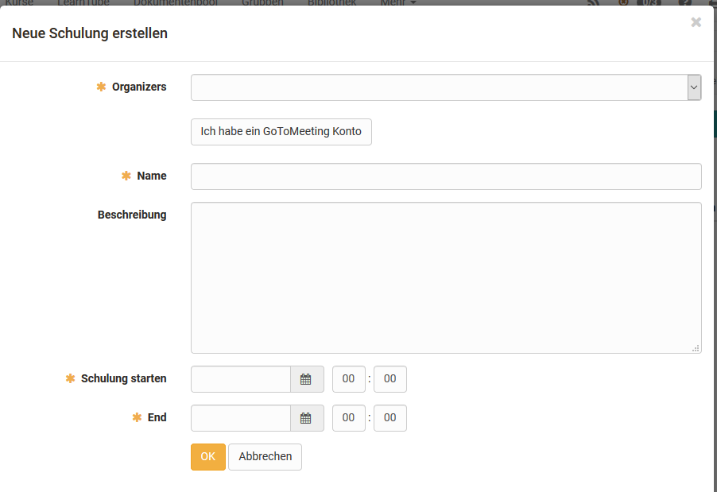

# Kursbaustein "GoToMeeting"

## Steckbrief

Name | GoToMeeting
---------|----------
Icon | :fontawesome-solid-tv:
Verfügbar seit | 
Funktionsgruppe | Kommunikation und Kollaboration
Verwendungszweck | Integration der Webkonferenz-Software GoToMeeting
Bewertbar | nein
Spezialität / Hinweis | GoToMeeting ist eine kommerzielle Software. Um den Kursbaustein zu nutzen ist eine separate Lizenz und ein Serverhosting erforderlich.

 ## Tool Spezifisches {: #tool_specific}
  
!!! note "Link zu weiteren Infos"

    Tool Webseite: <https://www.gotomeeting.com>  

## Konfiguration im Kurseditor {: #editor_config}

Kein spezifischer Tab 

## Konfiguration im Kursrun (geschlossener Editor) {: #closed_editor_config}

Im Bereich "Konfiguration" kann ein neues Meeting erstellt werden.

!!! info "Im Bereich *Schulungen* erhält man Zugang zum Meeting Raum."

