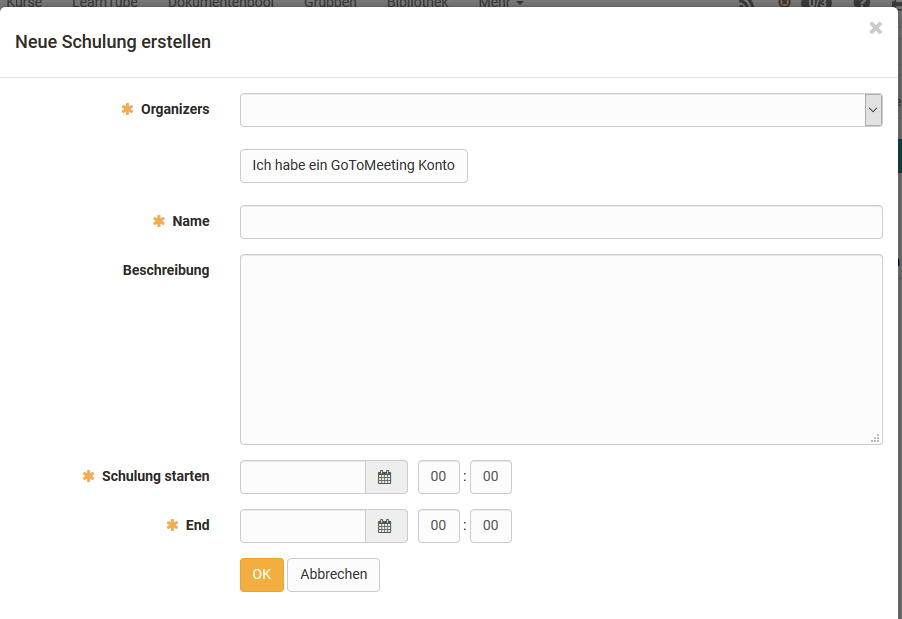

# Kursbaustein "GoToMeeting" {: #gotomeeting}

## Steckbrief

Name | GoToMeeting
---------|----------
Icon | :o_icon_o_gotomeeting_icon:
Verfügbar seit | 
Funktionsgruppe | Kommunikation und Kollaboration
Verwendungszweck | Integration der Webkonferenz-Software GoToMeeting
Bewertbar | nein
Spezialität / Hinweis | GoToMeeting ist eine kommerzielle Software. Um den Kursbaustein zu nutzen ist eine separate Lizenz und ein Serverhosting erforderlich.

 ## Tool Spezifisches {: #tool_specific}

!!! note "Link zu weiteren Infos"

    Tool Webseite: <https://www.goto.com/meeting>

## Konfiguration im Kurseditor {: #editor_config}

Kein spezifischer Tab 

## Konfiguration im Kursrun (geschlossener Editor) {: #closed_editor_config}

Im Bereich "Konfiguration" kann ein neues Meeting erstellt werden.

{ class="shadow lightbox" }

!!! info "Zugang zum Meeting-Raum"

    Im Bereich "Schulungen" erhält man Zugang zum Meeting-Raum.

## Weiterführende Informationen {: #further_information}

**Auf dieser Seite erwähnt** 
[GoToMeeting (Anbieter-Website)](https://www.goto.com/meeting)

**Weiterführend** 
[Kommunikation und Kollaboration](Communication_and_Collaboration.de.md) 
[Kursbaustein "Adobe Connect"](Course_Element_Adobe_Connect.de.md) 
[Externe Werkzeuge: Übersicht](../../manual_admin/administration/External_Tools_-_Administration.de.md)

[Zum Seitenanfang ^](#gotomeeting)
