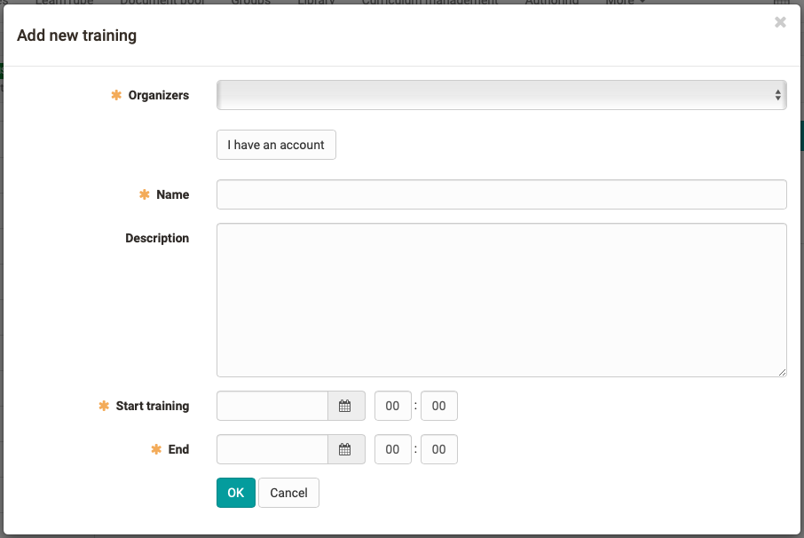

# Course Element "GoToMeeting"

## Profile

Name | GoToMeeting
---------|----------
Icon | :o_icon_o_gotomeeting_icon:
Available since | 
Functional group | Communication und collaboration
Purpose | Integration of the GoToMeeting web conferencing software 
Assessable | no
Specialty / Note | GoToMeeting is commercial software. To use the course element, a separate license and server hosting is required.

## Tool-specific {: #tool_specific}
  
!!! note "Link to further information" 

    Tool Website: [https://www.gotomeeting.com](https://www.gotomeeting.com/)  

## Configuration in the course editor {: #editor_config}

No specific tab  

## Configuration in the course run (closed editor) {: #closed_editor_config}

A new meeting can be created in the "Configuration" area.

!!! info "In the *Training* area you get access to the meeting room."  

