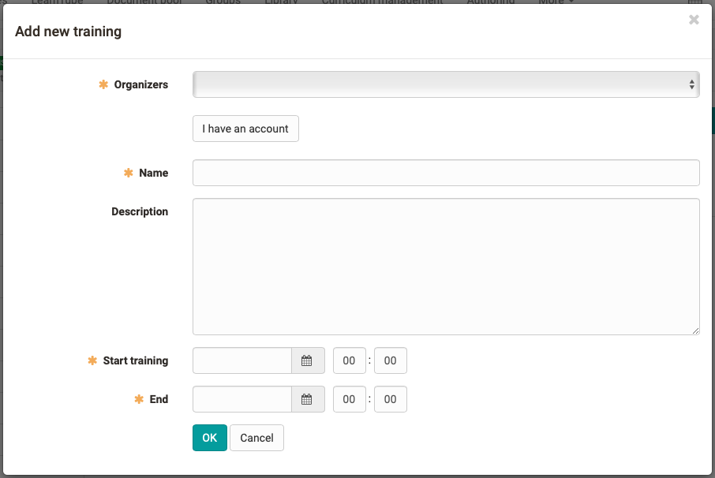

# Course Element "GoToMeeting" {: #gotomeeting}

## Profile

Name | GoToMeeting
---------|----------
Icon | :o_icon_o_gotomeeting_icon:
Available since | 
Functional group | Communication and collaboration
Purpose | Integration of the GoToMeeting web conferencing software 
Assessable | no
Specialty / Note | GoToMeeting is commercial software. To use the course element, a separate license and server hosting is required.

## Tool-specific {: #tool_specific}

!!! note "Link to further information"

    Tool Website: [https://www.goto.com/meeting](https://www.goto.com/meeting)

## Configuration in the course editor {: #editor_config}

No specific tab

## Configuration in the course run (closed editor) {: #closed_editor_config}

A new meeting can be created in the "Configuration" area.

{ class="shadow lightbox" }

!!! info "Access to the meeting room"

    In the "Training" area you get access to the meeting room.

## Further information {: #further_information}

**Mentioned on this page** 
[GoToMeeting (provider website)](https://www.goto.com/meeting)

**Further reading** 
[Communication and Collaboration](Communication_and_Collaboration.md) 
[Course Element "Adobe Connect"](Course_Element_Adobe_Connect.md) 
[External Tools: Overview](../../manual_admin/administration/External_Tools_-_Administration.md)

[To the top of the page ^](#gotomeeting)

