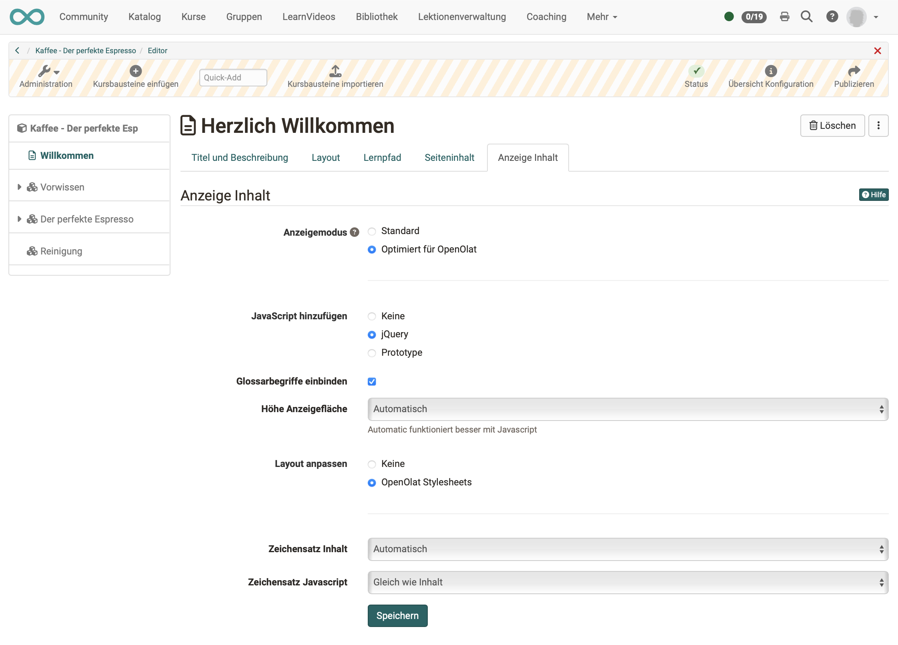
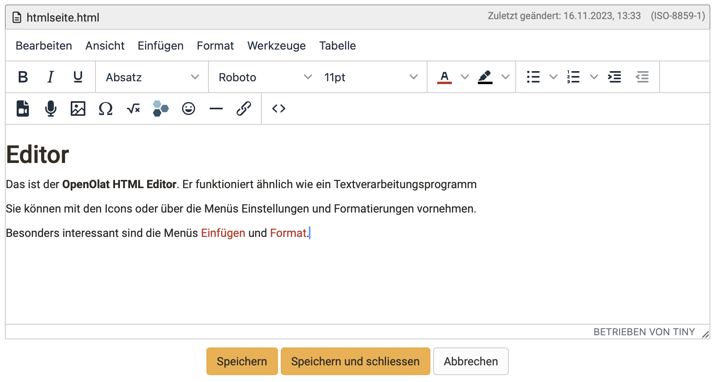
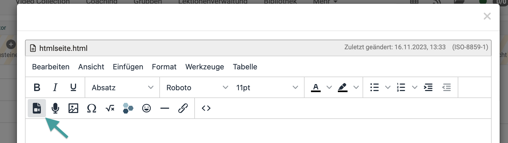

# Kursbaustein "HTML-Seite"

## Steckbrief

Name | HTML-Seite
---------|----------
Icon | { class=size24  }
Verfügbar seit | Neuauflage mit Release 18
Funktionsgruppe | Wissensvermittlung
Verwendungszweck | Darstellung verschiedener Inhalte (Texte, Bilder, Videos) innerhalb einer HTML-Seite
Bewertbar | nein
Spezialität / Hinweis | Für die Einbindung von Office-Dokumenten nutzen Sie bitte den Kursbaustein "Dokument".

Der Kursbaustein wird dazu verwendet, **Text, Bilder und Videos** zu präsentieren (Wissensvermittlung), wie man es von Websites her kennt.

Im Kursbaustein "HTML-Seite" ist eine **HTML-Datei als Lernressource**  eingebunden. 
Die Gestaltung der HTML-Seite geschieht im **HTML-Editor**, der im Tab Seiteninhalt aufgerufen wird.
Die verwendeten Dateien werden dabei im [Ablageordner](../learningresources/Storage_folder.de.md) des Kurses abgelegt. Auch die HTML-Datei selbst ist dort gespeichert.

## Beispiel

=== "Ansicht im Kurs"
    
    Eine HTML-Seite kann vor allem mit Bildern, Texten, Tabellen und Videos gestaltet werden. Fortgeschrittene Autor:innen können aber auch HTML-Elemente wie Accordion einfügen.

    { class="shadow lightbox" }

=== "Bearbeitung im Editor"

    Die Zusammenstellung der Inhalte funktioniert ähnlich wie in einem Textverarbeitungsprogramm. Zur Bearbeitung der HTML-Dateien direkt in OpenOlat wird der Tiny-Editor verwendet.

    (Hinweis: Im Kursbaustein "Seite" wird dagegen der Content Editor verwendet, in dem die Inhalte als Blöcke zusammengestellt werden. => Verbesserte Dartstellung auf Mobiles)
    
    { class="shadow lightbox" }

=== "HTML-Quellcode"

    Für Autor:innen mit HTML-Kenntnissen besteht auch die Möglichkeit, direkt den erzeugten HTML-Quellcode einzusehen und zu bearbeiten.

    { class="shadow lightbox" }

## Tab Seiteninhalt

Hier nehmen Sie die zentrale Konfiguration dieses Kursbausteins vor, indem Sie eine HTML-Datei als Lernressource einfügen. Sie haben verschiedene Möglichkeiten, den Inhalt mit Hilfe des Kursbausteins "HTML-Seite" in Ihren Kurs zu integrieren:

  * Eine neue HTML-Seite online in OpenOlat erstellen
  * Eine beliebige HTML-Datei aus dem Ablageordner wählen
  * Eine extern erstellte HTML-Datei in den Ablageordner hochladen und mit dem Kursbaustein verknüpfen

{ class="shadow lightbox" }

Für die **weitere Bearbeitung** von HTML-Seiten können Sie den OpenOlat Editor nutzen. Er funktioniert ähnlich wie ein Textverarbeitungsprogramm. Eine automatisch erstellte Datei trägt bereits den Namen des Kurselements. Einmal angelegt, öffnen Sie die HTML-Datei mit dem Link "Seite bearbeiten" und Sie gelangen in den OpenOlat HTML Editor.

Unter "**Sicherheitseinstellungen**" können Sie festlegen, ob Verweise in Ihren HTML-Seiten nur auf Dateien des gleichen Ordners und auf darin enthaltene Unterordner möglich sind, oder ob alle Dateien des Ablageordners referenziert werden können. Dies ist beispielsweise notwendig, wenn Ihre HTML-Seite Grafiken, CSS-Dateien oder Skripte enthält, die sich in anderen Ordnern befinden.

Ferner können Sie definieren, **ob Betreuer die hinterlegte HTML-Datei bearbeiten dürfen**. Die Betreuer benötigen dafür keine Kursbesitzerrechte oder Zugang zum Kurseditor.

## Tab Anzeige Inhalt

Im Tab "**Anzeige Inhalt**" definieren Sie die Einstellungen für die Anzeige des Seiteninhalts. Hier legen Sie fest ob die Seite unverändert, oder optimiert für OpenOlat angezeigt werden soll. Der Anzeigemodus "Optimiert für OpenOlat" gestattet Ihnen z.B. das Kurslayout auf den Seiteninhalt anzuwenden, oder ein in den Kurs eingebundenes [Glossar](../learningresources/Using_Additional_Course_Features.de.md#glossary) für die Seite zu aktivieren.

{ class="shadow lightbox" }

Folgende Einstellungen können für den Kursbaustein "HTML-Seite" vorgenommen werden.

 **Anzeigemodus:**

Wählen Sie den Modus "Standard" um die Ressource unverändert anzuzeigen. Dieser Modus ist geeignet für Ressourcen, bei denen es im Modus "Optimiert für OpenOlat" zu Anzeigeproblemen kommt, was vor allem bei extern erstellten HTML-Seiten passieren kann. 

Wählen Sie den Modus "Optimiert für OpenOlat", wenn Sie das Kurslayout in der Seite einbinden wollen, eine JavaScript Bibliothek verwenden möchten, das OpenOlat Glossar auf dieser Seite anwenden wollen oder die Höhe der Seite automatisch berechnet werden soll. 

Bei SCORM Modulen ist der Modus "Standard" empfohlen.

 **JavaScript hinzufügen:**

Um die Funktionen des Anzeigemodus "Optimiert für OpenOlat" nutzen zu können muss die JavaScript Bibliothek "jQuery" aktiviert sein. Die Option "Prototype" sollte nur gewählt werden, wenn Ihre Inhalte diese Bibliothek voraussetzen. Wählen Sie keine Bibliothek, wenn es zu Anzeigeproblemen mit Ihren Inhalten kommt.

 **Glossarbegriffe einbinden:**

Wählen Sie diese Option um die Möglichkeit der Hervorhebung von Glossarbegriffen für Ihre HTML-Seiten zu aktivieren, sofern Sie ein Glossar in Ihrem Kurs eingebunden haben. Diese Option setzt die Verwendung der JavaScript Bibliothek "jQuery" voraus.

 **Höhe Anzeigefläche:**

Mittels des Drop-Down-Menus können Sie die Höhe der Inhaltsanzeige bestimmen. Sie haben die Möglichkeit, diese via "Automatisch" auf die jeweilige Fensterhöhe oder auf einen bestimmten Wert zu setzen.

 **Layout anpassen:**

Wählen Sie die Option "OpenOlat Stylesheets" um das OpenOlat und Kurslayout in Ihre Seite zu übernehmen (Schriftart, Farben, Grösse usw.). Wenn Sie diese Anpassung nicht wünschen, wählen Sie die Option "Keine".

 **Zeichensatz Inhalt:**

OpenOlat versucht, den Zeichensatz automatisch zu erkennen. Wenn die Option "Automatisch" nicht zu der gewünschten Anzeige führt, kann die Kodierung des Inhalts anhand eines vordefinierten Zeichensatzes konfiguriert werden. (Ist keine Kodierung vorhanden, wird per Default der Zeichensatz ISO-8899-1 verwendet).

 **Zeichensatz JavaScript:**

Erlaubt die Kodierung des JavaScript Codes anhand eines vordefinierten Zeichensatzes (per Default wird der gleiche Zeichensatz für Inhalt und JavaScript verwendet).

!!! tip "Tipp"

    In der Regel sind im Tab "Layout" keine Änderungen notwendig. Die Standardeinstellungen passen für 90% der Kurse.

## Der HTML-Editor

An allen Stellen in OpenOlat, an denen HTML-Seiten erzeugt und bearbeitet werden, ist der **HTML-Editor Tiny MCE** eingebunden.

{ class="shadow lightbox" }

Dieser extern entwickelte Editor ist ebenfalls Open Source. Weitere Informationen finden Sie auf der Website: [https://www.tiny.cloud](https://www.tiny.cloud)

!!! info "Hinweis"

    Der Tiny-Editor kann von OpenOlat mit Voreinstellungen aufgerufen werden. Die **verfügbaren Bearbeitungsmöglichkeiten** (angebotene Buttons im Editor) können so den Verwendungssituationen angepasst werden.
    
    **Beispiel:**  
    In einer HTML-Seite für einen Kursbaustein ist es eine Bereicherung, dass beim Aufruf des HTML-Editors die Option zum Aufzeichnen eines Videos angeboten wird. Es gibt andere Stellen, an denen der HTML-Editor verwendet wird, bei denen ein Video-Recording nicht sinnvoll und erwünscht ist. Dort wird die Option zum Video-Recording nicht angezeigt, wenn der Editor geöffnet wird.

!!! info "Hinweis"

    Es können aus Sicherheitsgründen nicht sämliche Möglichkeiten von HTML zur Verfügung gestellt werden. Dies betrifft insbesondere integriertes Javascript.

## Elemente und Gestaltung einer HTML-Seite

Nachstehend sind die wesentlichen verfügbaren Elemente beschrieben.

### Formatierungen

Dazu gehören z.B.

* Schriften (Sie können individuell eingestellt oder aus vordefinierten Standards gewählt werden, z.B. h2.)
* Aufzählungen (Mit Punkten oder Zahlen. Für HTML-Kenner: Mit ul, ol) 
* Einrückungen
* usw.

### Video

{ class="shadow lightbox" }

Für die Anzeige greift das Tool auf den in OpenOlat integrierten Mediaplayer zurück, was einige Vorteile hat.  

1. Der Player erkennt das Format selbst, solange die Video- und Audio-Daten richtig codiert sind.  
2. Der Player erkennt, ob ein Benutzer mit einem HTML-fähigen und Codec-kompatiblen Mobile-Browser auf das Video zugreift. In diesem Fall werden die Filme mit einem HTML5-Tag versehen und können problemlos auch auf iPad o.ä. angezeigt werden.

!!! info "Hinweis"

    Hier in HTML eingebundene Videos werden einfach abgespielt. Es handelt sich nicht um OpenOlat Video-Lernressourcen. (Sie sind also ohne Annotationen, Quiz, usw.)
    
    Sollen Video-Lernressourcen verwendet werden, gibt es dafür einen eigenen Kursbaustein "Video".

Es können Video-Dateien hochgeladen (und in OpenOlat gespeichert) werden oder Links auf externe Videos (z.B. Youtube) gesetzt werden.  

Im Kurbaustein eingefügte Video-Dateien können bei Bedarf später auch wieder ausgetauscht werden.

Detaillierte Information zum Einbinden von Videos finden Sie hier: ["Videos in HTML-Seiten"](../learningresources/Video_in_HTML_Pages.de.md).

!!! tip "Tipp"

    Sie können Ihrer Mediendatei auch noch ein Startbild (Vorschau) hinzufügen.

### Videorecording

Siehe ["Video aufnehmen"](../learningresources/Video_Recording.de.md)

### Musik (.MP3)

Bei der Einbindung von reinen Audio-Dateien stehen nur eingeschränkte Funktionen im Player zur Verfügung. Man kann starten, stoppen und hat eine Fortschrittsanzeige, Funktionen wie Vollbild fehlen hier. 

Im Feld "Adresse" kann entweder ein Link auf ein mp3-File eingegeben werden oder man lädt eine Datei auf OpenOlat hoch.

### Audiorecording

Siehe ["Audio aufnehmen"](../learningresources/Audio_Recording.de.md)

### Bilder

Es können die üblichen Formate verwendet werden (png, jpg, ...). Zur Darstellungsgrösse und Ausrichtung können ebenfalls Angaben gemacht werden.

### Mathematische Formeln

In OpenOlat verwenden wir **Mathjax** zur Darstellung von Formeln.

### Emoticons

Wählen Sie Emoticons, wie Sie es von Social Media her gewohnt sind.

### Hyperlinks

Es können Links ins Internet und innerhalb OpenOlat (bestimmte Kursbausteine, auch in anderen Kursen) eingefügt werden. 
Die Links können auf Bilder, Videos oder auch die Tools in der [Toolbar](../learningresources/Using_Additional_Course_Features.de.md) zeigen. 
Wählen Sie, ob der Link im OpenOlat-Kursinhalt oder in einem neuen Fenster angezeigt werden soll.

{ class="shadow lightbox" }

### PDF-Dokumente

!!! tip "Empfehlung"

    Prinzipiell ist auch die Anzeige von pdf- und Office-Dokumenten in einer HTML-Seite möglich.
    Sollen ausschliesslich Office-Dokumente eingebunden werden, empfehlen wir, die Kursbausteine ["Dokument"](Course_Element_Document.de.md) oder ["Ordner"](Course_Element_Folder.de.md) zu verwenden.
    
### Extern erstellte HTML-Seiten hochladen

!!! tip "Tipp"

    Sie können auch extern erstellte Dateien in den **Ablageordner** des Kurses hochladen oder einen **Ressourcenordner** mit dem Kurs und dem Ablageordner verbinden. Über den Link "Auswählen" werden Ihnen alle Dateien angezeigt, die sich im Ablageordner befinden. Anschliessend können Sie diese Dateien über den Kursbaustein "HTML-Seite" verlinken und so in Ihren Kurs einbinden. Dieser Weg empfiehlt sich, wenn Sie die Strukturierung des Ablageordners selbst beeinflussen möchten.

!!! warning "Achtung"

    Öffnen und speichern Sie HTML-Seiten, die Sie mit einem externen Editor
    erstellt haben, nicht mit dem eingebauten HTML-Editor, da dadurch Teile der Formatierung verloren gehen können. Der OpenOlat HTML-Editor enthält nur den < body > Bereich einer HTML Seite. Sollen Einträge im HTML < head > vorgenommen werden, muss dies in einem externen Editor erfolgen.

## Unterschiede: KB Seite - KB HTML-Seite

|                        | KB Seite                       | KB HTML-Seite                  |
| -----------------------| ------------------------------ | ------------------------------ |
| Erstellung des Inhalts | im Content Editor              | im HTML-Editor                 |
| Gestaltung             | blockbasierter Ansatz          | HTML-Seite                     |
| Erstellungsaufwand     | geringer, da vorstrukturiert   | meistens höher                 |
| Vorschau               | direkt im Editor               | separater Tab "Anzeige Inhalt" |
| Medien                 | im Medien Center               | im Ablageordner                |
| Editieren kann Betreuer:innen erlaubt werden  | :material-check: | :material-check:      |
| erweiterte Berechtigungen                     | :material-check: | :material-cancel:     |
| Integration pdf        | :material-check:               | :material-check:               |
| Integration Office-Dokumente | :material-check:         | :material-cancel:              |
| Integration draw.io Diagramme        | :material-check: | :material-cancel:     |

!!! info "Info"

    Der Kursbaustein HTML-Seite kann von Kurs-Besitzer:innen oder optional auch von Betreuenden bearbeitet werden.

