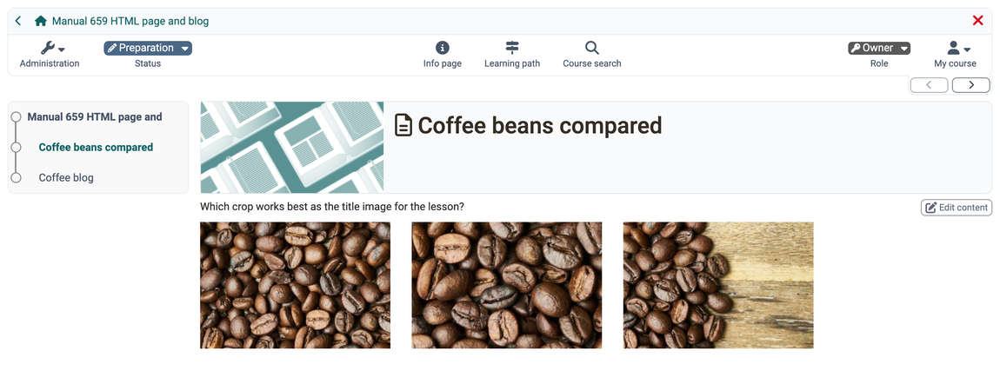
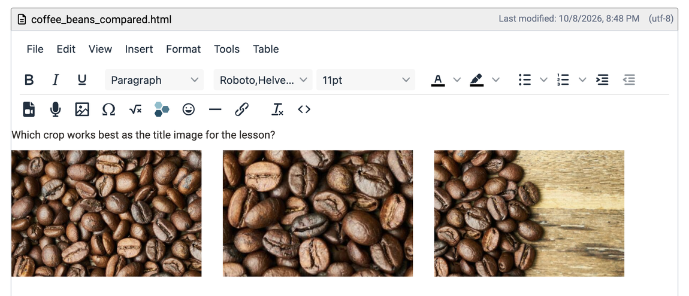
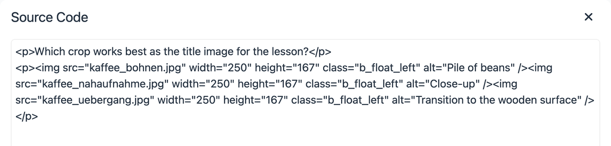
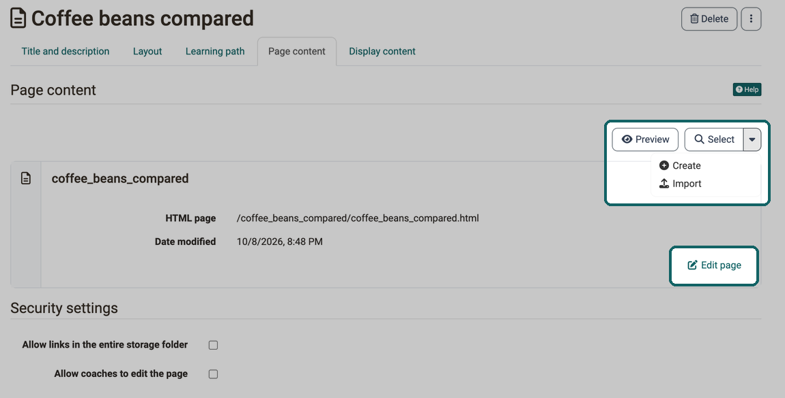
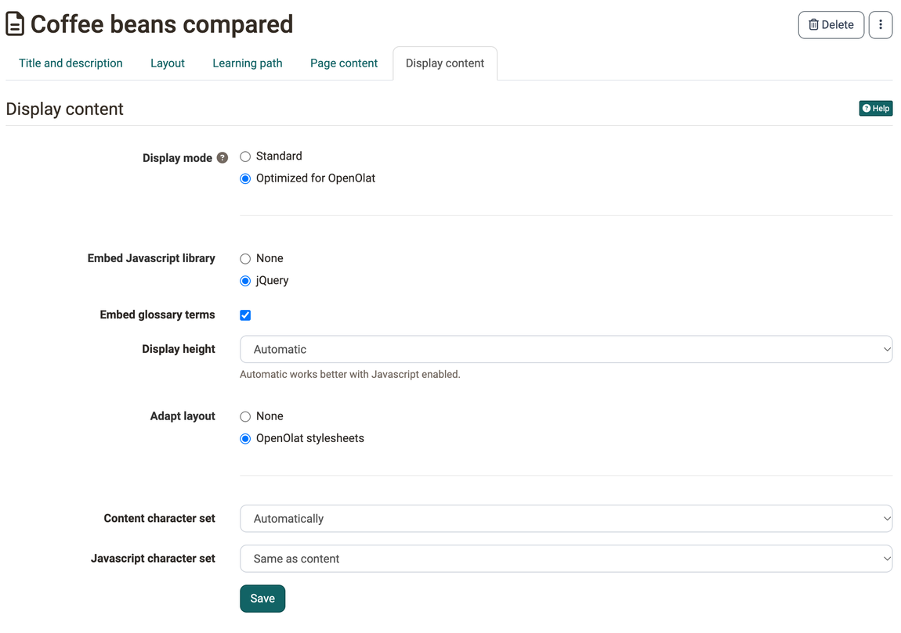
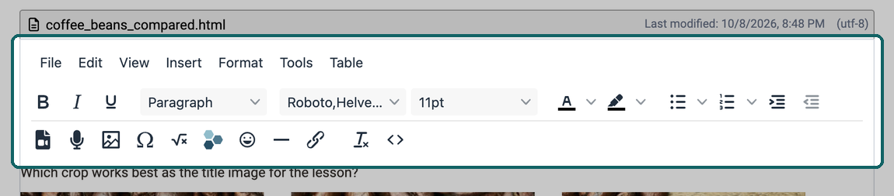
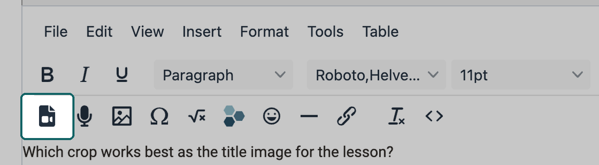
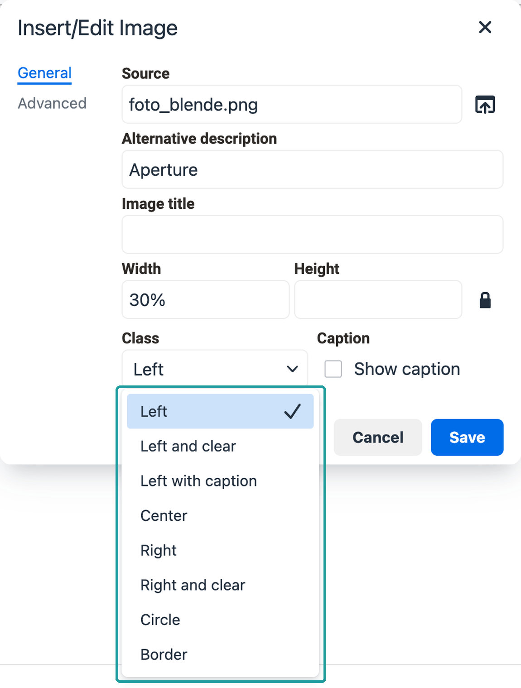
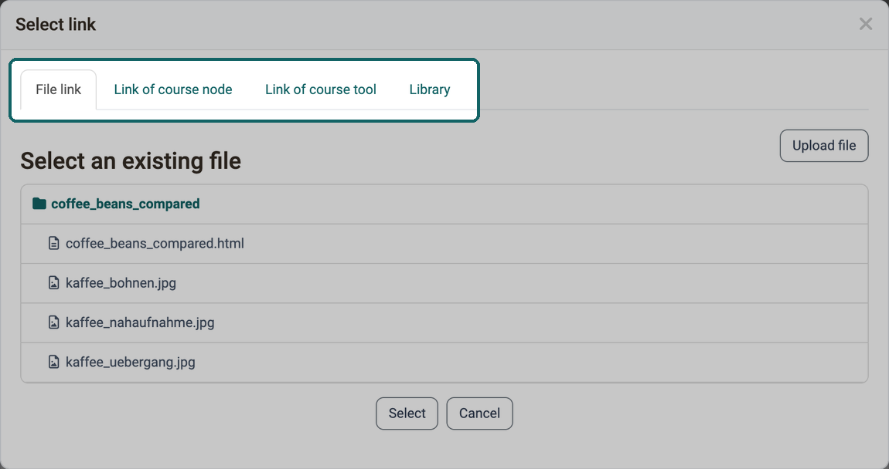

# Course Element "HTML page" {: #html_page}

## Profile

Name | HTML-Page
---------|----------
Icon | :o_icon_o_sp_icon:
Available since | New edition with release 18
Functional group | Other
Purpose | Presentation of different content elements (text, images, videos) within an HTML page
Assessable | no
Specialty / Note | To integrate Office documents, please use the "Document" course element. frentix does not recommend its use.

The course element is used to display **texts, images and videos** (Knowledge Transfer) as shown on websites.

In the course element "HTML page", an **HTML file** is embedded as a **learning resource**. 
You can design an HTML page in the **HTML editor**, which you can find in the tab "Page content". The used files, as well as the HTML file itself, are put in the [Storage folder](../learningresources/Storage_folder.md) of the course. 

!!! warning "frentix recommends keeping domains separate"

    In the course element "HTML page" you store any HTML and JavaScript code,
    including content of a foreign domain. OpenOlat delivers this code under your
    own domain. Based on modern security considerations, frentix recommends not
    to mix different domains and therefore advises against the use of this course
    element.

## Example {: #example}

=== "View in course"

    An HTML page can be designed primarily with images, text, tables and videos. Advanced authors can also insert HTML elements such as Accordion.

    The example shows three photos that stand side by side with the class "Left". How to create such a row of images is described in the section [Several images side by side](#images_side_by_side).

    { class="shadow lightbox" title="Course element HTML page in the course view · 2026.10.08" }

=== "Editing in editor"

    The compilation of content works in a similar way to a word processing program. The Tiny editor is used to edit HTML files directly in OpenOlat.

    (Note: In the "Page" course element, on the other hand, the content editor is used, in which the content is compiled as blocks => Improved display on mobile devices)

    { class="shadow lightbox" title="HTML editor in the course element HTML page · 2026.10.08" }

=== "HTML source code"

    Authors with HTML knowledge can also view and edit the generated HTML source code directly.

    { class="shadow lightbox" title="Source Code dialog in the HTML editor · 2026.10.08" }

## Tab Page content {: #tab_page_content}

Here you carry out the central configuration of this course element. There are several possibilities to embed a page's content in your course:

  * Use "Create" to create a new HTML page online in OpenOlat
  * Use "Select" to choose an HTML file from the storage folder
  * Use "Import" to upload an externally created HTML file or a ZIP file from your computer
  * Upload an externally created HTML file to the storage folder and choose it there with "Select"

{ class="shadow lightbox" title="Page content tab in the course editor · 2026.10.08" }

For **further editing** of HTML pages you can use the OpenOlat Editor. It works similar to a word processing program. The automatically created file when you create a page for the first time already has the name of the course element. Once created, open the file with the link "Edit page" and you will get to the OpenOlat HTML Editor. With "Preview", OpenOlat shows the linked page in a preview.

Under "**Security settings**" you can specify whether references in your HTML pages are only possible to files in the same folder and to subfolders contained therein, or whether all files in the storage folder can be referenced. This is necessary, for example, if your HTML page contains graphics, CSS files or scripts that are located in other folders.

With "Allow coaches to edit the page" you also define whether coaches are allowed to edit the stored HTML file. The coaches do not need course owner rights or access to the course editor. Regardless of this setting, course owners, administrators and learning resource managers can edit the page, as can persons with the [course right "Course editor"](../learningresources/Members_management.md#additional_rights). Whoever is allowed to edit the page sees the "Edit page" button above the page on the right in the course view.

### Replace the content {: #change_content}

If the content of an HTML page is out of date, replace the linked file instead of creating a new course element. The buttons in the [Page content tab](#tab_page_content) also work afterwards. With "Select" you link a different file from the storage folder. With "Import" you upload an HTML, ZIP or PDF file from your computer. With "Create" you create a new HTML page that takes the place of the previous one. If the course element already shows a file, you find "Create" and "Import" in the menu next to the "Select" button.

If you upload a ZIP file with "Import", OpenOlat unpacks it and then offers the HTML files it contains for selection. This way you replace an externally created page together with its images, CSS files and scripts in one step.

!!! info "Important"

    OpenOlat unpacks an imported ZIP file into a new folder that carries the name of the ZIP file and is created where the linked file is stored. If that folder already exists, OpenOlat appends a number to the name. The existing content remains and is not overwritten. Delete the old folders yourself in the [storage folder](../learningresources/Storage_folder.md) if required.

## Tab Display content {: #layout}

In the "Display content" tab you determine how OpenOlat displays the page in the course: unaltered or optimized for OpenOlat. The display mode "Optimized for OpenOlat" allows you to e.g. apply the course layout to the page content, or to enable the course [Glossary](../learningresources/Using_Additional_Course_Features.md#glossary).

{ class="shadow lightbox" title="Display content tab in the course editor · 2026.10.08" }

The following settings can be made for the course element "HTML page". 

#### Display mode {: #display_mode}

Select the mode "Standard" to display the resource unmodified. This mode is useful for resource that encounter render issues when using the mode "Optimized for OpenOlat", usually content not created with the OpenOlat editor, such as HTML5 content.

Use the mode "Optimized for OpenOlat" when you want to embed the course layout, a JavaScript library, the OpenOlat glossary or when you want to use the automatic height detection of the page.

In case of SCORM modules the mode "Standard" is recommended.

#### Embed Javascript library {: #javascript_library}

To use the features of the display mode "Optimized for OpenOlat" the JavaScript library "jQuery" must be activated. Select "None" if you have display issues with your content within OpenOlat.

#### Embed glossary terms {: #glossary_terms}

Select this option to activate the glossary terms embedding on that page if you have a glossary configured for this course. This option requires the JavaScript library "jQuery".

#### Display height {: #display_height}

By means of the drop-down menu you can determine the height of your content. You have the possibility to set them via "Automatic" to the respective window height or to a certain value of your choice.

#### Adapt layout {: #adapt_layout}

Select the option "OpenOlat stylesheets" to embed the OpenOlat and course layout into this page (font type, colors, sizes etc.). If you do not want this option select "None".

#### Content character set {: #content_character_set}

OpenOlat tries to detect a character set automatically. If the option "Automatically" is not successful it is possible to configure the content coding by means of a predefined character set (should there be no coding the character set ISO-8859-1 will be used by default).

#### Javascript character set {: #javascript_character_set}

This permits the coding of Javascript by means of a predefined character set (by default the same set will be used for content and Javascript).

!!! tip "Tip"

    As a rule, no changes are necessary in the "Display content" tab. The default settings are suitable for 90% of the courses.

## The HTML editor {: #html_editor}

The HTML editor TinyMCE is integrated at all points in OpenOlat where HTML pages are created and edited.

{ class="shadow lightbox" title="HTML editor in the course element HTML page · 2026.10.08" }

This externally developed editor is also open source. Further information can be found on the website: [https://www.tiny.cloud](https://www.tiny.cloud)

!!! info "Important"

    The Tiny editor can be called up from OpenOlat with default settings. The **available editing options** (buttons offered in the editor) can thus be adapted to the usage situations.

    **Example:** 
    In an HTML page for a course element, it is an enrichment that the option to record a video is offered when the HTML editor is called up. There are other places where the HTML editor is used where video recording is not useful or desirable. The option for video recording is not displayed there when the editor is opened.

!!! info "Important"

    For security reasons, not all HTML options can be made available. This applies in particular to integrated Javascript.

## Elements and design of an HTML page {: #html_elements}

The main available elements are described below.

### Formatting

These include, for example

* Fonts (they can be set individually or selected from predefined standards, e.g. h2)
* Enumerations (with dots or numbers. For HTML experts: with ul, ol)
* Indentations
* etc.

### Video

{ class="shadow lightbox" title="Toolbar of the HTML editor · 2026.10.08" }

The tool uses the media player integrated in OpenOlat for the display, which has several advantages.

1. The player recognizes the format itself as long as the video and audio data are encoded correctly. 
2. The player recognizes whether participants are accessing the video with an HTML-capable and codec-compatible mobile browser. In this case, the films are provided with an HTML5 tag and can also be displayed on an iPad or similar without any problems.

!!! info "Important"

    Videos embedded here in HTML are simply played. They are not OpenOlat video learning resources. (They are therefore without annotations, quizzes, etc.)

    If video learning resources are to be used, there is a separate "Video" course element for this.

Video files can be uploaded (and saved in OpenOlat) or links to external videos (e.g. YouTube) can be set.

Video files inserted in the course element can also be replaced later if required.

Detailed information on integrating videos can be found here: ["Videos in HTML pages"](../basic_concepts/Video_in_HTML_Pages.md).

!!! tip "Tip"

    You can also add a start image (preview) to your media file.

### Video recording

See ["Video Recording"](../basic_concepts/Video_Recording.md).

### Music (.mp3)

When integrating audio-only files, only limited functions are available in the player. You can start, stop and have a progress indicator. Functions such as full screen are missing here.

In the "Address" field, you can either enter a link to an mp3 file or upload a file to OpenOlat.

### Audio recording

See ["Audio Recording"](../learningresources/Audio_Recording.md).

### Images

Images show what is hard to describe in words, for example a photo or a graphic. You select image files in the format JPG, GIF or PNG and also define size and alignment in the "Insert/Edit Image" dialog. Under "Alternative description" you enter a text for people who cannot see the image. The "Image title" appears when someone points at the image with the mouse. With "Show caption" the image gets a caption, which you enter in the editor below the image. In the "Advanced" tab you set the spacing and border of the image.

### Several images side by side {: #images_side_by_side}

If you want to show two or three images in a row, for example photos for comparison, assign the class "Left" to each image. The images then stand side by side without you needing a table. This works in the course element "HTML page" as well as in a blog entry. The [example](#example) above shows the result: three photos in the course view, in the editor and in the HTML source code.

1. Place the cursor where the row of images should begin.
2. Click the image icon in the toolbar or select the entry "Image..." in the "Insert" menu. The dialog "Insert/Edit Image" opens in the "General" tab.
3. Click the browse icon to the right of the "Source" field. The dialog "Select link" opens.
4. Select an image file under "Select an existing file" and click "Select". To add a new image, upload it from your computer with "Upload file" and "Upload".
5. Check that the entry "Left" is selected under "Class". It is preset for a new image.
6. Under "Width", enter a value in pixels small enough for all images to fit into the line together, for example 250 for three images. The height adjusts automatically.
7. Click "Save".
8. Place the cursor directly behind the inserted image and repeat steps 2 to 7 for each further image.

Instead of pixels, you can also enter a percentage under "Width", for example 30%. In this case, empty the "Height" field so that the image keeps its proportions.

{ class="shadow lightbox" title="General tab in the Insert/Edit Image dialog" }

If the line is not wide enough for all images, the next image moves to the following line. In this case, reduce the width of the images. The input field of the editor can be narrower than the page in the view, for example in the form of a blog entry. Therefore, check in the course view or in the published blog entry whether the images stand in one line.

Select exactly one class per image. The classes have the following effect:

* **Left:** The image stands on the left. Text and further images with the same class follow to the right of it.
* **Left with caption:** The image stands on the left, without spacing to the content next to it. With "Show caption" as well, several images with this class stand side by side in the course view, each with its caption below it.
* **Right:** The image stands on the right, the text flows to the left of it.
* **Center:** The image stands alone and centered in its line.
* **Left and clear**, **Right and clear:** The image stands alone in its line, on the left or on the right. The flow around the preceding images ends here.
* **Circle**, **Border:** These classes give the image a round shape or a border, but do not change its position.

The classes come from the OpenOlat stylesheets, which are included by default in the course element "HTML page". If you select the display mode "Standard" or the option "None" under "Adapt layout" in the ["Display content"](#layout) tab, OpenOlat does not include these stylesheets in the course view. The classes then only take effect in the HTML editor, not in the course view.

In the course element "HTML page" there is a second way via the "Table" menu: select the entry "Table" there and a row with three columns in the grid. Then insert an image into each cell. The editor in the blog does not offer the "Table" menu, so there the class is the only way.

### Mathematical formulas

In OpenOlat we use MathJax to display formulas.

### Emoticons

Choose emoticons as you are used to from social media.

### Hyper links

Links to the Internet and within OpenOlat (certain course elements, also in other courses) can be inserted. 
The links can point to images, videos or the tools in the [Toolbar](../learningresources/Using_Additional_Course_Features.md). 
Select whether the link should be displayed in the OpenOlat course content or in a new window.

{ class="shadow lightbox" title="Select link dialog in the HTML editor · 2026.10.08" }

### PDF files

!!! tip "Recommendation"

    In principle, it is also possible to display PDF and Office documents in an HTML page. If only Office documents are to be integrated, we recommend using the course elements ["Document"](../learningresources/Course_Element_Document.md) or ["Folder"](../learningresources/Course_Element_Folder.md).

### Upload externally created HTML pages

!!! tip "Tip"

    You can also upload externally created files to the **storage folder** of the course or link a **resource folder** to the course and the storage folder. Click the "Select" button to display all HTML and PDF files in the storage folder. You can then link these files via the "HTML page" course element and integrate them into your course. This method is recommended if you want to influence the structure of the storage folder yourself.

!!! warning "Attention"

    Do not open and save HTML pages that you have created with an external editor using the built-in HTML editor, as this may cause parts of the formatting to be lost. The OpenOlat HTML editor only contains the < body > area of an HTML page. If entries are to be made in the HTML < head >, this must be done in an external editor.

## Differences: Course element page - Course element HTML page {: #page_differences}

|                        | CE page                       | CE HTML page                  |
| -----------------------| ------------------------------ | ------------------------------ |
| Creation of the content | in Content Editor              | in HTML editor                 |
| Design             | block-based approach          | HTML page                     |
| Production effort     | lower, as pre-structured   | mostly higher                 |
| Preview               | directly in editor               | separate tab "Display content" |
| Media                 | in Media Center               | in the storage folder                |
| Editing can be allowed for coaches  | :material-check: | :material-check:      |
| Extended authorizations                    | :material-check: | :material-cancel:     |
| Integration pdf        | :material-check:               | :material-check:               |
| Integration office files | :material-check:         | :material-cancel:              |
| Integration draw.io diagrams        | :material-check: | :material-cancel:     |

## Further information {: #further_information}

**Mentioned on this page** 
[Storage folder >](../learningresources/Storage_folder.md) 
[Members management >](../learningresources/Members_management.md) 
[Using Additional Course Features >](../learningresources/Using_Additional_Course_Features.md) 
[tiny.cloud](https://www.tiny.cloud) 
[Videos in course element "HTML page" >](../basic_concepts/Video_in_HTML_Pages.md) 
[Video Recording >](../basic_concepts/Video_Recording.md) 
[Audio recording >](../learningresources/Audio_Recording.md) 
[Course Element "Document" >](Course_Element_Document.md) 
[Course Element "Folder" >](Course_Element_Folder.md)

**Further reading** 
[Course Element "Page" >](Course_Element_Page.md) 
[Course Element "SCORM 1.2" >](Course_Element_SCORM_Learning_Content.md)

[To the top of the page ^](#html_page)

