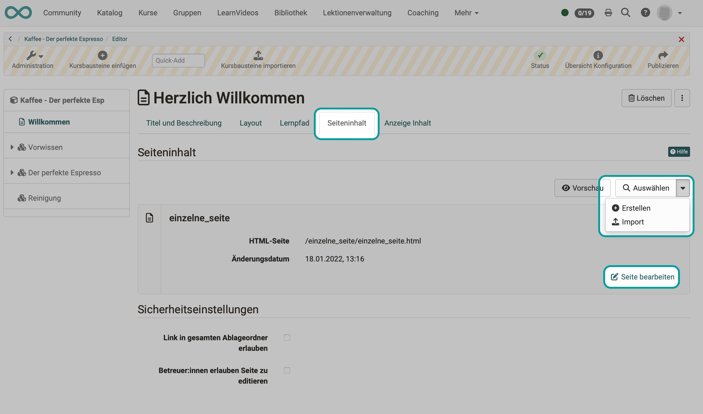

# Course Element "HTML page"

## Profile

Name | HTML-Page
---------|----------
Icon | { class=size24 }
Available since | New edition with release 18
Functional group | Knowledge transfer
Purpose | Presentation of different content elements (text, images, videos) within an HTML page
Assessable | no
Specialty / Note | To integrate Office documents, please use the "Document" course element.

The course element is used to display **texts, images and videos** (Knowledge Transfer) as shown on websites.

In the course element "HTML page", an **HTML file** is embedded as a **learning resource**. 
You can design an HTML page in the **HTML editor**, which you can find in the tab "page content". The used files, as well as the HTML file itself, are put in the [Storage folder](../learningresources/Storage_folder.md) of the course. 

## Example

=== "View in course"

    An HTML page can be designed primarily with images, text, tables and videos. Advanced authors can also insert HTML elements such as Accordion.

    { class="shadow lightbox" }

=== "Editing in editor"

    The compilation of content works in a similar way to a word processing program. The Tiny editor is used to edit HTML files directly in OpenOlat.

    (Note: In the "Page" course element, on the other hand, the content editor is used, in which the content is compiled as blocks => Improved display on mobile devices)

    { class="shadow lightbox" }

=== "HTML source code"

    Authors with HTML knowledge can also view and edit the generated HTML source code directly.

    { class="shadow lightbox" }

## Tab Page content

Here you carry out the central configuration of this course element. There are three possibilities to embed a page's content in your course:

  * Create new HTML page online
  * Select any file from the storage folder
  * Upload an externally created HTML file to the storage folder and link it to the course element

{ class="shadow lightbox" }

For **further editing** of HTML pages you can use the OpenOlat Editor. It works similar to a word processing program. The automatically created file when you create a page for the first time already has the name of the course element. Once created, open the file with the link "Edit page" and you will get to the OpenOlat HTML Editor.

Under "**Security settings**" you can specify whether references in your HTML pages are only possible to files in the same folder and to subfolders contained therein, or whether all files in the storage folder can be referenced. This is necessary, for example, if your HTML page contains graphics, CSS files or scripts that are located in other folders.

You can also define **whether coaches are allowed to edit the stored HTML file**. The coaches do not need course owner rights or access to the course editor.

## Tab Layout {: #layout}

In the "**Layout**" tab you can define the settings for the display of page contents. Here you determine whether the page should be displayed unaltered, or optimized for OpenOlat. The display mode "Optimized for OpenOlat" allows you to e.g. apply the course layout to the page content, or to enable the course [Glossary](../learningresources/Using_Additional_Course_Features.md#glossary).

{ class="shadow lightbox" }

The following settings can be made for the course element "HTML page". 

**Display mode:** 

Select the mode "Standard" to display the resource unmodified. This mode is useful for resource that encounter render issues when using the mode "Optimized for OpenOlat", usually content not created with the OpenOlat editor, such as HTML5 content.

Use the mode "Optimized for OpenOlat" when you want to embed the course layout, a JavaScript library, the OpenOlat glossary or when you want to use the automatic height detection of the page.

In case of SCORM modules the mode "Standard" is recommended.

 **Embed Javascript library:**
  
To use the features of the display mode "Optimized for OpenOlat" the JavaScript library "jQuery" must be activated. The option "Prototype" should only be used in case your content requests this library. Select no JavaScript library if you have display issues with your content within OpenOlat.

 **Embed glossary terms:** 

Select this option to activate the glossary terms embedding on that page if you have a glossary configured for this course. This option requires the JavaScript library "jQuery".

 **Display height:** 

By means of the drop-down menu you can determine the height of your content. You have the possibility to set them via "Automatic" to the respective window height or to a certain value of your choice.

 **Adapt layout:** 

Select the option "OpenOlat stylesheets" to embedd the OpenOlat and course layout into this page (font type, colors, sizes etc.). If you do not want this option select "None".

**Content character set:** 

OpenOlat tries to detect a character set automatically. If the option "Automatic" is not successful it is possible to configure the content coding by means of a predefined character set (should there be no coding the character set ISO-8899-1 will be used by default).

**Javascript character set:** 

This permits the coding of Javascript by means
of a predefined character set (by default the same set will be used for content and Javascript).

!!! tip "Hint"

    As a rule, no changes are necessary in the "Layout" tab. The default settings are suitable for 90% of the courses.

## The HTML editor

The **HTML editor Tiny MCE** is integrated at all points in OpenOlat where HTML pages are created and edited.

{ class="shadow lightbox" }

This externally developed editor is also open source. Further information can be found on the website: [https://www.tiny.cloud](https://www.tiny.cloud)

!!! info "Note"

    The Tiny editor can be called up from OpenOlat with default settings. The **available editing options** (buttons offered in the editor) can thus be adapted to the usage situations.

    **Example:** 
    In an HTML page for a course element, it is an enrichment that the option to record a video is offered when the HTML editor is called up. There are other places where the HTML editor is used where video recording is not useful or desirable. The option for video recording is not displayed there when the editor is opened.

!!! info "Note"

    For security reasons, not all HTML options can be made available. This applies in particular to integrated Javascript.

## Elements and design of an HTML page

The main available elements are described below.

### Formatting

These include, for example

* Fonts (they can be set individually or selected from predefined standards, e.g. h2)
* Enumerations (with dots or numbers. For HTML experts: with ul, ol)
* Indentations
* etc.

### Video

{ class="shadow lightbox" }

The tool uses the media player integrated in OpenOlat for the display, which has several advantages.

1. The player recognizes the format itself as long as the video and audio data are encoded correctly.
2. The player recognizes whether a user is accessing the video with an HTML-capable and codec-compatible mobile browser. In this case, the films are provided with an HTML5 tag and can also be displayed on an iPad or similar without any problems.

!!! info "Note"

    Videos embedded here in HTML are simply played. They are not OpenOlat video learning resources. (They are therefore without annotations, quizzes, etc.)

    If video learning resources are to be used, there is a separate "Video" course element for this.

Video files can be uploaded (and saved in OpenOlat) or links to external videos (e.g. YouTube) can be set.

Video files inserted in the course module can also be replaced later if required.
Detailed information on integrating videos can be found here: ["Videos in HTML pages"](../learningresources/Video_in_HTML_Pages.md).

!!! tip "Hint"

    You can also add a start image (preview) to your media file.

### Video recording

See ["Video Recording"](../learningresources/Video_Recording.md).

### Music (.mp3)

When integrating audio-only files, only limited functions are available in the player. You can start, stop and have a progress indicator. Functions such as full screen are missing here.

In the "Address" field, you can either enter a link to an mp3 file or upload a file to OpenOlat.

### Audio recording

See ["Audio Recording"](../learningresources/Audio_Recording.md).

### Images

The usual formats can be used (png, jpg, ...). You can also specify the display size and orientation.

### Mathematical formulas

In OpenOlat we use **Mathjax** to display formulas.

### Emoticons

Choose emoticons as you are used to from social media.

### Hyper links

Links to the Internet and within OpenOlat (certain course elements, also in other courses) can be inserted. 
The links can point to images, videos or the tools in the [Toolbar](../learningresources/Using_Additional_Course_Features.md). 
Select whether the link should be displayed in the OpenOlat course content or in a new window.

### PDF files

!!! tip "Recommendation"

    In principle, it is also possible to display PDF and Office documents in an HTML page. If only Office documents are to be integrated, we recommend using the course elements ["Document"](../learningresources/Course_Element_Document.md) or ["Folder"](../learningresources/Course_Element_Folder.md). This method is recommended if you want to influence the structure of the filing folder yourself.

### Upload externally created HTML pages

!!! tip "Hint"

    You can also upload externally created files to the **storage folder** of the course or link a **resource folder** to the course and the storage folder. Click on the "Select" link to display all the files in the storage folder. You can then link these files via the "HTML page" course element and integrate them into your course. This method is recommended if you want to influence the structure of the storage folder yourself.

!!! warning "Attention"

    Do not open and save HTML pages that you have created with an external editor using the built-in HTML editor, as this may cause parts of the formatting to be lost. The OpenOlat HTML editor only contains the < body > area of an HTML page. If entries are to be made in the HTML < head >, this must be done in an external editor.

## Differences: KB page - KB HTML page

|                        | KB page                       | KB HTML page                  |
| -----------------------| ------------------------------ | ------------------------------ |
| Creation of the content | in Content Editor              | in HTML editor                 |
| Design             | block-based approach          | HTML page                     |
| Production effort     | lower, as pre-structured   | mostly higher                 |
| Preview               | directly in editor               | separate tab "Display content" |
| Media                 | in Media Center               | in the storage folder                |
| Editing can be allowed for coaches  | :material-check: | :material-check:      |
| Extended authorizations                    | :material-check: | :material-cancel:     |
| Integration pdf        | :material-check:               | :material-check:               |
| Integration office files | :material-check:         | :material-cancel:              |
| Integration draw.io diagrams        | :material-check: | :material-cancel:     |

!!! info "Info"

    The HTML page course element can be edited by course owners or optionally also by coaches.

