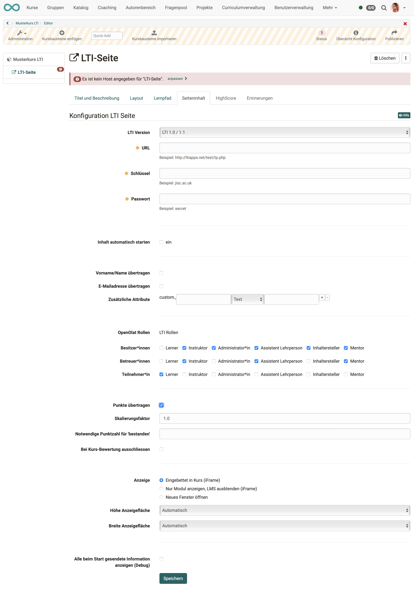

# Kursbaustein "LTI-Seite“ {: #lti}

## Steckbrief

Name | LTI-Seite
---------|----------
Icon | { class=size24  }
Verfügbar seit | Release 15.5 (Beta)
Funktionsgruppe | Andere
Verwendungszweck | Integration externer Lernapplikationen
Bewertbar | ja
Spezialität / Hinweis |

Mit Hilfe des Kursbausteins „LTI-Seite“ können Sie externe Lernapplikationen in Ihren Kurs integrieren und den Inhalt im OpenOlat-Fenster anzeigen lassen. LTI steht für "Learning Tool Interoperability" und ist ein IMS Standard zur Einbindung von externen Lernapplikationen wie zum Beispiel einem Chat, einem Mediawiki, einem Testeditor oder einem virtuellen Labor. Weitere Informationen zu LTI finden Sie auf der LTI Projekthomepage: [http://www.imsglobal.org/lti/](http://www.imsglobal.org/lti/)

## Prozess

* Geben Sie im Tab "Seiteninhalt" die zu referenzierende URL sowie den Schlüssel und das zugehörige Passwort an. 
* Wenn ein Benutzer in der Kursnavigation die LTI-Seite auswählt, muss er aus Datenschutzgründen zuerst der Datenübertragung zustimmen, bevor im Hintergrund die Benutzerdaten und Kursinformationen sowie der Schlüssel geschützt an die eingebundene Lernapplikation übermittelt werden. 
* Die Lernapplikation überprüft die Zugangsrechte und erlaubt bei gültigem Schlüssel den Zugriff. 
* Eine erneute Abfrage zur Datenübermittlung erfolgt später nur wieder, wenn sich die Konfiguration des Bausteins in Bezug auf übermittelte Daten ändert.
* Wenn der Benutzer die LTI-Seite in der Navigation auswählt, erscheint die eingebundene Lernapplikation im OLAT-Kurs.

  
## LTI im Kursbaustein konfigurieren

!!! info "Hinweis"

    Voraussetzung ist die von einem/einer Administrator:in vorgenommene Aktivierung und generelle Einrichtung von LTI.

Die folgenden Parameter können im Kursbaustein konfiguriert werden:

{ class=" shadow lightbox" }

**LTI Version:** Wir empfehlen die aktuelle Version LTI 1.3 Aus Kompatibilitätsgründen kann jedoch auch die ältere Version gewählt werden.

Wurden von Ihren Administrator:innen Deep Links eingerichtet, können Sie unter diesem Punkt vorkonfigurierte Deep Links auswählen. Die nachfolgenden Eintragungen sind dann teilweise bereits automatisch gemacht.

**URL:** In diesem Eingabefeld geben Sie die Adresse der externen Lernapplikation ein.  Das Format ist z.B. "https://tools.< Firma xyz >.de/lti_quiz/lti_quizwand.php".

**Schlüssel:** Hier geben Sie den Schlüssel ein, den Sie vom Anbieter der externen Lernapplikation erhalten haben ("lti_quiz" im obigen Beispiel).

**Passwort:** Hier geben Sie das zum Schlüssel passende Passwort ein, das Sie ebenfalls vom Anbieter der externen Lernapplikation erhalten haben ("weeHoo1w" im obigen Beispiel).

**Inhalt automatisch starten:** Ist diese Option aktiviert wird die verbundene Applikation direkt, ohne Zwischenseite "LTI-Lerninhalt anzeigen" dargestellt. Der Administrator kann diese Option abschalten.

* * *

**Vorname/Name übertragen:** Wenn Sie diese Checkbox ankreuzen, wird der Vor- und Nachname des Benutzers an die externe Lernapplikation weitergegeben. Ansonsten kann der Benutzer die externe Lernapplikation anonym nutzen.

**E-Mailadresse übertragen:** Markieren Sie die Checkbox, wird die E-Mailadresse des Benutzers an die externe Lernapplikation weitergegeben.

**Zusätzliche Attribute:** In dieses Eingabefeld können Sie weitere Parameter eingeben, die an die Lernapplikation übermittelt werden sollen. So kann der Lernapplikation beispielsweise mitgeteilt werden, dass die Anfrage von der Lernplattform OLAT übermittelt wird. (Die externe Lernapplikation muss die weitergegebenen Informationen verarbeiten können, weshalb eine Absprache mit dem Anbieter nötig ist). Sie haben die Wahl von statischen Text-Attributen (Für alle Benutzer ist Wert identisch) oder zusätzlichen dynamischen Benutzerattributen (pro Benutzer unterschiedlich). Sie können beliebig viele Zusatzattribute definieren, die LTI Ressource muss allerdings wissen, dass es diese Attribute gibt da diese nicht im Standard definiert sind.

* * *

**OpenOlat Rollen:** In diesem Bereich können Sie definieren welche Rolle die einzelnen Benutzer einnehmen wenn Sie die LTI Ressource starten. Es werden dabei die drei OpenOlat Besitzer, Betreuer und Teilnehmer unterstützt. Für jede Rolle kann genau definiert werden, welche Rollen dafür auf Seiten der LTI Ressource angewendet werden soll. Die folgenden LTI Rollen können konfiguriert werden: Lerner, Instruktur, Administrator, Assistent Lehrperson, Inhaltersteller und Mentor. 

**Punkte übertragen:** Wählen Sie diese Checkbox, wenn die LTI Ressource Punkte erzeugen und mit dem LTI 1.1 Standard an OpenOlat übermitteln soll. Dies ist optional. Übermittelte Punkte erscheinen beim Benutzer auf der Startseite des LTI Bausteins sowie auf dem Leistungsnachweis. Bitte beachten Sie, dass LTI gemäss Standard nur einen Wert zwischen 0 und 1 liefern kann.

!!! info "Hinweis"

    Wird die Option "Punkte übertragen" aktiviert, kann die LTI-Seite als bewertbares Kurselement zum Kurs hinzugefügt werden, und erscheint dann im Bewertungswerkzeug. Zusätzlich erscheinen die übermittelten Punkte beim Benutzer auf der Startseite des LTI-Bausteins.

**Skalierungsfaktor:** Mit dem Skalierungsfaktor können Sie die LTI Resultate, die gemäss Standard einen Wert zwischen 0 und 1 einnehmen müssen, auf einen im OpenOlat Kurs praktischeren Wert skalieren. Möchten Sie beispielsweise in OpenOlat maximal 10 Punkte für eine LTI Aufgabe vergeben, so müssen Sie als Skalierungsfaktor den Wert "10" eintragen. Möchten Sie die Punkte unverändert übernehmen, wählen Sie den Wert "1".

**Notwendige Punktzahl für 'bestanden':** Geben Sie hier den optionalen Schwellenwert an, ab wann das LTI Element als bestanden gilt. Dieser Schwellenwert bezieht sich auf das skalierte Endresultat und nicht auf die von LTI übermittelten Rohdaten! Im obigen Beispiel wäre ein Schwellwert von "5" gleichbedeutend mit "50%".

* * *

**Anzeige:** Wählen Sie die Option "Eingebettet in Kurs (iFrame)" um die LTI Ressource eingebettet im Kurslayout anzuzeigen. Mit der Option "Neues Fenster öffnen" wird die LTI Ressource hingegen in einem neuen Fenster geöffnet. Dies ist sinnvoll, wenn die Ressource viel Platz braucht oder parallel mit anderen Kurselementen verwendet werden soll.

**Höhe Anzeigefläche:** Wählen Sie "automatisch" oder eine explizite Grösse aus, wenn die automatische Funktion ungenügend ist.

**Breite Anzeigefläche:** Wählen Sie "automatisch" oder eine explizite Grösse aus, wenn die automatische Funktion ungenügend ist.

* * *

**Alle beim Start gesendete Information anzeigen (Debug):** Wenn Sie diese Checkbox ankreuzen, werden den Benutzern die gesendeten Informationen angezeigt. Diese Informationen beinhalten Parameter, wie zum Beispiel die Benutzeridentifikation, den Kursnamen, den Kursbaustein etc. Wenn Sie in der Kursansicht auf die Schaltfläche "Launch Endpoint with BasicLTI Data" oberhalb der Anzeige der gesendeten Daten drücken, gelangen Sie zur Startseite der Lernapplikation.
