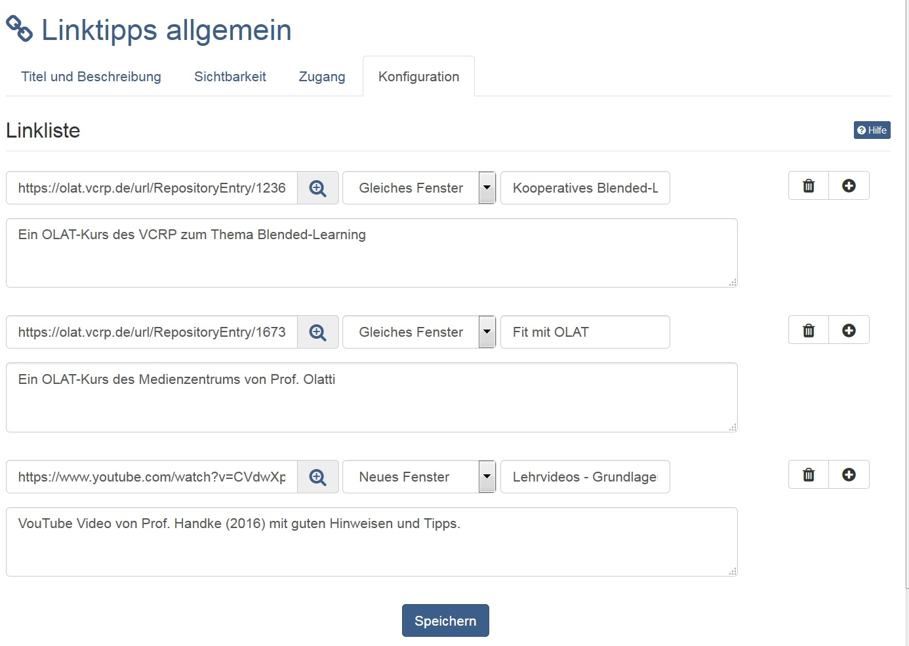

# Kursbaustein "Linkliste" {: #linklist}

## Steckbrief

Name | Linkliste
---------|----------
Icon | { class=size24  }
Verfügbar seit | 
Funktionsgruppe | Andere
Verwendungszweck | Linksammlungen innerhalb der Kursstruktur (Kursmenü)
Bewertbar | nein
Spezialität / Hinweis |

Der Kursbaustein "Linkliste" erlaubt es schnell und einfach eine Linksammlung für einen Kurs anzulegen. Keinerlei HTML-Kenntnisse werden dazu benötigt. In der Editoransicht des Kursbausteins muss im Tab "Konfiguration" lediglich die URL der Zielseite eingetragen, oder eine Zieldatei über das Lupen-Icon ausgewählt werden. Im neu sich öffnenden modalen Fenster können Dateien auch hochgeladen werden. Wählen Sie aus ob der Link in einem neuen oder im bestehenden Fenster geöffnet wird, und geben Sie dann den gewünschten Titel des Links an. Im Kommentarfeld unterhalb der Adresszeile kann bei Bedarf eine Beschreibung zum Link hinzugefügt werden. Mit einem Klick auf die Müll- oder + Schaltfläche werden bestehende Links gelöscht oder neue hinzugefügt.

Beispiel:

