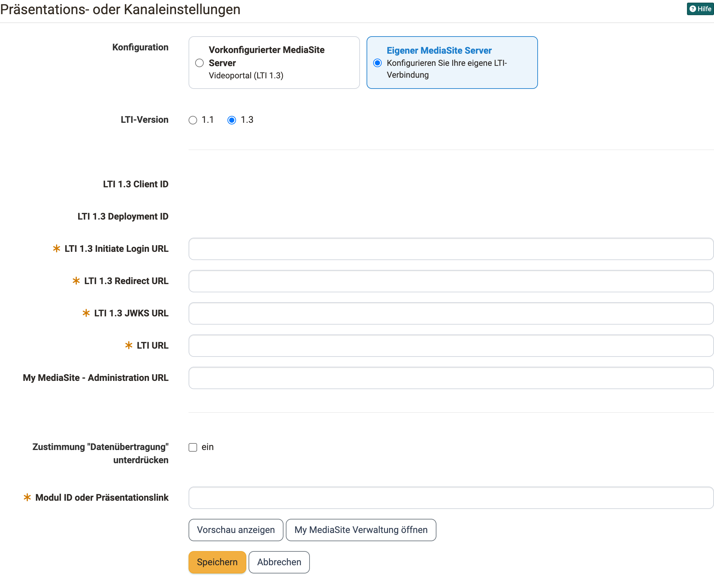

# Kursbaustein "MediaSite" {: #mediasite}

## Steckbrief

Name | MediaSite
---------|----------
Icon | { class=size24  }
Verfügbar seit | Release 16
Funktionsgruppe | Wissensvermittlung
Verwendungszweck | Anzeige von Mediasite-Inhalten
Bewertbar | nein
Spezialität / Hinweis | Eine Dokumentation finden Sie auf [mediasite.com](https://mediasite.com).

Mediasite ist eine automatisierte Videoplattform für Videoaufzeichnung, Videomanagement und Untertitelung. Mit dem Kursbaustein "MediaSite" zeigen Sie eine einzelne Aufzeichnung oder einen ganzen Kanal des Mediasite-Servers direkt im Kurs an. Weitere Informationen finden Sie in der Dokumentation von [mediasite.com](https://mediasite.com).

Voraussetzung ist, dass Ihre Administrator:innen das Mediasite-Modul in der System-Administration aktiviert und die Verbindung zum Mediasite-Server eingerichtet haben, unter: 
`Administration > Externe Werkzeuge > MediaSite`

Die Einrichtung ist im Administrationshandbuch beschrieben: [Externe Werkzeuge: Übersicht](../../manual_admin/administration/External_Tools_-_Administration.de.md). Die Verbindung läuft über LTI 1.1 oder LTI 1.3. Welche Version gilt, legen Ihre Administrator:innen dort fest [:octicons-tag-16:{ title="ab Release 21.0 (OO-9291)" }](https://track.frentix.com/issue/OO-9291){:target="_blank"}. Die Inhaltsauswahl im Kurseditor steht nur mit LTI 1.3 zur Verfügung.

## Konfiguration im Kurseditor {: #configuration}

Kursbesitzer:innen konfigurieren den Kursbaustein im Kurseditor im Tab "MediaSite Konfiguration". Sie legen dort fest, über welchen Server der Inhalt geladen wird und welche Aufzeichnung oder welcher Kanal im Kurs erscheint.

{ class="shadow lightbox" }

### Server wählen {: #server}

Im Bereich "Konfiguration" wählen Sie, welche Verbindung der Kursbaustein verwendet:

**Vorkonfigurierter MediaSite Server:** Der Kursbaustein verwendet den Server, den Ihre Administrator:innen in der System-Administration eingerichtet haben. Die Karte zeigt den Servernamen und die LTI-Version an. Diese Option erscheint nur, wenn in der System-Administration die Option "Vorkonfigurierter Server" aktiviert ist.

**Eigener MediaSite Server:** Der Kursbaustein verwendet eine eigene LTI-Verbindung, die nur für diesen Kursbaustein gilt. Sie wählen die **LTI-Version** und tragen die Angaben ein, die Sie von der Betreiberin Ihres Mediasite-Servers erhalten. Bei LTI 1.1 sind das **LTI Key**, **LTI Secret**, **LTI URL**, **My MediaSite - Administration URL** und **Username Property Key**. Bei LTI 1.3 sind das **LTI 1.3 Initiate Login URL**, **LTI 1.3 Redirect URL**, **LTI 1.3 JWKS URL** und **LTI URL**, optional die **My MediaSite - Administration URL**. Die **LTI 1.3 Client ID** und die **LTI 1.3 Deployment ID** erzeugt OpenOlat beim ersten Speichern und zeigt sie an. Diese beiden Werte benötigt die Betreiberin des Mediasite-Servers, um OpenOlat auf ihrer Seite zu registrieren.

Mit **Zustimmung "Datenübertragung" unterdrücken** legen Sie fest, ob Teilnehmende die Datenübertragung an den Mediasite-Server vor dem ersten Öffnen bestätigen müssen (siehe [Ansicht im Kurs](#course_view)).

### Inhalt auswählen [:octicons-tag-16:{ title="ab Release 21.0.3 (OO-9717)" }](https://track.frentix.com/issue/OO-9717){:target="_blank"} {: #choose_content}

Mit der Inhaltsauswahl bestimmen Sie, welcher Kanal oder welche einzelne Aufzeichnung im Kurs erscheint. Ein Kanal zeigt fortlaufend alle Aufzeichnungen der Sammlung, auch solche, die später hinzukommen. Eine einzelne Aufzeichnung zeigt genau dieses Video.

1. Klicken Sie unter dem Feld **Modul ID oder Präsentationslink** auf **Inhalt auswählen**.
2. Der Dialog "Inhalt auswählen" öffnet die Oberfläche des Mediasite-Servers. Durchsuchen Sie dort Ihre Kanäle und Aufzeichnungen.
3. Wählen Sie einen Kanal oder eine einzelne Aufzeichnung.
4. OpenOlat übernimmt die Auswahl in das Feld **Modul ID oder Präsentationslink**.
5. Klicken Sie auf **Speichern**.

Der Dialog stellt Ihnen auch die Funktionen des Mediasite-Servers zum Hochladen einer neuen Aufzeichnung bereit. So laden Sie ein Video direkt aus dem Kurseditor hoch und wählen es anschliessend aus, ohne die Mediasite-Oberfläche in einem eigenen Fenster zu öffnen.

!!! tip "Die Schaltfläche Inhalt auswählen erscheint bei einer vollständigen LTI-1.3-Verbindung"
    Die Inhaltsauswahl setzt LTI 1.3 voraus. Beim vorkonfigurierten Server legen Ihre Administrator:innen die LTI-Version fest. Beim eigenen Server wählen Sie LTI 1.3 und speichern den Kursbaustein einmal, damit die Verbindung aufgebaut wird. Danach erscheint die Schaltfläche. Bei LTI 1.1 geben Sie die Modul-ID von Hand ein.

### Modul-ID von Hand eingeben {: #module_id}

Im Feld **Modul ID oder Präsentationslink** tragen Sie die ID einer Aufzeichnung oder eines Kanals ein. Alternativ fügen Sie den Link ein, den Sie aus der Mediasite-Oberfläche kopiert haben. OpenOlat liest die ID aus dem Link heraus. Bei LTI 1.1 ist die manuelle Eingabe der einzige Weg. Bei LTI 1.3 steht sie zusätzlich zur Inhaltsauswahl zur Verfügung.

Mit **Vorschau anzeigen** prüfen Sie, wie der gewählte Inhalt für Kursteilnehmer:innen erscheint. Mit **My MediaSite Verwaltung öffnen** wechseln Sie in die Verwaltungsoberfläche Ihres Mediasite-Servers.

## Konfigurationsfehler im Kurseditor {: #configuration_errors}

Der Kurseditor prüft die Konfiguration des Kursbausteins und zeigt Fehler direkt in der Statusanzeige des Kursbausteins an. Ein Klick auf die Meldung öffnet den Tab "MediaSite Konfiguration".

* **Keine Modul-ID bereitgestellt:** Das Feld **Modul ID oder Präsentationslink** ist leer. Wählen Sie einen Inhalt aus oder tragen Sie die ID ein.
* **Die Zugangsdaten sind unvollständig:** In der System-Administration ist kein vorkonfigurierter Server aktiviert, und der Kursbaustein verwendet keinen eigenen Server. Wählen Sie **Eigener MediaSite Server** und tragen Sie die Zugangsdaten ein, oder wenden Sie sich an Ihre Administrator:innen.
* **Die LTI-1.3-Verbindung ist nicht vollständig konfiguriert:** Beim gewählten Server sind die Angaben zu LTI 1.3 unvollständig, zum Beispiel fehlt die LTI URL. Vervollständigen Sie die Angaben beim eigenen Server oder wenden Sie sich an Ihre Administrator:innen.

Solange ein Fehler besteht, lässt sich der Kursbaustein nicht publizieren.

## Ansicht im Kurs {: #course_view}

Teilnehmende öffnen den Kursbaustein und sehen die gewählte Aufzeichnung oder den Kanal direkt im Kurs. Beim ersten Öffnen erscheint die Seite "Zustimmung Datenübertragung". Sie zeigt, welche persönlichen Daten OpenOlat an den Mediasite-Server übermittelt, und verlangt die Bestätigung mit **Ich stimme der Datenübertragung zu**. Die Zustimmung gilt für diesen Kursbaustein, solange sich die übermittelten Daten nicht ändern.

Ist die Zustimmung unterdrückt, öffnet sich der Inhalt ohne diese Seite. Beim vorkonfigurierten Server legen Ihre Administrator:innen das in der System-Administration fest, beim eigenen Server Sie selbst im Kursbaustein.

## Kurs kopieren oder importieren {: #copy}

Verwendet der Kursbaustein einen eigenen MediaSite Server mit LTI 1.3, erhält er beim Kopieren oder Importieren des Kurses in der Kopie eine eigene LTI-1.3-Verbindung. Original und Kopie sind voneinander unabhängig. Eine Änderung der Serverkonfiguration in der Kopie wirkt sich nicht auf den ursprünglichen Kurs aus. Löschen Sie den Kursbaustein, entfernt OpenOlat die zugehörige LTI-1.3-Verbindung.

## Weiterführende Informationen {: #further_information}

[mediasite.com >](https://mediasite.com) 
[Externe Werkzeuge: Übersicht >](../../manual_admin/administration/External_Tools_-_Administration.de.md) 
[LTI - Deep Linking >](../../manual_admin/administration/LTI_Deeplinking.de.md) 
[Video: Übersicht >](../basic_concepts/Video.de.md)

[Zum Seitenanfang ^](#mediasite)
