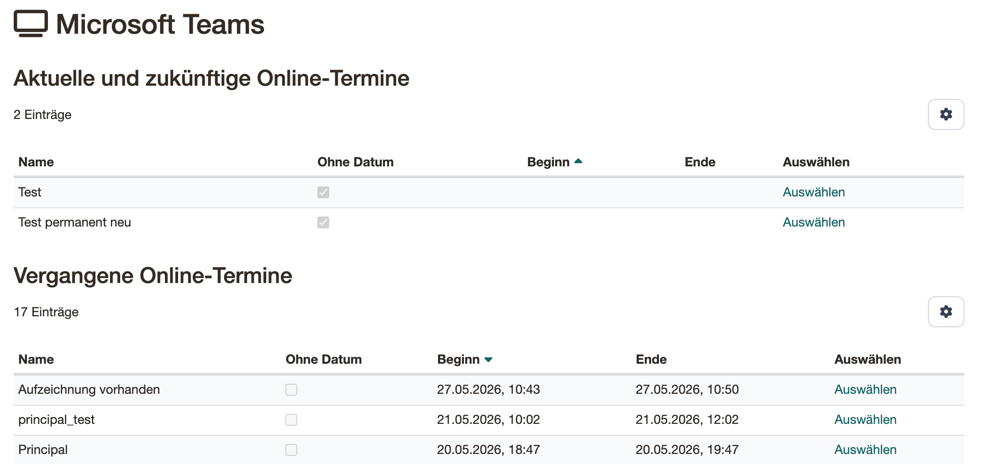
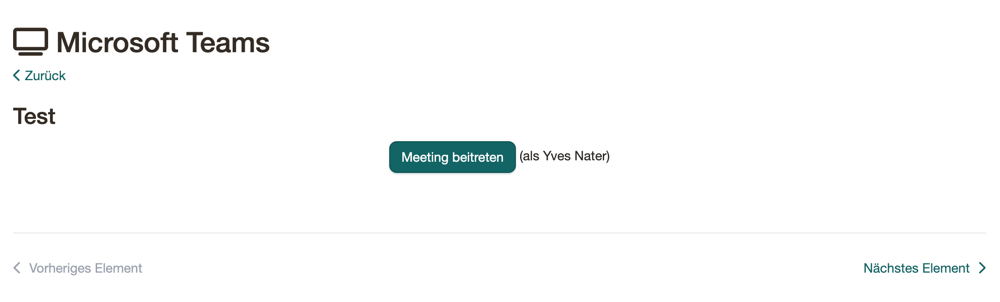

# Kursbaustein "Microsoft Teams"

## Steckbrief

Name | Microsoft Teams
---------|----------
Icon | :fontawesome-solid-tv:
Verfügbar seit | Release 15.4
Funktionsgruppe | Kommunikation und Kollaboration
Verwendungszweck | Integration der Webkonferenz-Software Microsoft Teams
Bewertbar | nein
Spezialität / Hinweis | Microsoft Teams ist eine kommerzielle Software. Um den Kursbaustein zu nutzen ist eine separate Lizenz und ein Serverhosting erforderlich.

:octicons-device-camera-video-24: **Video-Einführung**: [Microsoft Teams](<https://www.youtube.com/embed/eyHOaF-ujuE>){:target="_blank"}

## Funktionen der Software  {: #software_functions}

Microsoft Teams ermöglicht virtuelle Räume für synchrone Meetings mit Webcam- und Audio-Unterstützung.

## Systemvoraussetzungen {: #system_requirements}

MS Teams kann sowohl als App als auch im MS Browser Edge verwendet werden.

!!! tip "Empfehlung"
  
    Für die vollständige Nutzung aller Funktionen – insbesondere **Breakout-Räume** – wird die MS Teams **Desktop-App** auf Windows oder macOS empfohlen. Im Webbrowser sowie auf Linux, iOS und Android stehen nicht alle Funktionen zur Verfügung.

## Rollen in MS Teams {: #teams_roles}

In einem MS Teams Meeting gibt es drei Rollen:

| Rolle | Wer | Rechte |
|-------|-----|--------|
| **Organizer** | Automatisch die Person, die das Meeting zuerst betritt – genau eine Person pro Meeting | Breakout-Räume erstellen, Meeting-Einstellungen, volle Kontrolle |
| **Presenter** | Alle als Moderator konfigurierten Personen | Bildschirm teilen, Inhalte verwalten |
| **Attendee** | Alle übrigen Teilnehmenden | Zuhören und zuschauen |

!!! warning "Achtung: First-Joiner = Organizer"

    Die erste Person, die ein Meeting betritt, erhält automatisch die Rolle **Organizer** – unabhängig von der Moderator-Einstellung in OpenOlat. Diese Rolle kann nachträglich weder in OpenOlat noch in Microsoft Teams geändert oder neu vergeben werden.

    Bei **permanenten Räumen** mit wechselnden Betreuenden hat daher nur diejenige Person, die das Meeting zuerst gestartet hat, dauerhaft Zugriff auf erweiterte Funktionen wie Breakout-Räume. Soll eine andere Person als Organizer auftreten, muss ein neuer Raum erstellt werden.

## Raum konfigurieren bei geschlossenem Kurseditor  {: #closed_editor_configuration}

Im Kurs können Kursbesitzer und Betreuer im zuvor angelegten Kursbaustein
Microsoft Teams in der "**Terminverwaltung**" über "**Online-Termin hinzufügen**" neue
Termine anlegen.

### Folgende Varianten bei der Erstellung von Online-Terminen werden unterschieden: {: #meeting_variants}

  * Einzelnen Online-Termin hinzufügen
  * Permanente Reservierung hinzufügen
  * Täglich wiederkehrende Online-Termine hinzufügen
  * Wöchentlich wiederkehrende Online-Termine hinzufügen

Die Varianten unterscheiden sich nur in der Erstellung der Termine. Es werden
separate Online-Termine/Reservierungen erstellt, welche anschliessend im Tab
"**Terminverwaltung**" über den Link "**Editieren**" bearbeitet werden können.  

## Online-Termin hinzufügen: Die Einstellungen im Detail {: #add_meeting}

### Konfiguration Online-Termin

  *  **Name** : Bezeichnung des Termins
  *  **Erstellt durch:** Der Name des Erstellers wird automatisch angezeigt.
  *  **Beschreibung** : Beschreibung des Termins. Diese Information wird angezeigt bevor die Kursteilnehmenden den jeweiligen Meetingraum aufrufen. 
  *  **Hauptmoderator:** Hier kann der Name einer Person eingetragen werden.
  *  **Zugang externe Benutzer:** Hinterlegen sie hier ein Kennzeichen/Wort
  *  **Raumbuchungen anzeigen** : Kalenderansicht zur Prüfung von belegten Online-Meetings
  *  **Teilnehmer dürfen das Meeting eröffnen:** :octicons-tag-16:{ title="ab Release 15.4.1 (OO-5250)" } Teilnehmer mit einem Microsoft-Account der Institution dürfen das Meeting mit eingeschränkten Präsentationsberechtigungen eröffnen, ohne dass ein Betreuer anwesend sein muss.
  *  **Gäste zulassen:** Nicht angemeldete Personen können am Meeting teilnehmen. Diese Option ist nur sichtbar, wenn der Kurs öffentlich zugänglich und der Gastzugang aktiviert ist.
  *  **Moderator** : Bestimmt, wer in MS Teams die Rolle **Presenter** erhält (siehe [Rollen in MS Teams](#teams_roles)).

#### Moderator-Optionen im Detail {: #moderator_options}

| OO-Einstellung | Wer wird Presenter in Teams |
|---|---|
| **Betreuer/Besitzer** | Nur Kursbetreuer:innen und -besitzer:innen; alle anderen Teilnehmenden werden Attendees |
| **Organisation** | Alle Benutzer:innen der Azure-Organisation erhalten beim Beitritt automatisch die Rolle Presenter |
| **Alle** | Alle Teilnehmenden werden Presenter |

!!! info "Hinweis"

    Eine einmal erstellte Raum-Konfiguration kann nachträglich nicht mehr geändert werden. Sollen andere Moderator-Einstellungen gelten, muss ein neuer Raum angelegt werden.

#### **Bei termingebundenen Räumen:**

  *  **Beginn** : Definieren Sie hier den Starttermin des Meetings
  *  **Vorlaufzeit (Min.)** : Vorlaufzeit, in der das Meeting bereits von den Kursbetreuern und Besitzern gestartet werden kann
  *  **Ende** : Endtermin des Meetings - die maximale Laufzeit eines Meetings ist abhängig von der gewählten Raumvorlage
  *  **Nachlaufzeit (Min.)** :  Nachlaufzeit, in der das Meeting für alle Personen verlängert werden kann. Es erscheint eine Anzeige mit der verbleibenden Konferenzzeit.

!!! info "Hinweis"

    Bei täglich oder wöchentlich wiederkehrenden Terminen muss zusätzlich das Start und Enddatum definiert werden. Im Anschluss werden sämtliche Termine für diese Zeitspanne angezeigt und es können noch einzelne Termine aus der Liste gelöscht oder hinzugefügt werden.

In der Konfiguration eines Raums kann sowohl während der Erstellung als auch
später beim Editieren über den Link "**Raumbuchungen anzeigen**", eine Übersicht
über alle gebuchten Microsoft Teams Räume der Instanz eingesehen werden. Das
erleichtert es, zeitliche Engpässe bzw. eine starke Auslastung des Systems
frühzeitig zu erkennen und gegebenenfalls einen anderen Termin zu wählen.

Über den Tab "**Online-Termine**" erhält man Zugang zu einem bestimmten Termin
bzw. Raum.  

## Breakout-Räume {: #breakout_rooms}

Breakout-Räume können ausschliesslich vom **Organizer** eines Meetings erstellt und verwaltet werden (siehe [Rollen in MS Teams](#teams_roles)).

**Unterstützte Plattformen:** Breakout-Räume stehen nur in der Teams Desktop-App unter Windows und macOS zur Verfügung – nicht im Webbrowser und nicht auf mobilen Geräten.

**Einschränkungen bei der Teilnehmerzuweisung:** Folgende Personen können Breakout-Räumen nicht zugewiesen werden:

  * Personen mit einem Teams-Free-Account
  * Personen auf nicht unterstützten Geräten (z.B. CVI-Konferenzgeräte)
  * Offline-Teilnehmende oder Personen mit veralteter Teams-Version

**Weitere Einschränkungen:** Breakout-Räume sind nicht verfügbar bei abgesagten oder gelöschten Meetings, in privaten oder geteilten Kanälen sowie bei entsprechenden Admin-Richtlinien.

**Kapazität:** Pro Meeting sind maximal 300 Teilnehmende möglich. Bei Überschreitung wird die Breakout-Funktion automatisch deaktiviert. Räume verfallen nach 60 Tagen Inaktivität.

## Kalender Anzeige {: #calender_view}

Zusätzlich werden die in dem Kursbaustein erstellten Online-Termine
automatisch in den kursspezifischen Kalender eingetragen und von den
Teilnehmenden abonniert werden. Auch kann man rasch aus dem Kalender in den
termingebundenen Raum gelangen.

!!! info "Hinweis"
    Im Kurskalender erscheinen nur Termine mit einem definierten Start- und Enddatum. Permanente Reservierungen ohne Datum werden im Kalender nicht angezeigt.

  :octicons-device-camera-video-24: **Video-Einführung**: [Abonnements](<https://www.youtube.com/embed/h9gOqt7TR7Q>){:target="_blank"}

## Teilnehmerperspektive {: #participant_perspective}

Ruft ein Kursteilnehmer einen MS Teams Kursbaustein auf, sieht er eine
Übersicht der bevorstehenden und der abgelaufenen Termine, sofern vorhanden.
Ein Klick auf "**Auswählen**" öffnet die Detailansicht des jeweiligen Meetings.

Läuft ein Meeting, kann es über "**Meeting beitreten**" gestartet werden. Ob
Teilnehmende das Meeting auch ohne Betreuer eröffnen dürfen, hängt von der
Konfiguration des Termins ab (siehe oben).

!!! warning "Achtung"

    Bei abgelaufenen Meetings ist der Beitritt nicht mehr möglich. Aufzeichnungen stehen in OpenOlat nicht zur Verfügung; Aufzeichnungen, die direkt in Microsoft Teams erstellt wurden, sind ausschliesslich über Microsoft Teams abrufbar.

## Bei Problemen {: #troubleshooting}

Bei anwendungsspezifischen Herausforderungen steht die Microsofthilfe zur Verfügung:

[Microsoft-Hilfe: Problembehandlung in Microsoft Teams](https://support.microsoft.com/de-de/teams/platform/troubleshoot-in-microsoft-teams){:target="_blank"}
