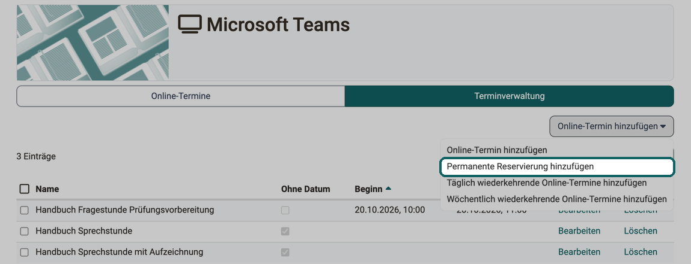
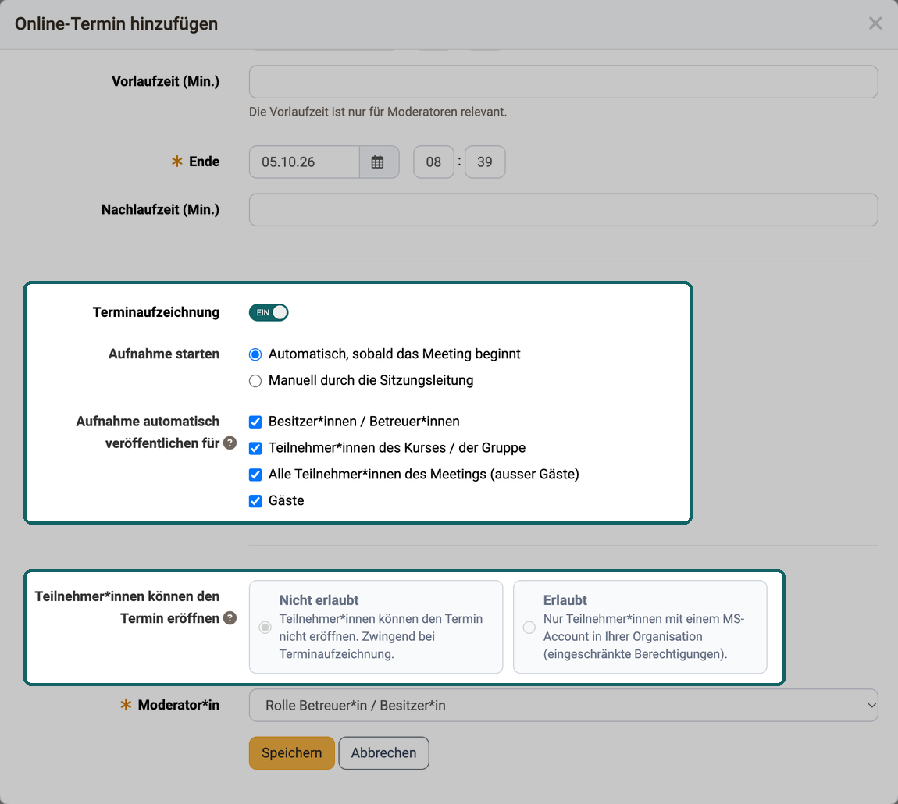
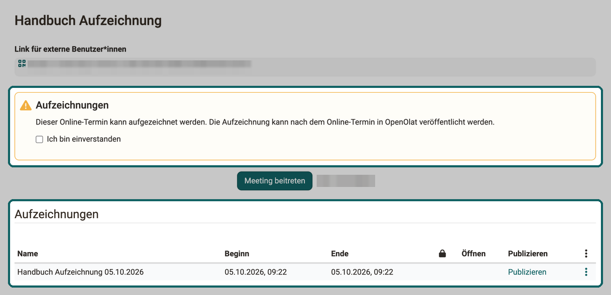
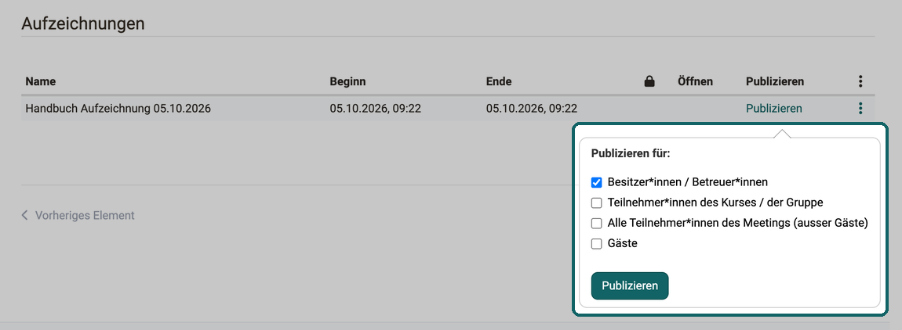
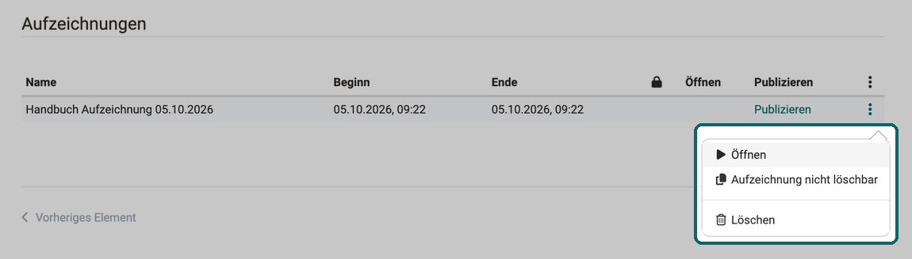
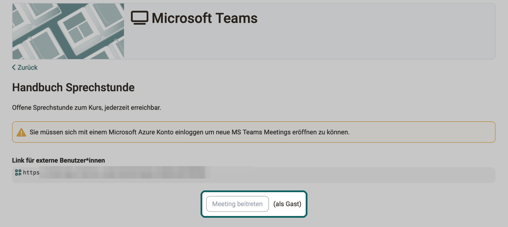
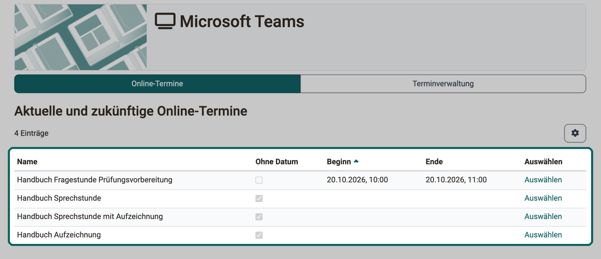

# Kursbaustein "Microsoft Teams" {: #microsoft_teams}

## Steckbrief

Name | Microsoft Teams
---------|----------
Icon | :o_icon_o_vc_icon:
Verfügbar seit | Release 15.4
Funktionsgruppe | Kommunikation und Kollaboration
Verwendungszweck | Integration der Webkonferenz-Software Microsoft Teams
Bewertbar | nein
Spezialität / Hinweis | Microsoft Teams ist eine kommerzielle Software. Um den Kursbaustein zu nutzen, ist eine separate Lizenz und ein Serverhosting erforderlich.

:octicons-device-camera-video-24: **Video-Einführung**: [Microsoft Teams](<https://www.youtube.com/embed/eyHOaF-ujuE>){:target="_blank"}

## Funktionen der Software  {: #software_functions}

Microsoft Teams ermöglicht virtuelle Räume für synchrone Online-Termine mit Webcam- und Audio-Unterstützung.

## Systemvoraussetzungen {: #system_requirements}

MS Teams kann sowohl als App als auch im MS Browser Edge verwendet werden.

!!! tip "Empfehlung"

    Für die vollständige Nutzung aller Funktionen, insbesondere der **Breakout-Räume**, wird die MS Teams **Desktop-App** auf Windows oder macOS empfohlen. Im Webbrowser sowie auf Linux, iOS und Android stehen nicht alle Funktionen zur Verfügung.

## Rollen in MS Teams {: #teams_roles}

In einem Online-Termin mit MS Teams gibt es drei Rollen:

| Rolle | Wer | Rechte |
|-------|-----|--------|
| **Organizer** | Automatisch die Person, die den Online-Termin zuerst startet, genau eine Person pro Online-Termin | Breakout-Räume erstellen, Einstellungen in MS Teams, volle Kontrolle |
| **Presenter** | Alle Personen gemäss der Einstellung **Moderator:in** des Online-Termins (siehe [Moderator-Optionen im Detail](#moderator_options)) | Bildschirm teilen, Inhalte verwalten |
| **Attendee** | Alle übrigen Teilnehmenden | Zuhören und zuschauen |

!!! warning "Achtung: First-Joiner = Organizer"

    Die erste Person, die einen Online-Termin startet, erhält automatisch die Rolle **Organizer**, unabhängig von der Einstellung **Moderator:in** in OpenOlat. Diese Rolle kann nachträglich weder in OpenOlat noch in Microsoft Teams geändert oder neu vergeben werden.

    Bei **permanenten Reservierungen** mit wechselnden Betreuenden hat daher nur diejenige Person, die den Online-Termin zuerst gestartet hat, dauerhaft Zugriff auf erweiterte Funktionen wie Breakout-Räume. Soll eine andere Person als Organizer auftreten, muss ein neuer Online-Termin angelegt werden.

## Online-Termine anlegen bei geschlossenem Kurseditor [:octicons-tag-16:{ title="ab Release 15.4 (OO-5124)" }](https://track.frentix.com/issue/OO-5124) {: #closed_editor_configuration}

Damit Teilnehmende einen Online-Termin mit Microsoft Teams direkt aus dem Kurs betreten können, legen Besitzer:innen und Betreuer:innen des Kurses dafür Online-Termine an. Das geschieht im laufenden Kurs, nicht im Kurseditor: Kursbaustein "Microsoft Teams" öffnen, dann im Tab **Terminverwaltung** die Auswahl **Online-Termin hinzufügen** öffnen: 
`Kursbaustein "Microsoft Teams" > Terminverwaltung > Online-Termin hinzufügen`

### Varianten beim Anlegen von Online-Terminen {: #meeting_variants}

Die Auswahl **Online-Termin hinzufügen** bietet vier Varianten an:

  * **Online-Termin hinzufügen**: ein einzelner Online-Termin mit Beginn und Ende.
  * **Permanente Reservierung hinzufügen**: ein Online-Termin ohne Datum, der dauerhaft offen steht. Die Variante erscheint nur, wenn die System-Administration die Option [Online-Termine ohne Datum/permanent](../../manual_admin/administration/Teams_module.de.md#permanent_meetings) auf "Ein" belassen hat. "Ein" ist der Standard. [:octicons-tag-16:{ title="ab Release 21.1.0 (OO-9666)" }](https://track.frentix.com/issue/OO-9666)
  * **Täglich wiederkehrende Online-Termine hinzufügen**: ein Online-Termin pro Werktag, Montag bis Freitag, in einer gewählten Zeitspanne.
  * **Wöchentlich wiederkehrende Online-Termine hinzufügen**: ein Online-Termin pro Woche in einer gewählten Zeitspanne.

{ class="shadow lightbox" title="Tab Terminverwaltung im Kursbaustein Microsoft Teams · 2026.10.05" }

Jede Variante legt eigenständige Online-Termine an, bei wiederkehrenden Terminen einen je Datum. Im Tab **Terminverwaltung** öffnet der Link **Bearbeiten** jeden Online-Termin einzeln. Ist ein Online-Termin samt Nachlaufzeit vorbei, steht dort **Ansehen**. Der Link **Löschen** entfernt einen Online-Termin nach einer Rückfrage. Mehrere Online-Termine löschen Sie gemeinsam, indem Sie sie ankreuzen und dann **Löschen** wählen.

## Online-Termin hinzufügen: Die Einstellungen im Detail {: #add_meeting}

### Konfiguration Online-Termin

  *  **Name**: Bezeichnung des Online-Termins. Pflichtfeld.
  *  **Erstellt durch**: Der Name der Person, die den Online-Termin anlegt, wird automatisch angezeigt.
  *  **Beschreibung**: Beschreibung des Online-Termins. Sie erscheint in der Detailansicht des Online-Termins, bevor Teilnehmende dem Online-Termin beitreten.
  *  **Hauptmoderator:in**: Hier kann der Name einer Person eingetragen werden. Vorbelegt ist der Name der Person, die den Online-Termin anlegt.
  *  **Gäste**: Das Kontrollkästchen **erlauben** lässt nicht angemeldete Personen am Online-Termin teilnehmen. Diese Option ist nur sichtbar, wenn der Kurs öffentlich zugänglich und der Gastzugang aktiviert ist.
  *  **Zugang externe Benutzer:innen**: Ein Kennzeichen, ein eindeutiges Wort ohne Sonderzeichen. OpenOlat erzeugt daraus einen Link, den Sie mit externen Personen teilen, z. B. per E-Mail. Besitzer:innen und Betreuer:innen finden ihn auf der Seite des Online-Termins unter "Link für externe Benutzer:innen", bis der Online-Termin beendet ist. Das Symbol davor zeigt den Link als QR-Code. Bleibt das Feld leer, ist der Zugang über den Link deaktiviert.
  *  **Raumbuchungen anzeigen**: Kalenderansicht zur Prüfung von belegten Online-Terminen.
  *  **Terminaufzeichnung**: Schaltet die Aufzeichnung für diesen Online-Termin ein oder aus. Der Schalter erscheint nur, wenn die System-Administration die Funktion eingeschaltet hat. Was die Einstellung bewirkt und welche Felder dazukommen, steht im Abschnitt [Terminaufzeichnung](#meeting_recording).
  *  **Teilnehmer:innen können den Termin eröffnen** :octicons-tag-16:{ title="ab Release 15.4.1 (OO-5250)" }: Bestimmt, ob Teilnehmende den Online-Termin starten dürfen, ohne dass eine Betreuer:in anwesend ist. Zur Wahl stehen zwei Karten. "Nicht erlaubt" ist vorausgewählt. Mit "Erlaubt" dürfen Teilnehmer:innen mit einem Microsoft-Konto der Organisation den Online-Termin mit eingeschränkten Berechtigungen eröffnen. Eröffnet eine Teilnehmer:in den Online-Termin, stehen den Betreuer:innen keine Gruppenräume ([Breakout-Räume](#breakout_rooms)) zur Verfügung. Ist die Terminaufzeichnung eingeschaltet, steht die Auswahl fest auf "Nicht erlaubt". Die Karten erscheinen nur, wenn die Serverkonfiguration dafür eingerichtet ist.
  *  **Moderator:in**: Bestimmt, wer in MS Teams die Rolle **Presenter** erhält (siehe [Rollen in MS Teams](#teams_roles)). Pflichtfeld.

#### Moderator-Optionen im Detail {: #moderator_options}

| OO-Einstellung | Wer wird Presenter in Teams |
|---|---|
| **Rolle Betreuer:in / Besitzer:in** | Nur Kursbetreuer:innen und -besitzer:innen; alle anderen Teilnehmenden werden Attendees |
| **Organisation** | Alle Benutzer:innen der Azure-Organisation erhalten beim Beitritt automatisch die Rolle Presenter |
| **Alle** | Alle Teilnehmenden werden Presenter |

!!! info "Wichtig"

    Die Einstellungen eines Online-Termins lassen sich nur ändern, solange er noch nicht gestartet wurde. Danach zeigt das Formular die Einstellungen nur noch an. Sollen andere Moderator-Einstellungen gelten, muss ein neuer Online-Termin angelegt werden.

#### Bei Online-Terminen mit Datum

  *  **Beginn**: Datum und Uhrzeit, zu der der Online-Termin beginnt.
  *  **Vorlaufzeit (Min.)**: Zeit in Minuten vor dem Beginn, in der Besitzer:innen und Betreuer:innen den Online-Termin bereits starten und betreten können. Für Teilnehmende öffnet der Online-Termin erst zum Beginn.
  *  **Ende**: Datum und Uhrzeit, zu der der Online-Termin endet.
  *  **Nachlaufzeit (Min.)**: Nachlaufzeit, in der der Online-Termin für alle Personen verlängert werden kann.

!!! info "Wichtig"

    Bei täglich oder wöchentlich wiederkehrenden Online-Terminen legen Sie zusätzlich **Start wiederkehrendes Datum** und **Ende wiederkehrendes Datum** fest. Im nächsten Schritt listet der Assistent alle Termine dieser Zeitspanne auf. Dort lassen sich einzelne Termine löschen oder über **Online-Termin hinzufügen** ergänzen.

In der Konfiguration eines Online-Termins öffnet der Link **Raumbuchungen anzeigen** beim Anlegen und beim Bearbeiten einen Kalender mit allen Microsoft Teams Online-Terminen der Instanz, die ein Datum haben. Permanente Reservierungen ohne Datum erscheinen darin nicht. Trotz der Beschriftung zeigt der Kalender keine Raumbuchungen aus dem Modul "Räume", sondern nur Online-Termine. Bei täglich oder wöchentlich wiederkehrenden Online-Terminen steht der Button **Raumbuchungen anzeigen** in Schritt 2 des Assistenten über der Liste der Termine. Das erleichtert es, zeitliche Engpässe bzw. eine starke Auslastung des Systems frühzeitig zu erkennen und gegebenenfalls einen anderen Termin zu wählen.

Im Tab **Online-Termine** öffnen Sie einen bestimmten Online-Termin.

## Terminaufzeichnung [:octicons-tag-16:{ title="ab Release 21.1 (OO-9665)" }](https://track.frentix.com/issue/OO-9665) {: #meeting_recording}

Wer einen Online-Termin aufzeichnet, will die Aufzeichnung danach den Teilnehmenden zeigen, ohne Dateien zu verschicken. Mit der Terminaufzeichnung holt OpenOlat die fertige Aufzeichnung aus Microsoft Teams ab, legt sie beim Online-Termin ab und zeigt sie dort an. Wer sie sehen darf, bestimmen Sie über Rollen. Ist in der System-Administration bei "Terminaufzeichnung automatisch löschen" eine Zahl Tage eingetragen, löscht OpenOlat die Aufzeichnung danach automatisch.

Die Terminaufzeichnung gehört zum Online-Termin, nicht zum Kursbaustein. Sie wirkt darum an allen Orten gleich, an denen Online-Termine mit Microsoft Teams entstehen: Kursbaustein "Microsoft Teams", "Kurs Termine", Kursbaustein "Terminplanung", Gruppen und Betreuer:innen-Chat.

Voraussetzung ist, dass die System-Administration die Funktion "Terminaufzeichnung" eingeschaltet hat, siehe [Modul Microsoft Teams](../../manual_admin/administration/Teams_module.de.md#meeting_recording). Sonst fehlen die Einstellungen im Online-Termin, und OpenOlat holt keine Aufzeichnung ab. Eine Aufzeichnung, die jemand direkt in Microsoft Teams startet, bleibt dann in Microsoft Teams.

### Einstellungen im Online-Termin {: #recording_settings}

Beim Anlegen oder Bearbeiten eines Online-Termins legen Sie fest, ob und wie er aufgezeichnet wird. Die Standardwerte kommen aus der System-Administration, Sie können sie je Online-Termin ändern.

  *  **Terminaufzeichnung**: Mit "Ein" darf der Online-Termin aufgezeichnet werden. Alle Personen müssen dann vor dem Betreten auf der Seite des Online-Termins **Ich bin einverstanden** ankreuzen, und die Auswahl "Teilnehmer:innen können den Termin eröffnen" steht fest auf "Nicht erlaubt". OpenOlat merkt sich die Zustimmung beim Beitritt für diesen Online-Termin und kreuzt sie beim nächsten Aufruf vor. Für Personen, die als Gast angemeldet sind, gilt das nicht. Mit "Aus" wird nichts aufgezeichnet, und die Seite des Online-Termins zeigt keine Aufzeichnungen.
  *  **Aufnahme starten**: "Automatisch, sobald das Meeting beginnt" oder "Manuell durch die Sitzungsleitung". Die Einstellung wirkt beim ersten Start des Online-Termins. Wer ihn zum ersten Mal startet, sieht neben dem Button **Online-Termin starten** das Kontrollkästchen **Aufzeichnung automatisch starten**. Es ist nach dieser Einstellung vorbelegt und lässt sich vor dem Start ändern. Danach zeigt die Seite allen Personen den Button **Meeting beitreten** und kein Kontrollkästchen mehr, auch wenn das Meeting in Microsoft Teams schon beendet ist.
  *  **Aufnahme automatisch veröffentlichen für**: Die Rollen, die die Aufzeichnung nach dem Online-Termin sehen: "Besitzer:innen / Betreuer:innen", "Teilnehmer:innen des Kurses / der Gruppe", "Alle Teilnehmer:innen des Meetings (ausser Gäste)" und "Gäste". Ist keine Rolle angekreuzt, veröffentlicht OpenOlat die Aufzeichnung nicht automatisch. Sie publizieren sie dann nach dem Online-Termin von Hand.

Die beiden Felder "Aufnahme starten" und "Aufnahme automatisch veröffentlichen für" erscheinen erst, wenn die Terminaufzeichnung eingeschaltet ist.

Das Bild zeigt nur den unteren Teil des Formulars. Die übrigen Felder, zum Beispiel den Link **Raumbuchungen anzeigen**, beschreibt der Abschnitt [Online-Termin hinzufügen: Die Einstellungen im Detail](#add_meeting).

{ class="shadow lightbox" title="Unterer Teil des Dialogs Online-Termin hinzufügen · 2026.10.05" }

### Aufzeichnungen nach dem Online-Termin {: #recordings_list}

Wer nach dem Online-Termin die Aufzeichnung ansehen oder freigeben will, findet sie auf der Seite des Online-Termins in der Liste **Aufzeichnungen**. OpenOlat holt Aufzeichnungen einmal pro Stunde aus Microsoft Teams ab, frühestens 15 Minuten nach dem Ende des Online-Termins. Online-Termine ohne Datum kommen bei jedem Abholen an die Reihe. Bis eine Aufzeichnung in der Liste steht, zeigt sie "Es ist zur Zeit noch keine Aufzeichnung für diesen Online-Termin vorhanden."

Schneller geht es für den Organizer, also die Person, die den Online-Termin zuerst gestartet hat (siehe [Rollen in MS Teams](#teams_roles)). Ruft sie die Seite mit ihrer Microsoft-Anmeldung auf, fragt OpenOlat sofort bei Microsoft Teams nach und trägt vorhandene Aufzeichnungen gleich in die Liste ein. Öffnen lässt sich eine so eingetragene Aufzeichnung erst nach dem stündlichen Abholen, weil OpenOlat die Datei dabei ablegt.

Die Liste zeigt je Aufzeichnung **Name**, **Beginn**, **Ende** und den Link **Öffnen**. "Öffnen" zeigt die Aufzeichnung in OpenOlat an, dort lässt sie sich auch herunterladen. Der Link erscheint, sobald OpenOlat die Datei abgeholt hat, und nur, wenn die Aufzeichnung für eine Rolle der Person veröffentlicht ist. Das gilt auch für Besitzer:innen und Betreuer:innen.

Das Bild zeigt die Seite eines Online-Termins kurz nach dem Ende: Die Aufzeichnung steht in der Liste, die Spalte **Öffnen** ist noch leer. Darüber stehen der Hinweis **Aufzeichnungen** mit **Ich bin einverstanden** und der Button **Meeting beitreten**. Neben dem Button steht in Klammern der Name aus Ihrem Microsoft-Konto, unter dem Sie beitreten, nicht Ihr Name in OpenOlat.

{ class="shadow lightbox" title="Seite eines Online-Termins mit Terminaufzeichnung · 2026.10.05" }

Besitzer:innen und Betreuer:innen sehen zusätzlich die Spalte **Publizieren** und je Aufzeichnung das Menü **Weitere Aktionen** am Zeilenende. Ist in der System-Administration bei "Terminaufzeichnung automatisch löschen" eine Zahl Tage eingetragen, zeigt ihnen die Spalte "Wird nicht automatisch gelöscht" (Schloss-Symbol), welche Aufzeichnungen davon ausgenommen sind.

**Publizieren** öffnet das Fenster "Publizieren für:" mit denselben vier Rollen wie im Online-Termin. Angekreuzt sind die Rollen, für die die Aufzeichnung bereits veröffentlicht ist. Der Button **Publizieren** übernimmt die Auswahl. So geben Sie eine Aufzeichnung nachträglich frei oder ziehen die Freigabe zurück.

{ class="shadow lightbox" title="Fenster Publizieren für in der Liste Aufzeichnungen · 2026.10.05" }

Das Menü **Weitere Aktionen** einer Aufzeichnung bietet drei Aktionen:

  *  **Öffnen**: zeigt die Aufzeichnung an, sobald OpenOlat die Datei abgeholt hat. Vorher bewirkt die Aktion nichts. Anders als der Link in der Liste hängt sie nicht davon ab, für welche Rollen die Aufzeichnung veröffentlicht ist.
  *  **Aufzeichnung nicht löschbar**: nimmt die Aufzeichnung vom automatischen Löschen aus, zum Beispiel eine Vorlesung, die dauerhaft gebraucht wird. Für eine so markierte Aufzeichnung steht an derselben Stelle **Aufzeichnung löschbar**, das die Ausnahme wieder aufhebt.
  *  **Löschen**: löscht die Aufzeichnung nach einer Rückfrage endgültig. Der Online-Termin bleibt bestehen.

{ class="shadow lightbox" title="Menü Weitere Aktionen in der Liste Aufzeichnungen · 2026.10.05" }

Das automatische Löschen betrifft nur Aufzeichnungen, nie den Online-Termin. Die Zahl Tage legt die System-Administration fest.

## Breakout-Räume {: #breakout_rooms}

Breakout-Räume können ausschliesslich vom **Organizer** eines Online-Termins erstellt und verwaltet werden (siehe [Rollen in MS Teams](#teams_roles)).

**Unterstützte Plattformen:** Breakout-Räume stehen nur in der Teams Desktop-App unter Windows und macOS zur Verfügung: nicht im Webbrowser und nicht auf mobilen Geräten.

**Einschränkungen bei der Teilnehmerzuweisung:** Folgende Personen können Breakout-Räumen nicht zugewiesen werden:

  * Personen mit einem Teams-Free-Account
  * Personen auf nicht unterstützten Geräten (z.B. CVI-Konferenzgeräte)
  * Offline-Teilnehmende oder Personen mit veralteter Teams-Version

**Weitere Einschränkungen:** Breakout-Räume sind nicht verfügbar bei abgesagten oder gelöschten Online-Terminen, in privaten oder geteilten Kanälen sowie bei entsprechenden Admin-Richtlinien.

**Kapazität:** Pro Online-Termin sind maximal 300 Teilnehmende möglich. Bei Überschreitung wird die Breakout-Funktion automatisch deaktiviert. Räume verfallen nach 60 Tagen Inaktivität.

## Anzeige im Kurskalender {: #calender_view}

Wer die Online-Termine des Kurses im Blick behalten will, findet sie im Kurskalender: OpenOlat trägt jeden Online-Termin mit Datum, der im Kursbaustein angelegt wird, automatisch dort ein. Der Kalendereintrag enthält einen Link, der direkt zum Online-Termin führt. Teilnehmende können den Kurskalender abonnieren.

!!! info "Wichtig"
    Im Kurskalender erscheinen nur Termine mit einem definierten Start- und Enddatum. Permanente Reservierungen ohne Datum werden im Kalender nicht angezeigt.

  :octicons-device-camera-video-24: **Video-Einführung**: [Abonnements](<https://www.youtube.com/embed/h9gOqt7TR7Q>){:target="_blank"}

## Online-Termin starten {: #start_meeting}

Damit Teilnehmende einem Online-Termin beitreten können, startet ihn eine Besitzer:in oder Betreuer:in des Kurses auf der Seite des Online-Termins: Tab **Online-Termine**, dann **Auswählen**. Dafür muss sie in OpenOlat mit ihrem Microsoft-Konto der Organisation angemeldet sein, siehe [Externe Werkzeuge: Microsoft Teams](../../manual_admin/administration/External_Tools_-_Administration.de.md#_microsoft_teams). Dann zeigt die Seite den Button **Online-Termin starten**. Er ist ab dem Beginn abzüglich der Vorlaufzeit aktiv, bei Online-Terminen ohne Datum jederzeit. Läuft der Online-Termin bereits, heisst der Button **Meeting beitreten**. Daneben steht der Name, unter dem die Person beitritt.

Ohne Microsoft-Anmeldung zeigt die Seite auch Besitzer:innen und Betreuer:innen die Warnung "Sie müssen sich mit einem Microsoft Azure Konto einloggen um neue MS Teams Meetings eröffnen zu können." Der Button **Meeting beitreten** bleibt dann gesperrt, bis jemand mit Microsoft-Anmeldung den Online-Termin gestartet hat. Daneben steht "(als Gast)". Dasselbe gilt für Teilnehmende, wenn der Online-Termin ihnen das Eröffnen erlaubt.

{ class="shadow lightbox" title="Seite eines Online-Termins ohne Microsoft-Anmeldung · 2026.10.05" }

## Sicht der Teilnehmenden {: #participant_perspective}

Ruft ein:e Teilnehmer:in den Kursbaustein auf, erscheint die Liste **Aktuelle und zukünftige Online-Termine**. Gibt es vergangene Online-Termine, folgt darunter die Liste **Vergangene Online-Termine**. Online-Termine ohne Datum sind in der Spalte **Ohne Datum** markiert und stehen immer in der ersten Liste. Ein Klick auf **Auswählen** öffnet die Seite des jeweiligen Online-Termins. Besitzer:innen und Betreuer:innen sehen dieselbe Liste im Tab **Online-Termine**, daneben den Tab **Terminverwaltung**.

{ class="shadow lightbox" title="Tab Online-Termine aus Sicht der Besitzer:innen · 2026.10.05" }

Über **Meeting beitreten** öffnet sich der Online-Termin in Microsoft Teams in einem neuen Fenster. Solange noch niemand den Online-Termin gestartet hat, ist der Button für Teilnehmende nicht aktiv. Daneben steht der Name, unter dem die Person beitritt, ohne Microsoft-Anmeldung "(als Gast)". Wie Besitzer:innen und Betreuer:innen den Online-Termin starten, steht im Abschnitt [Online-Termin starten](#start_meeting). Ob Teilnehmende den Online-Termin auch ohne Betreuer:in eröffnen dürfen, bestimmt die Einstellung **Teilnehmer:innen können den Termin eröffnen** (siehe [Online-Termin hinzufügen: Die Einstellungen im Detail](#add_meeting)).

Ist für den Online-Termin die Terminaufzeichnung eingeschaltet, steht über dem Button der Abschnitt **Aufzeichnungen**: "Dieser Online-Termin kann aufgezeichnet werden. Die Aufzeichnung kann nach dem Online-Termin in OpenOlat veröffentlicht werden." Den Online-Termin betreten Sie erst, wenn Sie **Ich bin einverstanden** angekreuzt haben. Nach dem Online-Termin erscheint die Aufzeichnung auf derselben Seite in der Liste **Aufzeichnungen**. Mit **Öffnen** sehen Sie sie an, sofern sie für Ihre Rolle veröffentlicht ist. Gäste sehen eine Aufzeichnung nur, wenn die Rolle "Gäste" gewählt ist. Details: [Terminaufzeichnung](#meeting_recording).

!!! info "Wichtig"

    Bei beendeten Online-Terminen ist der Beitritt nicht mehr möglich. Die Seite des Online-Termins zeigt dann "Der Online-Termin wurde bereits beendet."

## Bei Problemen {: #troubleshooting}

Bei anwendungsspezifischen Herausforderungen steht die Microsoft-Hilfe zur Verfügung:

[Microsoft-Hilfe: Problembehandlung in Microsoft Teams](https://support.microsoft.com/de-de/teams/platform/troubleshoot-in-microsoft-teams){:target="_blank"}

## Weiterführende Informationen {: #further_information}

**Auf dieser Seite erwähnt** 
[Modul Microsoft Teams >](../../manual_admin/administration/Teams_module.de.md) 
[Externe Werkzeuge: Übersicht >](../../manual_admin/administration/External_Tools_-_Administration.de.md) 
[Microsoft-Hilfe: Problembehandlung in Microsoft Teams](https://support.microsoft.com/de-de/teams/platform/troubleshoot-in-microsoft-teams){:target="_blank"}

**Weiterführend** 
[Virtuelle Klassenzimmer >](../basic_concepts/Virtual_classrooms.de.md) 
[Kursbaustein "Zoom" >](zoom/index.de.md) 
[Termine und Absenzen >](../basic_concepts/Events_and_Absences.de.md) 
[Gruppenwerkzeuge nutzen >](../groups/Using_Group_Tools.de.md)

**youtube** 
[Microsoft Teams](<https://www.youtube.com/embed/eyHOaF-ujuE>) 
[Abonnements](<https://www.youtube.com/embed/h9gOqt7TR7Q>)

[Zum Seitenanfang ^](#microsoft_teams)
