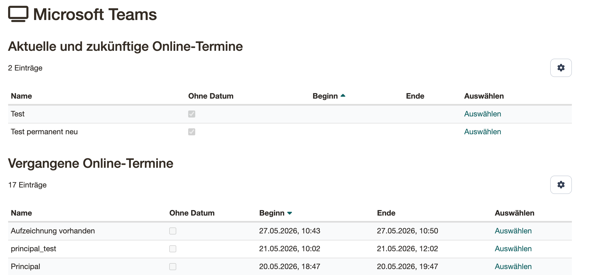
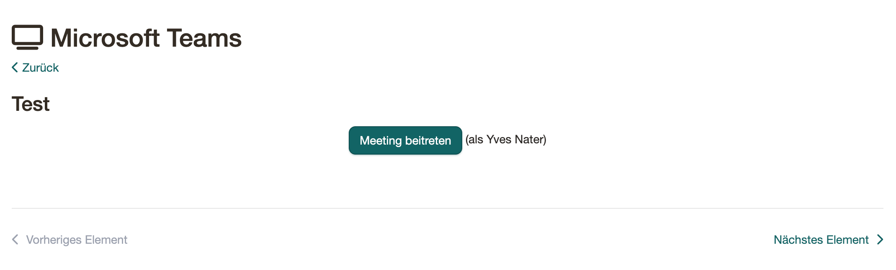

# Kursbaustein "Microsoft Teams" {: #microsoft_teams}

## Steckbrief

Name | Microsoft Teams
---------|----------
Icon | :o_icon_o_vc_icon:
Verfügbar seit | Release 15.4
Funktionsgruppe | Kommunikation und Kollaboration
Verwendungszweck | Integration der Webkonferenz-Software Microsoft Teams
Bewertbar | nein
Spezialität / Hinweis | Microsoft Teams ist eine kommerzielle Software. Um den Kursbaustein zu nutzen, ist eine separate Lizenz und ein Serverhosting erforderlich.

:octicons-device-camera-video-24: **Video-Einführung**: [Microsoft Teams](<https://www.youtube.com/embed/eyHOaF-ujuE>){:target="_blank"}

## Funktionen der Software  {: #software_functions}

Microsoft Teams ermöglicht virtuelle Räume für synchrone Meetings mit Webcam- und Audio-Unterstützung.

## Systemvoraussetzungen {: #system_requirements}

MS Teams kann sowohl als App als auch im MS Browser Edge verwendet werden.

!!! tip "Empfehlung"

    Für die vollständige Nutzung aller Funktionen, insbesondere der **Breakout-Räume**, wird die MS Teams **Desktop-App** auf Windows oder macOS empfohlen. Im Webbrowser sowie auf Linux, iOS und Android stehen nicht alle Funktionen zur Verfügung.

## Rollen in MS Teams {: #teams_roles}

In einem MS Teams Meeting gibt es drei Rollen:

| Rolle | Wer | Rechte |
|-------|-----|--------|
| **Organizer** | Automatisch die Person, die den Online-Termin zuerst startet, genau eine Person pro Meeting | Breakout-Räume erstellen, Meeting-Einstellungen, volle Kontrolle |
| **Presenter** | Alle Personen gemäss der Einstellung **Moderator:in** des Online-Termins (siehe [Moderator-Optionen im Detail](#moderator_options)) | Bildschirm teilen, Inhalte verwalten |
| **Attendee** | Alle übrigen Teilnehmenden | Zuhören und zuschauen |

!!! warning "Achtung: First-Joiner = Organizer"

    Die erste Person, die einen Online-Termin startet, erhält automatisch die Rolle **Organizer**, unabhängig von der Einstellung **Moderator:in** in OpenOlat. Diese Rolle kann nachträglich weder in OpenOlat noch in Microsoft Teams geändert oder neu vergeben werden.

    Bei **permanenten Reservierungen** mit wechselnden Betreuenden hat daher nur diejenige Person, die das Meeting zuerst gestartet hat, dauerhaft Zugriff auf erweiterte Funktionen wie Breakout-Räume. Soll eine andere Person als Organizer auftreten, muss ein neuer Online-Termin angelegt werden.

## Online-Termine anlegen bei geschlossenem Kurseditor [:octicons-tag-16:{ title="ab Release 15.4 (OO-5124)" }](https://track.frentix.com/issue/OO-5124) {: #closed_editor_configuration}

Damit Teilnehmende ein Microsoft Teams Meeting direkt aus dem Kurs betreten können, legen Besitzer:innen und Betreuer:innen des Kurses dafür Online-Termine an. Das geschieht im laufenden Kurs, nicht im Kurseditor: Kursbaustein "Microsoft Teams" öffnen, dann im Tab **Terminverwaltung** die Auswahl **Online-Termin hinzufügen** öffnen: 
`Kursbaustein "Microsoft Teams" > Terminverwaltung > Online-Termin hinzufügen`

### Varianten beim Anlegen von Online-Terminen {: #meeting_variants}

Die Auswahl **Online-Termin hinzufügen** bietet vier Varianten an:

  * **Online-Termin hinzufügen**: ein einzelner Online-Termin mit Beginn und Ende.
  * **Permanente Reservierung hinzufügen**: ein Online-Termin ohne Datum, der dauerhaft offen steht. Die Variante erscheint nur, wenn die System-Administration die Option [Online-Termine ohne Datum/permanent](../../manual_admin/administration/Teams_module.de.md#permanent_meetings) auf "Ein" belassen hat. "Ein" ist der Standard. [:octicons-tag-16:{ title="ab Release 21.1.0 (OO-9666)" }](https://track.frentix.com/issue/OO-9666)
  * **Täglich wiederkehrende Online-Termine hinzufügen**: ein Online-Termin pro Werktag, Montag bis Freitag, in einer gewählten Zeitspanne.
  * **Wöchentlich wiederkehrende Online-Termine hinzufügen**: ein Online-Termin pro Woche in einer gewählten Zeitspanne.

Jede Variante legt eigenständige Online-Termine an, bei wiederkehrenden Terminen einen je Datum. Im Tab **Terminverwaltung** öffnet der Link **Bearbeiten** jeden Online-Termin einzeln. Bei vergangenen Online-Terminen steht dort **Ansehen**.

## Online-Termin hinzufügen: Die Einstellungen im Detail {: #add_meeting}

### Konfiguration Online-Termin

  *  **Name**: Bezeichnung des Online-Termins. Pflichtfeld.
  *  **Erstellt durch**: Der Name der Person, die den Online-Termin anlegt, wird automatisch angezeigt.
  *  **Beschreibung**: Beschreibung des Online-Termins. Sie erscheint in der Detailansicht des Online-Termins, bevor Teilnehmende dem Meeting beitreten.
  *  **Hauptmoderator:in**: Hier kann der Name einer Person eingetragen werden. Vorbelegt ist der Name der Person, die den Online-Termin anlegt.
  *  **Gäste**: Das Kontrollkästchen **erlauben** lässt nicht angemeldete Personen am Meeting teilnehmen. Diese Option ist nur sichtbar, wenn der Kurs öffentlich zugänglich und der Gastzugang aktiviert ist.
  *  **Zugang externe Benutzer:innen**: Ein Meeting-Kennzeichen, ein eindeutiges Wort ohne Sonderzeichen. OpenOlat erzeugt daraus einen Link, den Sie mit externen Personen teilen, z. B. per E-Mail. Bleibt das Feld leer, ist der Zugang über den Link deaktiviert.
  *  **Raumbuchungen anzeigen**: Kalenderansicht zur Prüfung von belegten Online-Terminen.
  *  **Teilnehmer dürfen das Meeting eröffnen:** :octicons-tag-16:{ title="ab Release 15.4.1 (OO-5250)" } Teilnehmer mit einem Microsoft-Account der Institution dürfen das Meeting mit eingeschränkten Präsentationsberechtigungen eröffnen, ohne dass ein Betreuer anwesend sein muss.
  *  **Moderator:in**: Bestimmt, wer in MS Teams die Rolle **Presenter** erhält (siehe [Rollen in MS Teams](#teams_roles)). Pflichtfeld.

#### Moderator-Optionen im Detail {: #moderator_options}

| OO-Einstellung | Wer wird Presenter in Teams |
|---|---|
| **Rolle Betreuer:in / Besitzer:in** | Nur Kursbetreuer:innen und -besitzer:innen; alle anderen Teilnehmenden werden Attendees |
| **Organisation** | Alle Benutzer:innen der Azure-Organisation erhalten beim Beitritt automatisch die Rolle Presenter |
| **Alle** | Alle Teilnehmenden werden Presenter |

!!! info "Wichtig"

    Die Einstellungen eines Online-Termins lassen sich nur ändern, solange er noch nicht gestartet wurde. Danach zeigt das Formular die Einstellungen nur noch an. Sollen andere Moderator-Einstellungen gelten, muss ein neuer Online-Termin angelegt werden.

#### Bei Online-Terminen mit Datum

  *  **Beginn**: Datum und Uhrzeit, zu der der Online-Termin beginnt.
  *  **Vorlaufzeit (Min.)**: Zeit in Minuten vor dem Beginn, in der Besitzer:innen und Betreuer:innen den Online-Termin bereits starten und betreten können. Für Teilnehmende öffnet der Online-Termin erst zum Beginn.
  *  **Ende**: Datum und Uhrzeit, zu der der Online-Termin endet.
  *  **Nachlaufzeit (Min.)**: Nachlaufzeit, in der das Meeting für alle Personen verlängert werden kann.

!!! info "Wichtig"

    Bei täglich oder wöchentlich wiederkehrenden Online-Terminen legen Sie zusätzlich **Start wiederkehrendes Datum** und **Ende wiederkehrendes Datum** fest. Im nächsten Schritt listet der Assistent alle Termine dieser Zeitspanne auf. Dort lassen sich einzelne Termine löschen oder über **Online-Termin hinzufügen** ergänzen.

In der Konfiguration eines Online-Termins öffnet der Link **Raumbuchungen anzeigen** beim Anlegen und beim Bearbeiten eine Übersicht über alle gebuchten Microsoft Teams Online-Termine der Instanz. Das erleichtert es, zeitliche Engpässe bzw. eine starke Auslastung des Systems frühzeitig zu erkennen und gegebenenfalls einen anderen Termin zu wählen.

Im Tab **Online-Termine** öffnen Sie einen bestimmten Online-Termin.

## Breakout-Räume {: #breakout_rooms}

Breakout-Räume können ausschliesslich vom **Organizer** eines Meetings erstellt und verwaltet werden (siehe [Rollen in MS Teams](#teams_roles)).

**Unterstützte Plattformen:** Breakout-Räume stehen nur in der Teams Desktop-App unter Windows und macOS zur Verfügung: nicht im Webbrowser und nicht auf mobilen Geräten.

**Einschränkungen bei der Teilnehmerzuweisung:** Folgende Personen können Breakout-Räumen nicht zugewiesen werden:

  * Personen mit einem Teams-Free-Account
  * Personen auf nicht unterstützten Geräten (z.B. CVI-Konferenzgeräte)
  * Offline-Teilnehmende oder Personen mit veralteter Teams-Version

**Weitere Einschränkungen:** Breakout-Räume sind nicht verfügbar bei abgesagten oder gelöschten Meetings, in privaten oder geteilten Kanälen sowie bei entsprechenden Admin-Richtlinien.

**Kapazität:** Pro Meeting sind maximal 300 Teilnehmende möglich. Bei Überschreitung wird die Breakout-Funktion automatisch deaktiviert. Räume verfallen nach 60 Tagen Inaktivität.

## Anzeige im Kurskalender {: #calender_view}

Wer die Online-Termine des Kurses im Blick behalten will, findet sie im Kurskalender: OpenOlat trägt jeden Online-Termin mit Datum, der im Kursbaustein angelegt wird, automatisch dort ein. Der Kalendereintrag enthält einen Link, der direkt zum Online-Termin führt. Teilnehmende können den Kurskalender abonnieren.

!!! info "Wichtig"
    Im Kurskalender erscheinen nur Termine mit einem definierten Start- und Enddatum. Permanente Reservierungen ohne Datum werden im Kalender nicht angezeigt.

  :octicons-device-camera-video-24: **Video-Einführung**: [Abonnements](<https://www.youtube.com/embed/h9gOqt7TR7Q>){:target="_blank"}

## Sicht der Teilnehmenden {: #participant_perspective}

Ruft ein:e Teilnehmer:in den Kursbaustein auf, erscheinen zwei Listen: **Aktuelle und zukünftige Online-Termine** und **Vergangene Online-Termine**. Online-Termine ohne Datum sind in der Spalte **Ohne Datum** markiert und stehen immer in der ersten Liste. Ein Klick auf **Auswählen** öffnet die Detailansicht des jeweiligen Online-Termins.

{ class="shadow lightbox" title="Übersicht im Kursbaustein Microsoft Teams" }

Über **Meeting beitreten** öffnet sich das Meeting in Microsoft Teams in einem neuen Fenster. Solange noch niemand den Online-Termin gestartet hat, ist der Button für Teilnehmende nicht aktiv. Besitzer:innen und Betreuer:innen sehen an seiner Stelle **Online-Termin starten**. Ob Teilnehmende das Meeting auch ohne Betreuer:in eröffnen dürfen, hängt von der Konfiguration des Online-Termins ab (siehe oben).

{ class="shadow lightbox" title="Detailansicht eines Online-Termins" }

!!! warning "Achtung"

    Bei abgelaufenen Meetings ist der Beitritt nicht mehr möglich. Aufzeichnungen stehen in OpenOlat nicht zur Verfügung; Aufzeichnungen, die direkt in Microsoft Teams erstellt wurden, sind ausschliesslich über Microsoft Teams abrufbar.

## Bei Problemen {: #troubleshooting}

Bei anwendungsspezifischen Herausforderungen steht die Microsoft-Hilfe zur Verfügung:

[Microsoft-Hilfe: Problembehandlung in Microsoft Teams](https://support.microsoft.com/de-de/teams/platform/troubleshoot-in-microsoft-teams){:target="_blank"}

## Weiterführende Informationen {: #further_information}

**Auf dieser Seite erwähnt** 
[Modul Microsoft Teams >](../../manual_admin/administration/Teams_module.de.md) 
[Microsoft-Hilfe: Problembehandlung in Microsoft Teams](https://support.microsoft.com/de-de/teams/platform/troubleshoot-in-microsoft-teams){:target="_blank"}

**Weiterführend** 
[Virtuelle Klassenzimmer >](../basic_concepts/Virtual_classrooms.de.md) 
[Kursbaustein "Zoom" >](zoom/index.de.md) 
[Termine und Absenzen >](../basic_concepts/Events_and_Absences.de.md) 
[Gruppenwerkzeuge nutzen >](../groups/Using_Group_Tools.de.md)

**youtube** 
[Microsoft Teams](<https://www.youtube.com/embed/eyHOaF-ujuE>) 
[Abonnements](<https://www.youtube.com/embed/h9gOqt7TR7Q>)

[Zum Seitenanfang ^](#microsoft_teams)
