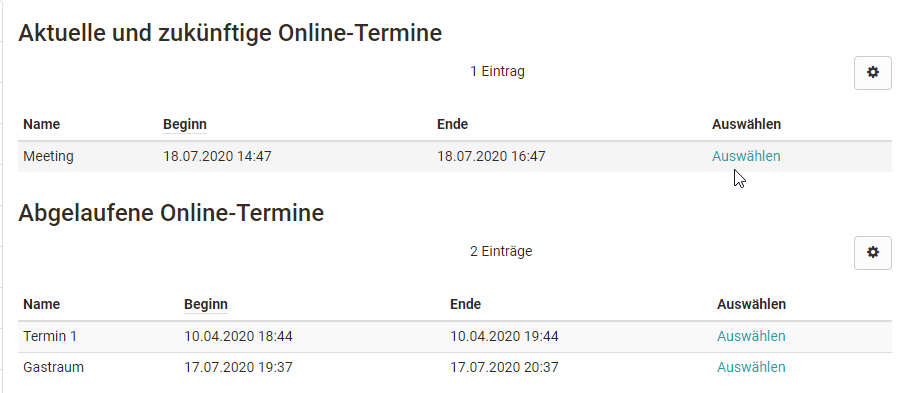

# Course Element "Microsoft Teams"

## Profile

Name | Microsoft Teams
---------|----------
Icon | { class=size24  }
Available since | 
Functional group | Communication und collaboration
Purpose | Integration of the Microsoft Teams web conferencing software 
Assessable | no
Specialty / Note | Microsoft Teams is commercial software. To use the course element, a separate license and server hosting is required.

## Software functions

Microsoft Teams enables virtual rooms for synchronous meetings with webcam and audio support.

## System requirements

MS Teams can be used both as an app and in the MS Edge browser.
  
## Configure room with closed course editor

In the course, course owners and tutors can add new meetings in the previously created course element Microsoft Teams in the "**Meeting management**" via "**Add online meeting**".

### The following variants are distinguished when creating online meetings:

* Add single online meeting
* Add permanent reservation
* Add daily recurring online meetings
* Add weekly recurring online meetings

The variants differ only in the creation of the dates. Separate online appointments/reservations are created, which can then be edited in the "**Meeting management**" tab via the "**Edit**" link.

## Add online meeting: The settings in detail

### Configuration Online Meeting

  *  **Name**: Appointment name
  *  **Created by**: The name of the creator is displayed automatically.
  *  **Description**: Appointment description. This information is displayed before the course participants enter the respective meeting room.
  *  **Main moderator**: Here, the name of a person csn be entered.
  *  **Access external user**: Enter a code/word here
  *  **Show room bookings**: Calendar view for checking busy online meetings
  *  **Participants may open the meeting**: If participants are allowed to open the meeting without a coach, there are no group rooms available
  *  **Participants may open the meeting**: Participants with a Microsoft account of the institution may open the meeting with limited permissions
  *  **Moderator**: Here you define which groups of people are moderators of the meeting.

#### **For scheduled rooms**:

  *  **Beginning**: Define the starting time for meetings
  *  **Lead time (Min.)**: Lead time in which the meeting can already be started by the course coaches and owners
  *  **End**: Ending time of the meeting - the maximum duration of a meeting depends on the selected room template
  *  **Follow-up time (Min.)**: Follow-up time in which the meeting can be extended for all persons. A display with the remaining conference time appears.

!!! info "Info"

    For daily or weekly recurring appointments, the start and end date must also be defined. Subsequently, all appointments for this period are displayed and individual appointments can still be deleted from the list or added.

In the configuration of a room, both during the creation as well as later when editing later when editing via the link "**Show room bookings**", an overview of all booked about all booked BigBlueButton rooms of the instance can be viewed. The makes it easier to identify time bottlenecks or a heavy workload on the system at an early stage system at an early stage and, if necessary, to select another date.

Via the tab "**Online appointments**" you get access to a specific appointment or room.

## Calendar display

In addition, the online appointments created in the course element will be automatically entered in the course-specific calendar and subscribed to by the participants. You can also quickly move from the calendar to the appointment-based space.

## Participant perspective

If a course participant calls up an MS Teams course element, they will see an overview of the current, the expired and the permanent rooms, if available. A click on "Select" leads to the login area of the respective room.

Current sessions can be started by clicking on "**Join meeting**" and the specific room can be accessed.

When meetings have expired, the rooms can no longer be accessed, but you get access to possible recordings of the meeting. Coaches and course owners can also delete records here.