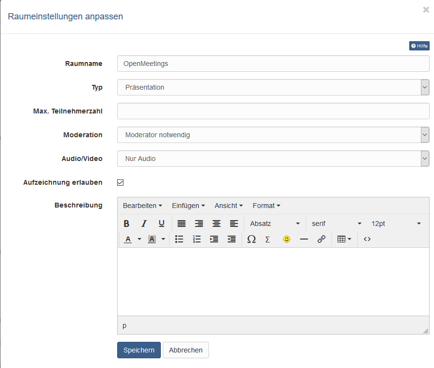
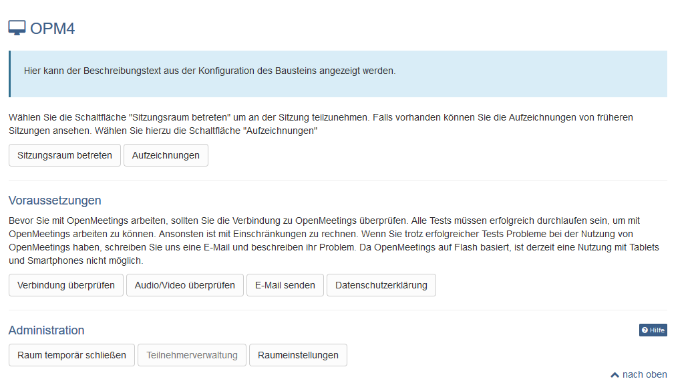

# Kursbaustein "OpenMeetings" {: #openmeetings}

## Steckbrief

Name | OpenMeetings
---------|----------
Icon | :o_icon_o_openmeetings_icon:
Verfügbar seit | Release 8.3.0 (OO-407)
Funktionsgruppe | Kommunikation und Kollaboration
Verwendungszweck | Integration der Webkonferenz-Software OpenMeetings
Bewertbar | nein
Spezialität / Hinweis | OpenMeetings ist eine OpenSource Software. Für die Nutzung in OpenOlat ist ein Serverhosting erforderlich (OpenSource Lizenz Apache 2.0).

## Tool Spezifisches {: #tool_specific}

OpenMeetings verfügt über drei verschiedene Raumtypen, die alle auch in
OpenOlat genutzt werden können:

  * Präsentationsräume (Webinar Räume)
  * Kooperationsräume (Konferenz Räume) und
  * Interviewräume

Je nach Raumwahl stehen unterschiedliche Funktionen zur Verfügung. Kooperationsräume stehen nicht nur in Kursen, sondern auch in Gruppen zur Verfügung. Jeder OpenOlat User kann somit ein eigenes Virtuelles Klassenzimmer für Gruppenarbeiten und Kooperationstreffen nutzen.  

!!! info "Wichtig"

    OpenOlat Kursbesitzer und Betreuer sind standardmässig OpenMeetings Moderatoren.

!!! note "Link zu weiteren Infos"

    Weitere Informationen zu aktuellen Features finden Sie unter der URL <http://incubator.apache.org/openmeetings>

## Konfiguration im Kurseditor {: #editor_configuration}

Nach dem Hinzufügen des Kursbausteins muss zunächst im Tab "Raum" ein OpenMeetings Raum angelegt und die Raumeinstellungen konfiguriert werden. Diese Einstellungen können später sowohl im Kurseditor als auch im Kursun angepasst werden.

{ class="shadow lightbox" }

Unter "Typ" kann der gewünschte Raumtyp gewählt werden. Die genauen Raum Bezeichnungen können je nach OpenMeetings Instanz variieren. Während sich Kooperations- und Präsentationsäume vorrangig darin unterscheiden, ob jeder User schon beim Betreten des Raums automatisch Audio/Videorechte erhält oder nicht, ist der Interviewraum anders aufgebaut als die anderen Räume.

* **Konferenzen** sind Kooperationsräume und eher für kleinere Benutzerzahlen gedacht bei denen alle Teilnehmer gleichberechtigt sind und alle Werkzeuge bedienen können. 

* Ein **Webinarraum** bzw. Präsentationsraum eignet sich, wenn es einen oder wenige Vortragende und viele Teilnehmende gibt bei denen die Audio- Funktion gar nicht oder erst im Nachhinein bereitgestellt werden soll. Auch für unerfahrene User ist ein Präsentationsraum die bessere Wahl. 

* Der **Interview Raum** ist ein Raum, der sich besonders für Videokonferenzen oder videobasierte Interviews anbietet.

Die Angabe einer **maximalen Teilnehmerzahl** limitiert die verfügbaren Plätze des Sitzungsraumes. Sind alle Plätze belegt, können keine neuen Teilnehmenden mehr den Raum betreten, solange bis eine Person den Raum wieder verlässt.

Unter "**Moderation**" kann definiert werden, ob ein Moderator erforderlich ist, bevor die Teilnehmer eines Raums weitere Rechte erhalten können. Wird die Option "**Ohne Moderation**" gewählt, erhält der erster User der den Raum betritt automatisch Moderationsrechte.

Unter "**Audio/Video**" legen Sie fest, ob im Raum nur Audio oder Audio und Video zur Verfügung steht. Mit der Option "**Aufzeichnung erlauben**" lässt sich die Sitzung als Film aufzeichnen; der Film wird nach der Sitzung automatisch bereitgestellt. Im Feld "**Beschreibung**" beschreiben Sie den Inhalt der Sitzung und das Zielpublikum.

## Konfiguration im Kursrun (geschlossener Editor) {: #course_run_configuration}

{ class="shadow lightbox" }

Über "**Sitzungsraum betreten**" gelangt man in den Meetingraum.

Liegen Aufzeichnungen vor, können diese über den Link "**Aufzeichnungen**" aufgerufen werden.

Über "**Raum temporär schliessen**" kann der Raum auch geschlossen werden, so dass ein Zugang nicht möglich ist.

Über den Link "**Teilnehmerverwaltung**" sieht man die Personen, die sich aktuell im Raum befinden und kann diese auch bei Bedarf auch entfernen. Über die Schaltfläche "**Raumeinstellungen**" passen Kursbesitzer und Betreuer die Raumeinstellungen auch im Kursrun an.

## Weiterführende Informationen {: #further_information}

**Auf dieser Seite erwähnt** 
[incubator.apache.org/openmeetings](http://incubator.apache.org/openmeetings)

[Zum Seitenanfang ^](#openmeetings)

