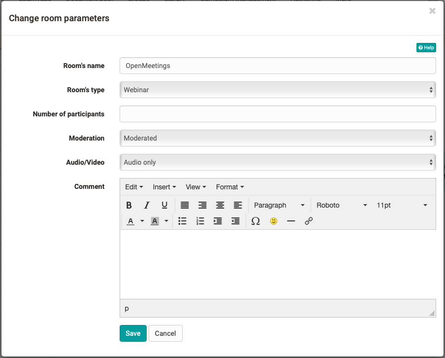

# Course Element "OpenMeetings"

## Profile

Name | OpenMeetings
---------|----------
Icon | { class=size24  }
Available since | 
Functional group | Communication und collaboration
Purpose | Integration of the OpenMeetings web conferencing software 
Assessable | no
Specialty / Note | OpenMeetings is an open source software. Server hosting is required for use in OpenOlat (Open source license Apache 2.0).

## Tool-specific

OpenMeetings has three different room types, all of which can also be used in
OpenOlat:

  * Presentation rooms (webinar rooms)
  * Cooperation rooms (conference rooms) and
  * Interview rooms

Different functions are available depending on the room selected. The special thing about OpenMeetings is that cooperation rooms are not only available in courses but also in groups. Every OpenOlat user can use his own virtual classroom for group work and cooperation meetings.

!!! info

    OpenOlat course owners and coaches are OpenMeetings moderators by default.  
  
!!! note "Link to further information"

    For more information about current features, see the URL <http://incubator.apache.org/openmeetings>  
  
## Configuration in the course editor

After adding the course element, you must first create an OpenMeetings room in the "Room" tab and configure the room settings. These settings can be adjusted later in the course editor as well as in the course unit.

The desired room type can be selected under "Room's type". The exact room designations can vary depending on the OpenMeetings instance.  While cooperation and presentation rooms differ primarily in whether each user automatically receives audio/video rights when entering the room or not, the interview room is structured differently from the other rooms.

* **Conferences** are cooperation rooms and are intended for smaller numbers of users where all participants have equal rights and can use all tools. 

* A **webinar room** or presentation room is suitable if there is one or a few speakers and many participants for whom the audio function should not be provided at all or only afterwards. A presentation room is also a better choice for inexperienced users.
  
* The **Interview Room** is a space that is particularly suitable for video conferencing or video-based interviews.

Specifying a **maximum number of participants** limits the available seats in the meeting room. Once all seats are occupied, no new users can enter the room until one person leaves.

Under "**Moderation**", you can define whether a moderator is required before the participants of a room can obtain further rights. If the option "**No moderation**" is selected, the first user who enters the room automatically receives moderation rights.  
  
## Configuration in the course run (closed editor)

Via "**Enter meeting room**" you enter the meeting room. 

If recordings are available, they can be accessed via the "**Recordings**" link. 

The room can also be closed via "**Temporarily close room**" so that access is not possible. 

Via the link "**Participant management**" you can see the persons who are currently in the room and can also remove them if required.

