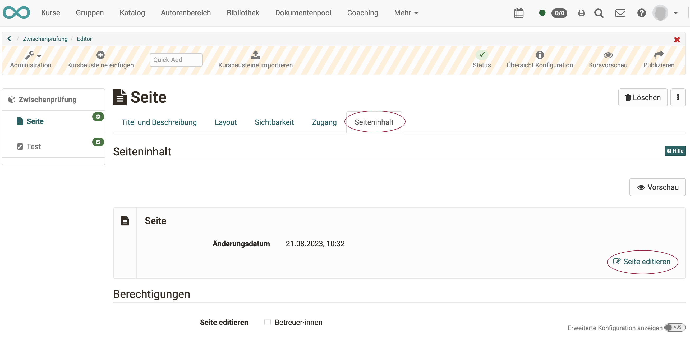
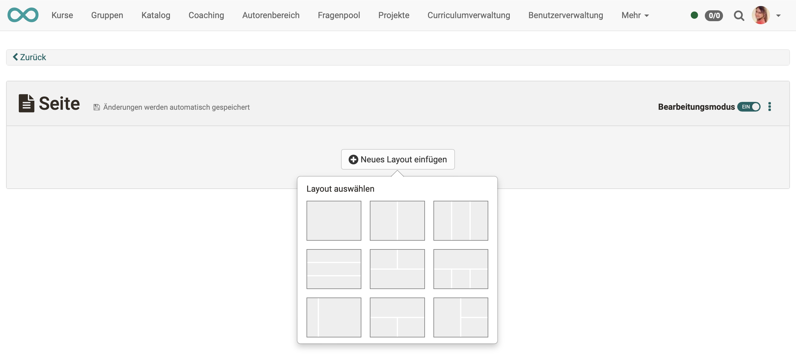
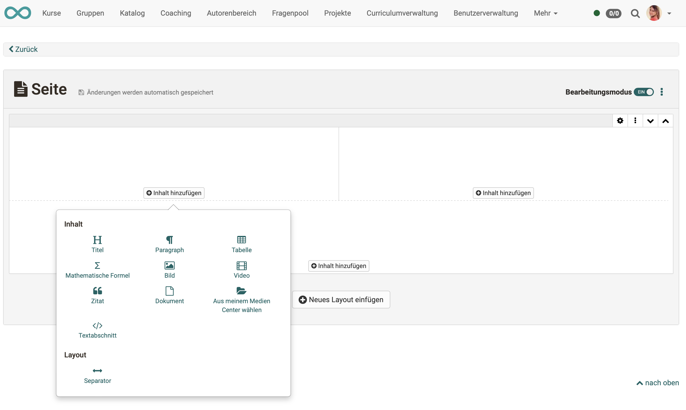
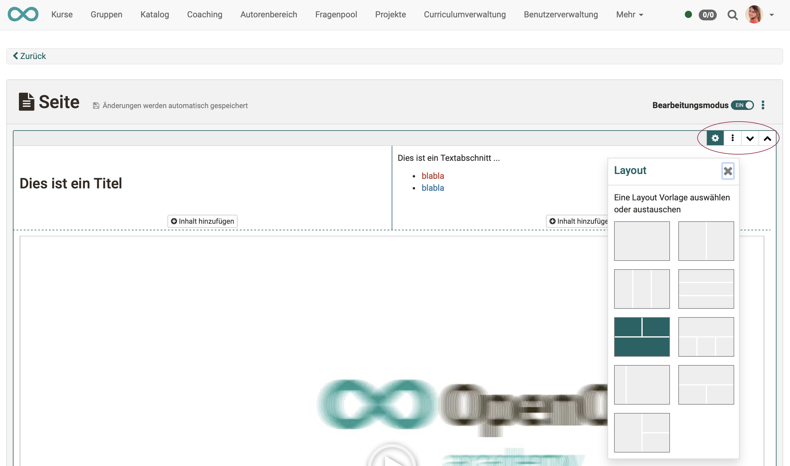
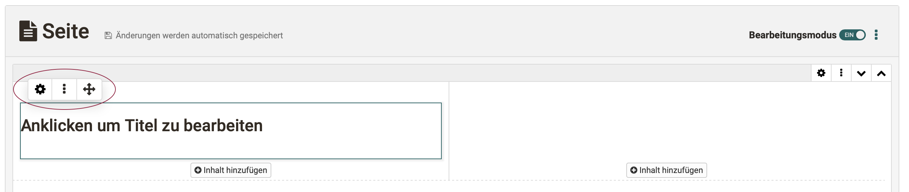

# Kursbaustein "Seite"

## Steckbrief

Name | Seite
---------|----------
Icon | { class=size24  }
Verfügbar seit | Release 18
Funktionsgruppe | Wissensvermittlung
Verwendungszweck | Darstellung verschiedener Inhalte in einem blockbasierten Layout
Bewertbar | nein
Spezialität / Hinweis | Die Bearbeitung in einem blockbasierten Editor wird neben dem Kursbaustein Seite auch in Formular-Lernressourcen und Portfolio-Einträgen verwendet.

## Beispiel

=== "Ansicht im Kurs"
    
    Es stehen verschiedene Layout-Varianten zur Auswahl, in denen die gewünschten Elemente wie z.B. Bilder, Texte, Tabellen und Videos flexibel platziert und so die gesamte Seite gestaltet werden kann. 

    { class="shadow lightbox" }

=== "Bearbeitungsmodus"

    Im Unterschied zum HTML-Editor (Kursbaustein "HTML-Seite") entspricht die Darstellung im blockbasierten Content Editor bereits weitgehend der Vorschau.

    { class="shadow lightbox" }

## Seiteninhalt erstellen

Im **Tab "Seiteninhalt"** rufen Sie den Editor auf.

{ class="shadow lightbox" }

Es öffnet sich der **Content Editor**. Fügen Sie zunächst ein neues Layout ein. (Es können weitere dieser Layouts ergänzt werden.)

{ class="shadow lightbox" }

In jedem Feld eines Layouts können ein oder mehrere **Inhaltselemente** hinzugefügt werden.

{ class="shadow lightbox" }

Es stehen folgende Inhaltselemente zur Verfügung:

* **Titel:** Titel verwenden die vordefinierten Grössen und Stile h1, h2, usw.
* **Paragraph:** Ein Text, der mit einem kleinen HTML-Editor gestaltet werden kann.
* **Tabelle:** Tabelle, die in einem zugehörigen Popup gestaltet werden kann.
* **Mathematische Formel:** Erstellung mathematischer Formeln mit dem Formeleditor MathJax.
* **Bild:** Einfügen eines Bildes aus dem Medien Center bzw. Upload.
* **Video:** Einfügen einer Videodatei aus dem Medien Center bzw. Upload oder neues Recording
* **Zitat:** Zitate können im Medien Center als eigenständige Inhaltselemente abgelegt und wiederverwendet werden.
* **Dokument:** Word-, Powerpoint- oder Excel-Dokumente können sowohl hochgeladen als auch direkt erstellt werden. PDF und andere können hochgeladen oder aus dem Medien Center übernommen werden.
* **Textabschnitt:** Ein Text, der mit einem HTML-Editor gestaltet werden kann. (Mit etwas mehr Optionen als im Inhaltselement Paragraph.)
* **Separator:** Eine Linie, mit der zwei Layouts optisch getrennt werden. 

## Seite editieren

### Layout editieren

Zum Editieren eines Layouts selektieren Sie das Layout. Es wird ein zugehöriger Rahmen angezeigt. Rechts oben werden Ihnen Icons mit Bearbeitungsoptionen angezeigt.

Ist ein Layout selektiert, kann die Anordnung der Inhalteselemente auch nachträglich noch geändert werden, indem das Zahnrad-Icon geklickt und eine andere Layout-Anordnung gewählt wird.

Vorhandene Inhaltselemente bleiben erhalten und können in neue Layout-Felder verschoben werden.

{ class="shadow lightbox" }

### Inhaltselemente editieren

Ein Inhaltselement kann geändert werden, indem man es per Mausklick selektiert und die Buttons links oben verwendet.

{ class="shadow lightbox" }

* **Zahnrad-Icon:** öffnet Popup mit Bearbeitungsoptionen
* **3 Punkte:** Löschen des aktuellen Elements, Einfügen weiterer Inhaltselemente 
* **Pfeilkreuz:** Verschieben innerhalb des Layouts (auch in andere Felder)

## Ablage der Medien

Zur Verwaltung und Freigabe der integrierten Medienelemente im Kurs steht das Medien Center zur Verfügung. 
Siehe [Medien Center](https://docs.openolat.org/de/manual_user/personal_menu/Media_Center/#dokument-hinzufugen).

Der Upload der Medien ins Medien Center erfolgt im persönlichen Menü oder im Content Editor bei der Erstellung eines neuen Inhaltselements.

## Unterschiede: Seite - HTML-Seite

|                        | KB Seite                       | KB HTML-Seite                  |
| -----------------------| ------------------------------ | ------------------------------ |
| Erstellung des Inhalts | im Content Editor              | im HTML-Editor                 |
| Gestaltung             | blockbasierter Ansatz          | HTML-Seite                     |
| Erstellungsaufwand     | geringer, da vorstrukturiert   | meistens höher                 |
| Vorschau               | direkt im Editor               | separater Tab "Anzeige Inhalt" |
| Medien                 | im Medien Center               | im Ablageordner                |
| Editieren kann Betreuer:innen erlaubt werden  | :material-check: | :material-check:      |
| erweiterte Berechtigungen                     | :material-check: | :material-cancel:     |
| Integration pdf        | :material-check:               | :material-check:               |
| Integration Office-Dokumente | :material-check:         | :material-cancel:              |
| Integration draw.io Diagramme        | :material-check: | :material-cancel:     |

!!! tip "Tipp"

    Sollen ausschliesslich Office-Dokumente eingebunden werden, können alternativ z.B. auch die Kursbausteine "Dokument" oder "Ordner" verwendet werden.

!!! info "Info"

    Die Seite kann von Kurs-Besitzer:innen oder optional auch von Betreuenden bearbeitet werden.

