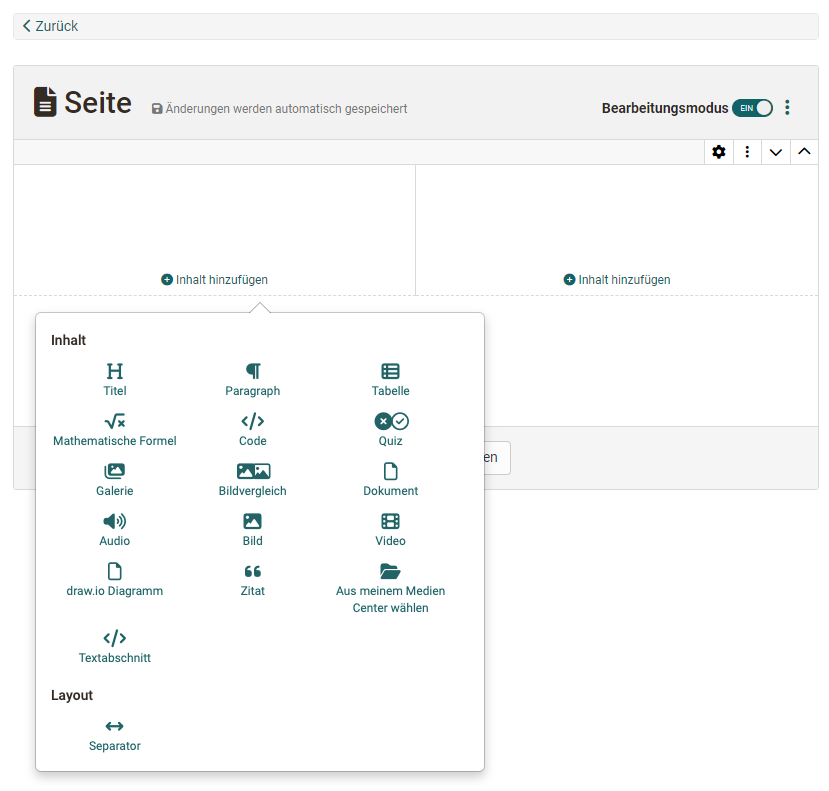

# Kursbaustein "Seite"

## Steckbrief

Name | Seite
---------|----------
Icon | { class=size24  }
Verfügbar seit | Release 18
Funktionsgruppe | Wissensvermittlung
Verwendungszweck | Darstellung verschiedener Inhalte in einem blockbasierten Layout
Bewertbar | nein
Spezialität / Hinweis | Die Bearbeitung in einem blockbasierten Editor wird neben dem Kursbaustein Seite auch in Formular-Lernressourcen und Portfolio-Einträgen verwendet.

## Beispiel

=== "Ansicht im Kurs"
    
    Es stehen verschiedene Layout-Varianten zur Auswahl, in denen die gewünschten Elemente wie z.B. Bilder, Texte, Tabellen und Videos flexibel platziert und so die gesamte Seite gestaltet werden kann.

    [Kursbaustein Seite im Kurs](assets/KB_Seite.png){ class="shadow lightbox" } 

=== "Bearbeitungsmodus"

    Im Unterschied zum HTML-Editor (Kursbaustein "HTML-Seite") entspricht die Darstellung im blockbasierten Content Editor bereits weitgehend der Vorschau.
    
    [Kursbaustein Seite im Bearbeitungsmodus](assets/KB_Seite_Bearbeitungsmodus.jpg){ class="shadow lightbox" } 

## Seiteninhalt erstellen

Der Kursbaustein Seite wird im Kurseditor hinzugefügt und in den Tabs konfiguriert. Im **Tab "Seiteninhalt"** rufen Sie den Editor auf.

{ class="shadow lightbox" }

Es öffnet sich der **Content Editor**. Fügen Sie zunächst ein neues Layout ein. (Es können weitere dieser Layouts ergänzt werden.)

{ class="shadow lightbox" }

In jedem Feld eines Layouts können ein oder mehrere **Inhaltselemente** hinzugefügt werden.

{ class="shadow lightbox" }

Es stehen folgende Inhaltselemente zur Verfügung:

* **Titel:** Titel verwenden die vordefinierten Grössen und Stile h1, h2, usw.
* **Paragraph:** Ein Text, der mit einem kleinen HTML-Editor gestaltet werden kann.
* **Tabelle:** Tabelle, die in einem zugehörigen Popup gestaltet werden kann.
* **Mathematische Formel:** Erstellung mathematischer Formeln mit dem Formeleditor MathJax.
* **Code:** Darstellung von Programmiercode ohne Ausführung.  
30 versch. Programmiersprachen ab :octicons-tag-24: Release 18.2.
{ class="shadow lightbox" } 
* **Dokument:** Word-, PowerPoint- oder Excel-Dokumente können sowohl hochgeladen als auch direkt erstellt werden. PDF und andere können hochgeladen oder aus dem Media Center übernommen werden.
* **Audio:** Audio auswählen, neu aufnehmen oder als MP3 oder m4a Datei hinzufügen. Ab :octicons-tag-24: Release 18.2. 
* **Bild:** Einfügen eines Bildes aus dem Media Center bzw. Upload.
* **Bildergalerie:** Darstellung mehrerer Bilder als Slideshow, in einem Raster oder mit kleinen Vorschaubildern. Ab :octicons-tag-24: Release 19. 
* **Bildervergleich:** Zwei übereinander liegende Bilder können durch einen Schieberegler überblendet werden. Ab :octicons-tag-24: Release 19. 
* **Video:** Einfügen einer Videodatei aus dem Media Center bzw. Upload oder neues Recording
* **draw.io Diagramm:** Neu erstellen oder aus der Liste auswählen. Ab :octicons-tag-24: Release 18.2. 
* **Zitat:** Zitate können im Media Center als eigenständige Inhaltselemente abgelegt und wiederverwendet werden.
* **Aus meinem Media Center** Zugriff auf alle Elemente des eigenen Media Centers. Auch können neue Elemente für das Media Center erstellt werden. 
* **Textabschnitt:** Ein Text, der mit einem HTML-Editor gestaltet werden kann. (Mit etwas mehr Optionen als im Inhaltselement Paragraph.)
* **Separator:** Eine Linie, mit der zwei Layouts optisch getrennt werden. 

## Seite editieren (Bearbeitungsmodus)

### Layout editieren

Zum Editieren eines Layouts selektieren Sie das Layout. Es wird ein zugehöriger Rahmen angezeigt. Rechts oben werden Ihnen Icons mit Bearbeitungsoptionen angezeigt.

Ist ein Layout selektiert, kann die Anordnung der Inhaltselemente auch nachträglich noch geändert werden, indem das Zahnrad-Icon geklickt und eine andere Layout-Anordnung gewählt wird.

Vorhandene Inhaltselemente bleiben erhalten und können in neue Layout-Felder verschoben werden.

{ class="shadow lightbox" }

### Inhaltselemente editieren

Ein Inhaltselement kann geändert werden, indem man es per Mausklick selektiert und die Buttons links oben verwendet.

{ class="shadow lightbox" }

* **Zahnrad-Icon:** öffnet Popup mit Bearbeitungsoptionen
* **3 Punkte:** Löschen des aktuellen Elements, Einfügen weiterer Inhaltselemente 
* **Pfeilkreuz:** Verschieben innerhalb des Layouts (auch in andere Felder)

## Ablage der Medien

Die Ablage der eingefügten Medien erfolgt nicht wie bei dem [Kursbaustein "HTML-Seite"](../learningresources/Course_Element_HTML_Page.de.md) im [Ablageordner](../learningresources//Storage_folder.de.md) des Kurses sondern im [Media Center](../personal_menu/Media_Center.de.md). Hier finden Sie alle eingebauten Medien wieder und können dort auch die weitere Verwaltung und Freigabe regeln. 

Der Upload der Medien ins Media Center erfolgt im persönlichen Menü oder im Content Editor bei der Erstellung eines neuen Inhaltselements.

## Unterschiede: Seite - HTML-Seite

|                        | KB Seite                       | KB HTML-Seite                  |
| -----------------------| ------------------------------ | ------------------------------ |
| Erstellung des Inhalts | im Content Editor              | im HTML-Editor                 |
| Gestaltung             | blockbasierter Ansatz          | HTML-Seite                     |
| Erstellungsaufwand     | geringer, da vorstrukturiert   | teilweise höher                 |
| Vorschau               | direkt im Editor               | separater Tab "Anzeige Inhalt" |
| Medien                 | im Media Center               | im Ablageordner                |
| Editieren kann Betreuenden erlaubt werden  | :material-check: | :material-check:      |
| erweiterte Berechtigungen                     | :material-check: | :material-cancel:     |
| Integration pdf        | :material-check:               | :material-check:               |
| Integration Office-Dokumente | :material-check:         | :material-cancel:              |
| Integration draw.io Diagramme        | :material-check: | :material-cancel:     |

!!! tip "Tipp"

    Sollen ausschliesslich Office-Dokumente eingebunden werden, können alternativ z.B. auch die Kursbausteine "Dokument" oder "Ordner" verwendet werden.

!!! info "Info"

    Die Seite kann von Kurs-Besitzer:innen oder optional auch von Betreuenden bearbeitet werden.

