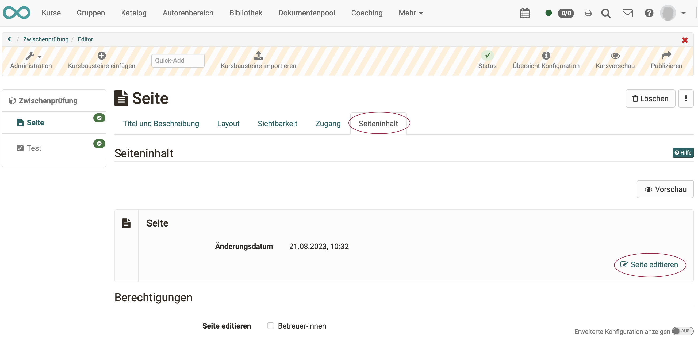
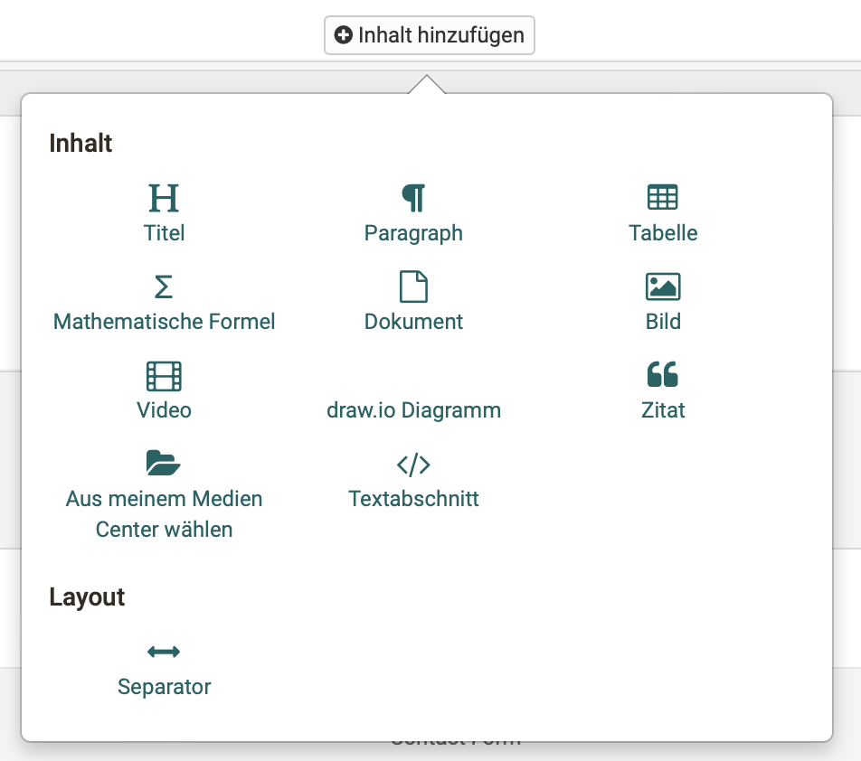

# Page

## Profile

Name | Page
---------|----------
Icon | { class=size24 }
Available since | Release 18
Functional group | Knowledge Transfer
Purpose | Display of different content in a block-based layout
Assessable | no
Specialty / Note | 

Der Kursbaustein "Seite" bietet neben der "HTML-Seite" (ehemals "Einzelseite") eine weitere Möglichkeit, auf einfache Art Inhalte in Kursen aufzubereiten und bereitzustellen.

 Es stehen verschiedene Layout-Varianten zur Auswahl, in denen die gewünschten Elemente wie z.B. Bilder, Texte, Tabellen und Videos flexibel platziert und so die gesamte Seite gestaltet werden kann. Die Seite kann von Kurs-Besitzer:innen oder optional von Betreuenden bearbeitet werden.

## Unterschiede: Seite - HTML-Seite

|                        | KB Seite                       | KB HTML-Seite                  |
| -----------------------| ------------------------------ | ------------------------------ |
| Erstellung des Inhalts | im Content Editor              | im HTML-Editor                 |
| Gestaltung             | blockbasierter Ansatz          | HTML-Seite                     |
| Erstellungsaufwand     | geringer, da vorstrukturiert   | meistens höher                 |
| Vorschau               | direkt im Editor               | separater Tab "Anzeige Inhalt" |
| Medien                 | im Medien Center               | im Ablageordner                |
| Editieren kann Betreuer:innen erlaubt werden  | :material-check: | :material-check:      |
| erweiterte Berechtigungen                     | :material-check: | :material-cancel:     |
| Integration pdf        | :material-check:               | :material-check:               |
| Integration Office-Dokumente | :material-check:         | :material-cancel:              |
| Integration draw.io Diagramme        | :material-check: | :material-cancel:     |

## Tab Seiteninhalt

Im Tab "Seiteninhalt" rufen Sie den Editor auf.

{ class="shadow lightbox" }

Im Unterschied zum HTML-Editor (Kursbaustein "HTML-Seite") entspricht die Darstellung im blockbasierten Content Editor bereits weitgehend der Vorschau.

=== "Bearbeitungsmodus"

    { class="shadow lightbox" }

=== "Ansicht im Kurs"

    { class="shadow lightbox" }

## Seite editieren

Zur Erstellung der Inhalte werden im Content Editor die verschiedenen Objekte eingefügt.

{ class="shadow lightbox" }

!!! note "Hinweis"

    Word-, Powerpoint- oder Excel-Dokumente können sowohl hochgeladen als auch direkt erstellt werden. 

!!! tip "Tipp"

    Sollen ausschliesslich Office-Dokumente eingebunden werden, können alternativ z.B. auch die Kursbausteine "Dokument" oder "Ordner" verwendet werden.

!!! info "Info"

    Der blockbasierte Ansatz wird bereits für die Erstellung von Formular-Lernressourcen und Portfolio-Einträgen verwendet.

## Ablage der Medien

Zur Verwaltung und Freigabe der integrierten Medienelemente im Kurs steht das Medien Center zur Verfügung.

Siehe [Medien Center](https://docs.openolat.org/de/manual_user/personal_menu/Media_Center/#dokument-hinzufugen).

Der Upload der Medien ins Medien Center erfolgt im persönlichen Menü.

