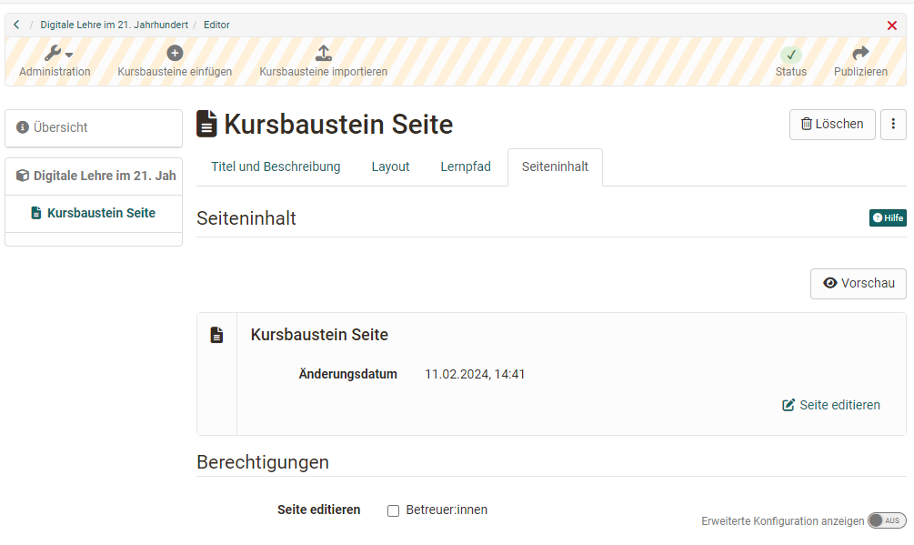

# Course Element "Page"

## Profile

Name | Page
---------|----------
Icon | { class=size24 }
Available since | Release 18
Functional group | Knowledge Transfer
Purpose | Display of different content in a block-based layout
Assessable | no
Specialty / Note | Editing in a block-based editor is used in form learning resources and portfolio entries in addition to the course element page.

## Example

=== "Course view"
    
    There are different layout variants to choose from, in which the desired elements such as images, texts, tables and videos can be flexibly placed and thus the entire page can be designed.

    { class="shadow lightbox" }

=== "Edit mode"

    In contrast to the HTML editor (course element "HTML page"), the display in the block-based content editor already largely corresponds to the preview.

    { class="shadow lightbox" }

## Create page content

The course element page is added in the course editor and configured in the tabs.
Open the editor in **tab "Page content"** .

{ class="shadow lightbox" }

The **Content Editor** will open. First, add a new layout. (More of these layouts can be added).

{ class="shadow lightbox" }

One or more **content elements** can be added in each field of a layout.

{ class="shadow lightbox" }

The following content elements are available:

* **Titel:** Titles use the predefined sizes and styles h1, h2, etc.
* **Paragraph:** A text that can be designed with a small HTML editor.
* **Table:** Table, which can be designed in an associated popup.
* **Mathematical formula:** Creating mathematical formulas with the MathJax formula editor.
* **Code:** Display of programming code without execution.  
30 different programming languages, since :octicons-tag-24: release 18.2.
{ class="shadow lightbox" } 
* **Document:** Word, PowerPoint or Excel documents can be uploaded as well as created directly. PDF and others can be uploaded or taken from the Media Center.
* **Audio:** Select audio, re-record or add as MP3 or m4a file. Since :octicons-tag-24: release 18.2. 
* **Image:** Inserting an image from the Media Center or uploading.
* **Video:** Inserting a video file from the Media Center or uploading or new recording
* **draw.io graph:** Create new or select from the list. Since :octicons-tag-24: release 18.2. 
* **Citations:** Citations can be stored and reused as standalone content items in the Media Center.
* **From my Media Center:** Access to all elements of your own Media Center. New elements can also be created for the Media Center.
* **Text segment:** A text that can be designed with an HTML editor. (With slightly more options than in the Paragraph content element).
* **Separator:** A line used to visually separate two layouts. 

## Edit page (Edit mode)

### Edit layout

To edit a layout, select the layout. An associated frame is displayed. In the upper right corner you will see icons with editing options.

Once a layout is selected, the arrangement of the content elements can also be changed later by clicking the gear icon and selecting a different layout arrangement.

Existing content elements are preserved and can be moved to new layout fields.

{ class="shadow lightbox" }

### Edit content elements

A content element can be changed by selecting it with a mouse click and using the buttons in the upper left corner.

{ class="shadow lightbox" }

* **Cogwheel-Icon:** opens popup with editing options
* **3 Points:** Deleting the current element, inserting additional content elements
* **Arrow cross:** Move within the layout (also to other fields)

## Media storage

The inserted media is not stored as with the [course element "HTML page"](../learningresources/Course_Element_HTML_Page.md) in the [storage folder](../learningresources//Storage_folder.md) of the course but in the [Media Center](../personal_menu/Media_Center.md). Here you will find all installed media and can also regulate further management and release. 

Uploading media to the Media Center is done in the personal menu or in the Content Editor when creating a new content item.

## Differences: Page - HTML-Page

|                        | Course Element Page                       | Course Element HTML Page                  |
| -----------------------| ------------------------------ | ------------------------------ |
| Content creation | in Content Editor              | in HTML Editor                 |
| Layout             | block-based approach          | HTML Page                     |
| Creation effort     | lower, since pre-structured   | possibly higher                 |
| Preview               | directly in editor               |  separate tab "Display content" |
| Media                 | in Media Center               | in storage folder                |
| Editing can be allowed to coaches | :material-check: | :material-check:      |
| Extended authorizations                    | :material-check: | :material-cancel:     |
| Integration pdf        | :material-check:               | :material-check:               |
| Integration Office-Documents | :material-check:         | :material-cancel:              |
| Integration draw.io Diagrams        | :material-check: | :material-cancel:     |

!!! tip "Hint"

    If only Office documents are to be included, the course elements "Document" or "Folder" can be used as an alternative.

!!! info "Info"

    The page can be edited by course owners or optionally by coaches.

