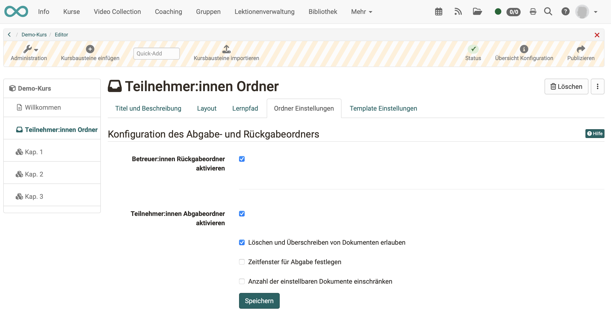
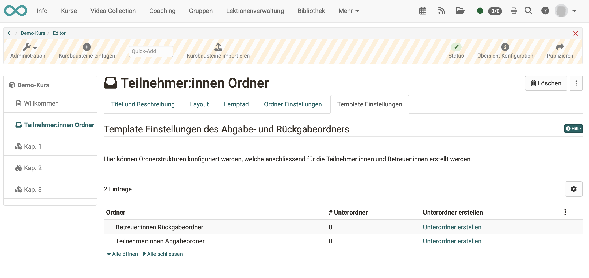

# Kursbaustein "Teilnehmer:innen Ordner" {: #participant_folder}

## Steckbrief

Name | Teilnehmer:innen Ordner
---------|----------
Icon | :o_icon_o_pf_icon:
Verfügbar seit | aktualisiert in Release 18.0
Funktionsgruppe | Kommunikation und Kollaboration
Verwendungszweck | Dateiaustausch zwischen Teilnehmenden und Betreuenden (je Teilnehmer:in ein Abgabeordner und ein Rückgabeordner)
Bewertbar | ja
Spezialität / Hinweis |

Der Kursbaustein "Teilnehmer:innen Ordner" ermöglicht einen Dateiaustausch zwischen einzelnen Teilnehmenden und Betreuenden. Dafür stehen zwei Ordner zur Verfügung. Zum einen ist dies der "Teilnehmer:innen Abgabeordner", über den Teilnehmende Dateien an Betreuer:innen abgeben können. Zum anderen der "Betreuer:innen Rückgabeordner", in welchem die Betreuer:innen Dateien an alle Teilnehmer:innen gleichzeitig oder individuell zurückgeben können. Im Prinzip verbergen sich hinter diesem Kursbaustein zwei (Kursbaustein-) Ordner einmal mit Schreibberechtigung und einmal ohne, die jedoch nur für Betreuende und einen/eine einzelne(n) Teilnehmer:in sichtbar sind.

Sofern von dem/der Administrator:in ein entsprechender Dokumenteneditor aktiviert wurde, ist auch die Erstellung von unterschiedlichen Dateiformaten wie Word, Excel oder PowerPoint Dateien direkt in OpenOlat möglich. Jeder/jede Kursteilnehmer:in sieht hier nur den eigenen individuellen Ordner. Einreichungen von anderen Lernenden sind im Teilnehmer:innen Ordner, im Gegensatz zum Kursbaustein "Ordner", nicht sichtbar.

Der Kursbaustein Teilnehmer:innen Ordner kann im Bewertungswerkzeug auch in die Bewertung mit einbezogen werden.

!!! info "Hinweis"

    Eine ähnliche Konfiguration der Abgabe von Dateien + Dateirückgabe durch Betreuer:innen kann auch mit dem Kursbaustein ["Aufgabe"](Course_Element_Task.de.md) umgesetzt werden, nur dass die Möglichkeiten des Aufgabenbausteins deutlich umfangreicher und komplexer sind.

## Tab "Ordner Einstellungen"

Im Tab "Ordner Einstellungen" im Kurseditor können Konfigurationen zum Abgabe- und Rückgabeordner vorgenommen werden. Standardmässig sind beide Ordner aktiviert und das Löschen und Überschreiben von Dateien ist den Teilnehmenden gestattet.

{ class="shadow lightbox" }

Ist der Teilnehmer:innen Abgabeordner aktiviert, können die Teilnehmenden Dateien hochladen oder direkt in OpenOlat erstellen. Wurden von dem/der Administrator:in der OpenOlat Instanz weitere Dokumenteneditoren aktiviert, ist auch die Erstellung von weiteren Dateiformaten wie Word, Excel oder PowerPoint Dateien möglich.

Für den Teilnehmer:innen Abgabeordner können auch weitere Konfigurationen vorgenommen werden. So können das Löschen und Überschreiben deaktiviert werden. Dies bedeutet, dass die Teilnehmenden keine Dokumente mehr löschen können, sobald sie diese hochgeladen bzw. erstellt haben. Alle Dokumente bleiben zwingend im Abgabeordner. Weiter kann ein Zeitfenster für die Abgabe festgelegt werden. Die Abgabe ist nur in diesem Zeitraum möglich. Ausserhalb des Zeitraumes können Dokumente nur heruntergeladen werden.

Zudem kann die Anzahl Dokumente, welche abgegeben werden können, eingeschränkt werden. Sobald diese Zahl erreicht ist, stehen keine Schreibwerkzeuge mehr zur Verfügung. Das heisst, die Dokumente können nicht mehr verschoben, kopiert, gezippt oder entzippt werden. Sie können jedoch weiterhin gelöscht werden. Falls gewünscht kann auch nur der Abgabe- oder nur der Rückgabeordner aktiviert werden.

!!! warning "Achtung"

    Für den Teilnehmer:innen Ordner existiert wie für alle Upload Bereiche eine Speicherbegrenzung. Die von der/dem Administrator:in eingestellten Begrenzungen für den Upload der Datei und die Begrenzung des gesamten Ordners werden angezeigt, wenn man versucht, eine Datei hochzuladen.

Eine ähnliche Konfiguration der Abgabe von Dateien und Dateirückgabe durch Betreuer:innen kann auch mit dem Kursbaustein ["Aufgabe"](Course_Element_Task.de.md) umgesetzt werden, nur dass die Möglichkeiten des Aufgabenbausteins deutlich umfassender und komplexer sind.

## Tab "Template Einstellungen"

Im Tab "Template Einstellungen" können sowohl für den Abgabe- als auch den Rückgabeordner Unterordner angelegt und so eine durchgehende Ordner-Struktur für alle Teilnehmenden angelegt werden. Zum Beispiel könnte ein Rückgabeordner einen Unterordner für inhaltliche Feedbacks und einen für ergänzende Dateien umfassen, oder ein Abgabeordner könnte eine gewisse gewünschte Struktur für die Abgaben widerspiegeln.

{ class="shadow lightbox" }

!!! warning "Achtung"

    Die hier angelegten Unterordner können später nicht umbenannt werden. Lediglich ein Löschen und Neuanlegen ist möglich. Im Kursrun werden beim Versuch diese Unterordner umzubenennen Kopien der Unterordner mit neuem Namen erstellt.

## Tab "Badges"
Wurde von dem/der Kursbesitzer:in unter `Kurs > Administration > Einstellungen > Tab "Bewertung" > Abschnitt "Badges"` die Vergabe von Badges aktiviert, wird im Kurseditor zu diesem Kursbaustein der Tab "Badges" angezeigt und es kann ein spezifischer Badge für diesen Kursbaustein erstellt werden.

## Weiterführende Informationen {: #further_information}

[Kursbaustein "Aufgabe" >](Course_Element_Task.de.md) 

[Zum Seitenanfang ^](#participant_folder)
