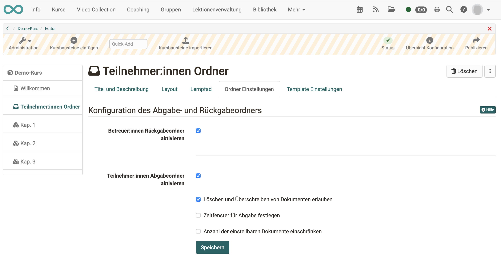
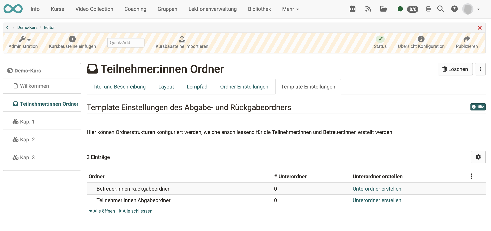

#  Course Element "Participant folder" {: #participant_folder}

## Profile

Name | Participant Folder
---------|----------
Icon | { class=size24 }
Available since | updated in release 18.0
Functional group | Communication and collaboration
Purpose | File exchange between participants and coaches (per participant a drop box and a return box)
Assessable | yes
Specialty / Note |

The course element "Participant folder" allows you to exchange files between participants and coaches. With the creation of the course element there are two folders available. On one side this is the drop box where participants can upload files for the coaches. On the other side it is the return box where coaches can upload files for all participants together or individually. In principle, this course element hides two (course element) folders, one with write permission and one without, which, however, are only visible to coaches and a single participant. 

Provided that a corresponding document editor has been activated by the administrator, it is also possible to create different file formats such as Word, Excel or PowerPoint files directly in OpenOlat. Each course participant can only see his/her own individual folder. Submissions from other learners are not visible in the participant's folder, in contrast to the course element "Folder".

The course element Participant Folder can also be included in the assessment in the assessment tool.

!!! info

    A similar configuration of file delivery + file return by coaches can also be implemented with the course element ["Task"](Course_Element_Task.md), only that the possibilities of the task element are much more comprehensive and complex and here also an evaluation or allocation of points can be made.

## Folder settings
In the Folder settings configurations for the drop box and the return box can be made. By default both folders are enabled and delete and override is enabled for the participants.

{ class="shadow lightbox" }

If the participant submission folder is activated, participants can upload files or create them directly in OpenOlat. If other document editors have been activated by the administrator of the OpenOlat instance, it is also possible to create other file formats such as Word, Excel or PowerPoint files.

Further configurations can also be made for the participant submission folder. For example, deletion and overwriting can be deactivated. This means that participants can no longer delete documents once they have uploaded or created them.  Uploaded files stay in the drop box coercively. Further, a time interval can be defined. The upload in the drop box is only possible in this time frame. Out of this time frame files can only be downloaded. If the participant's folder is activated, the participants can upload files or create them directly in OpenOlat. If the administrator of the OpenOlat instance has activated further document editors, it is also possible to create further file formats such as Word, Excel or PowerPoint files.

Additionally the number of files can be limited. As soon as this number is reached no writing tools are available anymore. This means that uploaded files cannot be moved, copied, zipped or unzipped anymore. But they can be deleted, if this option is enabled. If desired only the drop box or only the return box can be enabled.

!!! warning "Attention"

    As for all upload areas, there is a memory limit for the participant folder. The file upload limits set by the administrator and the entire folder limit are displayed when you try to upload a file.

A similar configuration of file submission and file return by coaches can also be implemented with the course element ["Task"](Course_Element_Task.md), except that the possibilities of the task element are much more comprehensive and complex.

## Tab Template Einstellungen

In the Template Settings tab, subfolders can be created for both the submission folder and the return folder, creating a continuous folder structure for all participants. For example, a return folder could include a subfolder for content feedback and one for supplemental files, or a submission folder could reflect some desired structure for the submissions. 

{ class="shadow lightbox" }

!!! warning 

    The subfolders created here cannot be renamed later. Only a deletion and a new creation is possible. In the course run, when you try to rename these subfolders, copies of the subfolders with new names will be created.
