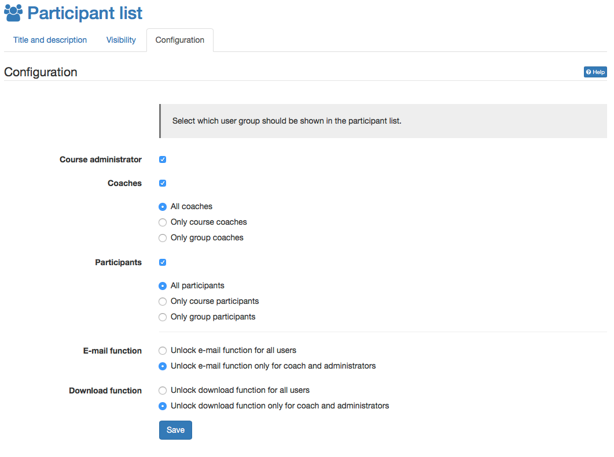

#  Course Element "Participant list" {: #participant_list}

## Profile

Name | Participant list
---------|----------
Icon | { class=size24 }
Available since | 
Functional group | Communication and collaboration
Purpose | List of all course participants, grouped by roles
Assessable | no
Specialty / Note |

In the participant list, the members of the course can be made visible to everyone. Unlike the [Member management](../learningresources/Members_management.md) course tool, which is only visible for course owners, the course element "Participant list" provides a list of all course members to those OpenOlat users allowed to open the respective course.

Members are listed depending on their role within the course as either "Course administrator", "Coach" or "Participant". Select the user groups to be displayed to course users.

{ class="shadow" }

The list of participants also gives access to the business card of the displayed persons. Depending on what information the OpenOlat members have stored there, it is available and contact can also be made via synchronous chat. If the configuration allows it, you can send e-mails to all or selected participants or download or print the entire list of participants.

By linking to the OpenOlat business card as well as the possibility to write an OpenOlat mail from within the course element to any desired member of the course, this course element allows to contact further course participants easily and without any problems. In the course editor you can define whether the e-mail function should be available for all participants or only for owners and coaches. Mails to single or multiple persons (groups) are sent via the button "Send e-mail" in the course view. External mail addresses can also be added in the form as needed.

The course view also offers, apart from the mail function, the online instant messaging status of listed course participants. A click on the status icon opens the chat window.

Finally it can be defined, who is allowed to download the participant list as Excel or to print it. Again it is differentiated between coach and owner or all users.

!!! info 

    A similar function is available in the toolbar with the "List of participants" tool. However, no further configurations can be made here.   

