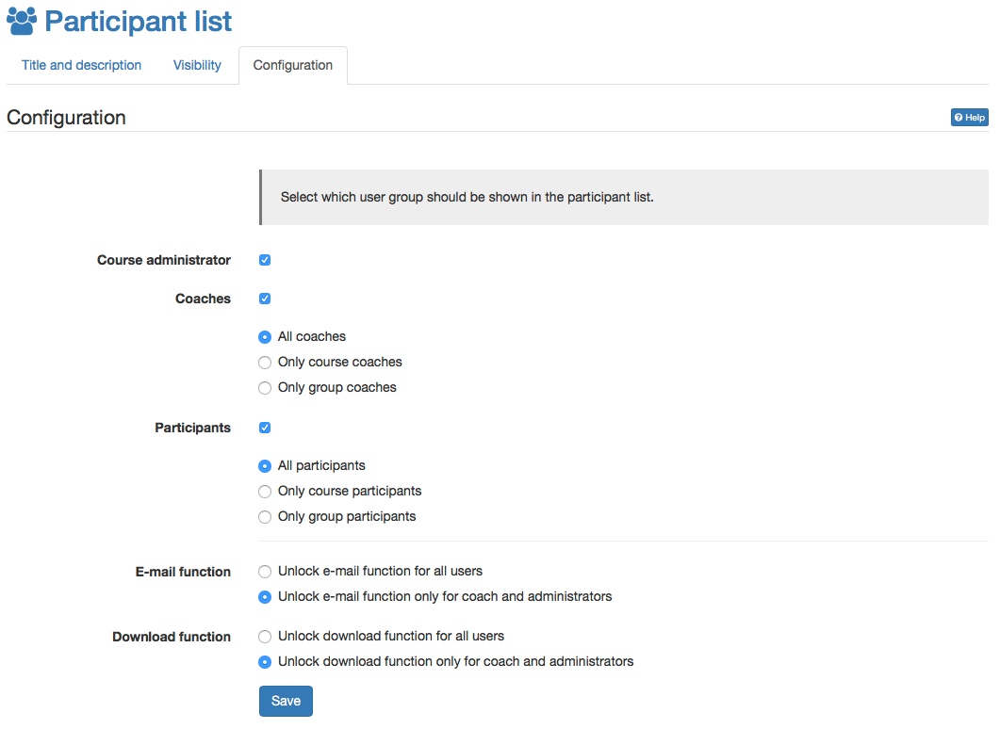

#  Course Element "Participant list" {: #participant_list}

## Profile

Name | Participant list
---------|----------
Icon | :o_icon_o_cmembers_icon:
Available since | 
Functional group | Communication and collaboration
Purpose | List of all course participants, grouped by roles
Assessable | no
Specialty / Note |

In the participant list, the members of the course can be made visible. Depending on the configuration, course owners (course administrators), coaches and/or participants are shown. (For comparison: the course tool [Members management](../learningresources/Members_management.md) is only accessible for owners.)

The members are listed by their course role as "Course administrator", "Coach" and "Participant", with photo, according to their "highest" role. In the configuration, you can define which user groups are displayed in the participant list.

{ class="shadow lightbox" }

The participant list also gives access to the business card of the displayed persons. Depending on what information the OpenOlat members have stored there, it is available and contact can also be made via synchronous chat. If the configuration allows it, you can send e-mails to all or selected participants or download or print the entire participant list.

By linking to the OpenOlat business card, and the possibility of writing an OpenOlat mail from within the course element to any desired member of the course, this course element makes it easy and straightforward to contact other participants. In the course editor, you can define whether the e-mail function is available for all users or only for coaches and administrators. Mails to single or multiple persons (groups) are sent via the button "Send e-mail" in the course view. External mail addresses can also be added in the form as needed.

In addition to the mail function, the chat function is also available in the participant list within the course view. The online status of each participant is visible next to their name. A click on it opens the chat window (instant messenger).

Finally it can be defined, who is allowed to download the participant list as Excel or to print it. Again it is differentiated between coach and administrator or all users.

!!! info "Important"

    A similar function is available in the toolbar with the "Participant list" tool. However, no further configurations can be made here.

## Further information {: #further_information}

**Mentioned on this page** 
[Members management](../learningresources/Members_management.md)

[To the top of the page ^](#participant_list)

