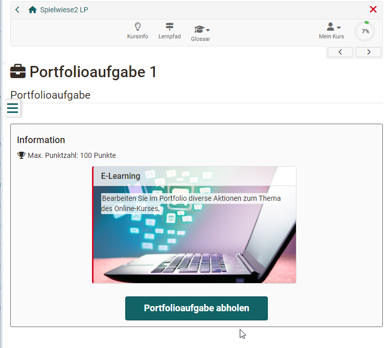
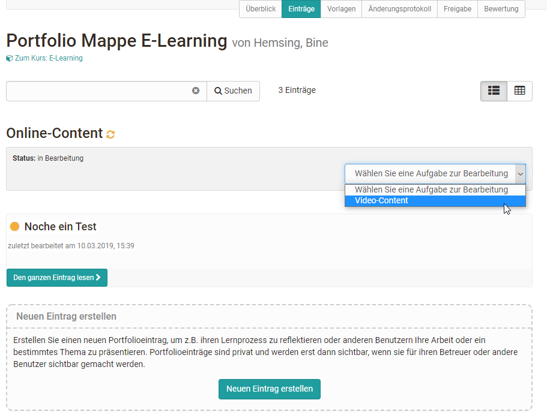
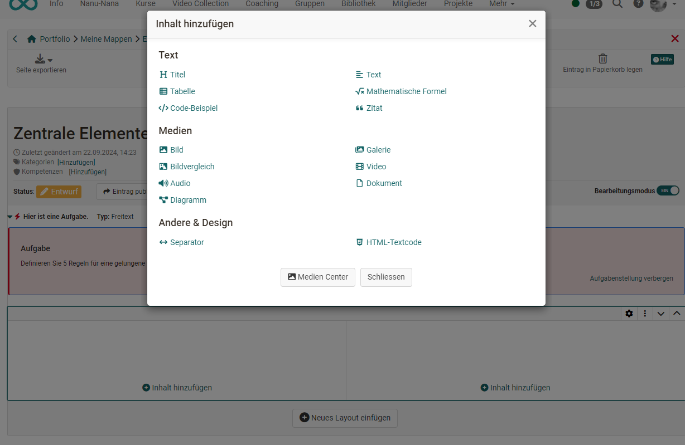
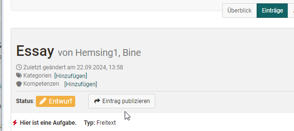
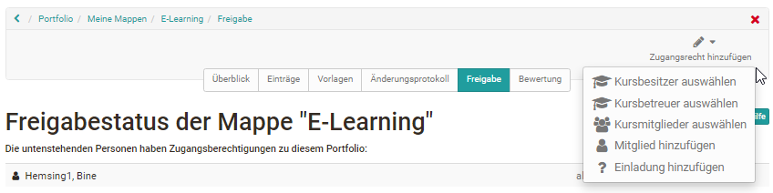
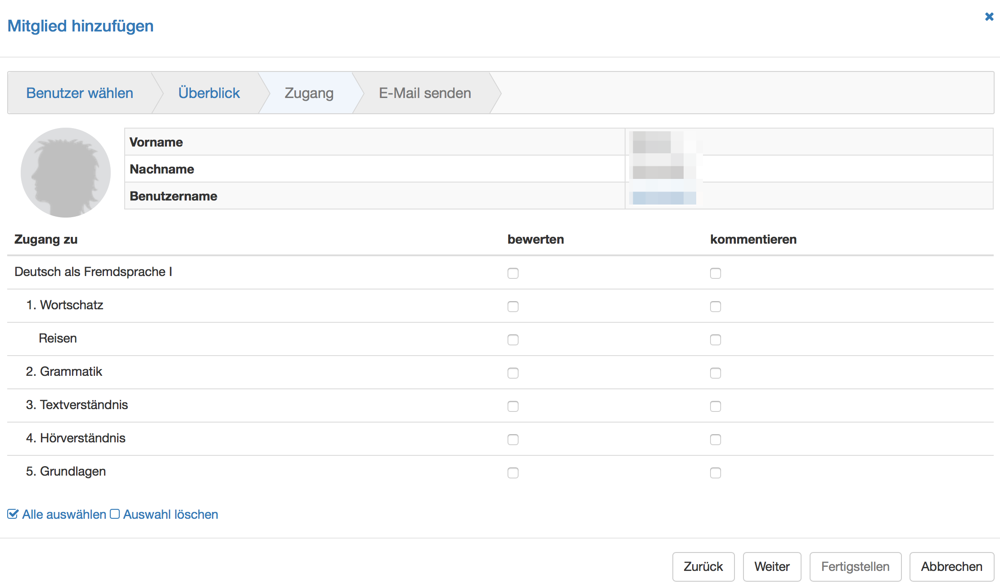

# Kursbaustein "Portfolioaufgabe" {: #course_element_portfolio}

## Steckbrief

Name | Portfolioaufgabe
---------|----------
Icon | { class=size24  }
Verfügbar seit | 
Funktionsgruppe | Wissensüberprüfung
Verwendungszweck | Bereitstellung einer Portolio-Mappe für jeden/jede Kursteilnehmer:in zur Bearbeitung 
Bewertbar | ja
Spezialität / Hinweis |

Über den Kursbaustein "Portfolioaufgabe" werden vom Lehrenden vordefinierte Portfolio Mappen für die Lernenden bereitgestellt. Die Kursteilnehmenden können die Portfolioaufgabe im Kurs abholen und werden anschliessend in ihren individuellen Portfoliobereich weitergeleitet. Das so abgeholte Portfolio kann dann von den Lernenden mit Inhalten und Artefakten unterschiedlicher Formate befüllt und wenn gewünscht weiteren Personen oder den Kursbetreuern zugänglich gemacht werden. Je nach Konfiguration können diese Personen das Portfolio auch bewerten und kommentieren.

Für den Kursbaustein Portfolioaufgabe benötigen Sie eine "Portfolio 2.0 Vorlage", die mit dem Kursbaustein verknüpft wird. Sie können direkt im Kurs über "Portfoliovorlage wählen oder erstellen" eine neue Portfoliovorlage erstellen bzw. eine zuvor erstellte verlinken. Wie Sie eine Portfolioaufgabe genau erstellen erfahren Sie [hier](../learningresources/Creating_Portfolio_Tasks.de.md).

Sofern Sie bereits eine Portfoliovorlage hinzugefügt haben, erscheint diese im Kurseditor im Tab "Lerninhalt" unter "Gewählte Portfoliovorlage". Folgen Sie dem Link um zur Vorschau zu gelangen. Sie haben nun die Möglichkeit, mit der Schaltfläche "Portfoliovorlage auswechseln" eine andere Portfolioaufgabe zu wählen. 

!!! Info

    Wurde eine Portfoliovorlage bereits heruntergeladen und bearbeitet, kann diese Vorlage nicht mehr ausgewechselt werden.

Im Kurseditor im Tab "Bewertung" können Sie die Anzeige von Punkten, Status Bestanden/Nicht bestanden und individuellen Kommentaren vorkonfigurieren. In den Feldern "Hinweis für alle Benutzer" und "Hinweis für Betreuer" formulieren Sie allgemeine Informationen zur Bewertung an alle Kursteilnehmer und -betreuer.

Wie Lehrende eine Portfolioaufgabe bewerten können, erfahren Sie im Kapitel "[Portfolioaufgabe: kommentieren und bewerten](../learningresources/Portfolio_assignment_Grading.de.md)".

Generelle Infos zum Thema Portfolio bzw. E-Portfolio können Sie [hier](../area_modules/index.de.md) nachlesen.

## Sicht Teilnehmende

Stellt Ihnen Ihr Dozent ein vorstrukturiertes Portfolio mit Aufgabenstellungen bzw. Aktionsaufforderungen bereit, können Sie sich diese hier abholen. Klicken Sie auf "Portfolioaufgabe abholen", um die Aufgabe anzusehen und die geforderten Aufgaben in der vordefinierten Mappe zu lösen. Wenn der Lehrende kaum Strukturierungen und Einschränkungen festgelegt hat, können Sie die Mappe nach Belieben gestalten, ansonsten bildet die vorgegebene Strukturierung den Rahmen für die weitere Bearbeitung. Möglicherweise hat der Lehrende einen Abgabetermin definiert, den Sie beachten sollten.

In der Portfolioaufgabe können Sie beispielsweise Ihren Lernprozess dokumentieren und reflektieren bzw. Bearbeitungen über einen längeren Zeitraum vornehmen.

Sobald Sie die Portfolioaufgabe im Kurs abgeholt haben, finden Sie diese auch in Ihrem [persönlichen Menü](../personal_menu/Personal_Tools.de.md) unter "Portfolio 2.0" - "Meine Portfolio Mappen".

Um die fertige Bearbeitung einzureichen, publizieren Sie die Aufgaben und geben Sie den Bereich [frei](../area_modules/Shared_by_me.de.md).

## Portfolioaufgabe erstellen

Um eine erstellte und eingerichtete Portfolio 2.0 Vorlage in einen OpenOlat Kurs einzubinden, fügen Sie ihrem Kurs den Kursbaustein Portfolioaufgabe hinzu.  
  
Nun muss dem Kursbaustein Portfolioaufgabe eine passende Lernressource **Portfolio 2.0 Vorlage** zugeordnet werden.
  
Damit ein Portfolio mit Punkten bewertet werden kann, muss die Portfolio Vorlage als Kursbaustein einem Kurs hinzugefügt werden und die Option "Punkte vergeben" im Tab "Bewertung" des Kursbausteins Portfolioaufgabe aktiviert sein.

Nachdem der Kurs publiziert wurde, kann die Portfolioaufgabe von Kursteilnehmenden abgeholt und bearbeitet werden.

## Portfolioaufgabe abholen  

Klicken Sie einfach auf den Button "Portfolioaufgabe abholen".

  
  
## Portfolioaufgabe finden

Die Portfolioaufgabe steht nach der Abholung im [persönlichen "Portfolio 2.0"](../personal_menu/Personal_Tools.de.md/#portfolio-20) unter "[Zu meinen Mappen](../area_modules/My_portfolio_binders.de.md)" zur Verfügung.  
  
Beim nächsten Zugriff kann die Portfolioaufgabe entweder über den Link im Kurs oder auch direkt im persönlichen Portfolio geöffnet werden.

Im persönlichen Portfolio sind alle aus einem Kurs abgeholten Portfolioaufgaben mit einem roten Strich am linken Rand gekennzeichnet und enhalten den Hinweis auf den zugehörigen Kurs.

## Portfolioaufgabe bearbeiten  

Öffnen Sie die Mappe der Portfolioaufgabe. Je nachdem wie der Lehrende die Portfolioaufgabe vorstrukturiert hat stehen Ihnen unterschiedliche Bereiche mit Portfolioaufgaben zur Verfügung.

Klicken Sie entweder im Tab "Überblick" oder „
"Einträge" auf einen Mappen Bereich und "Wählen Sie eine Aufgabe zur Bearbeitung". Anschliessend sind die zugehörige Aufgabenstellung sowie der Bearbeitungseditor sichtbar.

Nun können die Aufgaben mit dem Portfolio Editor bearbeitet und passende Inhalte (Texte, Bilder, Videos usw.) und Artefakte über den Portfolio Editor hinzugefügt werden.

  
Enthält die Portfolioaufgabe Formulare können diese ebenfalls ausgefüllt werden. Sofern in den Einstellungen der Portfolio Vorlage konfiguriert, dürfen die User auch neue Einträge ergänzen oder die gesamte abgeholte Mappe löschen.

  
## Bearbeitungsstatus

Der Bearbeitungsstatus einer Portfolio Aufgabe wird durch die farbliche und symbolhafte Kennzeichnung erkennbar. Die Details werden in der unteren Legende in der Mappe erläutert. So symbolisiert z.B.  ein roter Blitz im Tab "Überblick", dass eine Aufgabe noch nicht ausgewählt wurde oder ein grüner Haken, dass die Aufgabe bereits publiziert wurde. 

In dem Tab "Einträge" werden alle noch nicht ausgewählte Aufgaben des jeweiligen Bereichs in einem Dropdown Menü gebündelt, während abgeholte Aufgaben unterhalb des Dropdown Menüs erscheinen. 

## Portfolio publizieren   {: #publish}
  
Während der Bearbeitung steht der Status des Eintrags auf "Entwurf".

Sobald der Eintrag respektive die Aufgabe abgeschlossen ist, "Eintrag publizieren" wählen. So wird die Bearbeitung für andere Personen, die Zugang zum Portfolio haben, sichtbar und Feedbacks bzw. Kommentierungen sind möglich.  

!!! Info "Hinweis"

    Sobald ein Eintrag publiziert ist kann er nicht mehr verändert, nur noch kommentiert werden. Deshalb sollten Lernende darauf achten einen Eintrag oder eine bearbeitete Aufgabe erst dann zu publizieren, wenn sie komplett fertig ist!

## Portfolio freigeben

Damit eine Aufgabe von anderen Personen bewertet oder kommentiert werden kann, muss der Besitzer der Mappe diese zunächst für die jeweilige Person(en) freigeben. Sie können Portfolio Mappen sowohl an andere OpenOlat User (Lehrende, Lernende) als auch an externe Personen freigeben. (Für externe Personen maximal 180 Tage.)

!!! info "Hinweis"

    Auch Mappen aus Kursen sind nicht automatisch für die Kursbesitzer oder Kursbetreuer sichtbar.

Die Freigabe erfolgt über "Zugangsrecht hinzufügen".
  

  
Wählen Sie die gewünschte Option z.B. "Kursbetreuer auswählen", um die entsprechende Personengruppe oder Einzelperson hinzuzufügen. Für die Freigabe an externe Personen, auch ohne OpenOlat Account, wählen Sie "Einladung hinzufügen". Es werden dann Einladungen per E-Mail verschickt.

Im erscheinenden Dialog definieren Sie, welche Bereiche Sie der bzw. den gewählten Personen bereitstellen wollen und ob die Personen Bewertungen und/oder Kommentierungen vornehmen dürfen. Externe Personen können nur kommentieren, aber nicht bewerten.

  
Es kann auch eine E-Mail Benachrichtigung mit Link zur entsprechenden Mappe verschickt werden.
  
!!! info "Hinweis"

    Wenn der User die Freigabe für die Kursbetreuer schon zu Beginn seiner Bearbeitung einrichtet, können die Betreuer die Entwicklung des Portfolios bereits sehen und den laufenden Prozess begleiten, sofern der User einzelne Zwischenschritte publiziert. Eine Bearbeitung der Lösung ist dann aber nicht mehr möglich.
