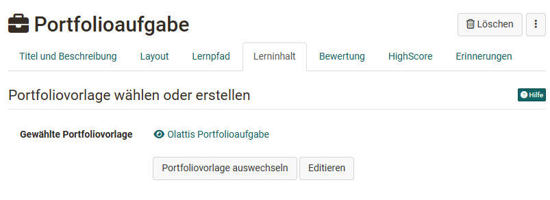
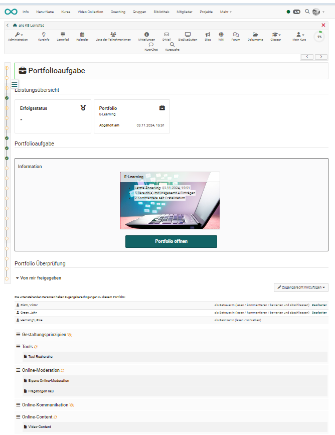
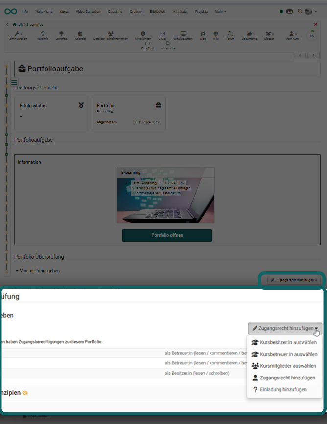

# Kursbaustein "Portfolioaufgabe" {: #course_element_portfolio}

## Steckbrief

Name | Portfolioaufgabe
---------|----------
Icon | { class=size24  }
Verfügbar seit | 
Funktionsgruppe | Wissensüberprüfung
Verwendungszweck | Bereitstellung einer Portolio-Mappe für jeden/jede Kursteilnehmer:in zur Bearbeitung 
Bewertbar | ja
Spezialität / Hinweis |

Über den Kursbaustein "Portfolioaufgabe" werden vom Lehrenden vordefinierte Portfolio Mappen für die Lernenden bereitgestellt. Die Kursteilnehmenden können die Portfolioaufgabe im Kurs abholen und werden anschliessend in ihren individuellen Portfoliobereich weitergeleitet. Das so abgeholte Portfolio kann dann von den Lernenden mit Inhalten und Artefakten unterschiedlicher Formate befüllt und wenn gewünscht weiteren Personen oder den Kursbetreuenden zugänglich gemacht werden. Je nach Konfiguration können diese Personen das Portfolio auch bewerten und kommentieren.

!!! info "Hinweis"

    Für den Kursbaustein Portfolioaufgabe benötigen Sie eine Lernressource ["Portfolio 2.0 Vorlage"](../learningresources/Portfolio_template_Creation.de.md), die mit dem Kursbaustein verknüpft wird. 

## Portfolioaufgabe erstellen

**Portfolio 2.0 Vorlage dem Kursbaustein Portfolioaufgabe zuordnen:**

Fügen Sie dem Kurs einen Kursbaustein "Portfolioaufgabe" hinzu und verbinden Sie den Kursbaustein mit einer "Portfolio 2.0 Vorlage". Dafür gehen Sie im Kurseditor in den Tab "Lerninhalt" und ordnen dem Kursbausteine eine passende Lernressource ["Portfolio 2.0 Vorlage"](../learningresources/Portfolio_template_Creation.de.md) zu. Sie können direkt im Kurs über "Portfoliovorlage wählen oder erstellen" eine neue Portfoliovorlage erstellen oder eine zuvor erstellte Vorlage verlinken. 
  
Wenn Sie dem Kursbaustein eine Vorlage hinzugefügt haben wird dies direkt im Tab "Lerninhalt" unter "Gewählte Portfoliovorlage" erkennbar. Über den Link "Editieren" kann die Vorlage bearbeitet werden. Über den Link "Portfolio auswechseln" können Sie eine andere Mappe hinterlegen. Ein Klick auf den Namen der Vorlage führt Sie direkt zur Vorlage-Mappe. 

!!! Info

    Wurde eine Portfoliovorlage bereits heruntergeladen und bearbeitet, kann diese Vorlage nicht mehr ausgewechselt werden.

**Weitere Tabs konfigurieren**

Nun können die weiteren Tabs des Kursbausteins konfiguriert werden.

Damit ein Portfolio bewertet werden kann, muss im Kurseditor auch der Tab "Bewertung" konfiguriert werden. Hier können Sie folgendes einstellen: 
* Details zur Vergabe von Punkten
* Aktivierung einer Noten- oder Bewertungsskala
* Anzeige von bestanden/nicht bestanden 
* Möglichkeit individuelle Kommentare und/oder Dokumente zu hinterlegen
* Hinweise für alle Teilnehmenden
* Hinweise für all Betreuenden

Wie Lehrende eine Portfolioaufgabe bewerten können, erfahren Sie im Kapitel "[Portfolioaufgabe: kommentieren und bewerten](../learningresources/Portfolio_assignment_Grading.de.md)".

Zum Schluss muss der Kursbaustein wie üblich publiziert werden.

## Teilnehmenden Sicht

### Portfolioaufgabe abholen  

Stellen Lehrende ein vorstrukturiertes Portfolio mit Aufgabenstellungen bzw. Aktionsaufforderungen bereit, können Lernende sich diese Vorlage im Kurs über den Button "Portfolioaufgabe abholen" abholen.

  

### Übersicht und Zugriff nach Abholung

Nachdem eine Portfolioaufgabe vom User abgeholt wurde kann er über den Link "Portfolio öffnen" direkt die Portfolio Mappe aufrufen. Darüber hinaus werden nun noch weitere Informationen im Kursbereich angezeigt.

Unter "Portfolio Überprüfung" können User Zugriffsrechte für weitere Personen definieren und so z.B. Kursbesitzenden oder Betreuenden das Zugangsrecht für das persönliche Portfolio vergeben. Darüber hinaus wird nun beim Kursbaustein Portfolioaufgabe eine Schnellübersicht über die Bereiche der Portfolio-Mappe und, sobald abgeholt, auch der zugeordneten Aufgaben angezeigt. 

Sobald die Portfolioaufgabe im Kurs abgeholt wurde, findet der User diese auch in seinem [persönlichen Menü](../personal_menu/Personal_Tools.de.md) unter "Portfolio 2.0" - "Meine Portfolio Mappen". Im persönlichen Portfolio sind alle aus einem Kurs abgeholten Portfolioaufgaben mit einem roten Strich am linken Rand gekennzeichnet und enthalten den Hinweis auf den zugehörigen Kurs. 

Ein Zugriff ist nach der Abholung sowohl vom Kurs als auch vom persönlichen Bereich aus möglich. 

### Portfolioaufgabe bearbeiten  

Je nachdem wie die Lehrenden die Portfolioaufgabe vorstrukturiert haben stehen Lernenden unterschiedliche Bereiche mit Portfolioaufgaben zur Verfügung. 

Lernende gehen entweder im Tab "Überblick" oder "Einträge" zu einen Mappen Bereich und wählen dort über das Drop-Down Menü "Wählen Sie eine Aufgabe zur Bearbeitung" eine konkrete Aufgabe aus. Anschliessend sind die zugehörige Aufgabenstellung sowie der Bearbeitungseditor sichtbar.

Nun können die Aufgaben mit dem [Portfolio Editor](../area_modules/The_portfolio_editor_17_1.de.md) bearbeitet und passende Inhalte (Texte, Bilder, Videos usw.) und Artefakte über den Portfolio Editor hinzugefügt werden.

  
Enthält die Portfolioaufgabe Formulare können diese ebenfalls ausgefüllt werden. 

Der Bearbeitungsstatus einer Portfolio Aufgabe wird durch die farbliche und symbolhafte Kennzeichnung erkennbar. Die Details werden in der unteren Legende in der Mappe erläutert. So symbolisiert z.B.  ein roter Blitz im Tab "Überblick", dass eine Aufgabe noch nicht ausgewählt wurde oder ein grüner Haken, dass die Aufgabe bereits publiziert wurde. 

In dem Tab "Einträge" werden alle noch nicht ausgewählten Aufgaben des jeweiligen Bereichs in einem Dropdown Menü gebündelt, während abgeholte Aufgaben unterhalb des Dropdown Menüs erscheinen. 

Sofern in den Einstellungen der Portfolio Vorlage entsprechend konfiguriert, dürfen die User auch neue Einträge ergänzen oder die gesamte abgeholte Mappe löschen.

  

### Portfolio publizieren   {: #publish}
  
Ist eine Bearbeitung erledigt muss der Eintrag noch publiziert werden. 

So wird die Bearbeitung für andere Personen, die Zugang zum Portfolio haben, sichtbar und Feedbacks bzw. Kommentierungen sind möglich. Solange noch nicht publiziert wurde steht ein Eintrag auf "Entwurf".

!!! Info "Achtung"

    Sobald ein Eintrag publiziert wurde kann er nicht mehr verändert, nur noch kommentiert werden. Deshalb sollten Lernende darauf achten einen Eintrag oder eine bearbeitete Aufgabe erst dann zu publizieren, wenn sie komplett fertig ist!

### Zugangsrecht für die Portfolio-Mappe vergeben

Zum Schluss müssen die Lernenden noch ihre erstellten Portfolio-Mappen für die Kursbesitzer:innen und Betreuenden zugänglich machen (Zugangsrecht). Diese Freigabe kann sowohl im Kurs als auch direkt in der Mappe konfiguriert werden.

Freigabe in der Mappe: 

Freigabe im Kurs: 

Für die Freigabe an externe Personen (auch ohne OpenOlat Account) wählen Sie "Einladung hinzufügen". Es werden dann Einladungen per E-Mail verschickt. Für externe Personen erfolgt die Freigabe für maximal 180 Tage.

Die Konfiguration erfolgt über einen Wizard. Im erscheinenden Freigabe-Dialog definieren Sie, welche Bereiche Sie der bzw. den gewählten Personen bereitstellen wollen und ob die Personen Bewertungen und/oder Kommentierungen vornehmen dürfen. Externe Personen können nur kommentieren, aber nicht bewerten.

  
Es kann auch eine E-Mail Benachrichtigung mit Link zur entsprechenden Mappe verschickt werden.
  
!!! info "Hinweis"

    Wenn der User die Freigabe für die Kursbetreuenden schon zu Beginn seiner Bearbeitung einrichtet, können die Betreuenden die Entwicklung des Portfolios bereits sehen und den laufenden Prozess begleiten, sofern der User einzelne Zwischenschritte publiziert. Eine Bearbeitung der Lösung ist dann aber nicht mehr möglich!
