# Kursbaustein "Portfolioaufgabe" {: #course_element_portfolio}

## Steckbrief

Name | Portfolioaufgabe
---------|----------
Icon | { class=size24  }
Verfügbar seit | 
Funktionsgruppe | Wissensüberprüfung
Verwendungszweck | Bereitstellung einer Portolio-Mappe für jeden/jede Kursteilnehmer:in zur Bearbeitung 
Bewertbar | ja
Spezialität / Hinweis |

### Funktionsweise

* Über den Kursbaustein "Portfolioaufgabe" werden vom Lehrenden vordefinierte Portfolio Mappen für die Lernenden bereitgestellt. 
* Die Kursteilnehmenden können die Portfolioaufgabe im Kurs abholen und werden anschliessend in ihren individuellen Portfoliobereich weitergeleitet. 
* Das so abgeholte Portfolio kann dann von den Lernenden mit Inhalten und Artefakten unterschiedlicher Formate befüllt werden.
* Wenn gewünscht, kann das Portfolio weiteren Personen oder den Kursbetreuenden zugänglich gemacht werden. Je nach Konfiguration können diese Personen das Portfolio auch bewerten und kommentieren.

!!! info "Hinweis"

    Für die Portfolioaufgabe wird eine Lernressource ["Portfolio 2.0 Vorlage"](../learningresources/Portfolio_template_Creation.de.md) benötigt. Diese kann entweder im Kursbaustein Portfolioaufgabe im [Tab "Lerninhalt"](#tab_learning_content) oder zentral im Autorenbereich erstellt werden.    

---

## Sicht Autor:in (Portfolioaufgabe erstellen) {: #view_author}

### Tab Titel und Beschreibung {: #tab_title}

Wie bei allen Kursbausteinen, bestimmen Sie in diesem Tab den Seitentitel, den Titel links im Kursmenü und die Beschreibungen.

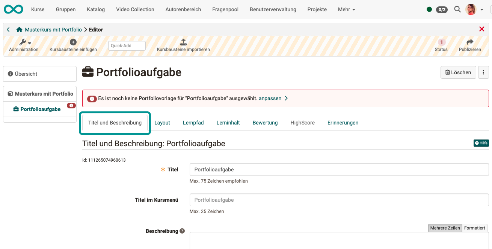{ class="shadow lightbox" }

### Tab Layout {: #tab_layout}

{ class="shadow lightbox" }

### Tab Lernpfad {: #tab_learning_path}

In diesem Tab kann unter anderem das Erledigungskriterium für den Kursbaustein festgelegt werden. (Wann gilt die Portfolioaufgabe als "erledigt"?)

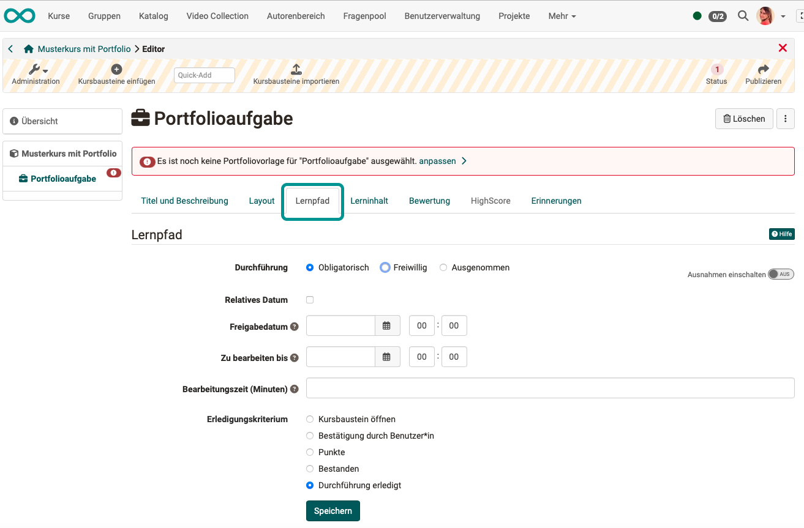{ class="shadow lightbox" }

### Tab Lerninhalt {: #tab_learning_content}

Nachdem Sie dem Kurs einen Kursbaustein "Portfolioaufgabe" hinzugefügt haben,  verbinden Sie den Kursbaustein mit einer "Portfolio 2.0 Vorlage". Dafür gehen Sie im Kurseditor in den Tab "Lerninhalt" und ordnen dem Kursbaustein eine passende Lernressource ["Portfolio 2.0 Vorlage"](../learningresources/Portfolio_template_Creation.de.md) zu. 

{ class="shadow lightbox" }

Sie können direkt im Kurs über "Portfoliovorlage wählen oder erstellen" eine neue Portfoliovorlage erstellen oder eine zuvor erstellte Vorlage verlinken. 
  
Wenn Sie dem Kursbaustein eine Vorlage hinzugefügt haben, wird dies direkt im Tab "Lerninhalt" unter "Gewählte Portfoliovorlage" erkennbar. Über den Link "Editieren" kann die Vorlage bearbeitet werden. Über den Link "Portfoliovorlage auswechseln" können Sie eine andere Mappe hinterlegen. Ein Klick auf den Namen der Vorlage führt Sie direkt zur Vorlage-Mappe. 

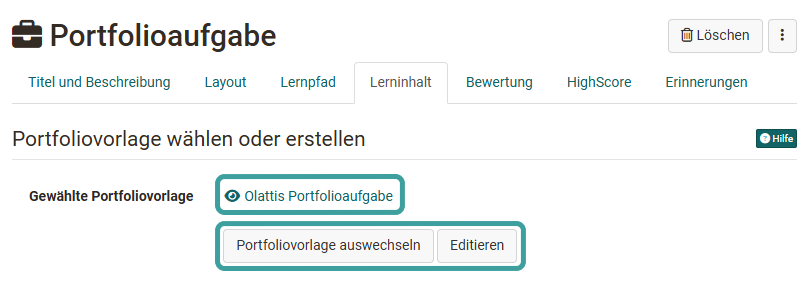{ class="shadow lightbox" }

!!! Info

    Wurde eine Portfoliovorlage bereits von Teilnehmer:innen heruntergeladen und bearbeitet, kann diese Vorlage nicht mehr ausgewechselt werden. Das würde dazu führen, dass die Teilnehmer:innen unterschiedliche Voraussetzungen bekämen.

### Tab Bewertung {: #tab_assessment}

Damit ein Portfolio bewertet werden kann, muss im Kurseditor auch der Tab "Bewertung" konfiguriert werden. 

{ class="shadow lightbox" }

Wie Lehrende eine Portfolioaufgabe bewerten können, erfahren Sie im Kapitel "[Portfolioaufgabe: kommentieren und bewerten](../learningresources/Portfolio_assignment_Grading.de.md)".

### Tab Highscore {: #tab_highscore}

Dieser Tab wird erst aktiv, wenn im Tab "Bewertung" die Vergabe von Punkten eingeschaltet wurde. Dann können hier (berechnet anhand der Punkte) Siegertreppchen, eine Liste der besten Teilnehmer:innen u.a. aktiviert werden.

{ class="shadow lightbox" }

### Tab Erinnerungen {: #tab_reminders}

Hier können Sie - wie bei anderen Kursbausteinen auch - das automatische Versenden von [Erinnerungsmails](../learningresources/Course_Reminders.de.md) einrichten. Z.B. ausgelöst durch eine eingestellte Bedingung "Teilnehmer:in hat 2 Wochen vor Abgabetermin noch nicht begonnen". 

### Tab Badges {: #tab_badges}

Wurde von dem/der Kursbesitzer:in unter **Administration > Einstellungen > Tab Bewertung > Abschnitt Badges** die Vergabe von Badges aktiviert, wird im Kurseditor zu diesem Kursbaustein der Tab "Badges" angezeigt und es kann ein spezifischer Badge für diesen Kursbaustein erstellt werden.

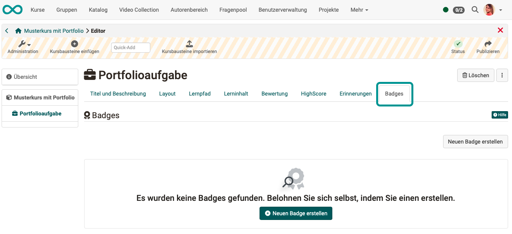{ class="shadow lightbox" }

[Zum Seitenanfang ^](#course_element_portfolio)

---

## Sicht Kursteilnehmer:in {: #view_participant}

### Schritt 1: Portfolioaufgabe abholen  

Hat ein/eine OpenOlat-Autor:in einen Kursbaustein "Portfolioaufgabe" vorbereitet, dann rufen Sie als Kursteilnehmer:in diesen Kursbaustein im Kursmenü auf. Mit dem Button "Portfolioaufgabe abholen" laden Sie sich eine Kopie der Vorlage zur Bearbeitung in Ihr eigenes Portfolio.

{ class="shadow lightbox" }

[Zum Seitenanfang ^](#course_element_portfolio)

---

### Schritt 2: Übersicht und Zugriff nach Abholung

Nachdem Sie die Portfolio-Mappe abgeholt haben, können Sie die Mappe zur Bearbeitung öffnen. Auf der Übersichtsseite werden Ihnen noch weitere Informationen zum Stand Ihrer Bearbeitung angezeigt. 

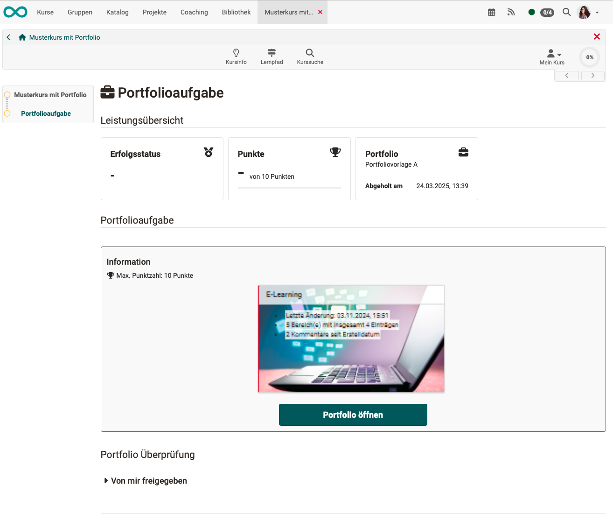{ class="shadow lightbox" }

Sobald die Portfolioaufgabe im Kurs abgeholt wurde, finden Sie als Kursteilnehmer:in diese Mappe auch in Ihrem [persönlichen Menü](../personal_menu/Personal_Tools.de.md) unter "Portfolio 2.0" - "Meine Portfolio Mappen". 

{ class="shadow lightbox" }

!!! info "Hinweis"

    Im persönlichen Portfolio sind auch Ihre weiteren Mappen sichtbar. Alle aus einem Kurs abgeholten Portfolioaufgaben sind mit einem roten Strich am linken Rand gekennzeichnet und enthalten den Hinweis auf den zugehörigen Kurs (unterhalb des Titels). 

Ein Zugriff ist nach der Abholung sowohl vom Kurs als auch vom persönlichen Bereich aus möglich. 

[Zum Seitenanfang ^](#course_element_portfolio)

---

### Schritt 3: Portfolioaufgabe bearbeiten  

**Schritt 3a:** Öffnen Sie die Mappe.

Je nachdem, wie der/die Autor:in die Portfolioaufgabe vorbereitet hat, stehen Ihnen als Teilnehmer:in unterschiedliche Bereiche mit Aufgabenstellungen zur Verfügung:

* Hat der/die Autor:in eine Anleitung und weitere Unterlagen zum Herunterladen angehängt? 
* Hat der/die Autor:in vorgesehen, dass Sie neue Einträge erstellen?
(Muss erlaubt worden sein unter Portfoliovorlage wählen > Administration > Einstellungen > Tab Einstellungen) In diesem Fall können Sie die Aufgaben mit dem [Portfolio Editor](../area_modules/The_portfolio_editor_17_1.de.md) bearbeiten und passende Inhalte (Texte, Bilder, Videos usw.) hinzufügen.
* Hat der/die Autor:in vorgesehen, dass Sie eine Mappe auch wieder löschen dürfen? (Dann steht Ihnen links oben der entsprechende Button zur Verfügung.)
* Hat der/die Autor:in vorgesehen, dass Sie ein Formular ausfüllen? (Dann finden Sie es in den angezeigten Bereichen.)

**Beispiel:** 

{ class="shadow lightbox" }

**Schritt 3b:** Klicken Sie auf einen Bereich oder auf den Tab "Einträge".

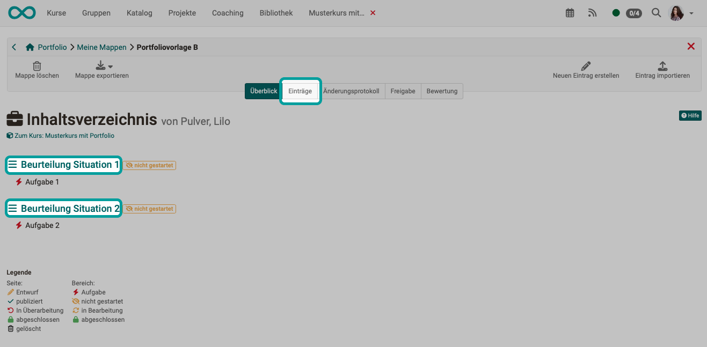{ class="shadow lightbox" }

**Schritt 3c:** Wählen Sie dort eine angezeigte Aufgabe oder suchen Sie die Aufgaben in den anderen Bereichen.

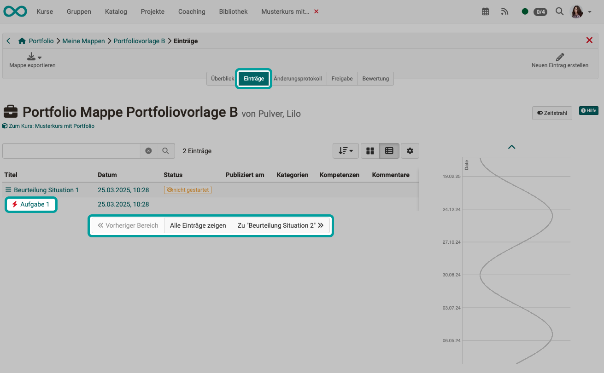{ class="shadow lightbox" }

Wurde nicht die Listenansicht gewählt, sondern die Kachelansicht, kann die Aufgabe über einen Dropdown-Button gewählt werden.

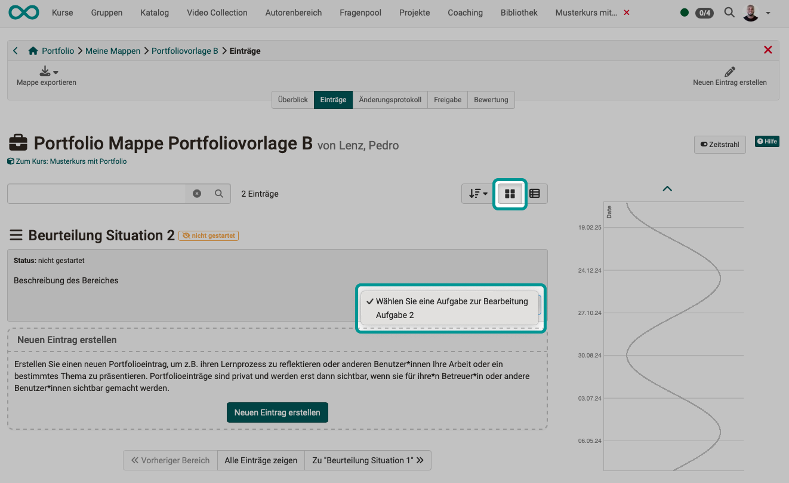{ class="shadow lightbox" }

**Schritt 3d:** Folgen Sie den Anweisungen. Die Aufgabe kann von Kursautor:innen ganz unterschiedlich gestaltet worden sein. Im folgenden Beispiel können Sie ein Dokument herunterladen und Ihre Antwort ergänzen.

{ class="shadow lightbox" }

**Schritt 3e: Beispiel mit Antwort in einem Layout-Block** 

Fügen Sie ein neues Layout-Element hinzu.

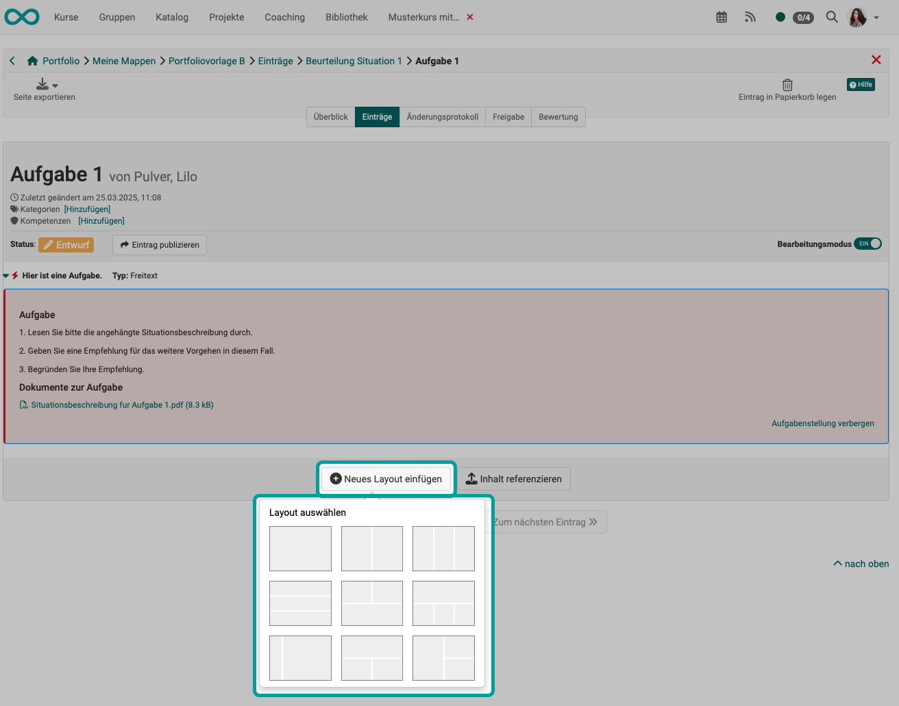{ class="shadow lightbox" }

**Schritt 3f: Beispiel mit Antwort in einem Layout-Block** 

Fügen Sie in die Layout-Felder Inhaltselemente hinzu.

{ class="shadow lightbox" }

**Schritt 3g: Beispiel mit Antwort in einem Layout-Block** 

Es stehen Ihnen verschiedene Inhalte zur Auswahl.

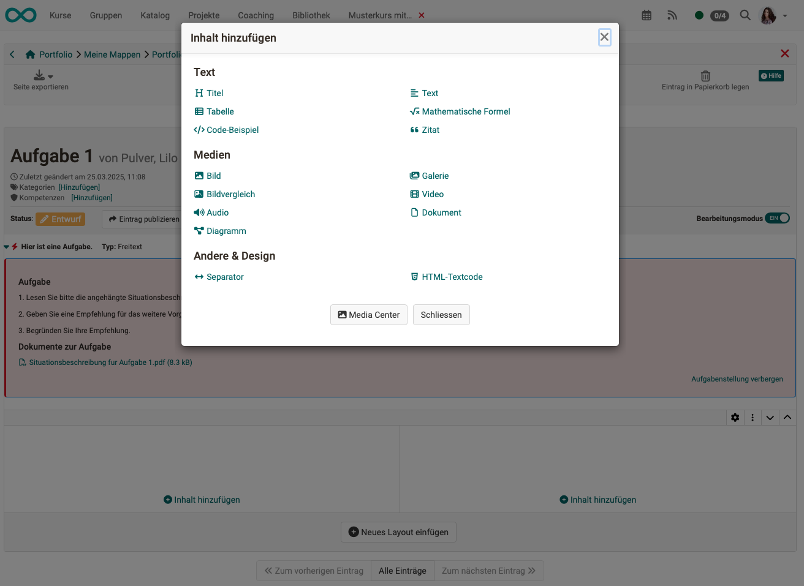{ class="shadow lightbox" }

**Schritt 3h: Beispiel mit Antwort in einem Layout-Block** 

Im nachstehend gezeigten Beispiel hat sich der/die Teilnehmer:in für eine Antwort in Form eines selbst aufgezeichneten Videos entschieden.

{ class="shadow lightbox" }

**Schritt 3: Beispiel Referenzierung**

Haben Sie bereits anderweitig einen Inhalt erstellt, können Sie diesen auch referenzieren (einbinden durch Verlinkung).

{ class="shadow lightbox" }

**Schritt 3: Beispiel Formular**

Enthält die Portfolioaufgabe Formulare (von dem/der Kursautor:in vorbereitet), können diese direkt online ausgefüllt werden. 

{ class="shadow lightbox" }

 

**Wie behalte ich die Übersicht über den Bearbeitungsstand?**

Sowohl im Tab "Überblick" als auch im Tab "Einträge" helfen Ihnen die Symbole und Tags dabei, den Überblick über den Bearbeitungsstand der einzelnen Einträge zu behalten.

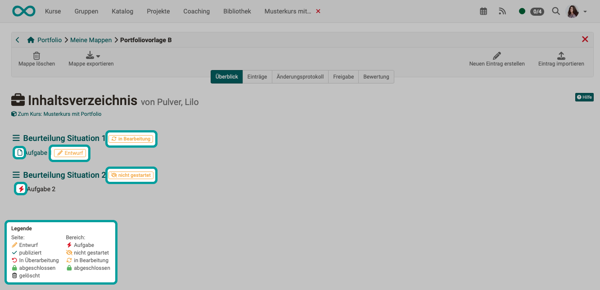{ class="shadow lightbox" }  

[Zum Seitenanfang ^](#course_element_portfolio)

---

### Schritt 4: Portfolio publizieren   {: #publish}
  
Ist eine Bearbeitung erledigt, muss der Eintrag noch publiziert werden. So wird die Bearbeitung für andere Personen, die Zugang zum Portfolio haben, sichtbar und Feedbacks bzw. Kommentierungen sind möglich. Solange noch nicht publiziert wurde, hat ein Eintrag den Status "Entwurf".

{ class="shadow lightbox" }

!!! warning "Achtung"

    Sobald ein Eintrag publiziert wurde kann er nicht mehr verändert, nur noch kommentiert werden. Deshalb sollten Lernende darauf achten, einen Eintrag oder eine bearbeitete Aufgabe erst dann zu publizieren, wenn sie komplett fertig ist!

[Zum Seitenanfang ^](#course_element_portfolio)

---

### Schritt 5: Zugangsrecht für die Portfolio-Mappe vergeben

In der Regel sollen durch Teilnehmer:innen erstellte Portfolio-Mappen durch Betreuer:innen (Lehrpersonen) beurteilt werden. Dazu muss diesen oder auch anderen Personen ein Zugangsrecht erteilt werden. Sie können dies als Ersteller:in der Mappe an 2 Orten tun:

**A) Freigabe Ihrer Portfolio-Mappe im Kurs**

Wenn Sie im Kurs den Kursbaustein mit der Portfolioaufgabe gewählt haben, finden Sie im unteren Bereich den Abschnitt "Portfolio Überprüfung". Dort finden Sie den Button "Zugangsrecht hinzufügen".

{ class="shadow lightbox" }

 

**B) Freigabe Ihrer Portfolio-Mappe in den Einstellungen der Mappe**

Öffnen Sie die Mappe und wählen Sie den Tab "Freigabe". Dort erscheint der Button "Zugangsrecht hinzufügen".

{ class="shadow lightbox" }

 

**Freigabe an externe Benutzer:innen** 

Für die Freigabe an **externe Personen** (ohne vollwertigen OpenOlat Account) wählen Sie **"Einladung hinzufügen"**. Es werden dann Einladungen per E-Mail verschickt. Für externe Personen erfolgt die Freigabe für maximal 180 Tage.

[Zum Seitenanfang ^](#course_element_portfolio)

---

**Der Wizard zur Einrichtung der Freigabe**

Die Konfiguration erfolgt über einen Wizard. Im Freigabe-Dialog definieren Sie, 

* für welche Personen Ihre Mappe freigegeben werden soll.
* ob die Personen Bewertungen und/oder Kommentierungen vornehmen dürfen, aufgegliedert nach Bereichen Ihres Portfolios. Externe Personen können nur kommentieren, aber nicht bewerten.
* ob eine E-Mail-Benachrichtigung mit Link zur entsprechenden Mappe verschickt werden soll.

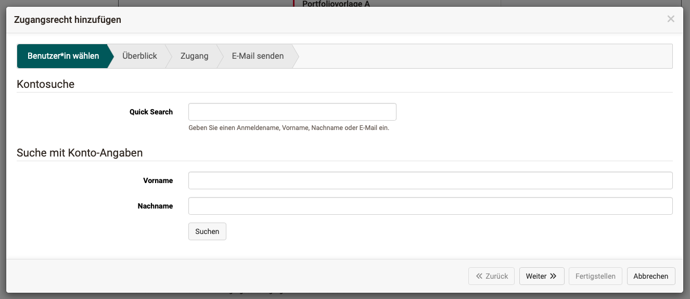{ class="shadow lightbox" }

!!! info "Hinweis"

    Wenn Sie als Kursteilnehmer:in die Freigabe für die Kursbetreuenden schon zu Beginn Ihrer Bearbeitung einrichten, können die Betreuenden die Entwicklung des Portfolios bereits sehen und den laufenden Prozess begleiten, sofern Sie als Kursteilnehmer:in einzelne Zwischenschritte publizieren. Eine Bearbeitung der Lösung ist dann aber nicht mehr möglich!

[Zum Seitenanfang ^](#course_element_portfolio)

---

## Sicht Betreuer:in {: #view_coach}

Wie Lehrende eine Portfolioaufgabe bewerten können, erfahren Sie im Kapitel "[Portfolioaufgabe: kommentieren und bewerten](../learningresources/Portfolio_assignment_Grading.de.md)".

[Zum Seitenanfang ^](#course_element_portfolio)

---

## Weitere Informationen

[Allgemeines zum Portfolio >](../area_modules/Portfolio_General_Information.de.md) 
[Bestandteile des Portfolios: Übersicht >](../area_modules/Components_of_the_portfolio.de.md) 
[Bestandteile des Portfolios: Meine Portfolio Mappen >](../area_modules/My_portfolio_binders.de.md) 
[Bestandteile des Portfolios: Meine Einträge >](../area_modules/My_entries.de.md) 
[Portfoliovorlage: Erstellung >](Portfolio_template_Creation.de.md) 
[Portfolio Editor >](../area_modules/The_portfolio_editor_17_1.de.md) 
[Portfoliovorlage: Administration und Bearbeitung >](Portfolio_template_Administration_and_editing.de.md) 
[Portfolioaufgabe: Kommentieren und Bewerten >](../learningresources/Portfolio_assignment_Grading.de.md) 

!!! info "Hinweis für Autor:innen"

    Wenn Sie Formulare im Portfolio verwenden:  Es gibt eine Formular-**Lernressource** und einen Formular-**Kursbaustein**. Bitte unterscheiden Sie die beiden. Das Konzept dahinter wird Ihnen in der Anleitung [Wie erstelle ich eine Formular-Lernressource?](../../manual_how-to/create_a_form/create_a_form.de.md) erklärt.

[Formulare Übersicht >](Form.de.md) 
[Formulare in der Portfolio 2.0 Vorlage >](Forms_in_the_ePortfolio_template.de.md) 
[Wie erstelle ich eine Formular-Lernressource? >](../../manual_how-to/create_a_form/create_a_form.de.md) 
[Formular-Editor >](Form_Editor.de.md) 
[Formular-Elemente >](Form_Elements.de.md) 

