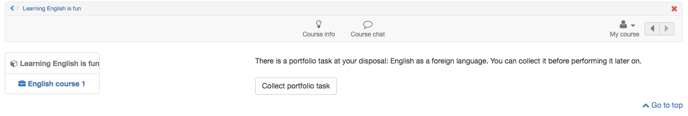
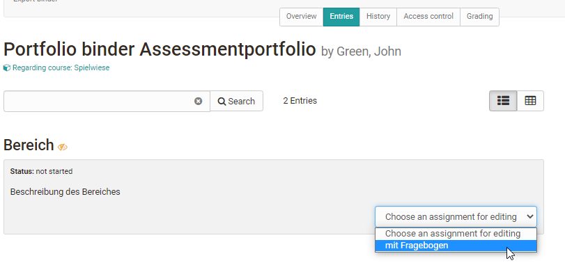
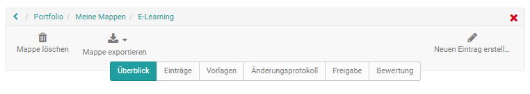
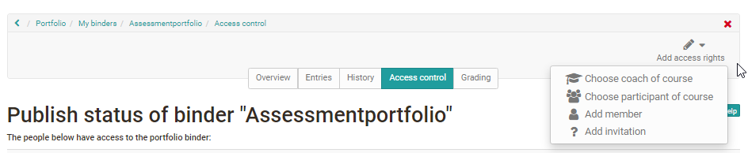
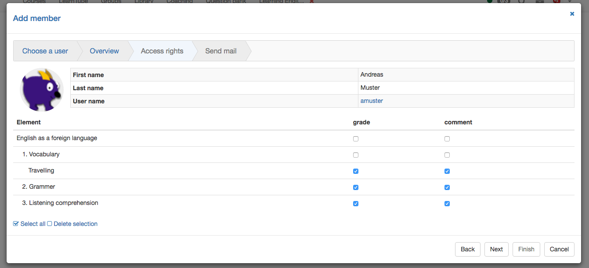

# Course Element "Portfolio Task" {: #course_element_portfolio}

## Profile

Name | Portfolio Task
---------|----------
Icon | { class=size24 }
Available since | 
Functional group | Assessment
Purpose | Provision of a portolio folder for each course participant to work on
Assessable | yes
Specialty / Note |

By means of the course element "Portfolio task" you can provide predefined
portfolio templates to be filled by your course participants. The course
participants can then pick up the portfolio task in their course, and are then forwarded to their individual portfolio area. The portfolio picked up in this way can then be filled with content and artifacts by the learners and, if desired, made available to other people or the course supervisors. Depending on the configuration, these persons can also evaluate and comment on the portfolio.

For the course element Portfolio task you need a "Portfolio 2.0 template", which you link to the course element. If you have not yet created a Portfolio Template learning resource, you can also create a new Portfolio Template or
link to a previously created one directly in the course via "Select or create Portfolio Template".  Click [here](../learningresources/Creating_Portfolio_Tasks.md) to find out exactly how to create a portfolio task.

If you have already added a portfolio template, it will appear under Selected Portfolio Template. Follow the link to get to the preview. You now have the option of selecting a different content with the "Change Portfolio Template" button.

!!! info

    In case a portfolio template has already been downloaded and edited it will no longer be possible to replace it.

In the tab "Evaluation" you can preconfigure the display of points, status passed/failed and individual comments. In the fields "Note for all users" and "Note for supervisors" you formulate general information for the evaluation to all course participants and coaches.

How coaches can assess a portfolio task can be found in the chapter "[Portfolio assignment: Grading](../learningresources/Portfolio_assignment_Grading.md)".

General information on the subject of portfolios and e-portfolios can be found [here](../area_modules/index.md).

## Participant view

If your coach provides you with a pre-structured portfolio of assignments or calls to action, you can pick them up here. Click on " Collect portfolio task" to view the task and solve the required tasks in the predefined portfolio. If the coach has hardly set any structuring and constraints, you can design the portfolio as you like, otherwise the predefined structuring will provide the framework for further work. Possibly the coach has defined a deadline that you should respect.

In the portfolio assignment, for example, you can document and reflect on your learning process or make edits over a longer period of time.

Once you have collected the portfolio assignment in the course, you will also find it in your [personal menu](../personal_menu/Personal_Tools.md) under "Portfolio 2.0" - "My portfolio folders".

To submit the completed editing, publish the tasks and share [it](../area_modules/Shared_by_me.md).

## Create portfolio task

To embed a created and set up Portfolio 2.0 template into an OpenOlat course, add the course element Portfolio Task to your course.  
  
Now you have to assign a suitable learning resource **Portfolio 2.0 Template** to the course element Portfolio Task.
  
In order for a portfolio to be assessed with points, the portfolio template has to be added to a course as a course element and the option " Assign score" has to be activated in the tab "Assessment" of the course element Portfolio task.

After the course has been published, the portfolio assignment can be picked up and edited by course participants.

## Collect portfolio task

Just click on the "Collect portfolio task" button.

## Find Portfolio task

The portfolio task is available after collection in the [personal "Portfolio 2.0"](../personal_menu/Personal_Tools.md/#portfolio-20) under "[To my portfolios](../area_modules/My_portfolio_binders.md)".  

The next time the portfolio task is accessed, it can be opened either via the link in the course or directly in the personal portfolio.

Folders picked up from courses are marked with a red left border and contain the reference to the associated course.
  
## Edit portfolio task  

Open portfolio. Depending on how the instructor has pre-structured the portfolio assignment, different areas of portfolio assignments are available. 

Click on a folder area in either the "Overview" or "Entries" tab and "Select a task for editing". Subsequently, the associated task and the editing editor are visible.
(Open in "My portfolio binders" the corresponding portfolio template.)

Now the tasks can be edited and suitable artefacts can be added within the portfolio editor and suitable content (text, images, videos, etc.) and artifacts can be added via the Portfolio editor.

If the portfolio task contains forms, these can also be completed. If the configuration of the Portfolio 2.0 template allows, a user can add new
entries or delete the collected binder.

## Editing status

The processing status of a portfolio task is indicated by the color and symbol marking. The details are explained in the lower legend in the portfolio. For example, a red lightning bolt in the "Overview" tab symbolizes that a task has not yet been selected, or a green check mark that the task has already been published.

Under "Entries" all assigned tasks which have not been collected yet are
available in a dropdown list. Collected tasks will be shown under the
portfolio section title.

## Publish portfolio {: #publish}
  
During editing the status of the entry/assignment is "Draft".
  

As soon as the entry/assignment is done, "Publish entry" can be selected. This makes the editing visible to other people who have access to the portfolio, and feedback or comments are possible.

!!! info "Info"

    As soon as the entry of a portfolio template is published, it cannot be modified by the user anymore, but commented. So learners should be aware to only publish entries and tasks when finished.

## Share portfolio
  
To allow another user or teacher to comment on or grade an portfolio assignment, it must be shared. Portfolio binders can be shared with other OpenOlat users (teachers, learners) and external persons.

!!! info "Info"

    Also binders from courses are not visible by default for the course owner.

The sharing is done via "Add access".

Select the desired option, e.g. "Select course coach", to add the corresponding group of people or individual. For sharing with external persons, even without an OpenOlat account, select "Add invitation". Invitations will then be sent by e-mail.

In the dialog that appears, define which areas you want to make available to the selected person(s) and whether they are allowed to rate and/or comment. External persons can only comment, but not assess.

You can send an email with a portfolio binder link as well.  

!!! info  "Info"

    When starting to edit a portfolio, users should add the corresponding coaches to the access control already. If entries will be published, they will be visible for the coach directly. However, editing the solution is then no longer possible.
