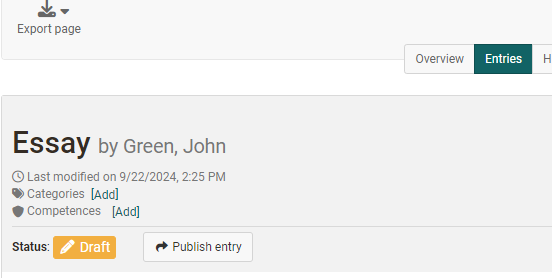

# Course Element "Portfolio Task" {: #course_element_portfolio}

## Profile

Name | Portfolio Task
---------|----------
Icon | { class=size24 }
Available since | 
Functional group | Assessment
Purpose | Provision of a portolio folder for each course participant to work on
Assessable | yes
Specialty / Note |

By means of the course element "Portfolio task" you can provide predefined portfolio templates to be filled by your course participants. The course participants can then pick up the portfolio task in their course, and are then forwarded to their individual portfolio area. The portfolio picked up in this way can then be filled with content and artifacts by the learners and, if desired, made available to other people or the course coaches. Depending on the configuration, these persons can also evaluate and comment on the portfolio.

 !!! info

    For the course element Portfolio task you need a ["Portfolio 2.0 template"](../learningresources/Portfolio_template_Creation.md), which you link to the course element. 

**Assign portfolio 2.0 template to the portfolio assignment course element:**

Add a "Portfolio assignment" course element to the course and link the course element to a "Portfolio 2.0 template". To do this, go to the "Learning content" tab in the course editor and assign a suitable learning resource ["Portfolio 2.0 template"](../learningresources/Portfolio_template_Creation.md) to the course element. You can create a new portfolio template directly in the course via "Select or create portfolio template" or link a previously created template. 

If you have added a template to the course element, this can be seen directly in the "Learning content" tab under "Selected portfolio template". The template can be edited via the "Edit" link. You can use the "Change portfolio" link to save a different portfolio. Clicking on the name of the template will take you directly to the template portfolio. 

!!! info

    In case a portfolio template has already been downloaded and edited it will no longer be possible to replace it.

**Configure further tabs**

The other tabs of the course element can now be configured.

In order for a portfolio to be evaluated, the "Assessment" tab must also be configured in the course editor. You can set the following here: 

* Details on the awarding of points
* Activation of a grading or rating scale
* Display of pass/fail
* Possibility to store individual comments and/or documents
* Notes for all participants
* Notes for all coaches

You can find out how teachers can grade a portfolio assignment in the chapter "[Portfolio assignment: commenting and grading](../learningresources/Portfolio_assignment_Grading.md)".

Finally, the course element must be published as usual.

## Participant view

### Collect portfolio task

If teachers provide a pre-structured portfolio with tasks or calls to action, learners can pick up this template in the course via the "Pick up portfolio task" button.

  

### Overview and access after collection

After a portfolio task has been collected by the user, they can open the portfolio folder directly via the "Open portfolio" link. In addition, further information is now displayed in the course area.

Under "Portfolio review", users can define access rights for other people and thus, for example, grant course owners or coaches access rights to the personal portfolio. In addition, a quick overview of the areas of the portfolio folder and, once collected, the assigned tasks is now displayed in the portfolio task course element. 

As soon as the portfolio task has been collected in the course, the user can also find it in their [personal menu](../personal_menu/Personal_Tools.md) under "Portfolio 2.0" - "My portfolio folders".

In the personal portfolio, all portfolio tasks collected from a course are marked with a red line on the left-hand side and contain a reference to the associated course. 

After collection, access is possible both from the course and from the personal area. 
  
### Edit portfolio task  

Depending on how the teacher has pre-structured the portfolio task, different areas with portfolio tasks are available to learners.  

Learners go to a folder area either in the "Overview" or "Entries" tab and select a specific task via the drop-down menu "Select a task for editing". The associated task and the editing editor are then visible.

Now the tasks can be edited and suitable artefacts can be added within the [Portfolio Editor](../area_modules/The_portfolio_editor_17_1.md) and suitable content (text, images, videos, etc.) and artifacts can be added via the Portfolio editor.

If the portfolio task contains forms, these can also be completed.

The processing status of a portfolio task is indicated by the color and symbolic marking. The details are explained in the legend at the bottom of the portfolio. For example, a red lightning bolt in the "Overview" tab indicates that a task has not yet been selected or a green tick indicates that the task has already been published.

In the "Entries" tab, all tasks of the respective area that have not yet been selected are bundled in a drop-down menu, while collected tasks appear below the drop-down menu.

If configured accordingly in the settings of the portfolio template, users can also add new entries or delete the entire collected folder.

### Publish portfolio {: #publish}
  
Once an edit has been completed, the entry still needs to be published. 
  

This makes the work visible to other people who have access to the portfolio and feedback or comments are possible. As long as it has not yet been published, an entry is set to "Draft".

!!! info "Attention"

    Once an entry has been published, it can no longer be changed, only commented on. Learners should therefore ensure that they only publish an entry or an edited task when it is completely finished!

### Assign access rights for the portfolio folder
  
Finally, learners must make their created portfolio folders accessible to the course owners and supervisors (access rights). This release can be configured both in the course and directly in the portfolio.

Share in the folder:

Share in the course: 

To share with external persons (even without an OpenOlat account), select "Add invitation". Invitations will then be sent by e-mail. External persons are released for a maximum of 180 days.

The configuration is carried out via a wizard. In the release dialog that appears, you define which areas you want to make available to the selected person(s) and whether they are allowed to make ratings and/or comments. External persons can only comment, but not rate.

An e-mail notification with a link to the corresponding folder can also be sent.

!!! info  "Note"

    If the user sets up the release for the course supervisors at the beginning of his work, the supervisors can already see the development of the portfolio and accompany the ongoing process, provided that the user publishes individual intermediate steps. However, it is then no longer possible to edit the solution!
