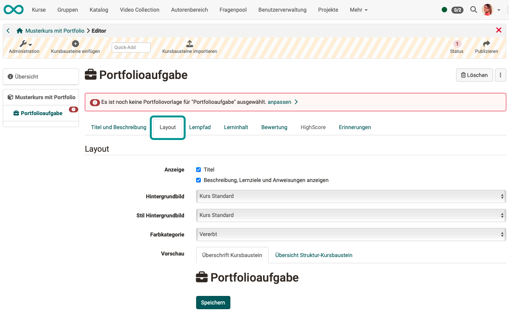

# Course Element "Portfolio Task" {: #course_element_portfolio}

## Profile

Name | Portfolio Task
---------|----------
Icon | { class=size24 }
Available since | 
Functional group | Assessment
Purpose | Provision of a portfolio folder for each course participant to work on
Assessable | yes
Specialty / Note |

### Functionality

* Predefined portfolio folders are made available to learners by the teacher via the "Portfolio task" course element. 
* Course participants can collect the portfolio assignment in the course and are then forwarded to their individual portfolio area. 
* The portfolio collected in this way can then be filled by learners with content and artifacts in different formats.
* If desired, the portfolio can be made accessible to other people or the course supervisors. Depending on the configuration, these people can also rate and comment on the portfolio.

 !!! info "Note"

    A learning resource ["Portfolio 2.0 Template"](../learningresources/Portfolio_template_Creation.md) is required for the portfolio assignment. This can either be created in the course element Portfolio assignment in the [tab "Learning content"](#tab_learning_content) or centrally in the authoring area.    

---

## Author perspective (Create portfolio task) {: #view_author}

### Tab title and description {: #tab_title}

As with all course elements, you determine the page title, the title on the left in the course menu and the descriptions in this tab.

{ class="shadow lightbox" }

### Tab Layout {: #tab_layout}

{ class="shadow lightbox" }

### Tab Learning path {: #tab_learning_path}

Among other things, the completion criterion for the course element can be defined in this tab. (When is the portfolio task considered "completed"?)

{ class="shadow lightbox" }

### Tab Learning content {: #tab_learning_content}

Once you have added a "Portfolio task" course element to the course, link the course element to a "Portfolio 2.0 template". To do this, go to the "Learning content" tab in the course editor and assign a suitable learning resource ["Portfolio 2.0 template"](../learningresources/Portfolio_template_Creation.md) to the course element. 

{ class="shadow lightbox" }

You can create a new portfolio template directly in the course via "Select or create portfolio template" or link a previously created template. 

If you have added a template to the course element, this can be seen directly in the "Learning content" tab under "Selected portfolio template". The template can be edited via the "Edit" link. You can use the "Change portfolio template" link to add a different portfolio. Clicking on the name of the template will take you directly to the template folder. 

{ class="shadow lightbox" }

!!! info

    If a portfolio template has already been downloaded and edited by participants, this template can no longer be changed. This would result in participants receiving different requirements.

### Tab assessment {: #tab_assessment}

In order for a portfolio to be assessed, the "Assessment" tab must also be configured in the course editor. 

{ class="shadow lightbox" }

You can find out how teachers can grade a portfolio assignment in the chapter "[Portfolio assignment: commenting and grading](../learningresources/Portfolio_assignment_Grading.md)".

### Tab Highscore {: #tab_highscore}

This tab only becomes active once the awarding of points has been activated in the "Rating" tab. You can then activate winners' podiums, a list of the best participants, etc. (calculated based on the points).

{ class="shadow lightbox" }

### Tab Reminders {: #tab_reminders}

As with other course elements, you can set up the automatic sending of [reminder emails](../learningresources/Course_Reminders.md) here. For example, triggered by a set condition "Participant has not yet started 2 weeks before the deadline". 

### Tab Badges {: #tab_badges}

If the course owner has activated the assignment of badges under **Administration > Settings > Assessment tab > Badges** section, the "Badges" tab will be displayed in the course editor for this course element and a specific badge can be created for this course element.

{ class="shadow lightbox" }

[To the top of the page ^](#course-element-portfolio-task--course_element_portfolio)

---

### Participant perspective {: #view_participant}

### Step 1: Pick up portfolio task

If an OpenOlat author has prepared a "Portfolio assignment" course element, you as a course participant can call up this course element in the course menu. Use the "Get portfolio assignment" button to download a copy of the template for editing in your own portfolio.

{ class="shadow lightbox" }

[To the top of the page ^](#course_element_portfolio)

---

### Step 2: Overview and access after collection

Once you have collected the portfolio folder, you can open it for editing. The overview page will show you further information on the status of your work. 

{ class="shadow lightbox" }

As soon as the portfolio assignment has been collected in the course, you as a course participant will also find:in this folder in your [personal menu](../personal_menu/Personal_Tools.md) under "Portfolio 2.0" - "My portfolio folders".

{ class="shadow lightbox" }

!!! info "Note"

    Your other portfolios are also visible in your personal portfolio. All portfolio tasks collected from a course are marked with a red line in the left-hand margin and contain a reference to the associated course (below the title). 

After collection, access is possible both from the course and from the personal area. 

[To the top of the page ^](#course_element_portfolio)

---

### Step 3: Edit portfolio task 

**Schritt 3a:** Open the portfolio.

Depending on how the author has prepared the portfolio task, different areas with tasks are available to you as a participant:

* Has the author attached instructions and other documents for download? 
* Did the author intend for you to create new entries?
(Must have been allowed under Select portfolio template > Administration > Settings > Settings tab) In this case, you can edit the tasks with the [Portfolio Editor](../area_modules/The_portfolio_editor_17_1.md) and add suitable content (texts, images, videos, etc.).
* Has the author provided for you to be able to delete a folder? (If so, the corresponding button is available at the top left).
* Did the author intend for you to fill out a form? (If so, you will find it in the areas shown).

**Example:** 

{ class="shadow lightbox" }

**Step 3b:** Click on an area or on the "Entries" tab.

{ class="shadow lightbox" }

**Step 3c:** Select a displayed task or search for the tasks in the other areas.

{ class="shadow lightbox" }

If the tile view has been selected instead of the list view, the task can be selected via a drop-down button.

{ class="shadow lightbox" }

**Step 3d:** Follow the instructions. The task can be designed very differently by course authors. In the following example, you can download a document and complete your answer.

{ class="shadow lightbox" }

**Step 3e: Example with answer in a layout block** 

Add a new layout element.

{ class="shadow lightbox" }

**Step 3f: Example with answer in a layout block** 

Add content elements to the layout fields.

{ class="shadow lightbox" }

**Step 3g: Example with answer in a layout block** 

You can choose from various contents.

{ class="shadow lightbox" }

**Step 3h: Example with answer in a layout block** 

In the example shown below, the participant has opted for an answer in the form of a self-recorded video.

{ class="shadow lightbox" }

**Step 3: Referencing example**

If you have already created content elsewhere, you can also reference it (integrate it by linking).

{ class="shadow lightbox" }

**Step 3: Form example**

If the portfolio task contains forms (prepared by the course author), these can be completed directly online. 

{ class="shadow lightbox" }

 

**How do I keep track of the processing status?**

In both the "Overview" tab and the "Entries" tab, the symbols and tags help you to keep track of the editing status of the individual entries.

{ class="shadow lightbox" }

[To the top of the page ^](#course_element_portfolio)

---

### Step 4: Publish portfolio  {: #publish} 

Once an edit has been completed, the entry must still be published. This makes the edit visible to other people who have access to the portfolio and feedback or comments are possible. As long as it has not yet been published, an entry has the status "Draft".

{ class="shadow lightbox" }

!!! warning "Attention"

    Once an entry has been published, it can no longer be changed, only commented on. Learners should therefore make sure that they only publish an entry or an edited task when it is completely finished!

[To the top of the page ^](#course_element_portfolio)

---

### Step 5: Assign access rights for the portfolio folder

As a rule, portfolios created by participants should be assessed by coaches (teachers). For this purpose, these or other persons must be granted access rights. They can do this as the creator of the portfolio in 2 places:

**A) Release of your portfolio folder in the course**

If you have selected the course element with the portfolio task in the course, you will find the "Portfolio review" section at the bottom. There you will find the "Add access right" button.

{ class="shadow lightbox" }

 

**B) Release your portfolio folder in the folder settings**

Open the folder and select the "Sharing" tab. The "Add access right" button appears there.

{ class="shadow lightbox" }

 

**Release to external users**

To share with **external persons** (without a full OpenOlat account), select **"Add invitation"**. Invitations will then be sent by e-mail. External persons are released for a maximum of 180 days.

[To the top of the page ^](#course_element_portfolio)

---

**The wizard for setting up the release**

The configuration is carried out via a wizard. In the release dialog, you define,

* to whom your portfolio should be released.
* whether the persons are allowed to rate and/or comment, broken down by areas of your portfolio. External persons can only comment, but not rate.
* whether an e-mail notification with a link to the corresponding folder should be sent.

{ class="shadow lightbox" }

!!! info "Note"

    If you, as a course participant, set up the release for the coach at the beginning of your work, the coach can already see the development of the portfolio and accompany the ongoing process, provided that you, as a course participant, publish individual intermediate steps. However, it is then no longer possible to edit the solution!

[To the top of the page ^](#course_element_portfolio)

---

## View Coach {: #view_coach}

You can find out how teachers can grade a portfolio assignment in the chapter "[Portfolio assignment: commenting and grading](../learningresources/Portfolio_assignment_Grading.md)".

[To the top of the page ^](#course_element_portfolio)

---

## Further information

[General informations about the portfolio >](../area_modules/Portfolio_General_Information.md) 
[Components of the portfolio: Overview >](../area_modules/Components_of_the_portfolio.md) 
[Components of the portfolio: My portfolio binders >](../area_modules/My_portfolio_binders.md) 
[Components of the portfolio: My entries >](../area_modules/My_entries.md) 
[Portfolio template: Creation >](Portfolio_template_Creation.md) 
[Portfolio Editor >](../area_modules/The_portfolio_editor_17_1.md) 
[Portfolio template: Administration and editing >](Portfolio_template_Administration_and_editing.md) 
[Portfolio task: Commenting and grading >](../learningresources/Portfolio_assignment_Grading.md) 

!!! info "Note for authors"

    If you use forms in the portfolio:  
    There is a form **learning resource** and a form **course element**. Please differentiate between the two. The concept behind this is explained in the instructions [How do I create a form learning resource?](../../manual_how-to/create_a_form/create_a_form.md).

[Form Overview >](Form.md) 
[Form in Portfolio 2.0 Template >](Forms_in_the_ePortfolio_template.md) 
[How to create a form learning resource? >](../../manual_how-to/create_a_form/create_a_form.md) 
[Form editor >](Form_Editor.md) 
[Form elements >](Form_Elements.md) 

