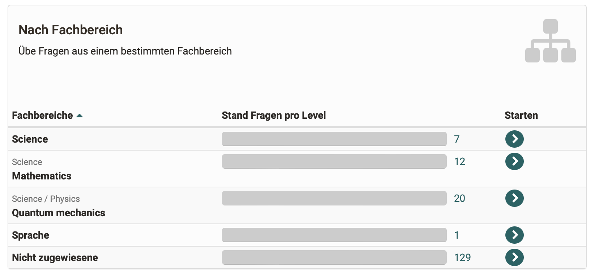
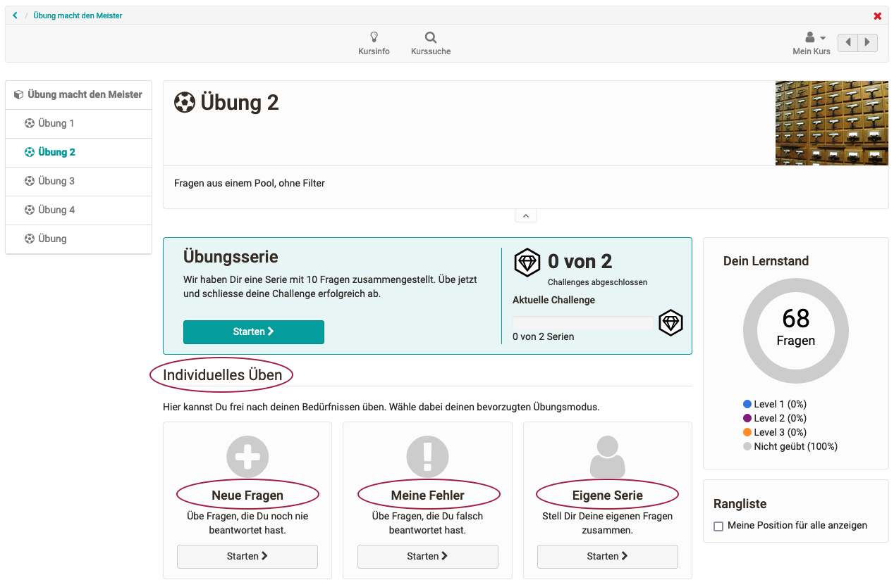

# Kursbaustein "Übung" {: #course_element_uebung}

## Steckbrief

Name | Übung
---------|----------
Icon | { class=size24  }
Verfügbar seit | Release 17.0
Funktionsgruppe | Wissensüberprüfung
Verwendungszweck | Wissenstransfer und Selbstüberprüfung 
Prinzip | Es muss eine definierte Anzahl von Fragen beantwortet werden. Nicht korrekt beantwortete Fragen werden nach dem Lernkarten-Prinzip erneut abgefragt und wiederholt.
Bewertbar | zur Selbstbeurteilung, Betreuer sehen Arbeitsstand, Bewertung erfolgt durch Zuordnung zu Levels
Spezialität / Hinweis | Übungsfragen können im Fragenpool verwaltet werden

---

## Funktionsprinzip

Der Kursbaustein "Übung" funktioniert nach dem Prinzip einer Lernkartei. Die Fächer entsprechen Levels.

{ class="shadow lightbox" }

!!! info "Info"

    Alle Fragen müssen automatisch korrigierbar sein. Es sind deshalb keine Fragetypen erlaubt, die zwingend eine manuelle Beurteilung erfordern, wie z.B. "Freitexteingabe" oder "Zeichnen".

---

### Level

Um auch ohne Bewertung (Punkte) die eigene Leistung einschätzen zu können, wird zu jeder Frage ein Lernstand als Level angezeigt.
Ein Level zeigt an, wie erfolgreich eine Frage beantwortet wurde.

**Zurückstufung** 
Wurde eine Frage z.B. 3 mal hintereinander richtig beantwortet, ist sie in Level 3. Wird sie dann einmal nicht richtig beantwortet, sinkt sie wieder in Level 2.

**Systemweite Verfügbarkeit** 
Die Ergebnisse (persönliches Level bei einer Frage) werden bei dem/der jeweiligen Teilnehmer:in gespeichert. Sie stehen so global im ganzen System zur Verfügung. Auch wenn der/die Teilnehmer:in an einem anderen Kurs teilnimmt.

Das heisst, wenn eine Frage z.B. schon zweimal richtig beantwortet wurde und dadurch in Level 2 eingestuft ist, merkt sich OpenOlat: Lerner:in A hat die Frage y in Level 2.
Kommt in einem anderen Kursbaustein Übung oder in einem ganz anderen Kurs diese Frage wieder vor, fängt Lerner:in A dort nicht bei 0 an, sondern baut auf seinem/ihrem bereits erreichten Stand auf.

Das kann sogar bedeuten, dass jemand einen Kurs zum ersten Mal betritt und dort in der Lernstandanzeige eines Kursbausteins Übung entdeckt, dass schon ein gewisser Prozentsatz erreicht ist.

---

### Übungsserien

Fragen werden immer in Übungsserien von beispielsweise 10 Fragen gestellt. Die Anzahl der Fragen kann pro Übungsserie festgelegt werden.

Für die Übungsserien können Fragen

* aus mehreren Lernressourcen (verschiedene Test-Lernressourcen) 
* oder aus Shares (frei gegebenen Fragen eines Fragenpools) 

zusammengestellt werden. 

Die Lernressourcen und Shares, die für die Erstellung der Übungsserien zur Verfügung stehen sollen, müssen von den Autor:innen in der Konfiguration des Kursbausteins angegeben werden.

Auch die Zusammenstellung eigener Fragenserien durch Teilnehmer:innen ist möglich. Lernende können sich damit ganz individuell auf bestimmte Fachbereiche fokussieren und auf Grundlage der Taxonomie für sie relevante Fragen herausfiltern.

---

### Challenges

Mehrere Übungsserien ergeben eine Challenge. Eine Challenge ist ein Zwischenziel, erreichbar durch Abarbeiten einer bestimmten Anzahl Serien.

Die Gesamtanzahl der Challenges kann festgelegt werden.

Nach Abschluss einer Challenge sind neben der Einordnung in Ranglisten detaillierte Statistiken zum Lernstand sowie eine zusammenfassende Übersicht verfügbar.

---

## Konfiguration

Wie bei allen Kursbausteinen wird zur Konfiguration vom Autor der Kursbaustein Übung im Kursmenü ausgewählt. Vor allem im **Tab „Konfiguration“** finden sich dann die Einstellmöglichkeiten und Settings.

{ class="shadow lightbox" }

### Ressourcen

Im Unterschied zu den meisten anderen Kursbausteinen, können im Kursbaustein Übung **mehrere Lernressourcen** eingebunden werden. Die im Kursbaustein Übung verwendeten Fragen entstammen dem Fragenpool oder Test-Lernressourcen. 

Aktuell gibt es 2 Möglichkeiten, Fragen in den Kursbaustein Übung einzufügen:

* Zum einen können Sie eine **Lernressource Test** einbinden, wie Sie es auch in den Kursbausteinen Test und Selbsttest tun. Dann können die Fragen aus den Tests geübt werden.

* Zum anderen können via **Share** Fragen eingefügt werden. Shares sind freigegebene Fragenpakete aus dem Fragenpool (Listen, Freigaben, Gruppenfreigaben).

Späteres Ändern oder Hinzufügen von Fragen ist möglich.

### Kriterien
  Durch die Festlegung von Kriterien für Taxonomie und Metadaten lassen sich gezielt die gewünschten Fragen herausfiltern.

### Übungssettings

In den Übungssettings wird von den Autor:innen festgelegt:

* Anzahl Levels 
* Anzahl Fragen pro Serie
* Anzahl Serien pro Challenge
* Anzahl Challenges, die als Erledigungskriterium erforderlich sind

In einer Übersicht sind alle zur Verfügung stehenden Fragen angezeigt (nach Fachbereichen/Taxonomie gruppiert).

!!! info "Beachten Sie:"

    Es handelt sich um Verknüpfungen der Fragen. Es werden keine Kopien der Fragen im Kursbaustein abgelegt. Wenn also eine Frage verändert oder gelöscht wird, ist sie auch im Kursbaustein Üben entsprechend geändert oder weg.

---

## Üben praktisch

### Vorgegebene Übungen

Betreuer:innen können in der Konfiguration des Kursbausteins steuern, welche Fragen die automatisch zusammengesetzten Übungsserien enthalten.

{ class="shadow lightbox" }

Die Filterung nimmt der/die Autorin vor im Kurseditor durch die Einstellungen im Abschnitt "Kriterien":

* Auswahl der entsprechenden Lernressourcen
* Eingrenzung auf eine bestimmte Taxonomie 
* Fragen ohne Fachbereich nicht mit einbeziehen
* weitere Eingrenzung auf bestimmte enthaltene Metadaten

Ausserdem können die Teilnehmer:innen auch nach Fachbereich üben, die entsprechend der Vorauswahl der Autor:innen angeboten werden.

{ class="shadow lightbox" }

### Selbst zusammengestellte Übungen

Lernende können sich aus dem enthaltenen Fragenpaket auch eine eigene Fragenserie zusammenstellen oder eine vorgegebene Auswahl, eine individuelle Übungsserie, benutzen.

Ab der zweiten Runde kann der Lernende dann entscheiden, ob er nur vollständig neue oder die falsch beantworteten Fragen bearbeiten möchte. 

Für das individuelle Üben nach eigenen Bedürfnissen können die Teilnehmer:innen deshalb zwischen 3 verschiedenen Modi wählen:

**Neue Fragen**: Üben mit Fragen, die der/die Teilnehmer:in bisher noch nie beantwortet hat  

**Meine Fehler**: Üben mit Fragen, die schon einmal von dem/der Teilnehmer:in falsch beantwortet wurden

**Eigene Serie**: Üben mit einer selbst zusammengestellten Fragenserie

{ class="shadow lightbox" }

### Feedbacks

Die Rückmeldung an den Lernenden, ob er eine Frage richtig oder falsch beantwortet hat, wird unmittelbar im Anschluss an die Bearbeitung einer Frage gegeben. 

Zum gesamten Üben kann der Lernende z.B. Informationen zu seiner Lernzeit abrufen.

Auch Ranglisten sind möglich, falls gewünscht.

Betreuer:innen können beim Anwählen des Kursbausteins einer Liste entnehmen, welche Teilnehmer:inen bereits mit dem Üben begonnen haben oder wie weit sie mit dem Üben sind.

Da von Betreuer:innen keine manuellen Bewertungen vorgenommen werden, sind auch keine Feedbacks durch Betreuer:innen vorhanden.

---

## Vergleich: Test - Selbsttest - Übung

Kursbaustein Test | Kursbaustein Selbsttest | Kursbaustein Übung
---------|----------|----------
 { class=size24  } | { class=size24  } | { class=size24  }
mit Punkten | mit Punkten  | ohne Punkte 
einsehbar für Betreuer |  nicht einsehbar für Betreuer | einsehbare Level Lernstand pro Level  Schwerpunktsetzung durch Teilnehmer:in
1 Test-Lernressource | 1 Test-Lernressource | mehrere Lernressourcen Freigaben/Shares aus dem Fragenpool Filter mit Verwendung der Taxonomie

 

:octicons-device-camera-video-24: **Video-Einführung**: [Der Kursbaustein Übung](<https://www.youtube.com/embed/ljbqzYLn0Zs>){:target="_blank”} 

