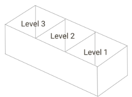
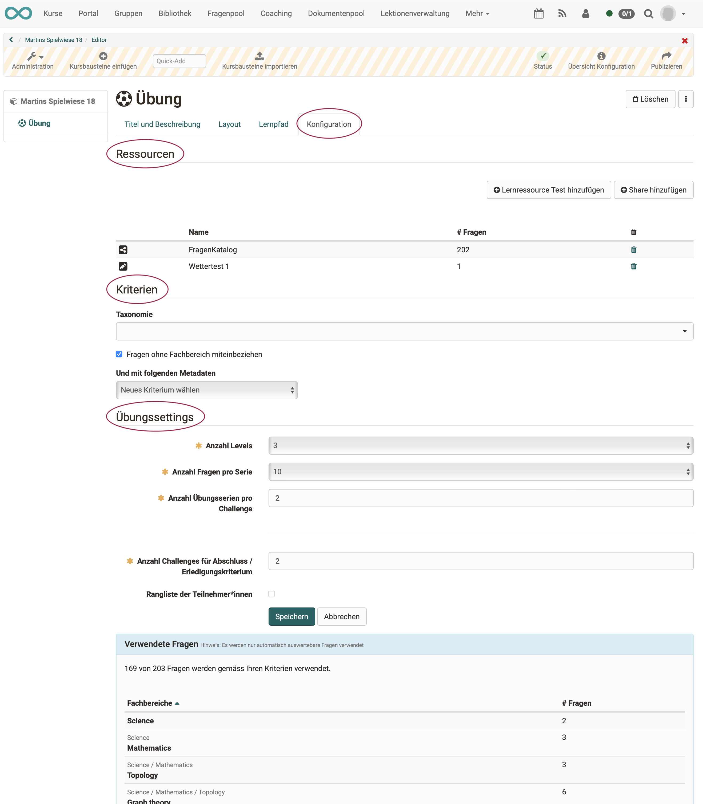
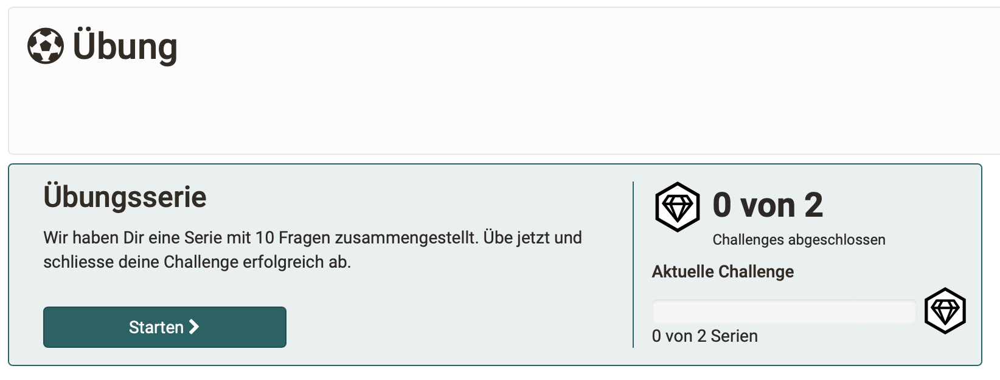
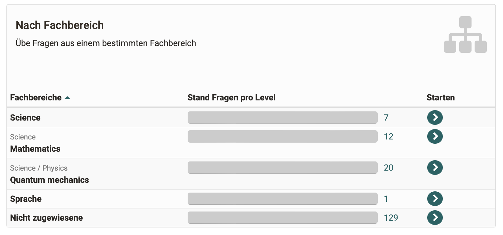
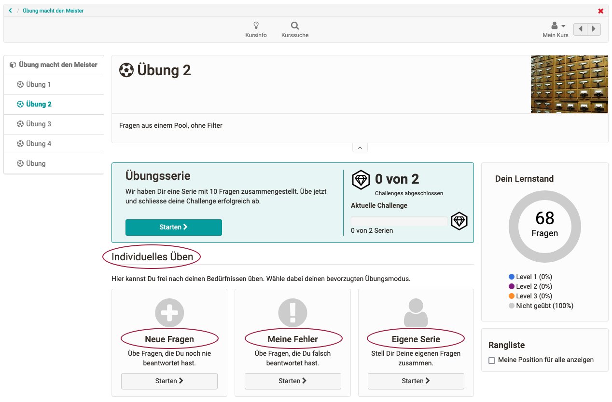

# Course Element "Practice" {: #course_element_uebung}

## Profile {: #profile}

Name | Task
---------|----------
Icon | :fontawesome-regular-futbol:
Available since | Release 17
Functional group | Assessment
Purpose | Knowledge transfer and self-examination. A defined number of questions must be answered. Questions that are not answered correctly are asked again and repeated according to the flashcard principle. 
Assessable | no
Specialty / Note | Exercise questions can be managed in the question pool

---

## Operating principle {: #operating_principle}

The course element "Practice" works according to the principle of a flashcard. The subjects correspond to levels.

{ class="shadow lightbox" }

!!! info "Info"

    All questions must be automatically correctable. Therefore, no question types are allowed that require mandatory manual assessment, such as "free text entry" or "drawing".

---

### Level {: #level}

In order to be able to assess one's own performance even without evaluation (points), a learning level is displayed for each question. A level indicates how successfully a question was answered.

**Downgrading** 
For example, if a question was answered correctly 3 times in a row, it is in level 3. If it is then not answered correctly once, it drops back to level 2.

**System wide availability** 
The results (personal level for a question) are stored with the respective participant. They are thus available globally throughout the system. Even if the participant takes part in another course.

This means, for example, that if a question has already been answered correctly twice and is therefore classified in level 2, OpenOlat remembers: Learner A has question y in level 2. If this question comes up again in another course element exercise or in a completely different course, Learner A does not start there from 0, but builds on his/her already achieved level.

This can even mean that someone enters a course for the first time and discovers there in the learning status display of a course element exercise that a certain percentage has already been reached.

---

### Exercise series {: #exercise_series}

Questions are always asked in exercise series of, for example, 10 questions. The number of questions can be set per exercise series.

For the exercise series questions can be compiled

* from several learning resources (different test learning resources) 
* or from shares (freely given questions of a question pool) 

The learning resources and shares that should be available for the creation of the exercise series have to be specified by the author in the configuration of the course element.

It is also possible for participants to compile their own series of questions. Learners can thus focus individually on specific subject areas and filter out questions relevant to them on the basis of the taxonomy.

---

### Challenges {: #challenge}

Several series of exercises make up a challenge. A challenge is an intermediate goal that can be reached by completing a certain number of series.

The total number of challenges can be set.

After completion of a challenge, detailed statistics on the learning status as well as a summary overview are available in addition to the ranking.

[To the top of the page ^](#course_element_uebung)

---

## Configuration tab {: #configuration}

As with all course elements, the author selects the course element Exercise in the course menu for configuration. Especially in the **tab "Configuration"** you will find the setting options and settings.

{ class="shadow lightbox" }

###  Ressources {: #resources}

In contrast to most other course elements, the course element Practice allows you to integrate **several learning resources**. The questions used in the course element practice come from the question pool or test learning resources.

Currently there are 2 ways to insert questions into the Course element Practice:

* On the one hand, you can include a **learning resource Test**, as you do in the course elements Test and Self-Test. Then the questions from the tests can be practiced.

* Second, you can insert questions from the **question pool**. You can insert question sets from lists, shared items, and group shares.

Later modification or addition of questions is possible.

###  Criteria {: #criteria}

By defining criteria for taxonomy and metadata, the desired questions can be specifically filtered out.

* You can specify multiple taxonomy categories to which the questions must be assigned.
* Since not all questions are assigned to a specific subject area, it may also be permissible to include questions that are not assigned to a subject area.
* The following metadata options are available for filtering: test type, keyword, language, and level. (Filter criteria based on this metadata can also be combined.)

###  Practice settings {: #practice_settings}

In the practice settings, the author determines:

* Number of levels (how many times a question should be answered correctly)
* Number of questions per series (how many questions to answer per exercise set)
* Number of series per challenge
* Number of challenges required as completion criteria

###  Used questions {: #questions}

An overview displays all questions available for review based on the criteria (grouped by subject area/taxonomy).

!!! info "Please note:"

    These are links to the questions. No copies of the questions are stored in the course module. Therefore, if a question is modified or deleted, it is also modified or removed in the Exercise course module.

[To the top of the page ^](#course_element_uebung)

---

## Practice practically {: #practice_practically}

### Given practices {: #given_practices}

In the configuration of the course element, coaches can control which questions are included in the automatically assembled series of exercises.

{ class="shadow lightbox" }

The filtering is done by the author in the course editor through the settings in the "Criteria" section:

* Selection of the appropriate learning resources
* Confinement to a specific taxonomy
* Do not include questions without subject area
* further narrowing down to specific contained metadata

In addition, the participants can also practice by subject area, which will be offered according to the pre-selection of the authors.

{ class="shadow lightbox" }

### Self compiled exercises {: #self_compiled_exercises}

Learners can also compose their own question series from the included question set or use a predefined selection, an individual practice series.

From the second round onwards, the learner can then decide whether to work only on completely new questions or on those that were answered incorrectly. 

For individual practice according to their own needs, participants can therefore choose between 3 different modes:

**New questions**: Practice with questions that the participant has never answered before.

**My mistakes**: Practice with questions that have already been answered incorrectly by the participant.

**Individual series**: Practice with a series of questions you put together yourself

{ class="shadow lightbox" }

### Feedbacks {: #feedbacks}

Feedback to the learner on whether he or she answered a question correctly or incorrectly is provided immediately following the completion of a question.

For the entire practice, the learner can, for example, retrieve information about his learning time.

Rankings are also possible, if desired.

When selecting a course element, coaches can see from a list which participants have already started practicing or how far they are in practicing.

Since no manual evaluations are carried out by coaches, no feedbacks by coaches are available.

[To the top of the page ^](#course_element_uebung)

---

## Comparison: Test - Self-test - Practice {: #comparison}

Course element Test | Course element Self-test | Course element Practice
---------|----------|----------
 :fontawesome-solid-square-pen: | :fontawesome-solid-square-pen: | :fontawesome-regular-futbol:
with score | with score  | without score 
visible for coaches|  not visible for coaches | einsehbare Level Learning level per level  Emphasis by participant:in
1 test learning resource | 1 test learning resource | multiple learning resources Shares/Shares from the question pool filter with use of taxonomy

[To the top of the page ^](#course_element_uebung)