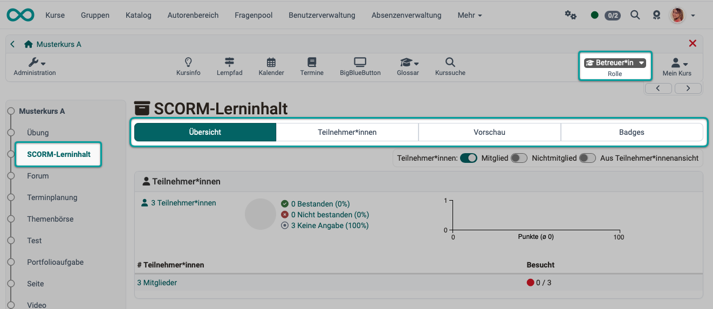
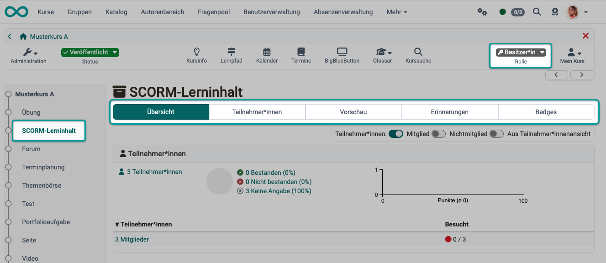
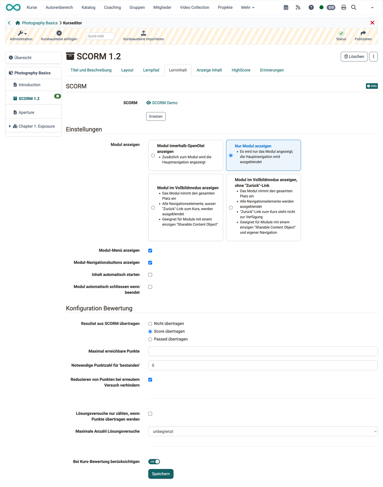
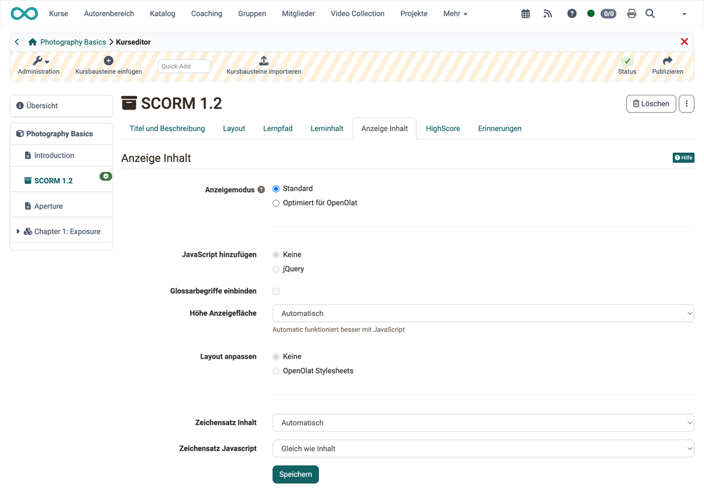
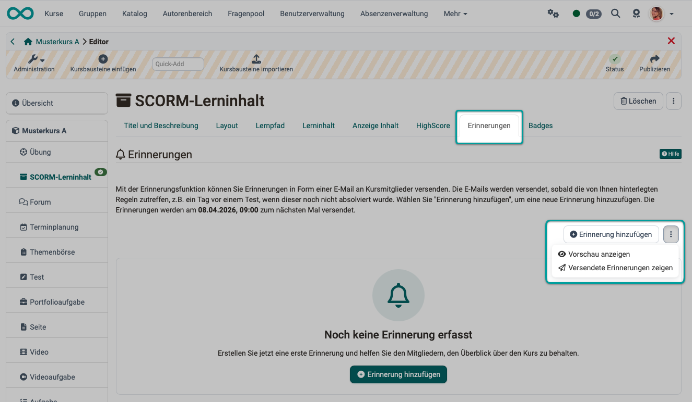

# Kursbaustein "SCORM 1.2" {: #course_element_scorm}

## Steckbrief {: #profile}

Name | SCORM 1.2
---------|----------
Icon | :o_icon_o_scorm_icon:
Funktionsgruppe | Wissensvermittlung
Verwendungszweck | Integration von SCORM-Paketen, die mit anderen Autorenwerkzeugen erstellt wurden
Bewertbar | ja
Spezialität / Hinweis |

SCORM steht für "Sharable Content Object Reference Model" und ist ein standardisiertes E-Learning-Format für interaktive E-Learning Module, das von OpenOlat unterstützt wird. Über den Kursbaustein "SCORM 1.2" können SCORM-1.2-Lerninhalte in OpenOlat-Kurse eingebunden werden. Das SCORM-Paket muss extern mit einem anderen Tool erstellt werden. Der als Lernressource verwendete Lerninhalt selbst heisst dabei "SCORM 1.2". [:octicons-tag-16:{ title="ab Release 20.3.0 (OO-9345)" }](https://track.frentix.com/issue/OO-9345){:target="_blank"}

## Ansicht als Betreuer:in {: #coach_view}

{ class="shadow lightbox" }

[Zum Seitenanfang ^](#course_element_scorm)

---

## Ansicht als Besitzer:in {: #owner_view}

Als Besitzer:in haben Sie im Vergleich zu Betreuer:innen im Run-Mode zusätzlich die Möglichkeit Erinnerungen einzurichten.

{ class="shadow lightbox" }

[Zum Seitenanfang ^](#course_element_scorm)

---

## Bearbeitung im Editor {: #editor}

Als Kursbesitzer:in erstellen und bearbeiten Sie den Kursbaustein "SCORM 1.2" wie alle anderen Kursbausteine im Kurseditor: `Kurs > Administration > Kurseditor`. Anschliessend können Sie in den Tabs die weitere Konfiguration vornehmen.

### Tab "Lerninhalt" {: #editor_tab_learning_content}

Im Tab "Lerninhalt" wählen Sie das SCORM-Paket aus und bestimmen, wie es sich den Teilnehmenden zeigt und ob seine Resultate in die Bewertung einfliessen. Der Tab gliedert sich in die Bereiche "SCORM", "Einstellungen" und "Konfiguration Bewertung".

{ class="shadow lightbox" }

#### SCORM {: #scorm }

Wählen oder importieren Sie einen SCORM-Inhalt. Klicken Sie auf "Auswählen oder importieren", um ein neues SCORM-Paket hochzuladen, oder wählen Sie ein bestehendes SCORM-Paket aus Ihren Einträgen aus. SCORM-Pakete können nicht nur im Kurseditor, sondern auch im "Autorenbereich" importiert werden. Wenn Sie noch keine ZIP-Datei als SCORM-Lerninhalt ausgewählt haben, erscheint beim Feld **SCORM** die Meldung _Kein SCORM 1.2 ausgewählt_.

!!! note "Importieren"
    Beschreibung des Imports von Lernressourcen im Autorenbereich. 
    [Aktionen im Autorenbereich > Importieren](../area_modules/authoring_new_course.de.md#lernressourcen-importieren)

Wenn Sie schon einen SCORM-Lerninhalt hinzugefügt haben, erscheint dessen Name als Link. Folgen Sie dem Link um zur Vorschau zu gelangen. Um die Zuordnung eines SCORM-Lerninhaltes nachträglich zu ändern, klicken Sie im Tab "Lerninhalt" auf "Ersetzen" und wählen anschliessend ein anderes SCORM-Paket aus.

#### Modul anzeigen {: #display_module }

Sie haben 4 Varianten zur Auswahl:

**Modul innerhalb OpenOlat anzeigen:** 
Zusätzlich zum SCORM-Modul wird die Hauptnavigation oben in der Kopfzeile angezeigt.

**Nur Modul anzeigen:** 
Ist diese Variante gewählt, wird die Hauptnavigation mit dem Öffnen des Kursbausteins ausgeblendet. Stattdessen wird das SCORM Modul im ganzen Browserfenster dargestellt.

**Modul im Vollbildmodus anzeigen:** 
\- Das Modul nimmt den gesamten Platz ein 
\- Alle Navigationselemente, ausser "Zurück"-Link zum Kurs, werden ausgeblendet 
\- Geeignet für Module mit einem einzigen "Sharable Content Object"

**Modul im Vollbildmodus anzeigen, ohne "Zurück"-Link:**  
\- Das Modul nimmt den gesamten Platz ein. 
\- Alle Navigationselemente werden ausgeblendet. 
\- Der "Zurück"-Link zum Kurs steht nicht zur Verfügung. 
\- Geeignet für Module mit einem einzigen "Sharable Content Object" und eigener Navigation.

Bei den beiden Vollbild-Varianten blendet OpenOlat die Felder "Modul-Menü anzeigen" und "Modul-Navigationsbuttons anzeigen" aus.

#### Modul-Menü anzeigen {: #show_module_menu }

Ist diese Checkbox markiert, zeigt OpenOlat links das Menü des SCORM-Pakets an. Dieses Menü listet die Kapitel des Pakets, die "Sharable Content Objects" (SCO), und ersetzt das Kursmenü, solange der SCORM-Inhalt geöffnet ist. Viele SCORM-Inhalte bringen eine eigene Navigation mit. In diesem Fall können Sie das Modul-Menü ausblenden, damit der SCORM-Inhalt mehr Platz erhält. Wird der SCORM-Inhalt verlassen (Klick auf "Zurück"), erscheint wieder das Kursmenü.

#### Modul-Navigationsbuttons anzeigen {: #show_module_navigation_buttons }

Besteht ein SCORM-Lerninhalt aus mehreren SCO, zeigt OpenOlat mit dieser Option Vor- und Zurückbuttons an, mit denen die Lernenden zwischen den SCO wechseln.

#### Inhalt automatisch starten {: #skip_launch_page }

Mit dieser Option startet der SCORM-Inhalt sofort, sobald im Kursmenü der Kursbaustein mit dem SCORM-Inhalt ausgewählt wird. Wenn Sie diese Option nicht aktivieren, wird stattdessen eine Startseite angezeigt.

#### Modul automatisch schliessen wenn beendet {: #close_module_on_finish }

Der SCORM-Lerninhalt wird automatisch geschlossen, sobald er beendet ist und die Benutzer:innen kehren in die Kursansicht zurück.

#### Resultat aus SCORM übertragen {: #transfer_score }

Korrekt erstellte SCORM-Pakete können bestimmte Parameter (Punkte, Bestanden, ...) an das LMS übergeben. Mit dieser Option übernimmt das OpenOlat-Bewertungssystem die Resultate aus dem SCORM-Paket. 
**Nicht übertragen:** Evtl. übergebene Werte aus dem SCORM-Paket werden in OpenOlat nicht berücksichtigt. 
**Score übertragen:** Die vom SCORM-Paket übergebenen Punkte werden in die Punkteauswertung von OpenOlat übernommen. 
**Passed übertragen:** Es wird nur ein vom SCORM-Paket gemeldetes "Bestanden" oder "Nicht bestanden" von OpenOlat übernommen, eine dafür zugrunde liegende Punktezahl ist nicht relevant. Entsprechend ist bei dieser Option auch eine Angabe der maximalen oder notwendigen Punktzahl obsolet und wird nicht angezeigt.

#### Maximal erreichbare Punkte {: #maximum_score }

Wird ein Score (eine Punktzahl) an OpenOlat übertragen, kann hier ein Maximum angegeben werden. Diese Begrenzung ist erforderlich, wenn im SCORM-Lerninhalt z.B. sehr viel mehr Punkte vergeben werden, als im OpenOlat-Kurs. Wenn dann die Option "Bei Kurs-Bewertung berücksichtigen" gewählt ist, könnte der Kursbaustein "SCORM 1.2" unverhältnismässig hohes Gewicht bekommen.

#### Notwendige Punktzahl für 'bestanden' {: #score_needed_to_pass }

Wird ein Score (eine Punktzahl) an OpenOlat übertragen, kann hier mit einem ganzzahligen Wert festgelegt werden, wie viele Punkte erreicht sein müssen, damit der Kursbaustein als bestanden gilt.

#### Reduzieren von Punkten bei erneutem Versuch verhindern {: #prevent_decreasing_score }

Wird der Kursbaustein mehrfach aufgerufen, werden einmal dort erreichte Punkte nicht zurückgesetzt, wenn bei einem neuen Versuch weniger Punkte erreicht werden. Ein erneuter Versuch kann also ein bereits bestehendes Resultat nicht verschlechtern. Das Feld erscheint nur, wenn unter "Resultat aus SCORM übertragen" die Option "Score übertragen" oder "Passed übertragen" gewählt ist.

#### Lösungsversuche nur zählen, wenn Punkte übertragen werden {: #count_attempts_if_score_transferred }

Die Lösungsversuche werden für Benutzer:innen nur dann gezählt, wenn auch Punkte vom SCORM-Paket an OpenOlat übertragen werden. Je nachdem, wann der SCORM-Lerninhalt die Punkte liefert (z.B. regelmässig oder nur am Ende der Bearbeitung), greift die Option bereits, wenn Benutzer:innen einen Teil im SCORM-Lerninhalt bearbeitet haben, oder erst wenn der SCORM-Lerninhalt geschlossen wird.

#### Maximale Anzahl Lösungsversuche {: #max_attempts }

Sie können in einem Drop-Down-Menü angeben, wie viele Lösungsversuche für diesen SCORM-Kursbaustein zugelassen sind (unbegrenzt oder Werte zwischen 1 und 20).

#### Bei Kurs-Bewertung berücksichtigen {: #include_in_course_assessment }

Mit diesem Toggle-Button wird bestimmt, ob das Bestehen des Kursbausteins und die eventuell hier erreichten Punkte in die Gesamtbewertung des Kurses einfliessen.

[Zum Seitenanfang ^](#course_element_scorm)

---

### Tab "Anzeige Inhalt" [:octicons-tag-16:{ title="ab Release 9.0.0 (OO-619)" }](https://track.frentix.com/issue/OO-619) {: #editor_tab_display_content}

Im Tab "Anzeige Inhalt" bestimmen Sie, wie OpenOlat den SCORM-Inhalt im Kurs darstellt. Im Anzeigemodus "Standard" sind die Felder "JavaScript hinzufügen", "Glossarbegriffe einbinden" und "Layout anpassen" nicht wählbar, sie greifen erst im Modus "Optimiert für OpenOlat".

{ class="shadow lightbox" }

#### Anzeigemodus {: #display_mode }

Wählen Sie den Modus "Standard" um die Ressource unverändert anzuzeigen. Dieser Modus ist geeignet für Ressourcen, bei denen es im Modus "Optimiert für OpenOlat" zu Anzeigeproblemen kommt. Bei SCORM-Lerninhalten ist der Modus "Standard" empfohlen, denn auf die Gestaltung des SCORM-Inhalts (Seitenverhältnis usw.) hat OpenOlat keinen Einfluss. 
Wählen Sie den Modus "Optimiert für OpenOlat", wenn Sie 
\- das Kurslayout in der Seite einbinden und auf den SCORM-Inhalt anwenden wollen, 
\- eine JavaScript-Bibliothek verwenden möchten, 
\- das OpenOlat-Glossar auf dieser Seite anwenden wollen 
\- oder die Höhe der Seite automatisch berechnet werden soll.

#### JavaScript hinzufügen {: #embed_javascript }

Um die Funktionen des Anzeigemodus "Optimiert für OpenOlat" nutzen zu können, muss die JavaScript-Bibliothek "jQuery" aktiviert sein. Wenn es zu Anzeigeproblemen mit Ihren Inhalten kommt, wählen Sie keine Bibliothek.

#### Glossarbegriffe einbinden {: #embed_glossary_terms }

Wählen Sie diese Option um die Möglichkeit der Hervorhebung von Glossarbegriffen zu aktivieren, falls Sie in Ihrem Kurs ein Glossar konfiguriert haben. Diese Option setzt die Verwendung der JavaScript Bibliothek "jQuery" voraus.

#### Höhe Anzeigefläche {: #display_height }

Mit diesem Drop-Down-Menü können Sie die Höhe der Fläche zur Inhaltsanzeige bestimmen. Sie haben die Möglichkeit, sie via "Automatisch" auf die jeweilige Fensterhöhe zu setzen oder Sie weisen einen bestimmten Wert zu. Die Einstellung "Automatisch" funktioniert besser, wenn JavaScript eingebunden ist.

#### Layout anpassen {: #adapt_layout }

Wählen Sie die Option "OpenOlat Stylesheets" um das in OpenOlat und im Kurs definierte Layout in Ihre Seite zu übernehmen (Schriftart, Farben, Grösse etc.). Wenn Sie diese Anpassung nicht wünschen, wählen Sie die Option "Keine".

#### Zeichensatz Inhalt {: #content_character_set }

OpenOlat versucht, den Zeichensatz automatisch zu erkennen. Wenn die Option "Automatisch" nicht zu der gewünschten Anzeige führt, kann die Kodierung des Inhalts anhand eines vordefinierten Zeichensatzes konfiguriert werden. (Ist keine Kodierung vorhanden, wird per Default der Zeichensatz ISO-8859-1 verwendet).

#### Zeichensatz Javascript {: #javascript_character_set }

Erlaubt die Kodierung des Javascript-Codes anhand eines vordefinierten Zeichensatzes (per Default wird der gleiche Zeichensatz für Inhalt und Javascript verwendet).

!!! note "Hinweis"

    SCORM-Lerninhalte werden normalerweise mit Startseite angezeigt. Wenn ein SCORM-Lerninhalt Aufgaben und Tests beinhaltet, werden auf dieser Startseite die erreichte Punktzahl und die verbleibenden Versuche, den Lerninhalt erfolgreich zu absolvieren, ermittelt.

[Zum Seitenanfang ^](#course_element_scorm)

---

### Tab "HighScore" {: #editor_tab_highscore}

Im Tab "HighScore" aktivieren und konfigurieren Sie eine Highscore-Übersicht für diesen Kursbaustein. Die Übersicht vergleicht die Ergebnisse der Teilnehmenden und ordnet das individuelle Ergebnis im Vergleich ein. Der Tab ist nur aktiv, wenn im Tab "Lerninhalt" unter "Resultat aus SCORM übertragen" die Option "Score übertragen" oder "Passed übertragen" gewählt ist.

!!! note "Highscore"
    Beschreibung der Highscore-Einstellungen. 
    [Kursbausteine > Highscore](Course_Elements.de.md#highscore)

[Zum Seitenanfang ^](#course_element_scorm)

---

### Tab "Erinnerungen" [:octicons-tag-16:{ title="ab Release 16.0.0 (OO-5447)" }](https://track.frentix.com/issue/OO-5447) {: #editor_tab_reminders}

Die Erstellung von Erinnerungen kann durch Kursbesitzer:innen innerhalb des Kurseditors vorgenommen werden oder auch im Run-Mode (bei Aufruf des Kursbausteins ausserhalb des Editors).

Sie können ausser dem Erstellen von Erinnerungen sich über beide Zugangswege auch eine Vorschau und alle versendete Erinnerungen anzeigen lassen.

{ class="shadow lightbox" }

[Zum Seitenanfang ^](#course_element_scorm)

---

### Tab "Badges" :octicons-tag-16:{ title="ab Release 18.0 (OO-6889)" } {: #badges}

Wurde von dem/der Kursbesitzer:in unter `Kurs > Administration > Einstellungen > Tab Bewertung > Abschnitt Badges` die Vergabe von Badges aktiviert, wird im Kurseditor zu diesem Kursbaustein der Tab "Badges" angezeigt und es kann ein spezifischer Badge für diesen Kursbaustein erstellt werden.

[Zum Seitenanfang ^](#course_element_scorm)

---

## Weiterführende Informationen {: #further_information}

[Autorenbereich - Kurse und Lernressourcen erstellen >](../area_modules/authoring_new_course.de.md) 
[Kursbausteine >](Course_Elements.de.md) 
[Bewertung von Kursbausteinen >](Assessment_of_course_modules.de.md) 
[Erinnerungen >](Course_Reminders.de.md) 
[Badges >](OpenBadges.de.md)

[Zum Seitenanfang ^](#course_element_scorm)

