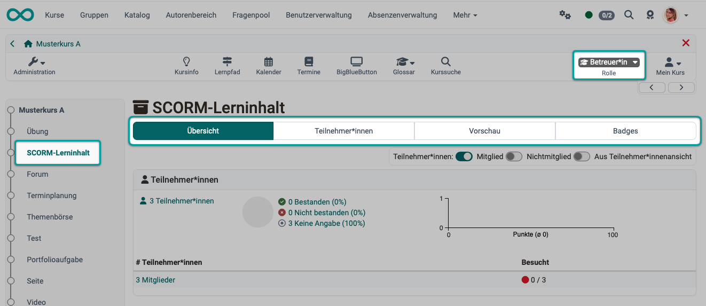
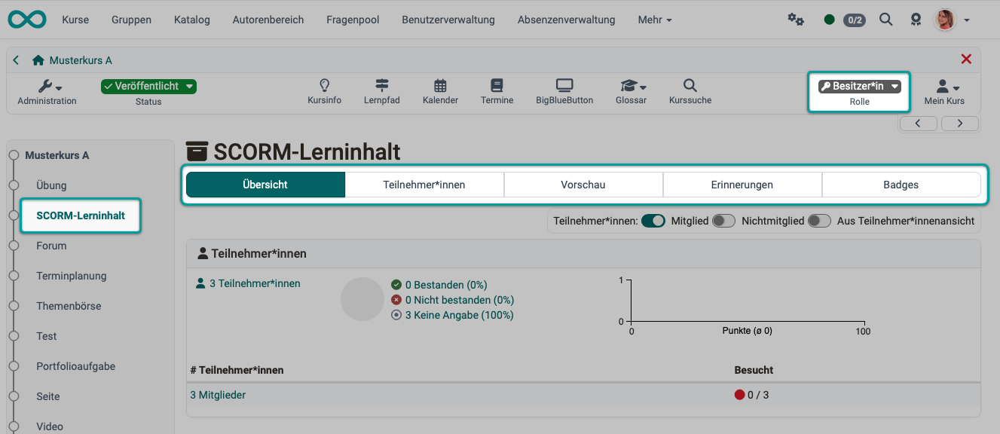
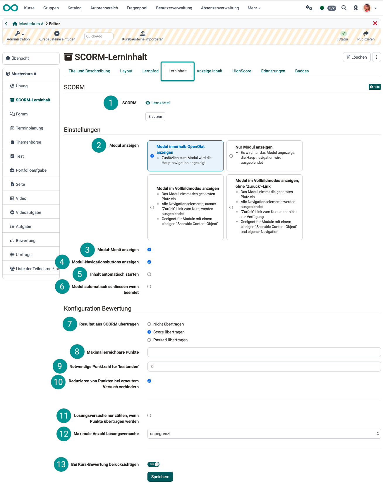
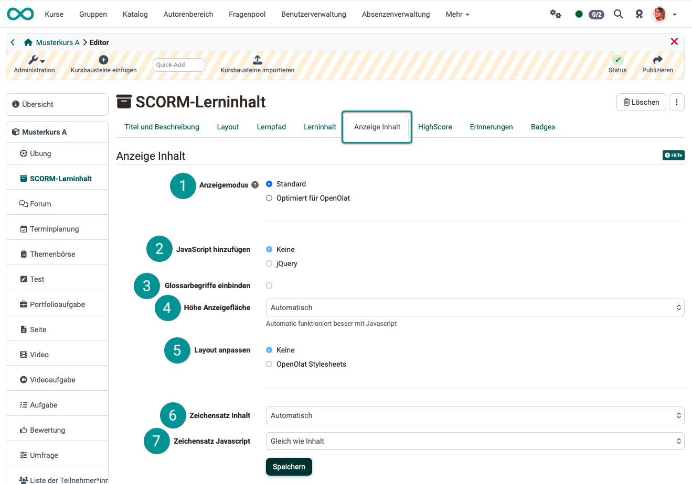
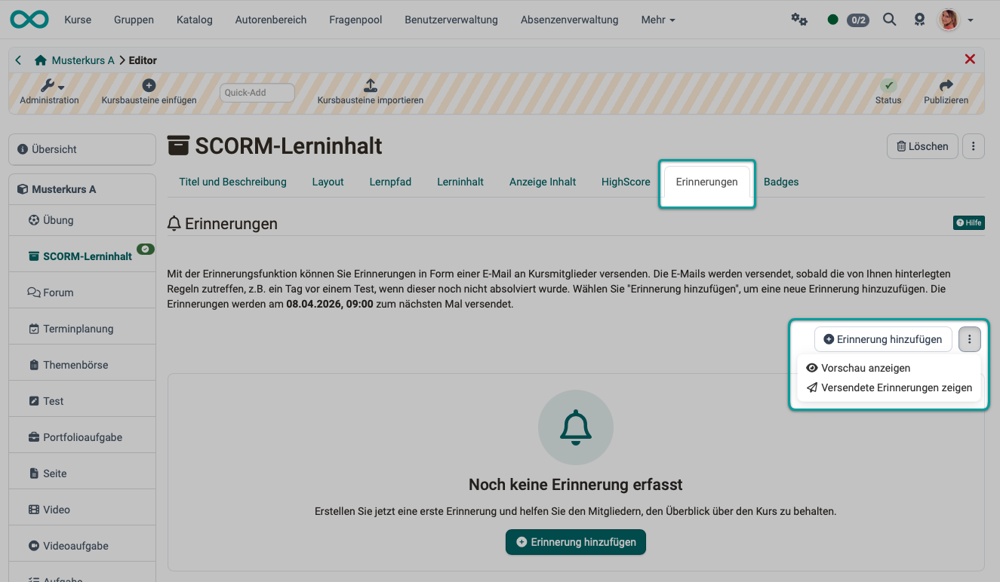

# Course Element "SCORM"
### Rename to SCORM1.2 [:octicons-tag-16:{ title="Available from Release 20.3.0 (OO-9345)" }](https://track.frentix.com/issue/OO-9345){:target="_blank"} {: #course_element_scorm}

## Profile {: #profile}

Name | SCORM
---------|----------
Icon | :fontawesome-solid-box-archive:
Functional group | Knowledge transfer
Purpose | Integration of SCORM packages, created with other authoring tools
Assessable | yes
Specialty / Note | 

SCORM stands for “Shareable Content Object Reference Model” and is a standardized e-learning format for interactive e-learning modules that is supported by OpenOlat. The "SCORM" course element allows SCORM 1.2 learning content to be embedded in OpenOlat courses. The SCORM package must be created externally using another tool. The learning resource used as the content itself is called "SCORM 1.2".

## Coach view {: #coach_view}

{ class="shadow lightbox" }

[To the top of the page ^](#course_element_scorm)

---

## Owner view {: #owner_view}

As an owner, you also have the option to set up reminders, unlike coaches in Run Mode.

{ class="shadow lightbox" }

[To the top of the page ^](#course_element_scorm)

---

## Editing in the editor {: #editor}

As a course owner, you can create and edit the “SCORM” course object just like any other course object by opening the **Course Editor** under **Administration**. You can then configure the settings further using the tabs.

### "Learning Content" tab {: #editor_tab_learning_content}

{ class="shadow lightbox" }

 **SCORM** 

Select or import SCORM content. Click "Import" to upload a new SCORM package, or select an existing SCORM package from your list. SCORM packages can be imported not only in the course editor but also under "Authoring". If you haven't yet selected a ZIP file as SCORM learning content, the message _No SCORM learning content selected_ will appear next to the title **Selected SCORM learning content**.

!!! info "Import"
    Description of importing learning resources in Authoring. 
    [Actions in Authoring > Import](../area_modules/authoring_new_course.md#import-learning-resources)

If you have already added a SCORM learning object, its name will appear as a link. Click the link to view a preview. To change the assignment of a SCORM learning object later, click "Replace SCORM Learning Object" in the "Learning Object" tab and then select a different SCORM package.

 **Show module** 

You have 4 options to choose from:

**Display module within OpenOlat:** 
In addition to the SCORM module, the navigation menu appears at the top of the header.

**Show module only:** 
If this checkbox is selected, OpenOlat and the main navigation bar will be hidden when the course module opens. Instead, the SCORM module will be displayed in the entire browser window.

**View module in full-screen mode:** 
\- The module takes up the entire space 
\- All navigation elements, except for the "Back" link to the course, are hidden 
\- Suitable for modules with a single "Sharable Content Object"

**View module in full-screen mode without the "Back" link:**  
\- The module takes up the entire space. 
\- All navigation elements are hidden. 
\- The "Back" link to the course is not available. 
\- Suitable for modules with a single "Shareable Content Object" and their own navigation.

 **Show module menu** 
The OpenOlat course menu is displayed on the left. Often, SCORM content also includes its own menu. In that case, the additional OpenOlat course menu can be hidden to make more room for the SCORM content. When you exit the SCORM content (by clicking "Back"), the course menu reappears.

 **Show module navigation buttons** 
If a SCORM learning object consists of multiple SCOs (Single Content Objects), it is possible to navigate between these SCOs within OpenOlat using forward and back buttons.

 **Automatically play content** 
With this option, the SCORM content launches immediately when the course module containing the SCORM content is selected from the course menu. If you do not enable this option, a welcome page will be displayed instead.

 **Close module automatically when finished** 
The SCORM learning content closes automatically once it is completed, and users return to the course view.

 **Transfer results from SCORM** 
Properly created SCORM packages can transfer certain parameters (points, pass/fail status, etc.) to the LMS. With this option, the OpenOlat grading system imports the results from the SCORM package.
**Not transferred:** Any values passed from the SCORM package are not taken into account in OpenOlat. 
**Transfer scores:** The scores provided by the SCORM package are imported into OpenOlat's scoring system. 
**Transfer Pass/Fail:** OpenOlat only adopts the "Pass" or "Fail" status reported by the SCORM package; the underlying score is irrelevant. Accordingly, specifying a maximum or required score is unnecessary with this option and will not be displayed.

 **Maximum possible points** 
If a score is transferred to OpenOlat, a maximum score can be specified here. This limit is necessary if, for example, the SCORM learning content awards significantly more points than the OpenOlat course. If the option “"nclude in course assessment" is selected, the "SCORM learning content" course element could be given disproportionately high weight.  

 **Necessary score for "Passed"** 
When a score is submitted to OpenOlat, you can use an integer value here to specify the minimum number of points required for the course module to be considered passed. 

 **Prevent points from being deducted on a retry** 
If the course module is accessed multiple times, points earned in a previous attempt are not reset if fewer points are earned on a subsequent attempt. Therefore, a subsequent attempt cannot result in a lower score than the one already achieved.

 **Attempts to solve the problem only count if points are carried over** 
Attempts to solve problems are only counted for users if points are also transferred from the SCORM package to OpenOlat. Depending on when the SCORM learning content provides the points (e.g., regularly or only at the end of the session), the option takes effect either when users have completed a section of the SCORM learning content or only when the SCORM learning content is closed.

 **Maximum number of attempts** 
You can use a drop-down menu to specify how many attempts are allowed for this SCORM course module (unlimited or a number between 1 and 20).

 **Include in the course assessment** 
This toggle button determines whether passing the course module and any points earned there will be included in the overall course grade.

[To the top of the page ^](#course_element_scorm)

---

### Tab "Display content" {: #editor_tab_display_content}

{ class="shadow lightbox" }

 **Display mode** 
Select "Standard" mode to display the resource as is. This mode is suitable for resources that experience display issues in "Optimized for OpenOlat" mode. For SCORM learning content, "Standard" mode is recommended, as OpenOlat has no control over the layout of the SCORM content (aspect ratio, etc.). 
Select the "Optimized for OpenOlat" mode if you   
\- want to embed the course layout in the page and apply it to the SCORM content,  
\- want to use a JavaScript library, 
\- want to use the OpenOlat glossary on this page 
\- or whether the page height should be calculated automatically.

 **Add JavaScript** 
To use the features of the "Optimized for OpenOlat" display mode, the "jQuery" JavaScript library must be enabled. If you experience display issues with your content, do not select a library.

 **Include glossary terms** 
Select this option to enable the highlighting of glossary terms if you have configured a glossary in your course. This option requires the use of the "jQuery" JavaScript library.

 **Display area height** 
Use this drop-down menu to set the height of the content display area. You can either select "Automatic" to adjust it to the current window height, or you can specify a specific value.

 **Edit layout** 
Select the "OpenOlat Stylesheets" option to apply the layout defined in OpenOlat and in the course to your page (font, colors, size, etc.). If you do not want this customization, select the "None" option.

 **Content Character set** 
OpenOlat attempts to automatically detect the character set. If the "Automatic" option does not produce the desired display, the encoding of the content can be configured using a predefined character set. (If no encoding is specified, the ISO-8899-1 character set is used by default.)

 **JavaScript character set** 
Allows you to encode JavaScript code using a predefined character set (by default, the same character set is used for content and JavaScript).

!!! note "Note"

    SCORM learning content is typically displayed on the home page. If a SCORM learning module includes assignments and tests, the home page displays the score achieved and the number of remaining attempts to successfully complete the learning module.

[To the top of the page ^](#course_element_scorm)

---

### Tab "Reminders" {: #editor_tab_reminders}

Course owners can create reminders within the course editor or in run mode (when accessing the course module outside of the editor).

In addition to creating reminders, you can also use either method to view a preview and all sent reminders.

{ class="shadow lightbox" }

[To the top of the page ^](#course_element_scorm)

---

### Tab "Badges" {: #badges}

If the course owner has enabled badge awarding under `Administration > Settings > Tab Assessment > Badges section`, the "Badges" tab will appear in the course editor for this course element, and a specific badge can be created for it.

[To the top of the page ^](#course_element_scorm)

