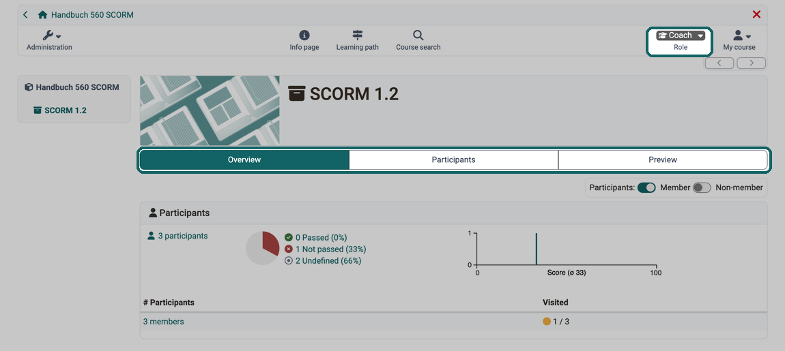
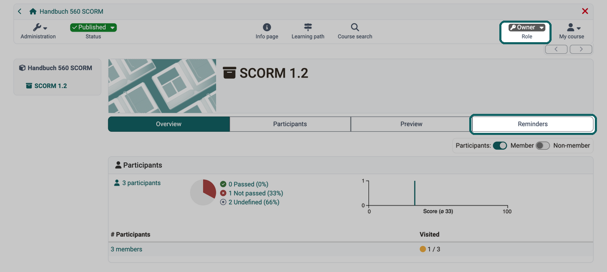
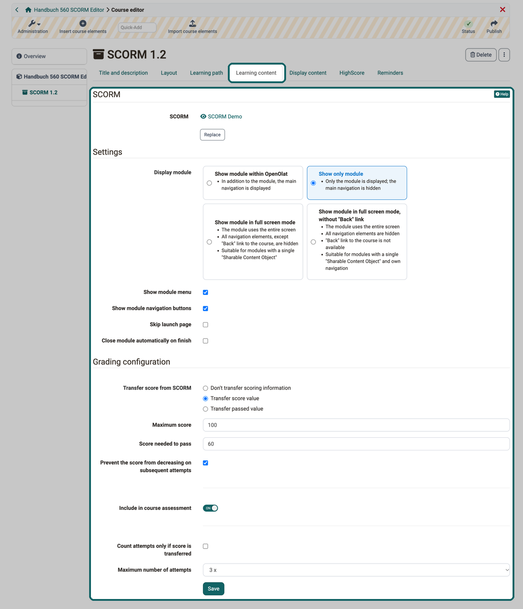
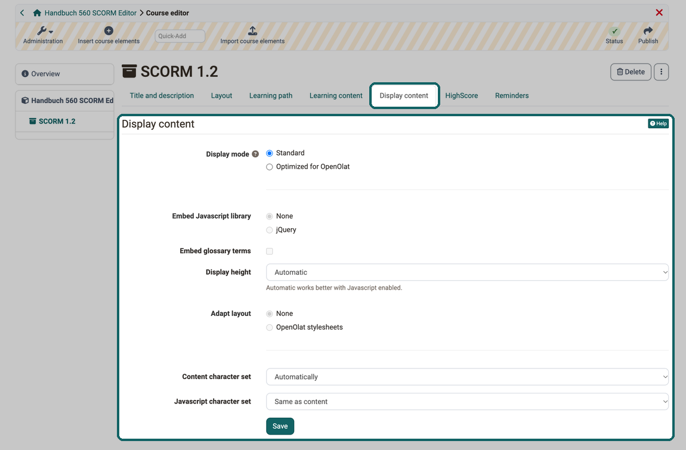
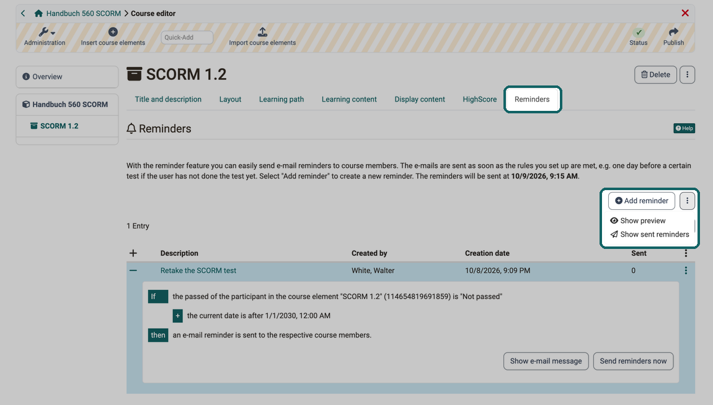

# Course Element "SCORM 1.2" {: #course_element_scorm}

## Profile {: #profile}

Name | SCORM 1.2
---------|----------
Icon | :o_icon_o_scorm_icon:
Functional group | Knowledge transfer
Purpose | Integration of SCORM packages, created with other authoring tools
Assessable | yes
Specialty / Note | 

SCORM stands for "Sharable Content Object Reference Model" and is a standardized e-learning format for interactive e-learning modules that is supported by OpenOlat. The "SCORM 1.2" course element allows SCORM 1.2 learning content to be embedded in OpenOlat courses. The SCORM package must be created externally using another tool. The learning resource used as the content itself is called "SCORM 1.2". [:octicons-tag-16:{ title="from Release 20.3.0 (OO-9345)" }](https://track.frentix.com/issue/OO-9345){:target="_blank"}

## Coach view {: #coach_view}

{ class="shadow lightbox" title="Course view of the SCORM 1.2 course element · 2026.10.08" }

[To the top of the page ^](#course_element_scorm)

---

## Owner view {: #owner_view}

If you open the course element in the course as an owner, you also have the tab "Reminders", unlike coaches, and can set up reminders there.

{ class="shadow lightbox" title="Course view of the SCORM 1.2 course element · 2026.10.08" }

[To the top of the page ^](#course_element_scorm)

---

## Editing in the editor {: #editor}

As a course owner, you can create and edit the "SCORM 1.2" course element just like any other course element in the course editor: `Course > Administration > Course editor`. You can then configure the settings further using the tabs.

### Tab "Learning content" {: #editor_tab_learning_content}

In the "Learning content" tab, you select the SCORM package and determine how it appears to participants and whether its results count towards the assessment. The tab is divided into the areas "SCORM", "Settings" and "Grading configuration".

{ class="shadow lightbox" title="Tab Learning content in the course editor · 2026.10.08" }

#### SCORM {: #scorm }

Select or import SCORM content. Click "Select or import" to upload a new SCORM package, or select an existing SCORM package from your entries. SCORM packages can be imported not only in the course editor but also under "Authoring". If you haven't yet selected a ZIP file as SCORM learning content, the message _No SCORM 1.2 selected_ will appear next to the field "SCORM".

!!! note "Import"
    Description of importing learning resources in Authoring. 
    [Actions in Authoring > Import](../area_modules/authoring_new_course.md#import-learning-resources)

If you have already added SCORM learning content, its name will appear as a link. Click the link to view a preview. To change the assigned SCORM learning content later, click "Replace" in the "Learning content" tab and then select a different SCORM package.

#### Display module {: #display_module }

You have 4 options to choose from:

**Show module within OpenOlat:** 
In addition to the SCORM module, the main navigation is displayed at the top.

**Show only module:** 
If this variant is selected, the main navigation will be hidden when the course element opens. Instead, the SCORM module will be displayed in the entire browser window.

**Show module in full screen mode:** 
\- The module takes up the entire space 
\- All navigation elements, except for the "Back" link to the course, are hidden 
\- Suitable for modules with a single "Sharable Content Object"

**Show module in full screen mode, without "Back" link:**  
\- The module takes up the entire space. 
\- All navigation elements are hidden. 
\- The "Back" link to the course is not available. 
\- Suitable for modules with a single "Sharable Content Object" and their own navigation.

With the two full screen variants, OpenOlat hides the fields "Show module menu" and "Show module navigation buttons".

#### Show module menu {: #show_module_menu }

If this checkbox is selected, OpenOlat displays the menu of the SCORM package on the left. This menu lists the chapters of the package, the "Sharable Content Objects" (SCO), and replaces the course menu while the SCORM content is open. Many SCORM contents come with their own navigation. In this case, you can hide the module menu to give the SCORM content more room. When you exit the SCORM content (by clicking "Back"), the course menu reappears.

#### Show module navigation buttons {: #show_module_navigation_buttons }

If a SCORM learning content consists of multiple SCOs, this option makes OpenOlat display forward and back buttons that let learners move between the SCOs.

#### Skip launch page {: #skip_launch_page }

With this option, the SCORM content launches immediately when the course element containing the SCORM content is selected from the course menu. If you do not enable this option, a launch page will be displayed instead.

#### Close module automatically on finish {: #close_module_on_finish }

The SCORM learning content closes automatically once it is completed, and users return to the course view.

#### Transfer score from SCORM {: #transfer_score }

Properly created SCORM packages can transfer certain parameters (points, pass/fail status, etc.) to the LMS. With this option, OpenOlat takes over the results from the SCORM package into the assessment. 
**Don't transfer scoring information:** Any values passed from the SCORM package are not taken into account in OpenOlat. 
**Transfer score value:** The scores provided by the SCORM package are imported into OpenOlat's scoring system. 
**Transfer passed value:** OpenOlat only adopts the "Passed" or "Failed" status reported by the SCORM package; the underlying score is irrelevant. Accordingly, specifying a maximum or required score is unnecessary with this option and will not be displayed.

#### Maximum score {: #maximum_score }

If a score is transferred to OpenOlat, a maximum score can be specified here. This limit is necessary if, for example, the SCORM learning content awards significantly more points than the OpenOlat course. If the option "Include in course assessment" is selected, the "SCORM 1.2" course element could be given disproportionately high weight.

#### Score needed to pass {: #score_needed_to_pass }

When a score is submitted to OpenOlat, you can use an integer value here to specify the minimum number of points required for the course element to be considered passed.

#### Prevent the score from decreasing on subsequent attempts {: #prevent_decreasing_score }

If the course element is accessed multiple times, points earned in a previous attempt are not reset if fewer points are earned on a subsequent attempt. Therefore, a subsequent attempt cannot result in a lower score than the one already achieved. The field only appears if the option "Transfer score value" is selected under "Transfer score from SCORM".

#### Include in course assessment {: #include_in_course_assessment }

This toggle button determines whether passing the course element and any points earned there will be included in the overall course grade.

#### Count attempts only if score is transferred {: #count_attempts_if_score_transferred }

Attempts are only counted for users if points are also transferred from the SCORM package to OpenOlat. Depending on when the SCORM learning content provides the points (e.g., regularly or only at the end of the session), the option takes effect either when users have completed a section of the SCORM learning content or only when the SCORM learning content is closed.

#### Maximum number of attempts {: #max_attempts }

You can use a drop-down menu to specify how many attempts are allowed for this SCORM course element (unlimited or a number between 1 and 20).

[To the top of the page ^](#course_element_scorm)

---

### Tab "Display content" [:octicons-tag-16:{ title="from Release 9.0.0 (OO-619)" }](https://track.frentix.com/issue/OO-619) {: #editor_tab_display_content}

In the "Display content" tab, you determine how OpenOlat presents the SCORM content in the course. In the display mode "Standard", the fields "Embed Javascript library", "Embed glossary terms" and "Adapt layout" cannot be selected; they only take effect in the mode "Optimized for OpenOlat".

{ class="shadow lightbox" title="Tab Display content in the course editor · 2026.10.08" }

#### Display mode {: #display_mode }

Select "Standard" mode to display the resource as is. This mode is suitable for resources that experience display issues in "Optimized for OpenOlat" mode. For SCORM learning content, "Standard" mode is recommended, as OpenOlat has no control over the layout of the SCORM content (aspect ratio, etc.). 
Select the "Optimized for OpenOlat" mode if you 
\- want to embed the course layout in the page and apply it to the SCORM content, 
\- want to use a JavaScript library, 
\- want to use the OpenOlat glossary on this page 
\- or want the page height to be calculated automatically.

#### Embed Javascript library {: #embed_javascript }

To use the features of the "Optimized for OpenOlat" display mode, the "jQuery" JavaScript library must be enabled. If you experience display issues with your content, do not select a library.

#### Embed glossary terms {: #embed_glossary_terms }

Select this option to enable the highlighting of glossary terms if you have configured a glossary in your course. This option requires the use of the "jQuery" JavaScript library.

#### Display height {: #display_height }

Use this drop-down menu to set the height of the content display area. You can either select "Automatic" to adjust it to the current window height, or you can specify a specific value. The setting "Automatic" works better when Javascript is embedded.

#### Adapt layout {: #adapt_layout }

Select the "OpenOlat stylesheets" option to apply the layout defined in OpenOlat and in the course to your page (font, colors, size, etc.). If you do not want this customization, select the "None" option.

#### Content character set {: #content_character_set }

OpenOlat attempts to automatically detect the character set. If the "Automatically" option does not produce the desired display, the encoding of the content can be configured using a predefined character set. (If no encoding is specified, the ISO-8859-1 character set is used by default.)

#### Javascript character set {: #javascript_character_set }

Allows you to encode JavaScript code using a predefined character set (by default, the same character set is used for content and JavaScript).

!!! note "Note"

    SCORM learning content is usually displayed with a launch page. If the SCORM learning content includes assignments and tests, this launch page shows the score achieved and the remaining attempts to complete the learning content successfully.

[To the top of the page ^](#course_element_scorm)

---

### Tab "HighScore" [:octicons-tag-16:{ title="from Release 11.3 (OO-2133)" }](https://track.frentix.com/issue/OO-2133) {: #editor_tab_highscore}

In the "HighScore" tab, you activate and configure the highscore for this course element. The highscore compares the results of the participants and ranks the individual result in comparison. The tab is only active if the option "Transfer score value" or "Transfer passed value" is selected under "Transfer score from SCORM" in the "Learning content" tab. With "Transfer passed value", OpenOlat does not take over any points from the SCORM package, so participants do not see a highscore in this case.

!!! note "Highscore"
    Description of the highscore settings. 
    [Course elements > Highscore](Course_Elements.md#highscore)

[To the top of the page ^](#course_element_scorm)

---

### Tab "Reminders" [:octicons-tag-16:{ title="from Release 16.0.0 (OO-5447)" }](https://track.frentix.com/issue/OO-5447) {: #editor_tab_reminders}

Course owners create reminders in the course editor or directly in the course: if they open the course element outside of the editor, the tab "Reminders" is available there as well.

In addition to creating reminders, you can also use either method to view a preview and all sent reminders. Created reminders appear in a list. A click on the plus sign at the start of a row shows the rules of the reminder. In the expanded row, "Show e-mail message" shows the e-mail that is sent. With "Send reminders now" you trigger the dispatch by hand, without waiting for the next regular dispatch.

{ class="shadow lightbox" title="Tab Reminders in the course editor · 2026.10.08" }

[To the top of the page ^](#course_element_scorm)

---

### Tab "Badges" :octicons-tag-16:{ title="from Release 18.0 (OO-6889)" } {: #badges}

If the course owner has enabled badge awarding under `Course > Administration > Settings > Tab Assessment > Badges section`, the "Badges" tab will appear in the course editor for this course element, and a specific badge can be created for it.

[To the top of the page ^](#course_element_scorm)

---

## Further information {: #further_information}

[Authoring - Create courses and learning resources >](../area_modules/authoring_new_course.md) 
[Types of Course Elements >](Course_Elements.md) 
[Assessment of course modules >](Assessment_of_course_modules.md) 
[Course Reminders >](Course_Reminders.md) 
[Badges >](OpenBadges.md)

[To the top of the page ^](#course_element_scorm)
