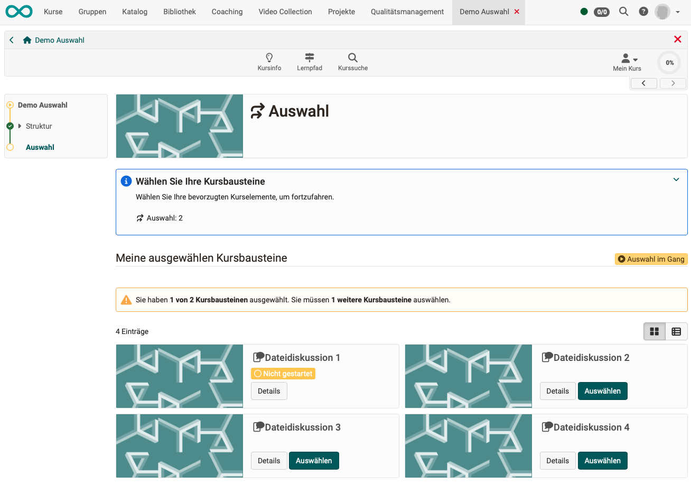
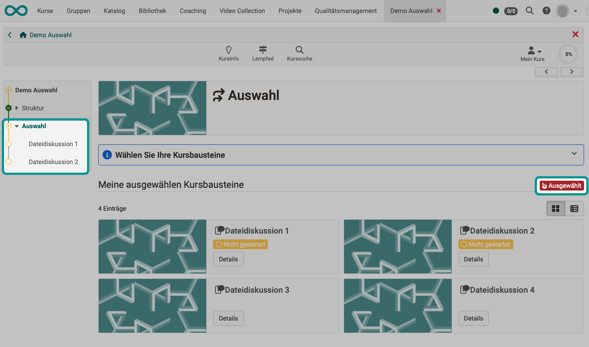
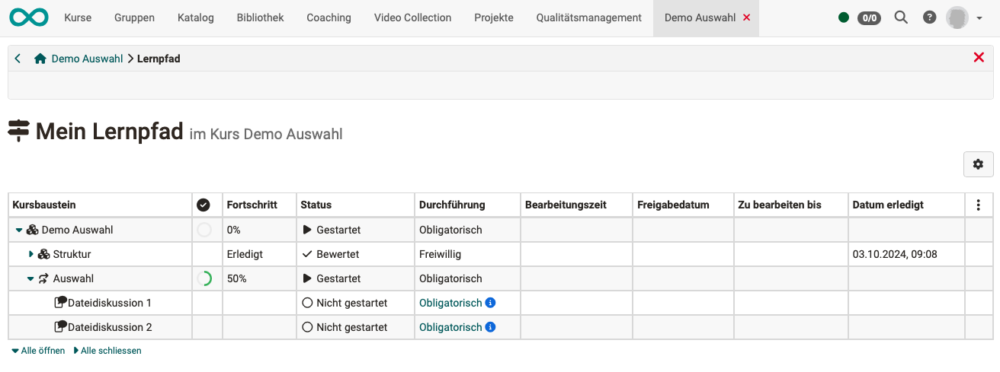
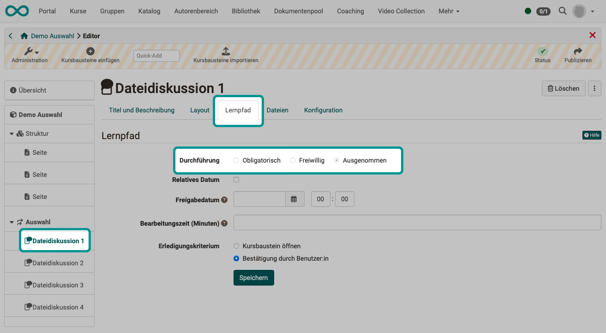
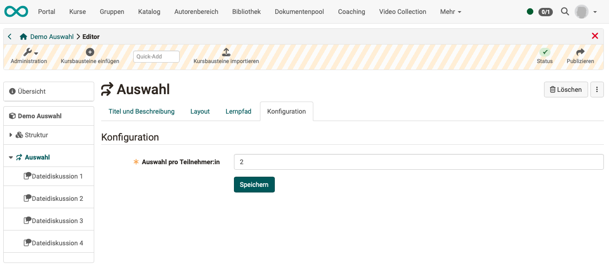
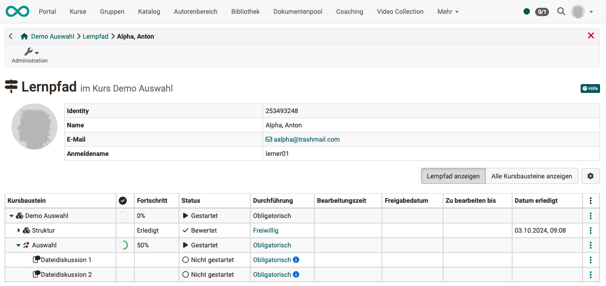
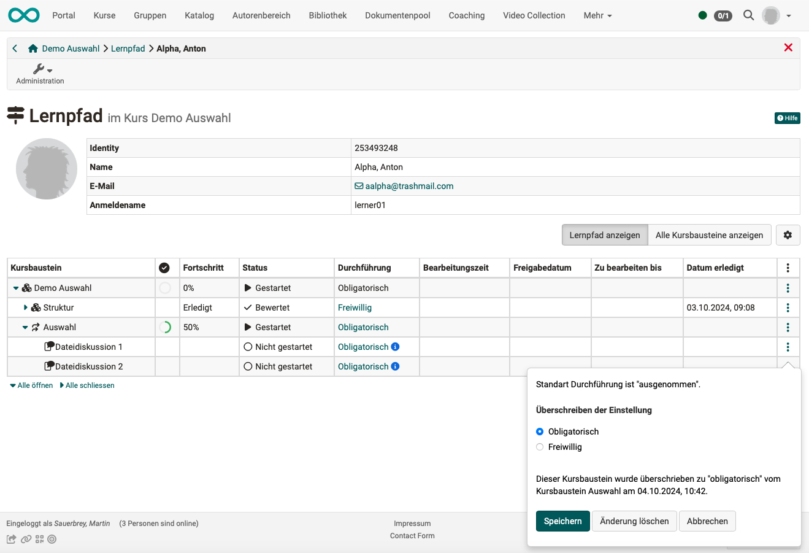

# Kursbaustein "Auswahl" {: #selection}

## Steckbrief

Name | Auswahl
---------|----------
Icon | { class=size24  }
Verfügbar seit | Release 19.1
Funktionsgruppe | Andere
Verwendungszweck | Auswahl einer bestimmten Anzahl Kursbausteine innerhalb der Kursstruktur (Kursmenü) durch die Teilnehmer:innen
Bewertbar | nein
Spezialität / Hinweis | Der Kursbaustein ist nur in Lernpfadkursen einsetzbar.

Der Kursbaustein "Auswahl" wird ähnlich verwendet, wie der Kursbaustein "Struktur". Auch unterhalb des Kursbausteins "Auswahl" befinden sich verschiedene weitere Kursbausteine. Im Unterschied zum Kursbaustein "Struktur", können die Teilnehmer:innen aber selbst bestimmen, welche Kursbausteine in ihrem Kursmenü enthalten sein sollen. Der/die Kursbesitzer:in gibt eine Anzahl Kursbausteine zur Auswahl vor (z.B. verschiedene Aufgaben). Jeder/jede Teilnehmer:in wählt dann im Kursbaustein "Auswahl" die Kursbausteine aus, die anschliessend im Kursmenü individuell angezeigt werden.

## Funktionsweise {: #selection_functionality}

* Im Kursmenü finden die Kursteilnehmer:innen einen Kursbaustein vom Typ "Auswahl" vor. (Der Titel kann auch anders heissen.)
* Bei Klick auf den Kursbaustein werden verschiedene Kursbausteine zur Auswahl angeboten.
* Jeder/jede Teilnehmer:in wählt aus den angebotenen Kursbausteinen eine vorgegebene Anzahl aus.
* Die ausgewählten Kursbausteine erscheinen nun im Kursmenü des/der Teilnehmer:in unterhalb des Kursbausteins vom Typ "Auswahl" (individuelles Menü).

[zum Seitenanfang ^](#selection)

## Auswahl treffen (Perspektive Kursteilnehmer:in) {: #selection_participant}

**Schritt 1:** 
Als Teilnehmer:in wählen Sie einfach den Kursbaustein vom Typ "Auswahl" in Ihrem Kurs. Dort wählen Sie, welche der vorgeschlagenen Kursbausteine Sie in Ihr Kursmenü aufnehmen wollen.

{ class="shadow lightbox" }

**Schritt 2:** 
Anschliessend erscheinen die gewählten Kursbausteine in Ihrem Kursmenü und können bearbeitet werden.

{ class="shadow lightbox" }

!!! info "Hinweis"

    Die einmal getroffene Auswahl kann nicht mehr durch Teilnehmer:innen geändert werden. Für ein Zurücksetzen ist ein Eingreifen von Kursbesitzer:in oder Betreuer:in erforderlich.

### Ansicht im Lernpfad-Werkzeug

Kursteilnehmer:innen finden in der Werkzeugleiste das Icon "Lernpfad" und können dort nachvollziehen, welche Kursbausteine sie schon abgearbeitet haben.
Solange in einem Kursbaustein vom Typ "Auswahl" noch keine Auswahl getroffen wurde, werden im Lernpfad-Werkzeug keine Kursbaustein angezeigt, die dem Auswahl-Baustein zugeordnet sind. Sobald eine Auswahl getroffen wurde, werden die ausgewählten Kursbausteine angezeigt.

{ class="shadow lightbox" }

{ class="shadow lightbox" }

[nach oben (Perspektive Kursteilnehmer:in) ^](#selection_participant) 
[zum Seitenanfang ^](#selection)

---

## Auswahl einrichten (Perspektive Kursbesitzer:in) {: #selection_setup}

### Kursbaustein einfügen

Fügen Sie im Kurseditor einen Kursbaustein "Auswahl" in Ihren Kurs ein, wie Sie einen Kursbaustein "Struktur" einfügen.

### Erfassen auswählbarer Themen

Ziehen Sie im Kurseditor weitere Kursbausteine auf den Kursbaustein "Auswahl", damit sie ihm untergeordnet werden. Die verfügbare Auswahl bezieht sich dann auf diese untergeordneten Bausteine.

### Tab "Lernpfad"

Im Unterschied zu den zugeordneten Kursbausteinen, kann im Auswahl-Baustein selbst für die **Durchführung** gewählt werden, ob der Kursbaustein obligatorisch, freiwillig oder mit einer Ausnahmeregelung versehen ist.

Das **Erledigungskriterium** kann für einen Kursbaustein "Auswahl" **nicht** gesetzt werden, sondern ist vorgegeben.
Es zählt, ob zugeordnete Kursbausteine ausgewählt und erledigt sind. 

### Tab "Lernpfad" der zugeordneten Kursbausteine

Alle im Kurseditor einem Kursbaustein "Auswahl" zugeordneten Kursbausteine werden zu Beginn automatisch "**ausgenommen**", also standardmässig nicht im Kursmenü angezeigt.
Diese automatisch gesetzte Eigenschaft kann im Kurseditor **nicht** durch Autor:innen geändert werden.

Später, während der Durchführung des Kurses, wird nach getroffener Auswahl durch die Teilnehmer:innnen diese Eigenschaft automatisch individuell abgeändert.

{ class="shadow lightbox" }

### Tab "Konfiguration"

Im Tab "Konfiguration" kann angegeben werden, wie viele Kursbausteine die Teilnehmer:innen aus den Vorschlägen in ihr persönliches Kursmenü übernehmen müssen.
Für Kursbesitzer:innen ist dies eine Pflichtangabe, damit der Kursbaustein "Auswahl" funktioniert. 

{ class="shadow lightbox" }

[nach oben (Perspektive Kursbesitzer:in) ^](#selection_setup) 
[zum Seitenanfang ^](#selection)

---

## Auswahl betreuen (Perspektive Kursbetreuer:in) {: #selection_coaching}

### Ansicht Kursbausteine

Im Kursmenü sehen Sie als Betreuer:in **alle** für die Teilnehmer:innen zur Auswahl stehenden Kursbausteine unterhalb eines Kursbausteins "Auswahl". 

Rufen Sie als Betreuer:in den Kursbaustein "Auswahl" auf, sehen Sie die Kursteilnehmer:innen aufgelistet und können sich informieren, wer welche Kursbausteine ausgewählt hat.

Wurde noch keine vollständige Auswahl getroffen, erkennen Sie dies am kleinen gelben Dreieck rechts. 

In der Detailansicht erkennt man an der Durchführung, welche Kursbausteine ein/eine Teilnehmer:in ausgewählt hat.

Kursbausteine mit dem Durchführungsstatus "Ausgenommen" werden nicht im Kursmenü angezeigt.
Vor einer Auswahl haben alle wählbaren Kursbausteine diesen Status. Mit getroffener Wahl bekommt der Kursbaustein die Durchführung "Obligatorisch" oder "Freiwillig" (abhängig vom Status des Kursbausteins "Auswahl"). 

Hat der/die Teilnehmer:in die geforderte Anzahl Kursbausteine ausgewählt, wird das gelbe Dreieck nicht mehr angezeigt.

{ class="shadow lightbox" }

### Ansicht gewählter Kursbausteine im Lernpfad-Werkzeug

Betreuer:innen können unter dem Icon "Lernpfad" in der Werkzeugleiste die Lernpfade aller Kursteilnehmer:innen anzeigen lassen. Öffnen sie das Werkzeug und wählen Sie einen/eine Teilnehmer:in aus.

{ class="shadow lightbox" }

Wenn noch keine Auswahl durch den/die Kursteilnehmer:in getroffen ist, werden auch noch keine Kursbausteine unterhalb des Kursbausteins "Auswahl" angezeigt. Sobald von Teilnehmer:innen eine Auswahl getroffen wurde, werden die gewählten Kursbaustein auch für Betreuer:innen in ihrem Lernpfadwerkzeug sichtbar.

{ class="shadow lightbox" }

[nach oben (Perspektive Kursbetreuer:in) ^](#selection_coaching) 
[zum Seitenanfang ^](#selection)

### Von Teilnehmer:innen getroffene Auswahl zurücksetzen oder ändern

Betreuer:innen und Besitzer:innen haben die Möglichkeit, die von Teilnehmer:innen getroffene Auswahl zu bearbeiten: 

* Wählen Sie im Kursmenü den gewünschten Kursbaustein "Auswahl". 
* Als Betreuer:in werden Ihnen alle Teilnehmer:innen angezeigt. Wählen Sie einen/eine Teilnehmer:in.
* Mit Klick auf den Eintrag in der Spalte "Durchführung" öffnet sich das Popup zum Überschreiben der Einstellung zur Durchführung.

{ class="shadow lightbox" }

**Variante:**

* Öffnen Sie das Lernpfad-Werkzeug und wählen Sie einen/eine Teilnehmer:in.
* Klicken Sie auf die 3 Punkte am Ende einer Zeile. Es öffnet sich das Popup zum Überschreiben der Einstellung zur Durchführung. 
* Zum kompletten Zurücksetzen ändern Sie alle Kursbausteine auf "Ausgenommen". Klicken Sie dazu auf "Änderung löschen". Dadurch wird wieder der Ausgangszustand hergestellt.

{ class="shadow lightbox" }

[nach oben (Perspektive Kursbetreuer:in) ^](#selection_coaching) 
[zum Seitenanfang ^](#selection)

---

## Weitere Informationen 

[Kursbaustein Struktur](../learningresources/Course_Element_Structure.de.md) 

 

[zum Seitenanfang ^](#selection)

